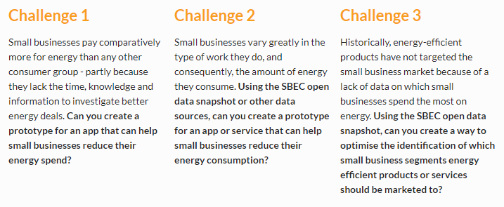
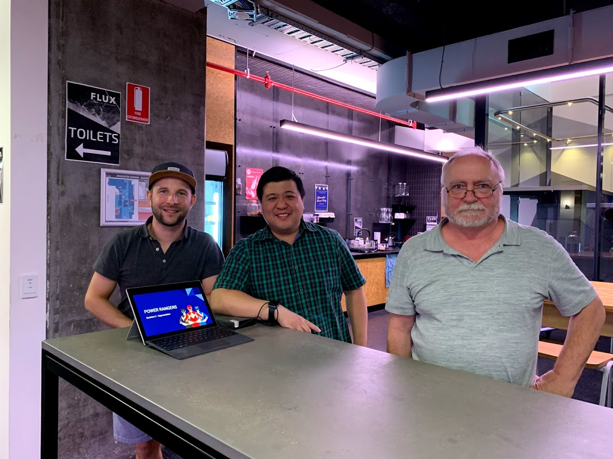

Just a quick post on my recent attendance of the one-day hackathon "Energy Hack".

<!-- more -->

# Energy Hack

Its been a while since I have done a hackathon so when I saw Energy Hack from the Ministry of Data popup in my inbox I thought solving energy problems would be interesting so I signed up.

Unlike other events I have participated in this was a one-day event so time was really limited. Starting at 8am you had just a few short hours to form a team, come up with an idea to solve one of the three challenges then present your idea at 5pm.

There was \$4k worth of prizes on offer to help motivate people to attend which is pretty generous for a one-day event.

# The Day

I teamed up with two other guys that I met right at the start of the event. Jeremy is a semi-retired engineer, programmer and general all-round technical knowledge-base. Tim is a computer science graduate, ex-management consultant and energy-industry expert.

With that combination of expert knowledge and experience I felt like we had a good chance.

So after officially forming our team and coming up with a name (Power Rangers), we set to work coming up with a solution to the three challenge questions.

The theme of Energy Hack was energy in small business so all three challenges revolved around that:

I hadnt looked at the challenges before I arrived but Jeremy had and had even come up with an idea to solve Challenge 3 that he was keen to pursue.

The idea was to apply data segmentation techniques to small business categories so that the government or industry could more accurately target their solutions.

We discussed it for a little while and decided to give it a shot. I was a little hesitant because I wasnt sure that it was really "innovative" enough for a hackathon but after some more thought I realised that solving the "targeting" problem was really important as having a great solution for reducing energy consumption was well and good but if you dont know who you should target with your solution then you are just shooting into the dark.

Using my past hackathon experience I decided early on that it was probably best that we didnt even attempt to actually build a solution. A few short hours isnt enough to do anything meaningful and you were more likely to just end up stressed and rushed.

Instead we spent the bulk of the time trying to come up with the most clear way of conveying our idea and why we felt it was important.

The result was a well rehersed slide deck that I was pretty happy with. If you are interested then you can find the slides here: [https://docs.google.com/presentation/d/1sLRtkFDUtK7kfE4MyXLUb2mVWYi47mWn1qUgw_7E_s4/edit?usp=sharing](https://docs.google.com/presentation/d/1sLRtkFDUtK7kfE4MyXLUb2mVWYi47mWn1qUgw_7E_s4/edit?usp=sharing).

So 5pm rolled around and it was time for all 8 teams to present.

I decided not to present this time. Tim is a far better orator than me and he did a great job giving the 3 minute presentation. Jeremy and I went up to join him for the two minutes of questions.

# Results

So sadly we didnt win a prize. I just think we didnt do anything innovative enough. Basically we were pitching a consultancy who's product is a report. So even though I think we did a great job with putting together the slides and presenting ultimately it wasnt what the judges were looking for.

# Conclusion

I had a great time again and met some really interesting people that I hope to keep in contact with. Thats one of the main reasons for going to events like this, build your network up because as they say "Its not what you know but who you know".
