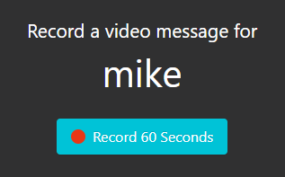
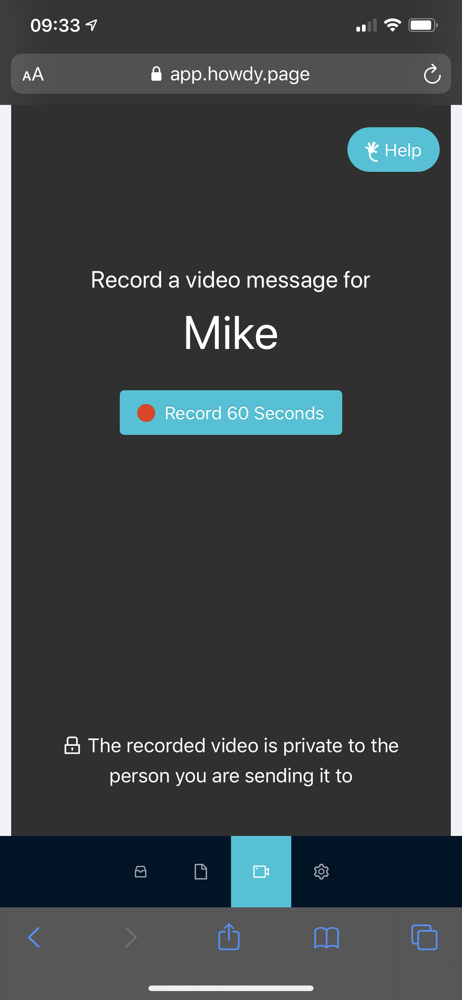

A couple of months ago my [Markd](https://markd.ltd/) co-founder [Brandon](https://www.linkedin.com/in/theBrandonWu) came up with an great idea for a new app, we mulled it over, ran a few experiments and decided to build it, thus [Howdy](https://howdy.page/) was born.

<!-- more -->

# TLDR;

Howdy is a service for sending short personalized video messages to one another.

`youtube: https://www.youtube.com/watch?v=WbT3Lkynx9g`

# Concept & Testing

[Brandon](https://www.linkedin.com/in/theBrandonWu) pitched the idea to me a couple of months ago as a service for people who get too many emails. The idea is that those people can sign up to our service, put a link to their own private "page" in their email footer or auto-responder and have others send them personalized video rather than more emails.

One of the key concepts for the service was that the messages should be personal and so shouldn't be pre-recorded, that is they must be recorded on the spot and must be short (no more than 1 minute in length).

We were unsure if the idea was good enough to spend the time on development so we decided to run some ad tests. This is a process that Brandon knows a great deal about more than me but the general-jist is that you spend a small amount of money on ads that point to a targeted landing page. You then analyse the resulting analytics to determine if the pitch is good and which target market might respond the best.

After we ran a bunch of different ads we had enough data to confirm that the idea was good enough to spend the 3-4 weeks of development on to get an MVP launched.

# Development

Although we tested the idea with ads we knew that we didn't want to spend too long coming up with the "perfect" technical architecture for something that still might not work in practice.

So I chose my preferred weapons of choice at the moment for rapid iteration; a Typescript-React frontend hosted on Netlify with Postgres-Node backend hosted on Heroku.

Development was swift and within a week or so I had a working prototype up on our "staging" server where we could send messages to each other.

We decided that for this product we wanted to have payments in from the beginning. We chose Stripe as our payments platform and it took me a week or so to get that implemented into the app with tiered subscription levels. I hadn't used Stripe before so it took me longer than I would have liked but its a really nice API and platform so I think we will definitely use it again for other projects.

We spent another week or two polishing, adding some extra features and making sure everything worked on mobile.

One of the trickiest hurdles was (and usually is these days) the lagging support for modern web technologies by Apple on the Safari browser. We use WebRTC to record video from the user's webcam which we then stream to S3, then do some processing on our servers before delivering to the user.

Unfortunately WebRTC isnt supported on Safari yet so as a workaround we implemented a input-file-picker for video on iOS. This works okay and doesnt allow users to select a pre-recorded video from their camera-roll thankfully but it would be nice if we had a unified video recording system.

# Conclusion

Its still very early days for the project but we have had a number of signups already and some messages sent. We are still unsure if the service will work or not but its a positive sign that while we were developing the large company Typeform released a very similar product named [VideoAsk](https://www.videoask.com/) although competition might seem bad, to us it validates the concept.

Im happy with the amount of time we have spend on it relative to the potential for the project. Im really happy that we managed to get the payments system in from the start too and we definitely learnt a whole bunch from working with the excellent Strip API. Theres definitely a ton more we can do but its a good start.

If you would like to check out Howdy head over to [https://howdy.page](https://howdy.page) and signup for free now and tell your friends! :)
