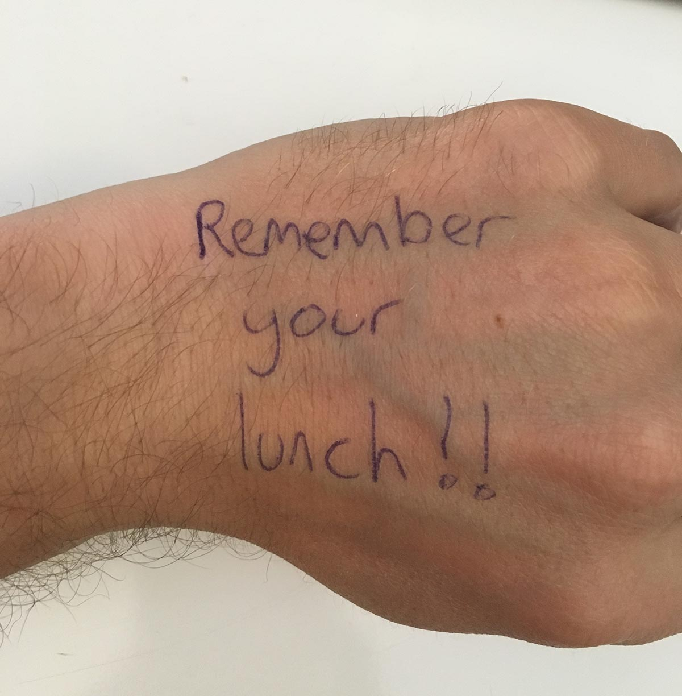
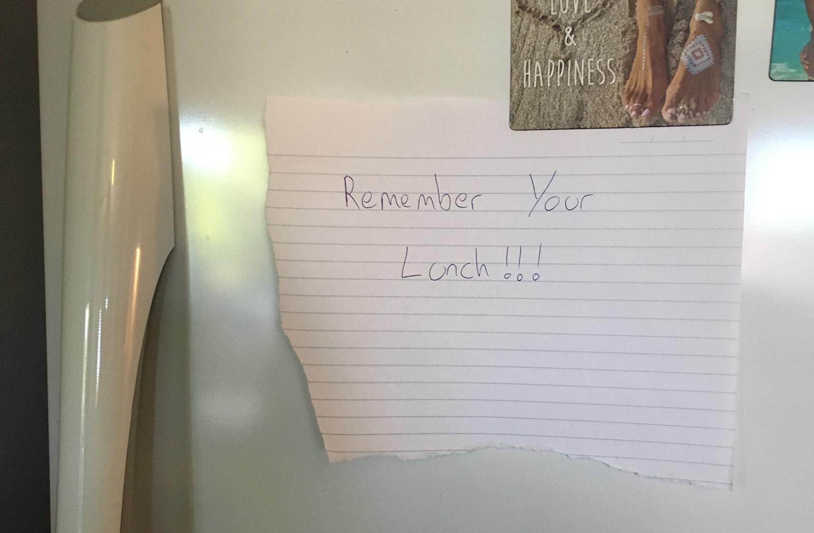
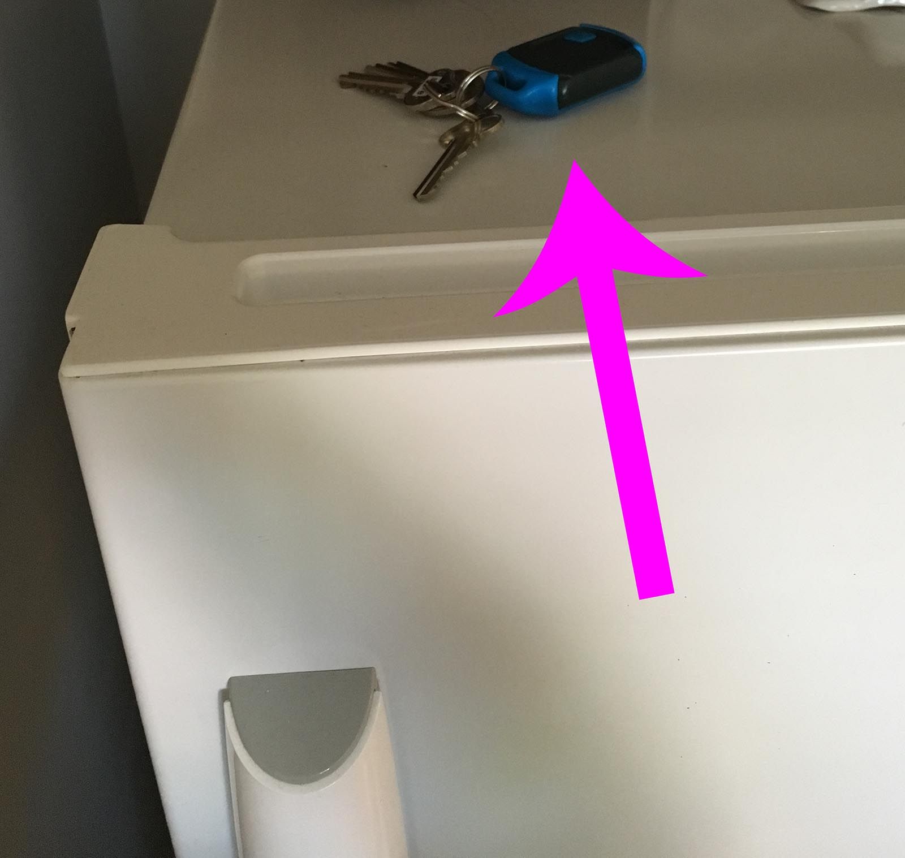

Bit of a departure from the usual technically focused blog posts today to talk about a little "[lifehack](https://www.lifehacker.com.au)" that I use frequently to help me remember things. So if you are like me and have a terrible memory, then read on.

<!-- more -->

# The Problem

I have always been a bit of a scatter brain. The people that know me personally probably all have some sort of story about me forgetting something.

I leave my house keys at work all the time. I almost never remember to take my lunch to work. I have have walked off a train without my backpack on more than one occasion. I have lost a ton of hats over the years in umpteen many cafes, resturant, gyms and other places. I have even left suitcases on busses or in airports. I dont bother buying expensive sun glasses because I know that im bound to leave them somewhere. Basically its an ongoing thing.

Rather than get annoyed I have over the years tried many different approaches to solve the problem.

Taking just the task of remember my lunch to work in the morning for example;

I have tried writing on my hand:

But that assumes that I look at my hand before I head to work in the morning.

I have tried writing a note on the fridge too:

But again that assumes that I look at the fridge before I leave for work.

I have tried setting alarms and alerts on my phone:

But that assumes that I set the alarm for the correct time, and that I check my phone before leaving the house.

# The Solution

One day my [girlfriend Kelsie](https://www.abetterme.com.au/) came up with a simple but ingenious solution:

Because I need the keys to lock the house before I leave in the morning I will always remember to take my keys.

My keys always live in a little bowl by the front door, thus in the morning I will normally go to the bowl to get my keys, but if the keys arent there it will trigger me out auto-pilot to go look for the keys. Once out of auto-pilot I then remember that I put the keys on the fridge because... my lunch!

I know it sounds a contrived but honestly it really works. I guess it doesnt have to be my keys, it could be my phone, or wallet or something that I will **always** remember to take with me in the morning,

# Conclusion

Im not sure if this helps anyone else but it was a revelation for me and a simple cheap solution that actually works.

Let me know in the comments below if you use this method or have a different strategy for remembering things :)

_p.s. Imagery used in the header courtesy of the Noun Project ([designer1](https://thenounproject.com/grega.cresnar), [designer2](https://thenounproject.com/search/?q=keys&i=467407), [designer3](https://thenounproject.com/rafaelgarciamotta/))._
