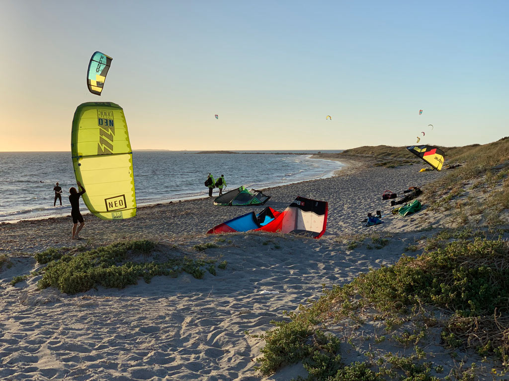

Its been an adventurous month of travel, activities and hard work on our exciting new venture [Markd](https://markd.co).

<!-- more -->

# Trip to Europe

Late Jan and early Feb I took a much overdue trip back to the UK to visit family that I hadnt seen for over 2.5 years. It was great to catch up with everyone again, particularly awesome to see my cousins youngest considerably older than I saw him last time.

While in Europe I spent a week with my parents in the Alps on a rather excellent Skiing adventure in Morzine. Its been over 6 years since I last went skiing and although I hadnt forgotten the snowplow I had forgotten how much you ache after a hard day on the slopes.. either that or im getting old!

I even snuck in a day of snowboarding for the first time at the end of the trip:

`youtube: https://www.youtube.com/embed/rUpN_Qrh3vc`

# Above and Below the Water

When I returned to Australia in early Feb I ditched the snow for the heat of the the Perth Summer. Before leaving I had begun my adventures in Kite Surfing and was keen to continue when I returned.

So I have been out a number of times, whenever the wind will allow basically. Its been awesome, I cant believe I haven't been doing it sooner. As one fellow POM put it the other day; "Not kite surfing in WA its like going to Chamoix and not skiing"

To round off my favorite Australian past times, this month I have also been doing a fair bit of snorkeling / free diving around Perth and Busselton. I put tohether this short movie of one of my Busso dives:

`youtube: https://www.youtube.com/embed/YeOIC7A582M`

# Markd

Last but certainty not least I have been working hard on [Markd](https://markd.co). I [spoke about Markd in my last post](/personal/farewell-bamboo-hello-markd/), its a chrome extension and website that aims to make remembering and organizing people fast, simple and fun.

We have been doing a lot behind the scenes, planning out what features we want and what priorities we should give them. We setup a [centre so that users can leave us feedback](https://markd.public.makerkit.co/) which has already been useful.

Our first major new feature, Lists, went live last week. I wont go into it too much as my co-founder Brandon already did an excellent job describing it in this post: https://blog.markd.co/2019/02/21/new-feature-add-to-lists.html

`youtube: https://www.youtube.com/embed/9_IFBqUas6s`

We are working hard on a number of other features including a major re-design of the site which im really excited about and cant wait to share once its ready.

Hopefully over the next month or two ill be able to share some more Markd updates as we progress, so stay tuned!
