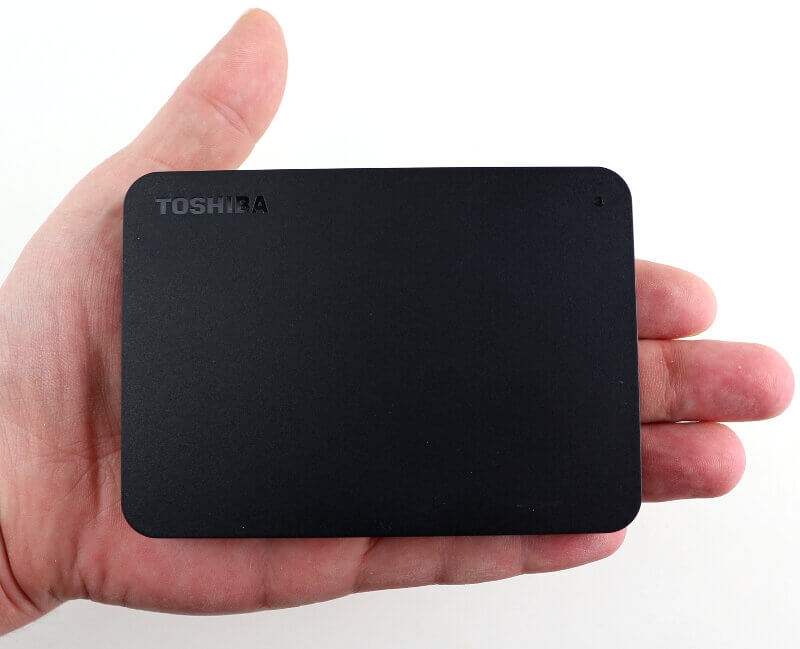
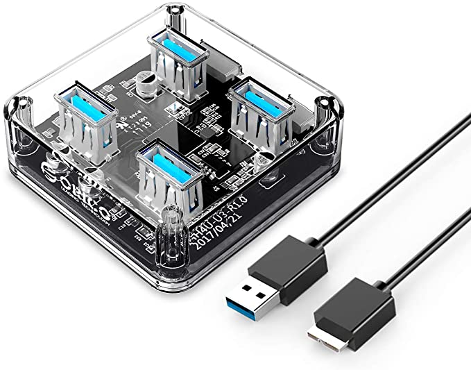
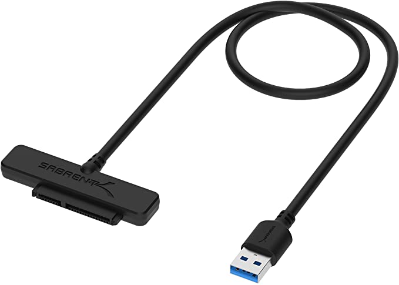
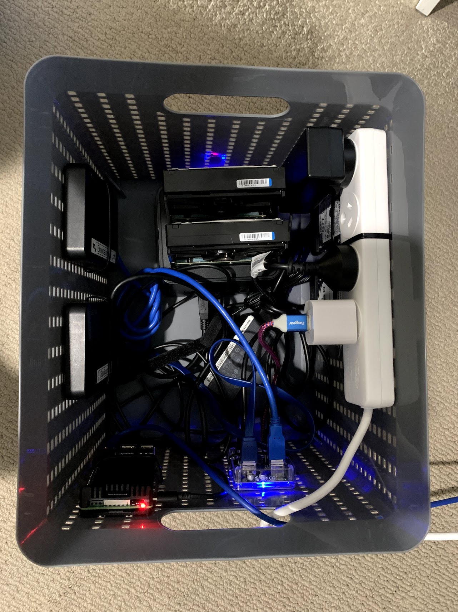
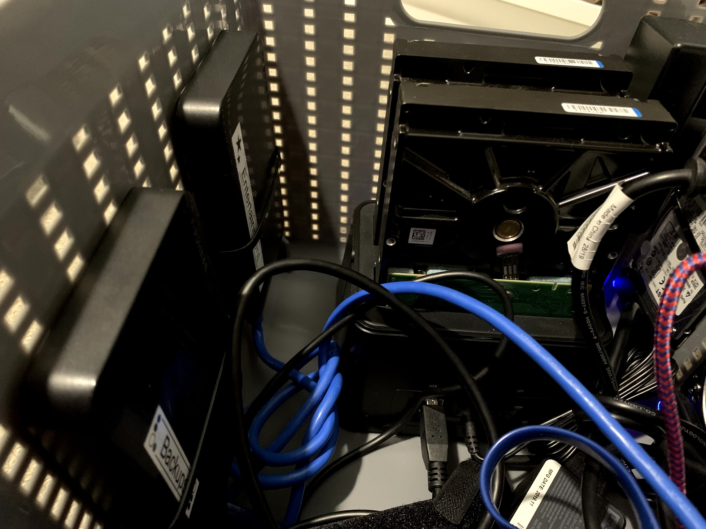
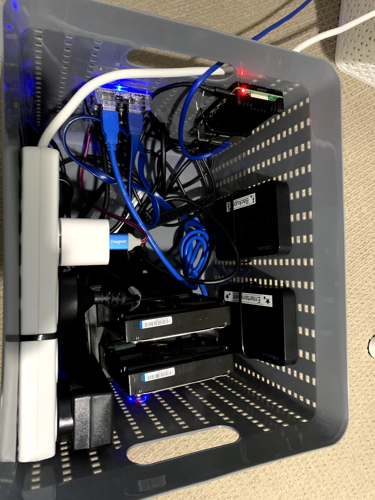

My PC is awesome but it has a bit of an addiction to Watts. So I wanted to build a low-powered NAS and Plex server so when I put PC asleep at night I can still enjoy some quality time with my content on the TV downstairs. Since I had a spare Raspberry Pi 4 glaring at me from my desk I thought, sure why not, how hard could it be?

<!-- more -->

# Requirements

- **Low Power**, its going to be on all day so it should just sip from the fountain of joules
- **Quiet**, its going to live in my office, so I don't want it bothering me with it whining all the time
- **Flexible**, I have a bunch of old hard drives, so I want to just sling them in there and have them all just work and contribute to one large pool of "stuff"
- **Redundant**, im not storing my sons baby pics on it or anything but I would rather not loose the data either, so some sort of redundancy would be nice.
- **Powerful**, it doesnt need to be a super computer but it needs to have enough juice to transcode a 4k video
- **Low Cost**, I aint made of money, if I was I would just buy a [Drobo](https://www.drobo.com/)

# Software

[Unraid](https://unraid.net/) would have been my first choice for a NAS / Media Server but it requires an x86 CPU and the Pi is ARM so unfortunately thats a non starter.

So I decided to just go with the standard Raspbian OS, I [grabbed the ISO](https://www.raspberrypi.org/software/) smashed it on an SD card and got cracking. I setup [SSH and VNC](https://www.raspberrypi.org/documentation/computers/configuration.html) for easy access then assigned a [static IP address to the Pi using the Google Home app](https://support.google.com/wifi/answer/6274660?hl=en-AU).

After a bunch of research and experimentation (which I will not bore you with) I decided to go with [Open Media Vault](https://www.openmediavault.org/) (OMV) as my main way of managing the Pi. It provides a nice UI and set of plugins smoothing the way like a butter coated bar of soap.

[A video](https://www.youtube.com/watch?v=FYkdPyCt5FU) by the rather nerdy but very helpful [Techno Dad Life](https://www.youtube.com/channel/UCX2Vhc0LIzSS9aMzhGFZ7PA) got me going with UnionFS which merges disks together so they appear as one large file system and SnapRAID which gives me a simple way to provide redundancy to the NAS.

The final step was to install Plex. I read a bunch of guides to installing it using OMV but they all seemed overly complicated involving Docker or other things. I found that [simply installing it natively using SSH](https://pimylifeup.com/raspberry-pi-plex-server/) worked just great.

Im making this sound all rather straight forward but by this point I had spent many nights and headaches on getting it all to work. But finally I now had a working NAS that had a single large file system that I could access from across the network. The drives were resistant to failure thanks to SnapRAID.

So with the software issues ironed out it was onto the hardware issues..

# Hardware

Its like software but harder.

Well I had the Pi.. so thats a good start. I also had two 2tb Toshiba Canivo drives that were sat around from my adventures around Australia a few years back.

The Pi has 4 USB ports on it so I thought I could just hook up these two drives, job done. Oh no, that would be far too easy.. It turns out that the Pi, unlike a normal desktop PC, cannot deliver the full power required by a USB when multiple devices are plugged in. The result is one or both of the drives making a horrible clicking sound as it dies of power-starvation.

The solution? A powered USB hub that can deliver the required power and pass through the data communications to the Pi.

It turns out however, powered USB hubs are rather expensive at the moment for some reason. Particularly if you want each port to deliver the full power for a spinning hard drive.

I'll spare you the evening spent digging through various shopping sites looking for deals and instead show you what I ended up with:

https://www.amazon.com.au/gp/product/B08222CYSS

This badboy cost only $19.99 and has been great. While I was there I also picked up this for $36:

https://www.amazon.com.au/dp/B07C9RSZFM

And a couple of these for $15 each:

https://www.amazon.com.au/gp/product/B011M8YACM/ref=ppx_yo_dt_b_asin_title_o02_s00?ie=UTF8&psc=1

I now had a way to get my 2 x portable drives, 2 x 2.5" drives and 2 x 3.5" drives all to work in the Pi.

I just needed a container for them all. I don't have a 3D printer to make one but thats okay because my Targét game is pretty strong, so I snagged this beaut for $8

https://www.target.com.au/p/rattan-plastic-storage-basket/60093127

It was just a matter of then zip-tying it all together in some semblance of order.

   

It actually came out pretty nice and neat, pop the lid on and then shove it in the corner and forget about it, exactly what a NAS should be.

# Conclusion

So how did I do against my goals?

- **Quiet**, yep I cant hear it at all
- **Flexible**, yep I was able to mix and match a whole range of different drives and it all just works.
- **Redundant**, with SnapRAID it should be, I haven't fully tested it yet however..
- **Powerful**, yep the Pi 4B is a very capable little device
- **Low cost**, the total I calculated (excluding the drives) was $174 AUD which is quite a bit more that I would have liked but its still far cheaper than a [Drobo](https://www.drobo.com/), even a second hand one.
- **Low Power**, yep it only uses 10w, about 0.25 kWh per day at 30 Aussie cents per kWh that works out to be about $27 per year which is acceptable and much less than what it would be if I left my PC on all the time.

So all in all im happy with how it all went tho there are probably better ways of doing everything, please let me know in the comments if you have done something similar or have ideas for improvements!
