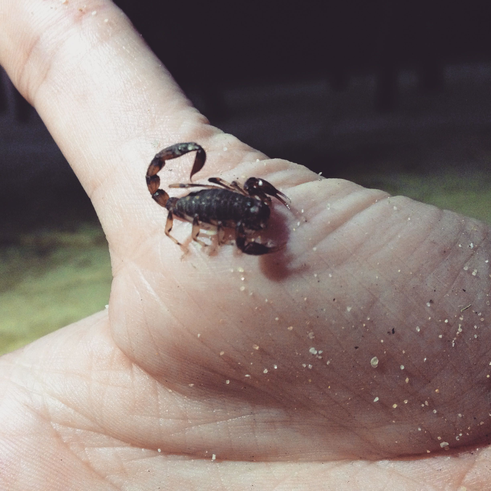
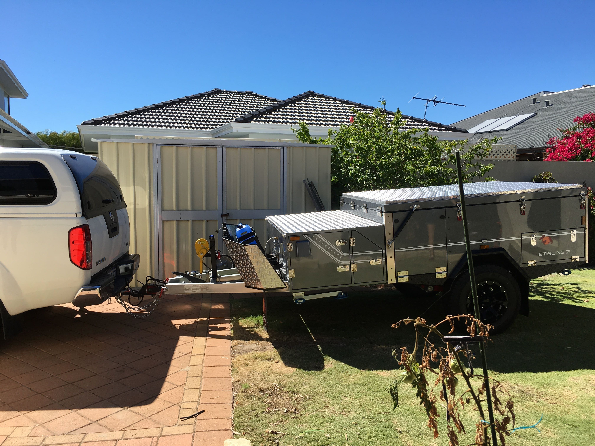
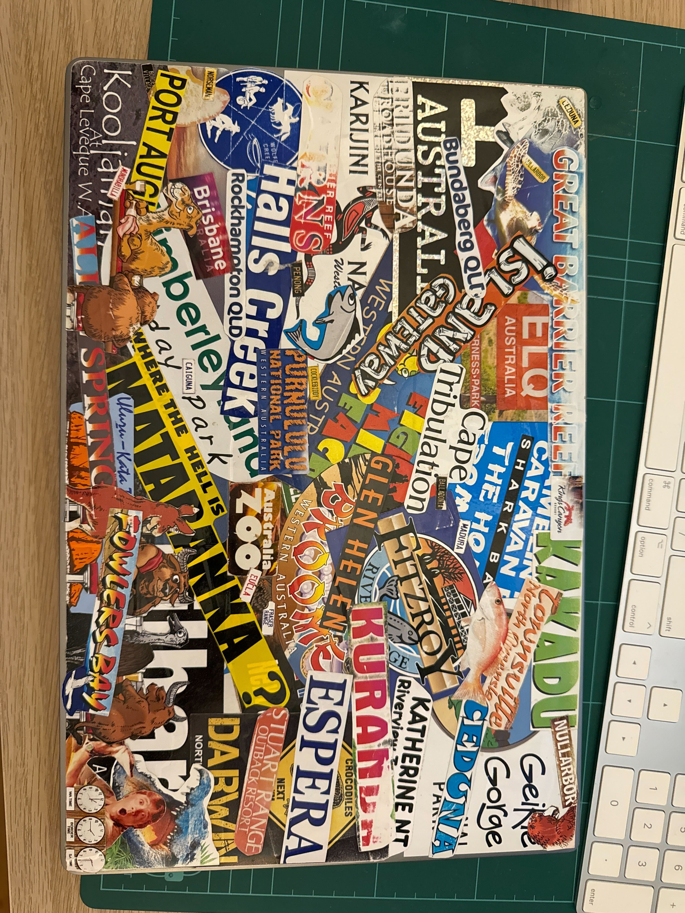
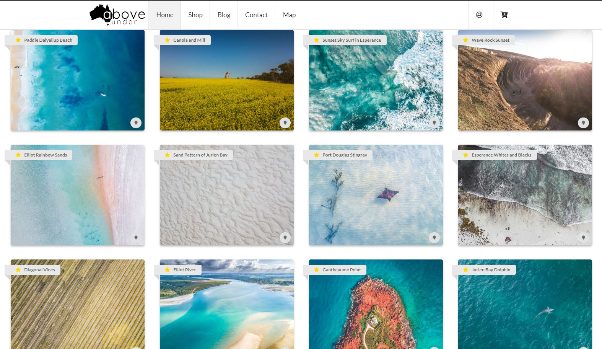
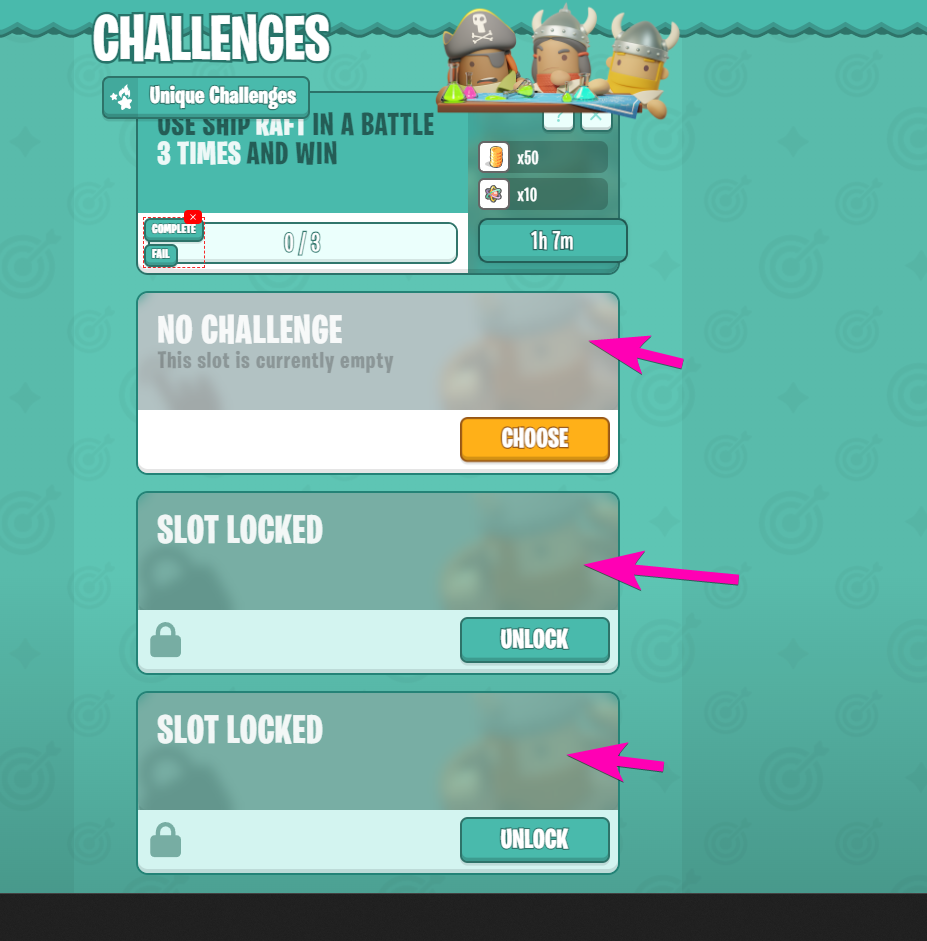
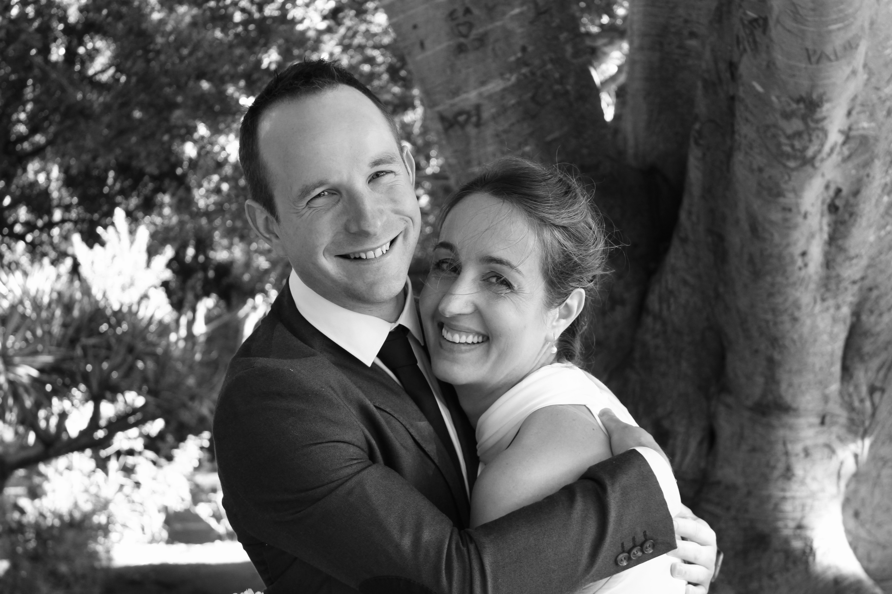

Wow can you believe it, exactly 10 years to the day since I took the almighty leap into the unknown and traveled half way around the work from the UK to Western Australia to start my new life with a girl I had met just a few short months ago.

I thought I would take this opportunity to look back and reflect on the last 10 years of my life in Australia.

So much has happened in the intervening years that its hard to know where to start so I think ill do something a bit different and do one of those "toplist" kind of posts..

# 10 Major Events in 10 Years

## 1. Arrived in Australia

This [very blog documented](https://mikecann.co.uk/posts/mike-goes-down-under) the day that I arrived in Australia 3652.5 days ago.

I remember being in a sort of shock for several days when I first arrived. I had heard so much about Australia from Kelsie on our travels so when I finally arrived it was hard to wrap my head around.

I remember in the first week seeing a scorpion scuttle across the living room floor and being assured that I had nothing to worry about.

I remember being stunned that there were beautiful parrots and cockatoos just flying around all the time and no one batting an eye lid at it.

I remember everything smelling so different, a rich dry-eucalyptus smell that I now associate with home.

I remember many long days working by myself on [Mr Nibbles](https://mikecann.co.uk/posts/indie-game-project-management-with-trello) and other projects, often not speaking to anyone all day then being super excited when Kelsie returned home that "I just wouldn't shut up".

I remember stressing about visa's and how I was going to stay in Australia, so thats why after a year I..

## 2. Moved to Perth

I joined just about the only gaming company that was hiring in Perth at the time called [TapSlots](https://www.linkedin.com/company/tap-slots/). They were kind enough to sponsor my visa through the early stages of 456 all the way up to the Permenant Residency (one step before Citizenship).

I was super happy there, I found the work rewarding and the people excellent. I made some life long friends there.

A year or so after I moved, Kelsie joined me and we began renting a place in the beautiful South Perth.

I was living the dream, my daily commute involved a quick stroll past the zoo and the sounds of the howler monkeys, through a park down to the ferry. A short ferry across the water where dolphins often could be seen in the water, then another walk through a park before I arrived at the office. It really was a great life.

But before long the old traveling itch started again and I wanted to explore a bit more before I became too comfortable, so thats why in 2017 Kelsie and I..

## 3. Traveled Australia

Kelsie and I loved the idea of exploring more of the vast country so we went out and bought a car and a camper and [set off for 5 months](https://mikecann.co.uk/posts/and-off-we-go).

We went to so many places, had so many adventures it would be impossible to recount them here. My laptop still bears the scars from my cleptomania obsession of collecting stickers from each major place we visited.

Before we left I had purchased a brand new (at the time) consumer drone called the DJI Mavic Pro. This was so early that most places didnt have any rules or policies around drones so I took full advantage of that capturing thousands of incredible photos and videos which I attempted to sell over at: https://aboveunder.com.au/

Before long tho it was time to return back to Perth and real life but that was okay because by this point I had..

## 4. Made new Friends

It seems like the older you get the harder it is to make friends. I find making friends really important to general happiness and really helps to make a place feel more like home.

I have joined numerous clubs, groups and meetups in my years here to both try to grow my network and make new friends. It takes real effort but its most certainly worth doing.

One of the friends I made along the way caused me to..

## 5. Learnt a new Sport

I technically had actually tried Kiteboarding already while I as on my South American trip but it wasnt until my (at the time) neighbor Stan convinced me to pick it up again in Australia.

Im so glad he did as I have had an awesome time kiting around, making the most of the vast west australian coastline and prodigious and consistent wind.

Other than the wind WA also has a lot of coastline so I have over the years gotten more and more into Freediving. If you are interested I have made a number of videos about my dives here: https://www.youtube.com/watch?v=J9IhSAuuFDY&list=PLdFGn0KeUCYer1aL7cEzpcDIg51vycrio

With myself settling into Aussie life it was just about time that I..

## 6. Became a Citizen

In January of 2020 [I officially became](https://mikecann.co.uk/posts/a-personal-update) a citizen of Australia!

It was a long windy 6-year road of different visas and constant worry but I finally made it.

Im told tho that im not truly an Aussie until I have caught a Barra.. so I have that to aim for still.

Around the same time I also..

## 7. Started a Company

I have always been entrepreneurial so when my co-founder Brandon raised the possibility of securing some funding to work on a new SaaS business I [lept at the opportunity](https://mikecann.co.uk/posts/farewell-bamboo-hello-markd).

That has been an incredibly difficult but rewarding adventure that is still ongoing with [Gangbusters](https://mikecann.co.uk/posts/bandai-namco-invests-in-gangbusters) as we work on brining our premier title BattleTabs to mobile.

If running your own business was not hard enough I also recently...

## 8. Became a Father

Among all the milestones I've reached, becoming a father was by far the most transformational. The birth of my son, Joshie, introduced a profound shift in my world view, priorities, and daily routines.

Suddenly, the adventures had a new co-star, and my projects had a deeper purpose. Watching him grow, explore, and start to form his own relationship with Australia has been an incredible journey.

Parenthood is a mix of joy, worry, sleepless nights, and unparalleled love. It has grounded me in ways I never anticipated, anchoring my adventurous spirit with a new sense of responsibility and wonder.

It often goes hand in hand but it was around this time that I also..

## 9. Got Married

Kelsie and I had shared countless adventures, faced life's ups and downs, and grown together in ways neither of us could have imagined when we first met.

It was only fitting that we decided to solidify our journey together by tying the knot. Our wedding was exactly as I wanted it, small and intimate with just family nearby.

My sister even flew all the way out from the UK as a suprise to join us for the big day :D

Our honeymoon was exactly as I liked it, functional, as you see we had just..

## 10. Bought a house

After years of moving, traveling, and exploring, Kelsie and I decided it was time to lay down more permanent roots. [Buying a house in Busselton](https://mikecann.co.uk/posts/moving-home-and-startlink) was a milestone that symbolized not just a physical home, but the establishment of our family's base camp.

<iframe width="853" height="480" src="https://www.youtube.com/embed/T4kaZX1ZzzM" frameborder="0" allow="autoplay; encrypted-media" allowfullscreen></iframe>

We only moved in here less than 6 months ago so it still a bit early to call it home but there are definitely lots of signs that im going to enjoy it here for hopefully another 10 years or more!
