In my last post on Machine Learning we followed Unity's Getting Started tutorial and managed to get the "Balance Ball" example project up and running. In this post we are going to start something from scratch and see if we can dig a little deeper and learn some new things about Machine Learning.

<!-- more -->

# The Series

If you are new to the series I recommend you checkout the previous posts first, here's the whole series:

0. [A Game Developer Learns Machine Learning - Intent](/machine-learning/a-game-developer-learns-machine-learning-intent/)
1. [A Game Developer Learns Machine Learning - Getting Started](/machine-learning/a-game-developer-learns-machine-learning-getting-started/)
1. A Game Developer Learns Machine Learning - A Little Deeper
1. [A Game Developer Learns Machine Learning - Mr Nibbles Basics](/machine-learning/a-game-developer-learns-machine-learning-mr-nibbles-basics)

# TLDR;

We start a new project from scratch and train an agent to learn the solution to a simple problem.

<iframe width="853" height="480" src="https://www.youtube.com/embed/MiY6DiZovRg" frameborder="0" allow="autoplay; encrypted-media" allowfullscreen></iframe>

# Where to Begin?

For this post I knew I wanted to dig a little deeper into Unity's ml-agents so I can get a better understanding of how I can can eventually use the SDK to play Mr Nibbles Forever.

I started off by reading some more of the [documents](https://github.com/Unity-Technologies/ml-agents/blob/master/docs/Readme.md) on Unity's GitHub page. They were interesting but they didn't really suggest to me what my next steps should be after completing the Getting Started.

It was then that I stumbled across this video from Unity 3D College:

<iframe width="853" height="480" src="https://www.youtube.com/embed/61_FtB1PhaM" frameborder="0" allow="autoplay; encrypted-media" allowfullscreen></iframe>

Sweet! Exactly what I was looking for. A clear and concise next step with some great tips. Im going to see if I can take the video and recreate it in my own style.

# Clean Slate

I created a new Github Repo for this post: https://github.com/mikecann/MrNibblesML then downloaded the latest ml-agents source code from Unity's github: https://github.com/Unity-Technologies/ml-agents/releases (version 0.2 beta at the time of writing).

[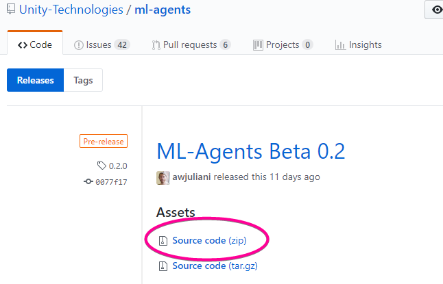](./ml-agents-src.png)

I then stripped out the examples projects and other things that I didn't need.

Then I downloaded and imported the TensorFlowSharp library project from https://s3.amazonaws.com/unity-agents/0.2/TFSharpPlugin.unitypackage.

[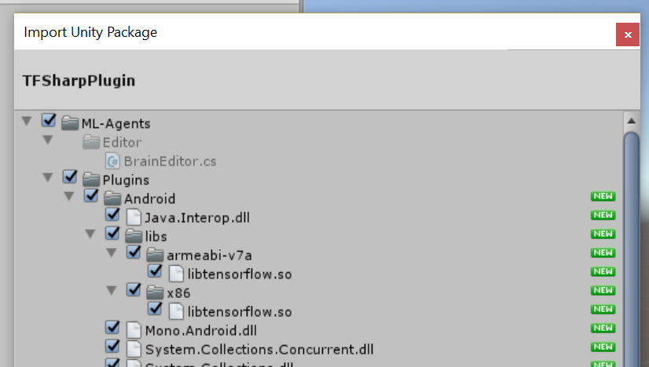](./importing-tf-sharp.png)

Now I now have a clean base to build my experiments on top of.

# Mr Nibbles 1D

After watching the excellent video from Unity 3D College it got me thinking how I could make this more "Mr Nibbles" related. Perhaps if I just simplified the Mr Nibbles Forever game down to a 1-dimensional plane and reduced the gameplay to "move left or right or get to the nibble while not touching the spider" that would be a good next step on my Machine Learning mission to completely automate Mr Nibbles Forever.

# Scene Setup

So I created a new scene like so:

[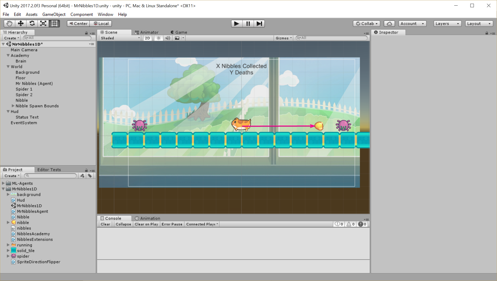](./the-scene-setup.png)

Mr Nibbles (the agent) must try to get to the nibble, he can only move left or right and if he touches a spider he dies. When he "wins" by touching the nibble or "looses" by touching the spider the scene resets and the nibble is placed at a new random location between the two spiders.

# The Academy & Brain

Next up I created an empty Academy script.

```csharp
namespace MrNibbles1D
{
    public class NibblesAcademy : Academy
    {
        public override void AcademyReset()
        {
        }

        public override void AcademyStep()
        {
        }
    }
}
```

The Academy isnt used for this example so stays empty, but we may use it in future projects.

[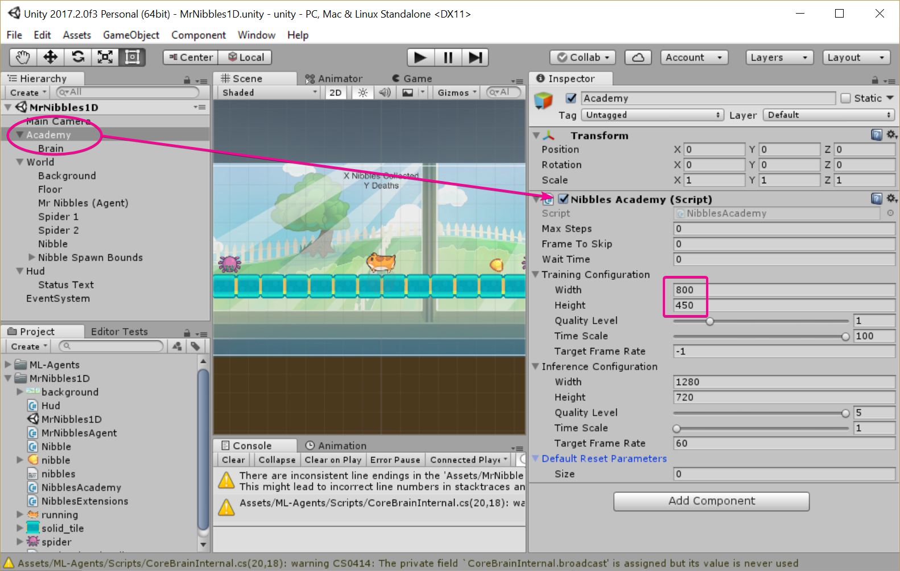](./the-academy.png)

I changed the `Width` and `Height` properties in the `Training Configuration` section because I like to see what's going on during training tho this could perhaps hurt training performance (something to tinker with later).

# The Brain

The "Brain" is the object that communicates with the the Academy and is the.. umm.. brains of your scene.

[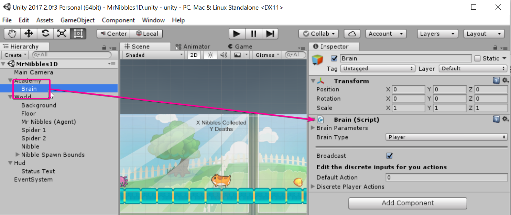](./basic-brain.png)

For now I have just left the default settings, but will be coming back to this soon.

# The Nibble

[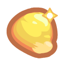](./nibble.png)

The nibble is the target that Mr Nibbles is going to be trying to collect.

```csharp
using UnityEngine;

namespace MrNibbles1D
{
    public class Nibble : MonoBehaviour
    {
        public Transform minPosition;
        public Transform maxPosition;

        public void Respawn()
        {
            var randX = Random.Range(minPosition.position.x, maxPosition.transform.position.x);
            transform.position = new Vector3(randX, transform.position.y, transform.position.z);
        }
    }
}
```

When collected the agent restarts and at the same time we re-spawn the nibble at a random position between two points.

[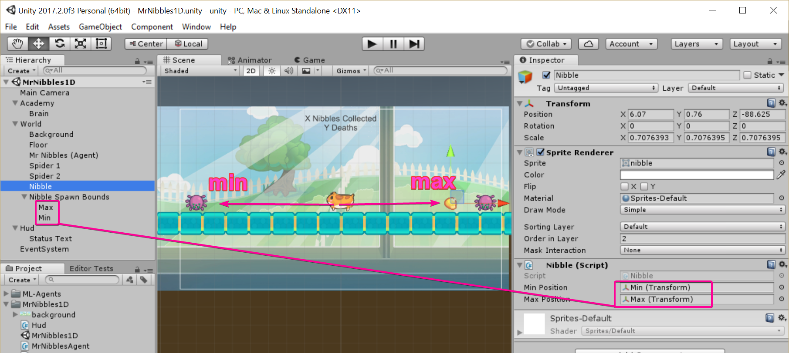](./nibble-spawning.png)

# Spider

[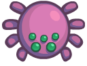](./spider.png)

The spiders are the things that can kill Mr Nibbles so he should avoid them. For this simple example however they just represent the boundry for the world, and thus if the agent "touches" them by leaving the boundary that counts as a death to Mr Nibbles.

[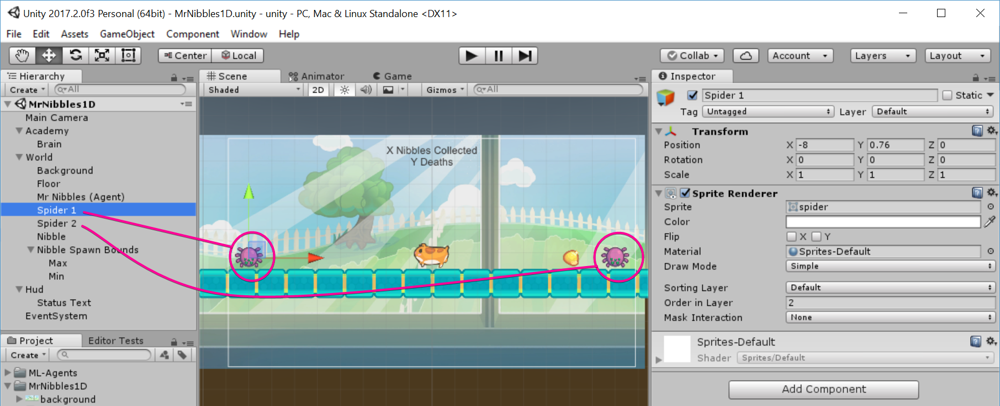](./the-spiders.png)

# The Agent

The agent is where the meat and potatoes of the C# code is. Its the part that controls how Mr Nibbles behaves.

I first started off with an empty agent.

```csharp
namespace MrNibbles1D
{
    public class MrNibblesAgent : Agent
    {
    }
}
```

## State

We know from my [last post](/machine-learning/a-game-developer-learns-machine-learning-getting-started/) that at its heart Reinforcement Learning (the type of machine learning we are doing) is training an agent which action to perform given a specific state.

So with that in mind we need to begin by telling the ML code what the current state of the world is:

```csharp
using System.Collections.Generic;

namespace MrNibbles1D
{
    public class MrNibblesAgent : Agent
    {
        public Nibble nibble;

        public override List<float> CollectState()
        {
            return new List<float> { transform.position.x, nibble.transform.position.x };
        }
    }
}
```

The state is pretty simple, just two floats. One is the position of Mr Nibbles (the agent) and the other is the position of the nibble. We could potentially include some state information about the position of the spiders but we dont need to as they only represent the boundary of the world and thus are accounted for in the reward function (see below).

## Actions

Next up is the actions that the agent can take to affect the state:

```csharp
using System.Collections.Generic;

namespace MrNibbles1D
{
    public class MrNibblesAgent : Agent
    {
        private const int MoveLeft = 0;
        private const int MoveRight = 1;

        public float speed = 0.05f;

        ...

        public override void AgentStep(float[] action)
        {
            if (action.Is(MoveLeft))
                Move(-speed);
            else if (action.Is(MoveRight))
                Move(speed);
        }

        private void Move(float delta)
        {
            transform.Translate(delta, 0, 0);
        }
    }
}
```

There are only two possible actions that the agent can take. Either move left or move right. Each step the agent will try one of these actions depending on what it previously leant will get it the highest reward (more on rewards in a second).

You will note that the `action.Is()` is just a helper extension method I wrote to make things a little easyier to read:

```csharp
namespace MrNibbles1D
{
    internal static class NibblesExtensions
    {
        public static bool Is(this float[] action, int actionType)
        {
            return (int)action[0] == actionType;
        }
    }
}
```

_Note: Im a big fan of writing code that doesnt need comments because the variables and functions have been named so that they are redundant._

## Out of Bounds

So now that our agent can either move Mr Nibbles Left or Right. We also need to define what happens if Mr Nibbles moves too far to the left or right, i.e. he goes out of bounds.

```csharp
using System.Collections.Generic;
using UnityEngine;

namespace MrNibbles1D
{
    public class MrNibblesAgent : Agent
    {
        public int Deaths { get; private set; }

        public Transform minimumBounds;
        public Transform maximumBounds;

        ...

        public override void AgentStep(float[] action)
        {
            ...

            if (OutOfBounds())
                AgentFailed();
        }

        private bool OutOfBounds()
        {
            return transform.position.x <= minimumBounds.position.x ||
                   transform.position.x >= maximumBounds.position.x;
        }

        private void AgentFailed()
        {
            reward = -1f;
            done = true;
            Deaths++;
        }

        ...
    }
}
```

Here we pass in the spider's positions which represent the maximum and minimum bounds for our agent.

[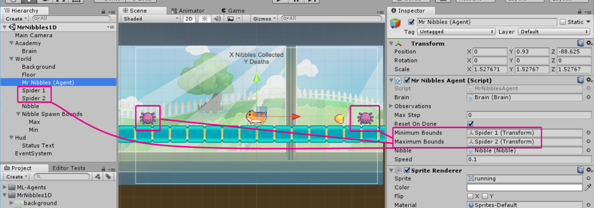](./the-boundries.png)

So each tick `OutOfBounds()` is checked and if true we set the reward to `reward = -1` and `done = true`.

The reward is the feedback mechanism that the agent uses during training to determine if the action it took resulted in a positive outcome or not and thus it updates itself to make that action more or less likely given that state next time.

## Target Acquired

Now we have the boundary condition covered, we just have just one more scenario to cover during a tick; when mr nibbles collect a nibble.

```csharp
using System.Collections.Generic;
using UnityEngine;

namespace MrNibbles1D
{
    public class MrNibblesAgent : Agent
    {
        public int NibblesCollected { get; private set; }

        public Nibble nibble;
        public float speed = 0.05f;

        ...

        public override void AgentStep(float[] action)
        {

            ...
            else if (HaveReachedTarget())
                AgentSucceed();
        }

        private bool HaveReachedTarget()
        {
            return Mathf.Abs(nibble.transform.position.x - transform.position.x) <= speed;
        }

        private void AgentSucceed()
        {
            reward = 1;
            done = true;
            NibblesCollected++;
        }

        ...
    }
}
```

Here we use a range check to see if we are within one step of the nibble, if so then we `HaveReachedTarget()` and `AgentSucceed()` will be called. In doing so we positively reward the agent thus encouraging that behavior in the future.

## Agent Reset

The final thing we need to cover for our agent is what happens when `done = true` caused by the agent when it is `OutOfBounds()` or `HaveReachedTarget()`.

```csharp
using System.Collections.Generic;
using UnityEngine;

namespace MrNibbles1D
{
    public class MrNibblesAgent : Agent
    {
        ...

        public Nibble nibble;

        private Vector3 _startingPostition;

        void Awake()
        {
            _startingPostition = transform.position;
        }

        ...

        public override void AgentReset()
        {
            nibble.Respawn();
            transform.position = _startingPostition;
        }
    }
}
```

We simply record what the starting position is and set that again and tell the `Nibble` to respawn at the new random position.

# Hud

Now we have defined all the important parts of our scene we are almost ready to test things, but first lets just setup a quick HUD so we can see the "score".

```csharp
using UnityEngine;
using UnityEngine.UI;

namespace MrNibbles1D
{
    public class Hud : MonoBehaviour
    {
        public MrNibblesAgent mrNibbles;
        public Text text;

        void FixedUpdate()
        {
            text.text = $"{mrNibbles.NibblesCollected} Nibbles Collected\n";
            text.text += $"{mrNibbles.Deaths} Deaths";
        }
    }
}
```

[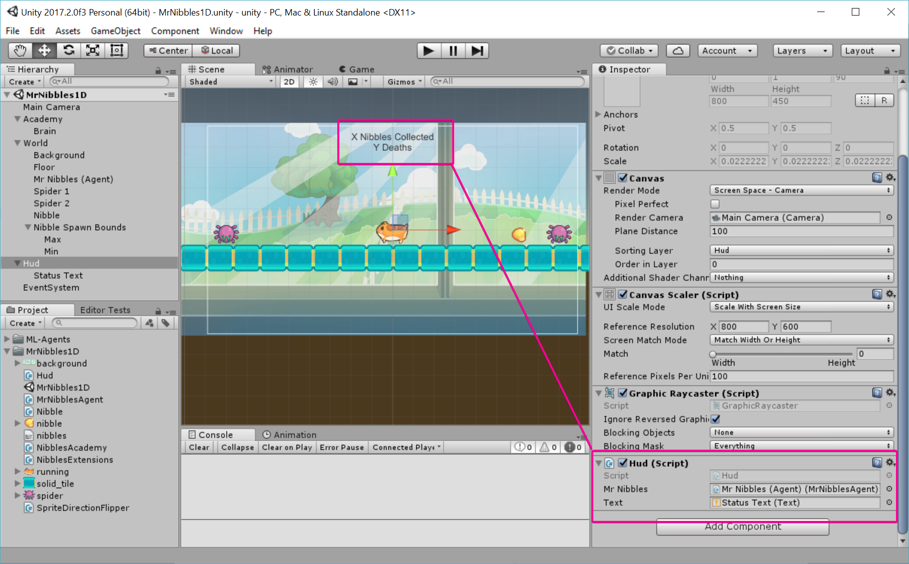](./the-hud.png)

# Playmode

We are finally ready to enter playmode and test out our scene prior to training. First we need to make sure the `Brain` type is set to `Player` and we have mapped the "Player Actions".

[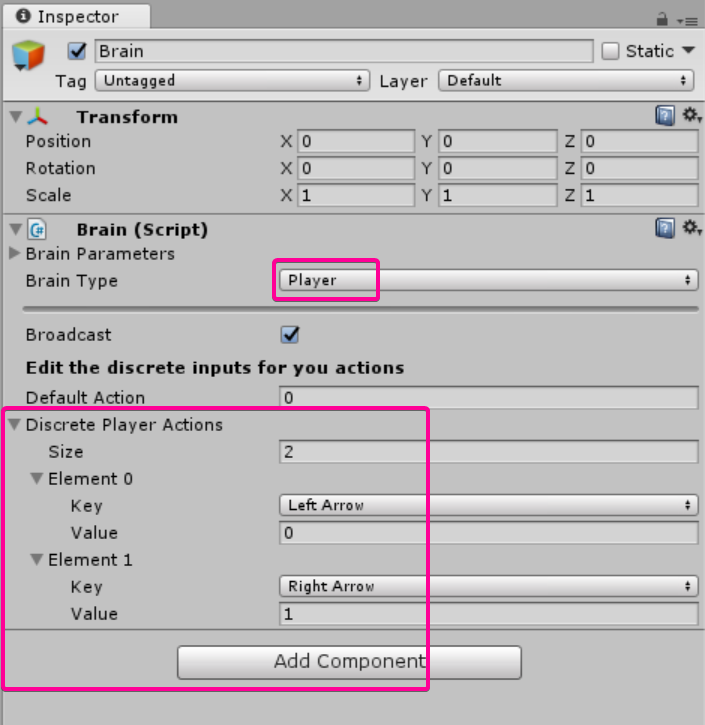](./brain-player.png)

Now lets press play and we can use the arrow keys on our keyboard to control Mr Nibbles

<iframe width="853" height="480" src="https://www.youtube.com/embed/T2hAcNlQoI0" frameborder="0" allow="autoplay; encrypted-media" allowfullscreen></iframe>

Sweet! We can see that it works, when Mr Nibbles touches a spider then he "dies" and when he touches a nibble he "wins".

One small little addition, lets add this little script to Mr Nibbles:

```csharp
using UnityEngine;

namespace MrNibbles1D
{
    [RequireComponent(typeof(SpriteRenderer))]
    public class SpriteDirectionFlipper : MonoBehaviour
    {
        private float _lastPosition;
        private SpriteRenderer _renderer;

        void Start()
        {
            _renderer = GetComponent<SpriteRenderer>();
            _lastPosition = transform.position.x;
        }

        void FixedUpdate()
        {
            var delta = transform.position.x - _lastPosition;
            _renderer.flipX = delta > 0;
            _lastPosition = transform.position.x;
        }
    }
}
```

Now when we move left or right Mr Nibbles will face the correct direction.

<iframe width="853" height="480" src="https://www.youtube.com/embed/JNgzEKvtAHY" frameborder="0" allow="autoplay; encrypted-media" allowfullscreen></iframe>

_NOTE: we have to use `FixedUpdate()` instead of `Update()` because the Agent takes its actions on the FixedUpdate loop._

# Training

Okay so far so good, we have a working scene that is controllable by a human, now comes the interesting part. Lets train an computer to play instead of us.

## Exporting the Environment

First we set the brain to "External" mode, this means that the agent will no longer be controlled by the player and will instead be controlled by an external source (python).

[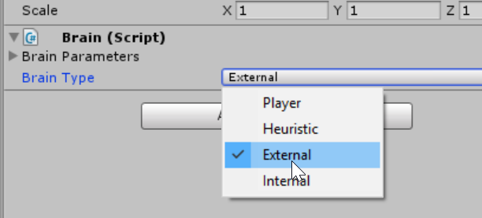](./external-brain.png)

Now we just need to build our scene exe (also known as environment) and save it to the `/python/` directory.

[](./building-environment.png)

## Configuring Hyperparameters

Okay with that done lets fire up jupyter notebook:

```
cd python
jupyter notebook
```

And open the PPO.ipynb notebook.

[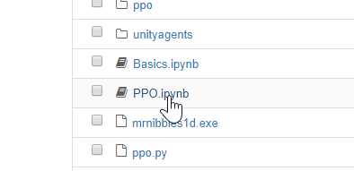](./ppo-notebook.png)

Now lets change the Hyperparameters (such a cool term):

```python
### General parameters
max_steps = 5e5 # Set maximum number of steps to run environment.
run_path = "mrnibbles1d/run1" # The sub-directory name for model and summary statistics
load_model = False # Whether to load a saved model.
train_model = True # Whether to train the model.
summary_freq = 5000 # Frequency at which to save training statistics.
save_freq = 50000 # Frequency at which to save model.
env_name = "mrnibbles1d" # Name of the training environment file.
curriculum_file = None

### Algorithm-specific parameters for tuning
gamma = 0.99 # Reward discount rate.
lambd = 0.95 # Lambda parameter for GAE.
time_horizon = 2048 # How many steps to collect per agent before adding to buffer.
beta = 1e-3 # Strength of entropy regularization
num_epoch = 8 # Number of gradient descent steps per batch of experiences.
num_layers = 1 # Number of hidden layers between state/observation encoding and value/policy layers.
epsilon = 0.2 # Acceptable threshold around ratio of old and new policy probabilities.
buffer_size = 4096 # How large the experience buffer should be before gradient descent.
learning_rate = 3e-4 # Model learning rate.
hidden_units = 64 # Number of units in hidden layer.
batch_size = 32 # How many experiences per gradient descent update step.
normalize = False
```

Its a bit of a dark-art knowing which of these to change for your given scenario.

I used a combination the Unity 3D College video and [this doc](https://github.com/Unity-Technologies/ml-agents/blob/master/docs/best-practices-ppo.md);

Note that I have set `run_path` to be `"mrnibbles1d/run1"` because we are probably going to try a few different thing out so its good to keep track of this by splitting things into separate runs.

## Running

Okay cool, lets give this a shot then. Pressing shift enter on each of the cells in the notebook we start the training process, the environment window opens up and straight away we can see that the agent is training:

[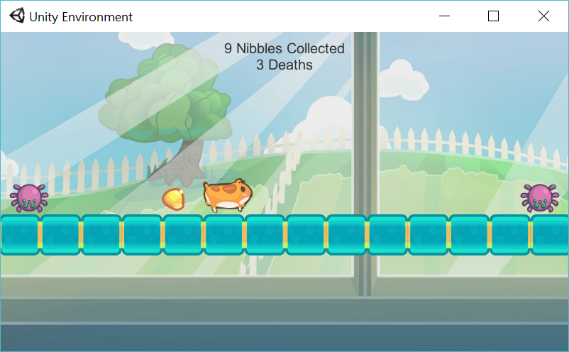](./env-window.png)

To get a better picture of whats going on inside the agent, lets fire-up tensorboard:

```
tensorboard --logdir=summaries
```

[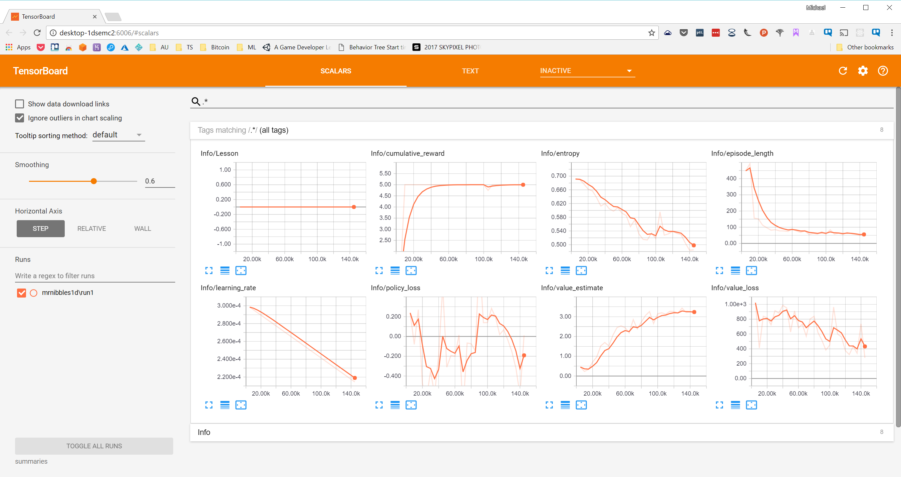](./tensorboard1.png)

Since last post in this series I have come to understand a little more about these graphs:

`cumulative_reward` tells us how much reward was given to the agent in a single run. So we can see that is started off low as the agent randomy tries different actions and consequently doesnt get much reward. Quite rapidly however it figures out how to get more reward up until it levels off at around 60k steps. So from this we can see that in about 60k steps the agent has pretty much found its optimum strategy as it is no longer increasing its reward per run.

`episode_length` this tells us how long it takes the agent to complete the run, either pass or fail. So we can see, as with the cumulative_reward, that the time the agent takes to finish starts off pretty high as it randomly moves around but rapidly works out an optimum strategy thus decreasing the episode length.

## Exporting

After a few hundred k steps I stop the training, however it probably could have been stopped around 60k steps once it has found its optimum solution.

[](./exporting-model.png)

I export the trained model to a `.bytes` file ready to be imported into the game.

# Running the trained model

I copy the model from `/python/models/mrnibbles1d/mrnibbles1d.bytes` to `/unity/MrNibbles1D/` then set the brain to `Internal` and the model on "Graph Model".

[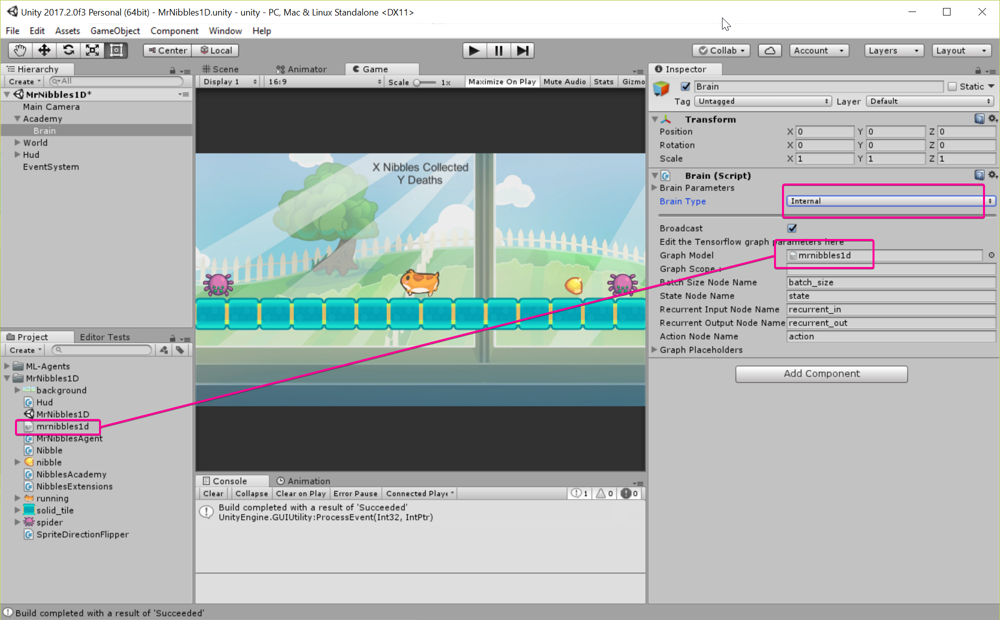](./setting-imported-model.png)

Now we should be able to just press play and see how well our trained model does:

<iframe width="853" height="480" src="https://www.youtube.com/embed/LD_YynM7oZI" frameborder="0" allow="autoplay; encrypted-media" allowfullscreen></iframe>

Sweet! It works! Its able to move towards the nibble 100% of the time.

# Stopping the Jitters

It doesn't come across on the video but Mr Nibbles seems to occasionally "jitter", that is turn left then right repeatedly, as it hesitates towards a solution. I want to see if I can get rid of that.

One way I can think of doing that is by penalizing the agent every time it changes its mind:

```csharp
using System.Collections.Generic;
using UnityEngine;

namespace MrNibbles1D
{
    public class MrNibblesAgent : Agent
    {
        ...

        private int _lastAction;

        void Awake()
        {
            ...
            _lastAction = 0;
        }

        ...

        public override void AgentStep(float[] action)
        {
            ...
            else // if not out of bounds or at a nibble
            {
                if (_lastAction != (int)action[0])
                    reward -= 0.5f;

                _lastAction = (int) action[0];
            }
        }

        ...
}
```

So each time the current action isnt the same as the last it takes a penalty.

I change the brain back to `External` and re-export the environment. Open the notebook again and change the run_path:

```python
run_path = "mrnibbles1d/run2"
```

And run it again.

Tensorboard looks a little different this time:

[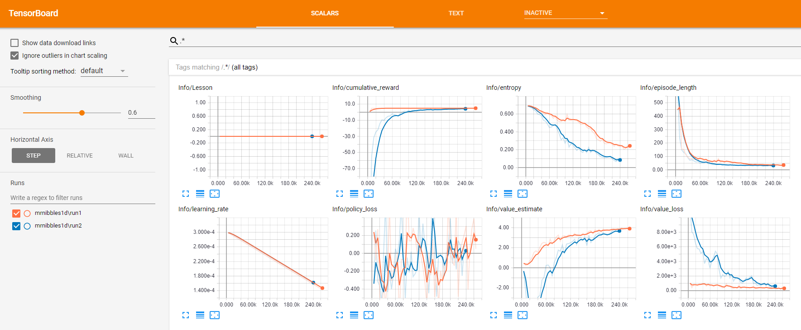](./tensorboard-run2.png)

Run2 is in blue, we can see that the cumulative_reward this time starts off a lot lower before ramping up to the same level after about 120k steps. This is to be expected as we are making things a little more difficult for the agent by rewarding it heavily against changing direction.

The episode_length takes roughly the same amount of time however so that's good.

Lets see how it does when we use the model in the game:

<iframe width="853" height="480" src="https://www.youtube.com/embed/MiY6DiZovRg" frameborder="0" allow="autoplay; encrypted-media" allowfullscreen></iframe>

Awesome! Most of the jitter has gone, just a tiny amount when the nibble spawns close but I think that's good enough for now :)

# Conclusion

Im really happy with how this turned out, I learnt a lot and I think it has set me up well for extending this to more states and actions.

There's still a ton to learn however and I haven't really touched any of that Python code (other than tweaking the Hyperparameters) so stay tuned for the next episode when hopefully we can extend this project a little further towards a working agent for Mr Nibbles Forever!

If you want to checkout the code and run the Unity project yourself then just clone the repo: https://github.com/mikecann/MrNibblesML
