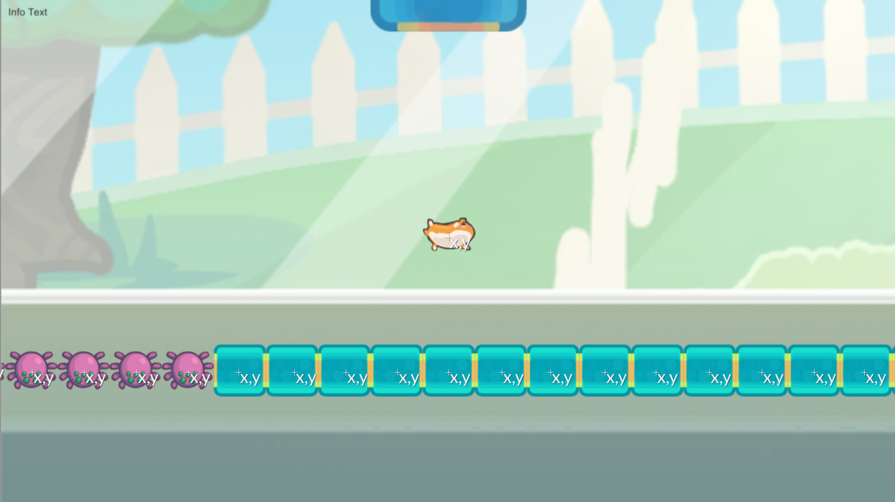
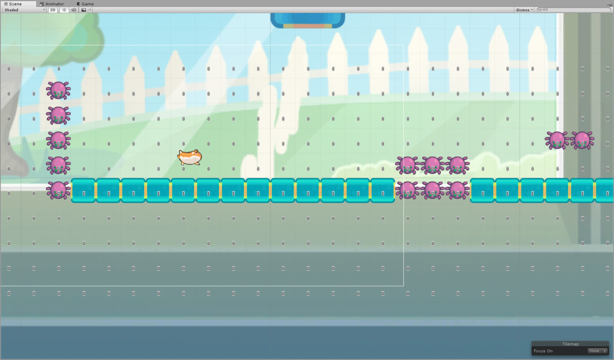

In my [last post](/machine-learning/a-game-developer-learns-machine-learning-a-little-deeper/) we dug a little deeper into machine learning by starting from scratch and training an agent on a vastly simplified version of mr nibbles. In this post we will explore what happens when we step it up a notch and attempt to train on a significantly more complex version of the game.

<!-- more -->

# The Series

If you are new to the series I recommend you checkout the previous posts first, here's the whole series:

0. [A Game Developer Learns Machine Learning - Intent](/machine-learning/a-game-developer-learns-machine-learning-intent/)
1. [A Game Developer Learns Machine Learning - Getting Started](/machine-learning/a-game-developer-learns-machine-learning-getting-started/)
1. [A Game Developer Learns Machine Learning - A Little Deeper](/machine-learning/a-game-developer-learns-machine-learning-a-little-deeper/)
1. A Game Developer Learns Machine Learning - Mr Nibbles Basics

# Code

If you want to see the code for this post then checkout this tag: https://github.com/mikecann/MrNibblesML/tree/MrNibblesBasicsBlogPost

# Mr Nibbles Forever vs Mr Nibbles

My original [Intent](/machine-learning/a-game-developer-learns-machine-learning-intent/) was to teach an ML agent to learn my game [Mr Nibbles Forever](http://epicshrimp.com/app/mrnibblesforever/). Based on my experience up to this point I think what might be easier is to begin with trying to train an agent to learn a game similar to "[Mr Nibbles](http://mr-nibbles.com/)" instead of "[Mr Nibbles Forever](http://epicshrimp.com/app/mrnibblesforever/)".

`youtube: https://www.youtube.com/embed/lyAf7VVLdKg`

Rather than an endless procedurally generated game like Mr Nibbles Forever, Mr Nibbles is a level-based platform-puzzler.

I suspect that Mr Nibbles will be easyier to learn as it's significantly less complex than its later variant, Mr Nibbles Forever.

# The Environment

Before I can even think about training my agent, I need an environment. Mr Nibbles was originally made many years ago in HaXe and thus I will need a way to build levels in Unity.

Unity recently launched a [set of tools](https://docs.unity3d.com/Manual/Tilemap-Painting.html) for generating tile-based games.

So I set to work using those tools to construct some levels:

`youtube: https://www.youtube.com/embed/99TRpAmZFYM`

I borrowed some code from Unity's [tutorial on platform games](https://unity3d.com/learn/tutorials/topics/2d-game-creation/creating-basic-platformer-game) to build a "Platform Controller" for Mr Nibbles. This is the thing that actually controls the how mr nibbles moves given an input.

I added a little of flourish in the way of big tubes to represent the entrance and exit points for the level. I even wrote some code that animated Mr Nibbles through the tubes but I found that it caused issues in the training so I decided to drop that aspect for now, perhaps ill add it again later.

The end result is that you are able to play a number of levels as mr nibbles. When you reach the exit another level is randomly selected and Mr Nibbles is spawned into that.

`youtube: https://www.youtube.com/embed/IHdPzaLRY98`

# The Agent

With the levels built its time to code up the agent.

## State

What information do we need to tell the network about the state of the world that will allow it to successfully learn how to navigate it?

Well we obviously need to supply the position of Mr Nibbles and the position of the exit point.

```csharp
public override List<float> CollectState()
{
    var state = new List<float>();

    state.Add(_exitPoint.transform.position.x);
    state.Add(_exitPoint.transform.position.y);

    state.Add(_platformController.transform.position.x);
    state.Add(_platformController.transform.position.y);

    return state;
}
```

We should probably also supply a variable to help with learning the potential set of actions depending if the player is in the air or not.

```csharp
public override List<float> CollectState()
{
    var state = new List<float>();

    ...

    state.Add(_player.IsGrounded ? 1 : 0);

    return state;
}
```

Im not sure if this is really needed but I thought it cant hurt.

Now for the hard part. How do I represent the level? I cant really pass in the collision bounds for each tile as that would be too complicated to represent as floats.

Each level is constructed as tiles, so everything sits on a uniform grid. So I should only need to pass in the centre point of each tile in the level along with its type and hopefully that should be enough for the agent from.

[](./tile-xy-pos.jpg)

The next issue is; how do I deal with different level sizes? [This GitHub issue](https://github.com/Unity-Technologies/ml-agents/issues/139) mentions that the state size needs to be fixed (I believe this is to do with the way TensorFlow works under the hood).

This restriction is going to make things a little tricky because our levels are different sizes with a different number of tiles, so keeping the state size the same for each level may be a problem (more on potential solutions to that later).

For now my "just get it working" solution is just to make sure the levels are quite small then grab all the tiles in a certain bounds. If the tile is empty I set its type to "0" if its a solid tile its "1" and if its a spider its "2".

[](./tile-types-rendered.jpg)

When the level changes I grab the tiles from the tilemaps:

```csharp
public BoundsInt tileBoundsToIncludeInState = new BoundsInt(-25, -1, 0, 40, 1, 1);

public override void AgentReset()
{
    ...
    _tiles = _game.CurrentLevel.GetComponentInChildren<TilesController>().GetTiles(tileBoundsToIncludeInState);
    ...
}
```

Then feed them into the state list:

```csharp
public override List<float> CollectState()
{
    ...

    foreach (var tile in _tiles)
    {
        state.Add(tile.position.x);
        state.Add(tile.position.y);
        state.Add(tile.type);
    }

    ...
}
```

## Actions

Now we have our state, we need to allow the agent to take and action and receive a reward or punishment for that action.

```csharp
public override void AgentStep(float[] actions)
{
    PerformActions(actions);
    UpdateRewards();
}
```

Digging into `PerformActions` first:

```csharp
public const int None = 0;
public const int MoveLeft = 1;
public const int MoveRight = 2;
public const int Jump = 3;

...

private void PerformActions(float[] actions)
{
    var nothing = (int) actions[None] == 1;
    var moveLeft = (int) actions[MoveLeft] == 1;
    var moveRight = (int) actions[MoveRight] == 1;
    var jump = (int) actions[Jump] == 1;

    var isJumping = false;
    var hozMove = 0f;

    if (moveLeft)
        hozMove = -1f;
    if (moveRight)
        hozMove = 1f;
    if (jump)
        isJumping = true;

    _platformController.Tick(hozMove, isJumping);
}
```

I handle the condition where the player can perform none, one or all of the actions simultaneously. I then pass those actions to the platform controller component which updates the physics of mr nibbles.

Now we need to handle how to reward the agent for its actions:

```csharp
private void UpdateRewards()
{
    if (_exitPoint.IsTriggered)
    {
        Wins++;
        reward = 10;
        done = true;
    }
    else if (_spiders.IsTriggered)
    {
        Deaths++;
        reward = -10;
        done = true;
    }
    else
    {
        reward = -0.01f;
    }
}
```

The agent is rewarded for reaching the exit, punished for touching the spiders and given a small punishment for each moment that goes by that it doesnt reach the exit.

Im not sure if these are the correct values, I played around with a few different values but im not sure if these are correct or not.

# Defining Brain and Academy

[As with my last post](/machine-learning/a-game-developer-learns-machine-learning-a-little-deeper/) I am going to leave the academy empty for now, I dont need its features as I dont have multiple agents in my scene.

The brain is setup like so:

[](./brain-setup.png)

We have defined the number of states: tiles (x,y,type) + agent state (x,y,isOnGround) + exit point (x,y) = 1505

The number of actions: jump, left, right, nothing (stand still).

The action space is set to continuous because we want to allow the agent to perform multiple actions at once, jump and move right for example.

The state space is continuous because we arent dealing with integer positions for things in the level rather we are using floats.

# Training

With the environment constructed lets move onto training. First I need to get the hyperparameters right for the PPO algorithm. I re-read [the unity best practices doc](https://github.com/Unity-Technologies/ml-agents/blob/master/docs/best-practices-ppo.md) and took a guess at the following hyperparams:

```python
### General parameters
max_steps = 5e5 # Set maximum number of steps to run environment.
run_path = "mrnibbles/run14-differentrewards" # The sub-directory name for model and summary statistics
load_model = False # Whether to load a saved model.
train_model = True # Whether to train the model.
summary_freq = 10000 # Frequency at which to save training statistics.
save_freq = 50000 # Frequency at which to save model.
env_name = "mrnibbles" # Name of the training environment file.
curriculum_file = None

### Algorithm-specific parameters for tuning
gamma = 0.99 # Reward discount rate.
lambd = 0.95 # Lambda parameter for GAE.
time_horizon = 1500 # How many steps to collect per agent before adding to buffer.
beta = 1e-3 # Strength of entropy regularization
num_epoch = 6 # Number of gradient descent steps per batch of experiences.
num_layers = 2 # Number of hidden layers between state/observation encoding and value/policy layers.
epsilon = 0.2 # Acceptable threshold around ratio of old and new policy probabilities.
buffer_size = 10000 # How large the experience buffer should be before gradient descent.
learning_rate = 3e-4 # Model learning rate.
hidden_units = 64 # Number of units in hidden layer.
batch_size = 2500 # How many experiences per gradient descent update step.
normalize = False
```

I kicked off training and fired up TensorBoard. After a few different attempts I felt like I had something that was training so I let it run for an hour or so:

[](./tensorboard.png)

It looks okay, we can see that the cumulative reward increases sharply and levels off and the episode length decreases as the agent learns to play the level.

When we try our model out in the game however we see this:

`youtube: https://www.youtube.com/embed/S21Rkob0XfM`

On the positive side, it looks like he is attempting to move towards the exit point when the exit is to the right of the spawn point. On the negative side he doesnt ever seem to want to try going left and also seems to get stuck for a long time at a small hurdle.

I think whats going on is the levels where the exit point is to the left of the spawn point have spiders, thus they are significantly more difficult for the agent to solve than the levels where the exit point is to the right of the spawn point. As a result the agent has learnt that probably it should always just go right and is unable to learn that it can jump over the spiders.

It looks like the agent is having trouble with jumping in general..

# Future Work

I tried a few smaller tweaks but none seemed to have a significant effect. I think what I need to to change my training strategy.

## Curriculum Training

While browsing through the Unity docs I came across the concept of [curriculum training](https://github.com/Unity-Technologies/ml-agents/blob/master/docs/curriculum.md). As I understand it; you incrementally train your agent with progressively more difficult scenarios thus accelerating the learning by focusing the agent on learning just one aspect of your game at a time. This reminds me of how humans learn in school, we aren't immediately thrown into quantum mechanics, instead we start with basic mathematics and work our way up from there.

I think my next set of experiments will have to take advantage of curriculum learning by slowly introducing level elements until the agent is able to successfully proceed.

## Tile Radius State

One current limitation of my current setup is that I encode the state of the entire level. This means I am currently limited to small levels of fixed size.

A solution (suggested by a member of [my local Machine Learning meetup group](https://perthmlgroup.wordpress.com/)) is to only provide the state of tiles that lie in a radius around Mr Nibbles. As Mr Nibbles moves so to does the nearest surrounding tiles. This is analogous to using a camera as my input state but unlike camera state the agent should be able to learn [temporal information](https://github.com/Unity-Technologies/ml-agents/issues/183).

## Reward Tweaking

I think I may need to work on how I reward and punish a little bit more. Perhaps I should have a timeout if it takes the agent too long to solve a level, maybe that would prevent it from learning that on certain levels its best just to suicide rather than try to solve the level.

## Velocity

Another potential issue is was unable to learn to jump correctly was because it was missing information about its velocity. I was hoping it could infer the velocity based on the previous positional state of mr nibbles but perhaps it would help if I manually supplied that information as two more state parameters.

# Conclusion

Well I cant really call this post a success, but I certainty learnt a lot and that's the ultimate goal. I have lots of ideas for how to proceed from here so subscribe to stay tuned.

Until next time!

P.S. If you want to see the code for this post then checkout this tag: https://github.com/mikecann/MrNibblesML/tree/MrNibblesBasicsBlogPost
