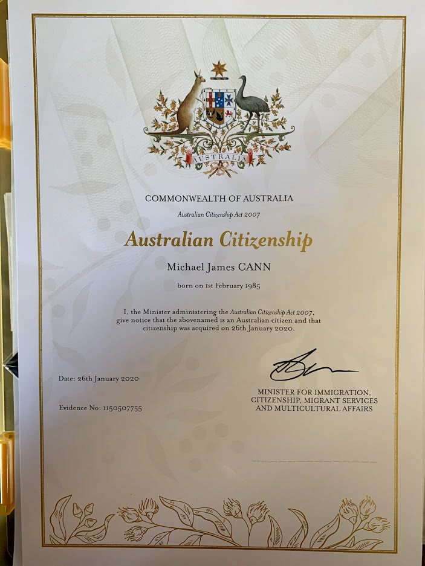
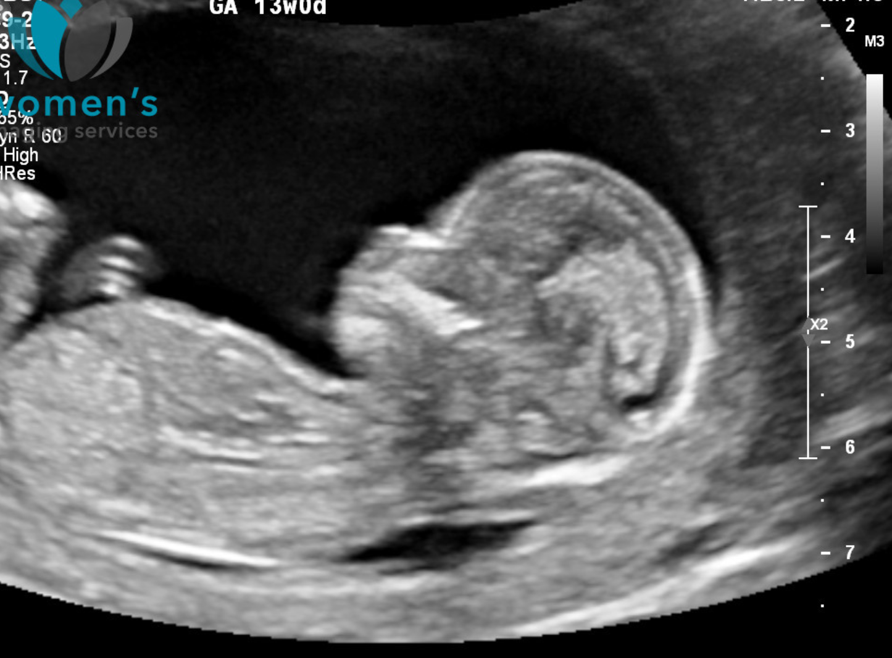

This blog has been going for a long time and in the early days it was a mixture of Personal updates and technical updates.

<!-- more -->

Lately tho its become more technical and less personal as I have usually contained my personal updates to my [Facebook Profile](https://facebook.com/mikeysee) and my [Instagram Account](https://www.instagram.com/mikeysee/).

But I thought its okay to do a personal update every now and then and theres been some major milestones happening in the life of Mike Cann of late..

# Mike The Australian

Well I cant remember if I ever actually blogged about this but 6 years ago I moved to Australia to be with my beautiful girlfriend Kelsie who lives here. Well a lot has happened in the intervening years and as of a few months ago I am now official Australian Citizen :)

# Mike The Outdoors Enthusiast

I have fully embraced the Australian lifestyle and now make the most of every opportunity I can to get outside and do various activities.

My current passions are Kitesurfing, Freediving and Electric Skateboarding :)

https://www.instagram.com/mikeysee/

<iframe src="https://www.facebook.com/plugins/video.php?href=https%3A%2F%2Fwww.facebook.com%2Fmikeysee%2Fvideos%2F10157700052541031%2F&show_text=0&width=560" width="560" height="315" style="border:none;overflow:hidden" scrolling="no" frameborder="0" allowTransparency="true" allowFullScreen="true"></iframe>

<iframe width="560" height="315" src="https://www.youtube.com/embed/eU--BOB6owA" frameborder="0" allow="accelerometer; autoplay; encrypted-media; gyroscope; picture-in-picture" allowfullscreen></iframe>

<iframe src="https://www.facebook.com/plugins/video.php?href=https%3A%2F%2Fwww.facebook.com%2Fmikeysee%2Fvideos%2F10158156960906031%2F&show_text=0&width=476" width="476" height="476" style="border:none;overflow:hidden" scrolling="no" frameborder="0" allowTransparency="true" allowFullScreen="true"></iframe>

# Mike The Father (to be)

Last but not least in December we had some incredibly special news that I am to become a father for the first time.

Its a boy and its due in early June and I couldn't be more excited / apprehensive :)

