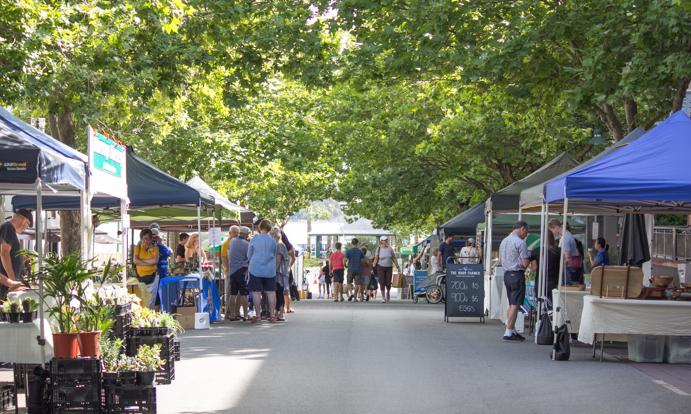
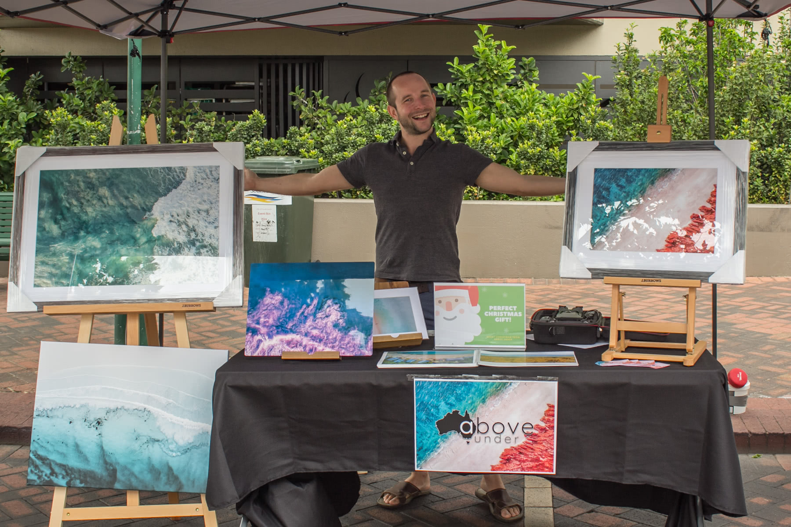
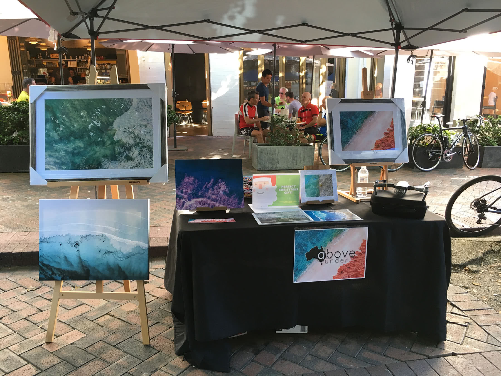
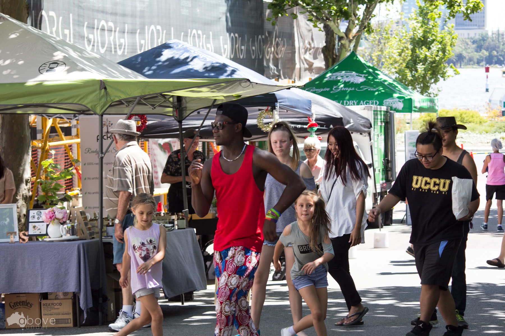
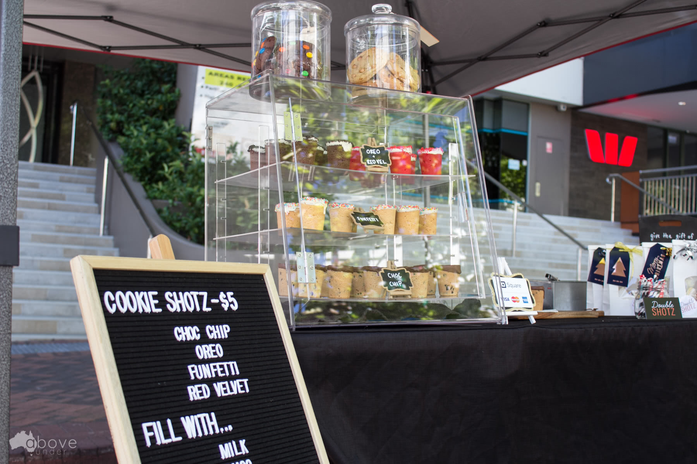

For the past couple of weeks I have run a Sunday market stall for my side-project-business Above Under. Its my first time ever running a stall and its been a really interesting experience thus far.

<!-- more -->

# Location Location Location

My daily commute to work is one of the reasons I love living where I do. I walk past the zoo, through a park, down a beautiful tree-lined street then catch the ferry, often watching the dolphins feeding in the river, then through another park and im at work.

Each time I walk down that beautiful tree-lined street I though to myself; this would be a great place to have a market, and lo and behold I was walking down here the other week and saw that indeed they had just started to run markets here!

Its a beautiful area, theres lots of foot traffic from the shops, cafes and the zoo so I thought to myself, why dont I have a go at running a market stall?

# Why?

Although Above Under has a website, Facebook, Instagram and all the other usual gamet of social media destinations I think that my best chance of showing people how spectacular some of the imagery is by actually putting it infront of them.

A market stall also lets me demonstrate the various material types that I can print on from various photo paper posts, to acrylic to solid metal Alumalux.

Although I had seen photography stalls at markets before (although I am the only photography stall at this market) I had never seen a stall specialize in drone photography.

# The Stall

So I spent a busy week rushing around buying a table, gazebo and a few picture stands and easals, not to mention ordering \$500+ worth of prints in various sizes and types as examples. There was some doubt if I would manage to get it all together in time but I just about managed it.

# Lessons

The first Sunday running the stall, it was really very windy and despite bringing some weight and buckets full of sand, our gazebo very almost took off in the heavy winds. So for the second week I went out and invested in 4 heavy weights for each of the 4 legs of the gazebo.

Another thing I learnt is more about the business itself. I didnt really know what to expect sales wise on the day so I spent a bit of time setting up a square.com account and bought one of their contactless readers for \$50. In my mind I was expecting that people might want to buy xmas gifts and some people might want to order prints for later delivery so I would be prepared.

What actually seems to have been the case is that people walk over, have a look and a chat then take a business card. The majority of the keen people are looking to find an image that matches their decor, either for themselves or for a client if they are an interior decorator.

So my pitch has changed from focusing on the products available to promoting which images would look good with which color combinations.

One other thing I learnt was that some people didnt understand how I had made the images. Infact several people asked if they were paintings. So I decided to put my drone out on the table infront so people can see how I actually took the images.

However this has now led to people asking if my drone was for sale. Sigh!

# Experiment

Its all just an experiment at this stage. Im enjoying learning retail and sales lessons the hard way, by actually doing it. Its good experience which should follow through into selling things online too.

So if you are in the market for some high quality Australian drone photography come down to the Mends Street Markets in South Perth, ill be here each Sunday for the next few weeks at least!

