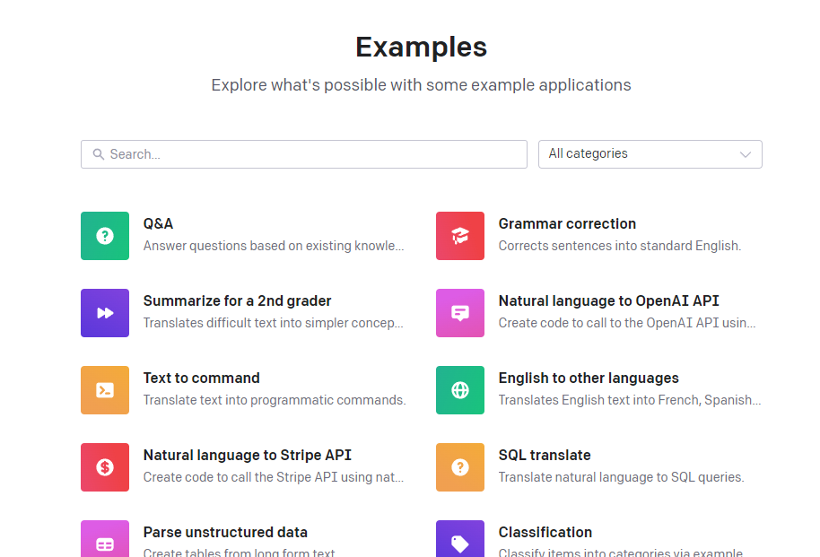
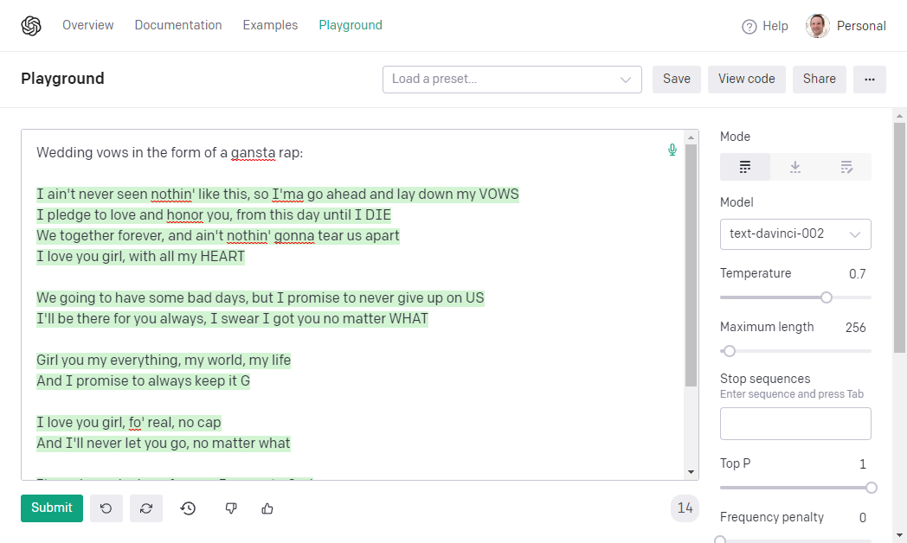
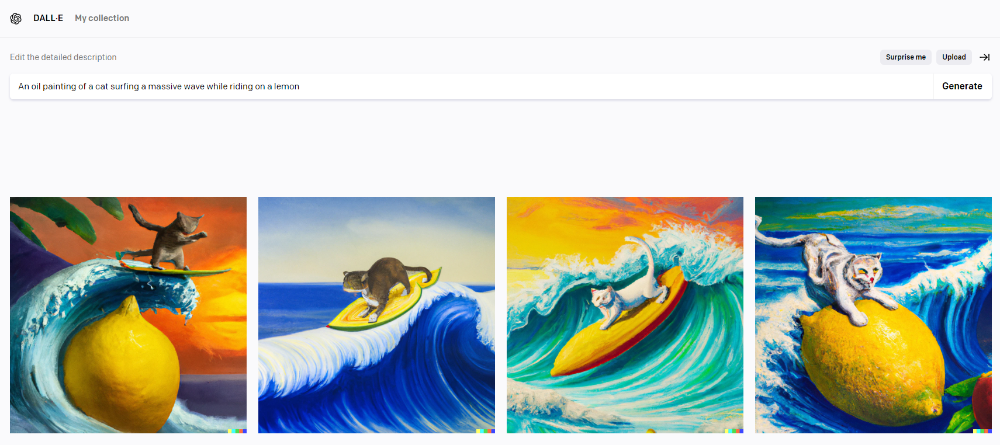
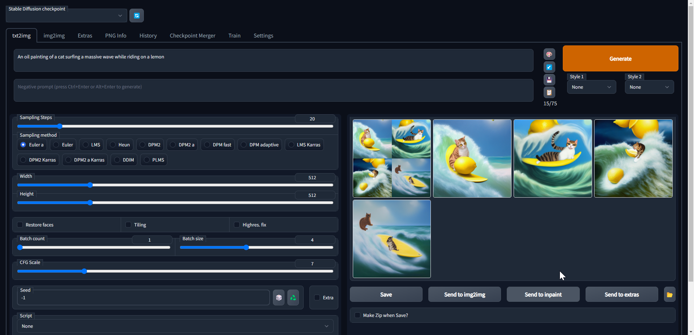
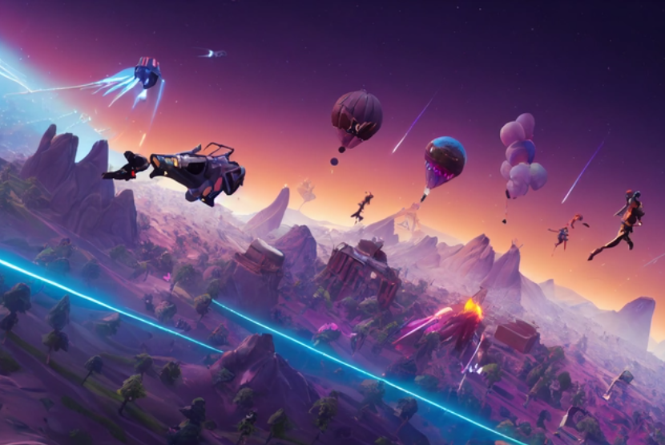
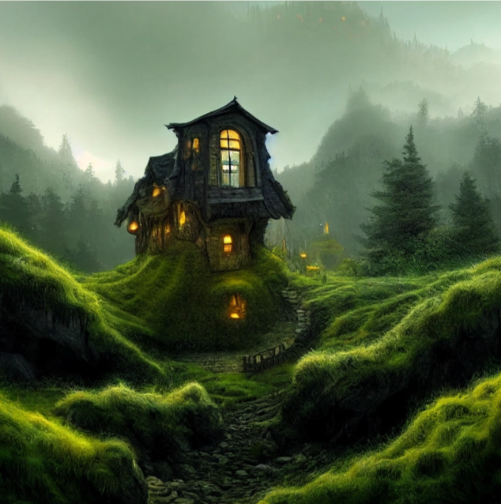
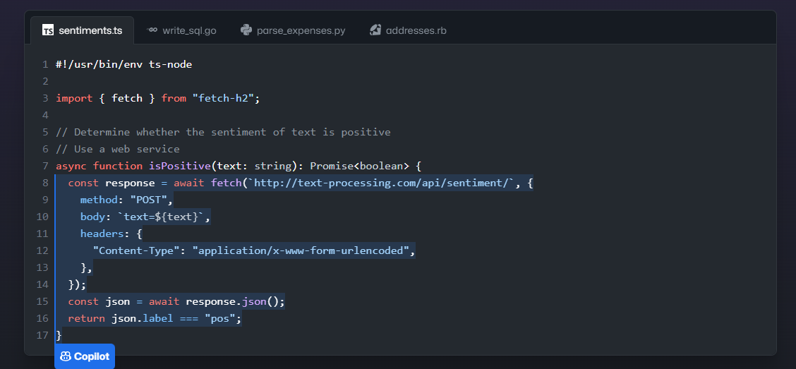
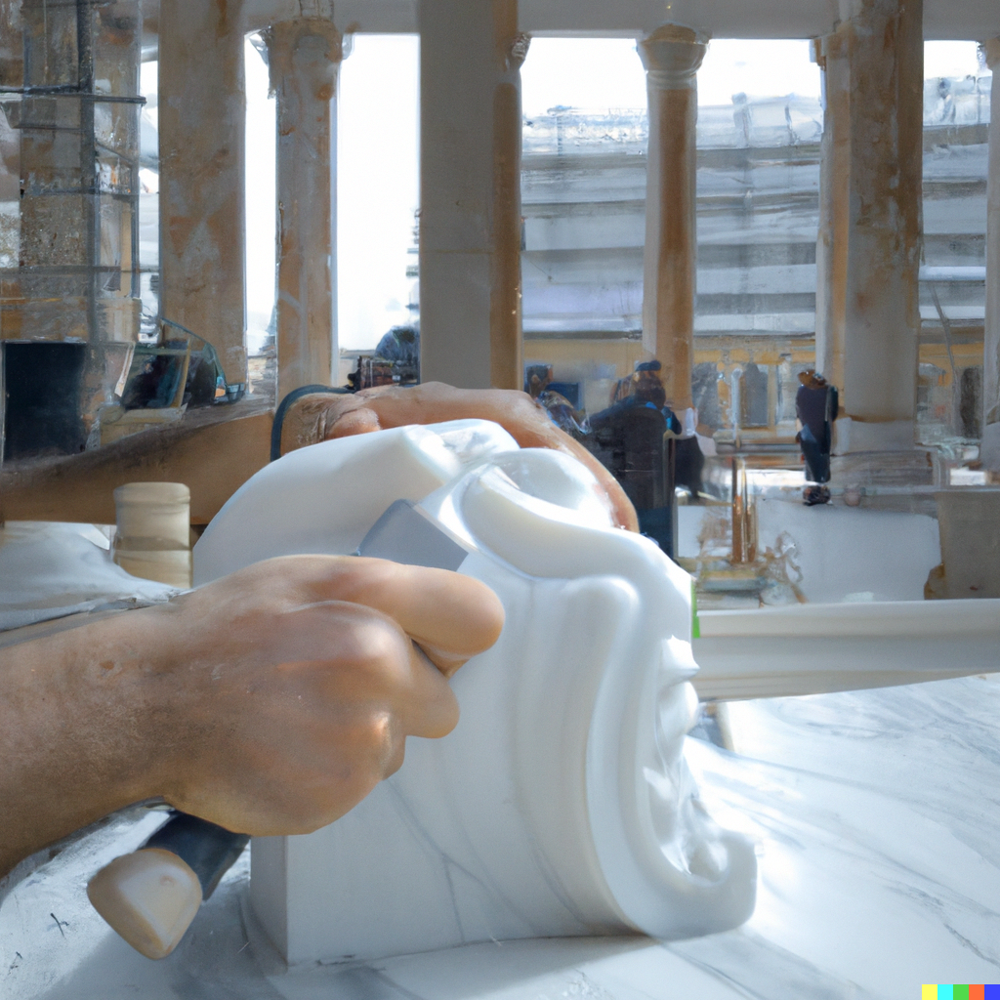
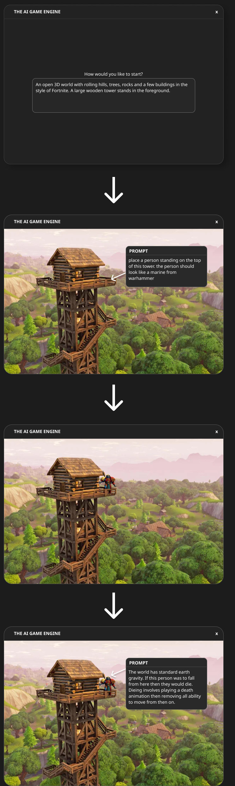

As a [game developer of 30](/about) years I like to stay up to date with new tools and techniques in my chosen profession. There is however a change coming of such magnitude I think its going to totally upend the way games are made in the future.

# History

Before we can talk about the future of Game Development we must first take a quick trip to the past to see how we got here.

I remember first being blown away by AI powered image generation technology 6-7 years ago when [CycleGAN](https://github.com/junyanz/CycleGAN) was first released allowing you to "Style Transfer" a horse into a zebra:

[](./horse2zebra.gif)

This led to a whole world of incredible advances, notably [StyleGAN](https://arxiv.org/abs/1912.04958) brought the ability to generate very realistic human portrait photos. Checkout this page and hit refresh a few times:

[https://thispersondoesnotexist.com/](https://thispersondoesnotexist.com/)

This then led to an explosion of [This X does not exist](https://thisxdoesnotexist.com/) websites that are all based on GANs (Generative Adversarial Networks).

Around that same time there was a whole wave of "Deep Fakes" that used the StyleGAN process to impose peoples faces onto video creating incredibly realistic videos that could very easily trick unsuspecting viewers.

<iframe width="853" height="480" src="https://www.youtube.com/embed/gLoI9hAX9dw" frameborder="0" allow="autoplay; encrypted-media" allowfullscreen></iframe>

Up to this point most of these techniques had been limited to either transferring style or generating images based on a highly specialized model.

Then came along a new wave of generic language models based on [Google Brain's Transformer Networks](https://ai.googleblog.com/2017/08/transformer-novel-neural-network.html), notably [GPT-2 and 3 from OpenAI](https://beta.openai.com/examples/).

[](./gpt3.png)

These massive multi-billion neuron models understand language much more deeply than anything that had come before them and are able to understand and translate human language with incredible accuracy.

Don't tell my wife but I actually used GPT3 to help me craft my wedding vows:

[](./vows.png)

These advances in language understanding were critical to the next wave in image generation; text to image.

You see, to be able to generate images from some text that you provide then the AI must first deeply understand all the words in a given prompt.

For example lets say we want "An oil painting of a cat surfing a massive wave while riding on a lemon".

To accomplish this the AI must have a deep understanding of not only what a cat, a lemon, wave and surfing are but it must understand those words in the correct order and then understand how to put them together to look like an "oil painting".

[](./lemon-cat.png)

[OpenAI's Dall-e-2](https://openai.com/dall-e-2/) was released this year as a commercial product was used to generate the above images.

Arguably more impressive images are able to be generated by [Stable Diffusion](https://stability.ai/blog/stable-diffusion-public-release) which unlike Dall-e-2 was released for free to the general public:

[](./lemon-cat-sd.png)

Stable Diffusion and its cousin [Mid Journey](https://www.midjourney.com/showcase/) are more targeted towards "Concept Art" than Dalle-e-2 this means that althought it might still understand the words "cat", "lemon", "surfing" when it comes to generating the images however it is less likely to do a good job on the "oil painting" part of the prompt than Dalle-e.

When given a task that its designed for however it is REALLY good. I mean just checkout some of the examples on this page with the prompts used to generate them: [https://openart.ai/discovery?dataSource=md](https://openart.ai/discovery?dataSource=md)

Designing the correct prompt is itself an art however and there are now job positions opening for "Prompt Engineers".

# Game Development

So what has all this got to do with the future of game development?

## Concept Art

Well firstly in my opinion Stable Diffusion and Mid Journey have all but destroyed the "Concept Artist" sub profession in game development.

A bold statement I know, but why would you pay hundreds of thousands of dollars per year for a highly specialized concept artist when in a few seconds you can generate images like this:

[](./fortnite.png)
["fortnite in the year 2060"](https://openart.ai/discovery?dataSource=md&q=game)

[](./house.png)
["medieval fantasy monster tavern inn, hidden mimic monster living organic building , isolated lane in mountains, deep forest, winding paths, lonely traveller, detailed living organic architecture hidden monster, Tudor fantasy historical, eye-windows, fangs, mouth-doors, tongue, rain, digital concept art, menacing"](https://openart.ai/discovery?dataSource=md)

[](./woman.png)
["beautiful cyberpunk woman in armor, dark hair, futuristic, intricate binary and electronic designs, elegant, highly detailed, sharp focus, ghost in the shell, mamoru oshii, nier automata, art by wlop, art by guweiz"](https://openart.ai/discovery?dataSource=md)

Sure, they aren't perfect, so I guess you could make the argument that concept artists in their current form would still be needed, if only to tweak the output to the intended application.

I suspect its more likely that "a concept artist"'s job will change. Instead of pushing pixels around with a [Wacom tablet](https://www.wacom.com/) instead they will simply become "Prompt Engineers". Taking in the request from their client and using their experience with a number of specialized models to iterate towards a result.

## Generalist Artist

Right now the models arent particularly well tuned for generating sprites / textures or other assets that we currently use to build games but I suspect that is either currently being worked on or is currently being used in the larger studios.

Given tools such as [Pixel Diffision](https://colab.research.google.com/github/KaliYuga-ai/Pixel-Art-Diffusion/blob/main/) or [Pixelator](http://pixelatorapp.com/) or [Monster Mash](https://ai.googleblog.com/2021/04/monster-mash-sketch-based-tool-for.html) I suspect its just a matter of joining the dots and putting these pieces together in one cohesive package.

Maybe [even more recent](https://waxy.org/2022/11/invasive-diffusion-how-one-unwilling-illustrator-found-herself-turned-into-an-ai-model/) advances from [DreamBooth](https://dreambooth.github.io/) will allow us to train models designed specifically for our game's art style.

Having said that I think ultimately we wont have such low-level tooling that humans use, instead, I believe things will go much grander direction..

## Code

So art in Game Development as we know it is dead. Surely we will still need coders like myself. Right? The 30 years of game-making experience I have built up aren't simply going to become obsolete. Surely?

Github's [Copilot](https://github.com/features/copilot) was released last year to much fanfare and its easy to see why. Given a simple prompt written in a comment it's able to generate large swaths of working code for you:

[](./copilot.png)

As with image generation it uses very large complex language models under the hood to understand to break apart your prompt (and other context specific information from your workspace) and transform that into an output, generating one token at a time.

OpenAI, the creators of GPT-3 have also been working on their own code generation tool they call [Codex](https://openai.com/blog/openai-codex/). This I think this strongly hints at the direction things are going to go for game coders of the future:

<iframe src="https://player.vimeo.com/video/583550498?h=90927a1846&color=ffffff&title=0&byline=0&portrait=0" width="640" height="360" frameborder="0" allow="autoplay; fullscreen; picture-in-picture" allowfullscreen></iframe>

See how the programmer no longer writes code. Instead he describes iteratively what he wants and lets the AI generate the code.

What happens in this world where the programmer no longer needs to write code? The syntax for the code becomes your own language; English, French, Chinese whatever. The countless arguments over semicolons or braces become obsolete and irrelevant when you no longer have to write using syntax dictated by a "programming language".

I have spent so much of my career thinking about and worrying over the best practices for programming. Am I correctly implementing the SOLID principles in OO C# or and I fully understanding the Monad or ADTs in Functional Programming? In the future <b>IT DOES NOT MATTER</b>. The output is the only thing that matters.

I think about the future of programming more as sculpting. You start off with a blank slate then using your own words you command by command iterate towards your end goal.

[](./sculpt.png)
"a person sculping a half-finished masterpiece from a block of marble with a chisel, background is the inside of a grand building"

Imagine a future IDE / Game Engine such as [Unity](https://unity.com/) or [Unreal](https://www.unrealengine.com/) where you write no code, there is no code to interrogate. All there is is a prompt. Sure you can still select things but that is only to give context to the prompt rather than to directly edit its vertices or textures or anything like that.

[](./mockup1.jpg)

# Conclusion

Do I think this is going to happen tomorrow, next year, next 5 years? Probably not but the more I think about it the more I see it as an almost inevitability that this is the direction things are going to go. Particularly as we integrate more and more AI into our work lives.

Don't believe me? Check out this incredible Tweet from Nat Friedman who used GPT-3 to generate an intelligent web-crawling agent to automate browser tasks: https://twitter.com/natfriedman/status/1575631194032549888?s=20&t=3eSi6pFWeSE7rMui4kdyyA

His prompt and generated code can be found here: https://github.com/nat/natbot/blob/27a357115093cfe9ca927c9e22fd07048e91eb36/natbot.py#L15

Now imagine that you couldnt see the code output python code, it doesnt matter. Just so long as the final product works as intended who cares if the code "looks good" or not.

I guess in some aspects this is the ultimate promise of [BDD](https://en.wikipedia.org/wiki/Behavior-driven_development). We specify in written english what the system under test should do and dont care about how it does it so long as it does it.

Perhaps BDD will become the programming "language" of the future?

```
Title: Mario 2032

As a game player,
I want to play a side scrolling platformer where I control a player that has to run and jump over obstacles and avoid enemies and solve puzzles

Scenario 1: The player can move left or right
Given that the player is alive and is controllable,
When I press left or right on the keyboard,
Then I should move the character left or right depending on the direction pressed.
```

Keen to hear your thoughts, drop me a comment below!
