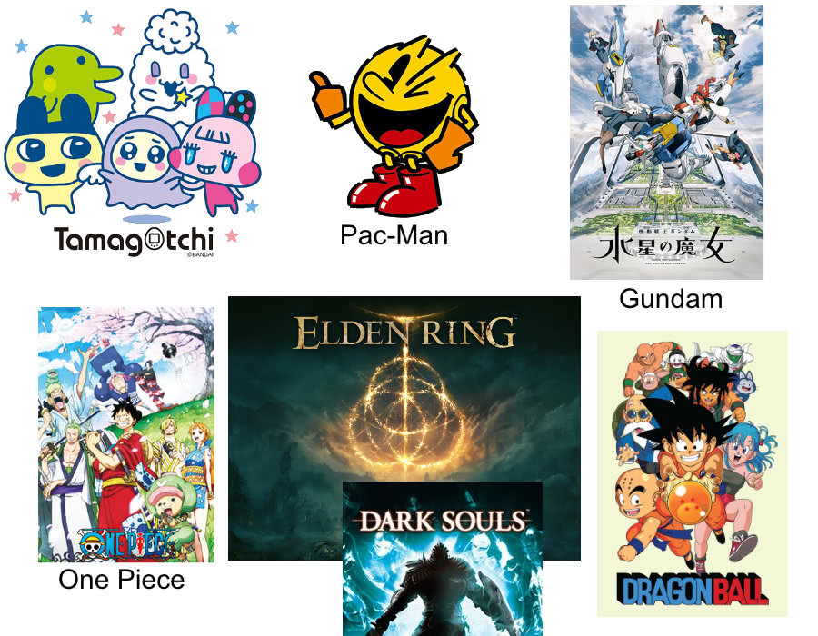
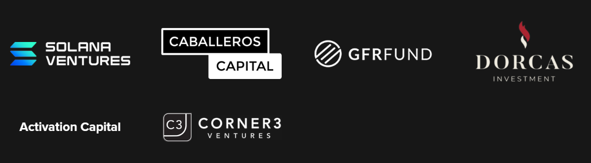

Im super excited to announce that [Gangbusters](https://www.gangbusters.io/) (the company that I am a co-founder and CTO of) has been joined on its journey by the gaming powerhouse [Bandai Namco](https://021fund.bn-ent.net/en/news/)!

We are super excited by this as it not only allows us to grow our team and ambitions it also validates our strategy and enhances our brand by having the creator / publisher of [such large IPs](https://en.wikipedia.org/wiki/List_of_Bandai_Namco_video_game_franchises) behind us:

Bandai are joining a number of other investors as part of our early-seed round to help us realize our Web3 ambitions and take BattleTabs to mobile.

Its been a long roller-coaster of a journey to reach this point but after 3 years of working in a very small team im really happy that we are finally able to grow a little bit and hire some more gang-members.

We still have a tough path ahead of us with some ambitious plans but I think we are starting to assemble a fantastic team that will allow us to get there. I personally cant wait to show our incredible community what we can do now!

We still have a small amount of space in our current seed round so if you are interested in participating then email us: mike@gangbusters.io or brandon@gangbusters.io.