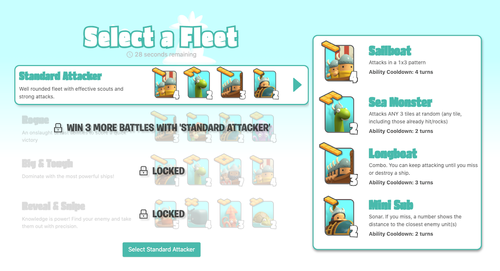
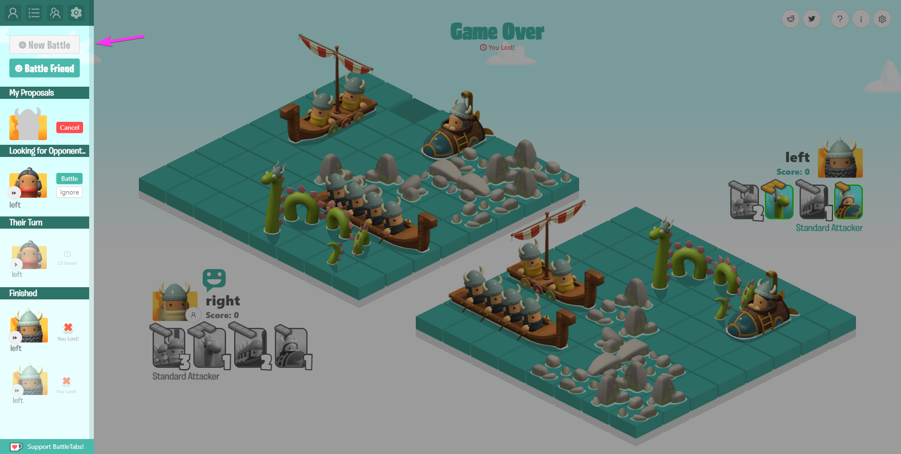
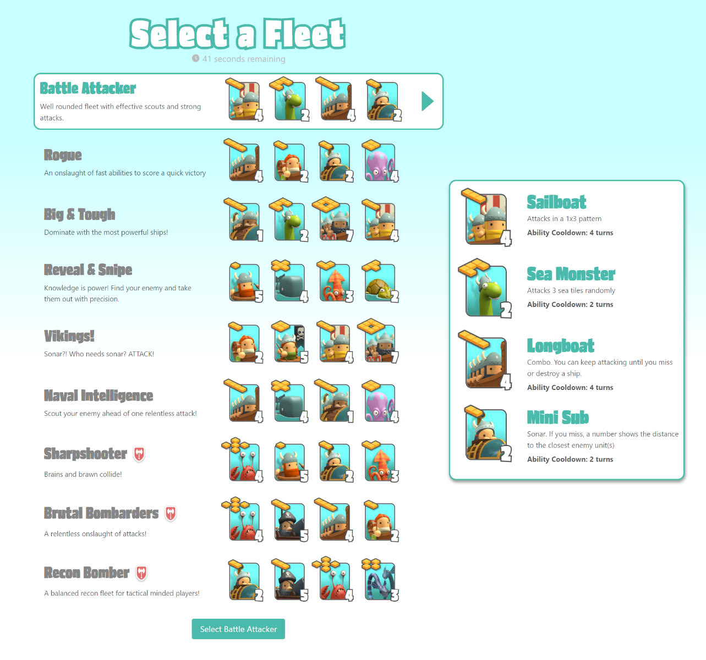
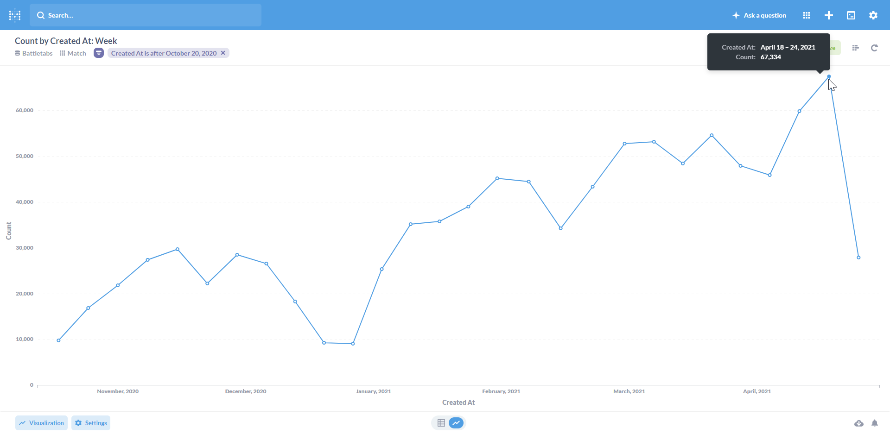
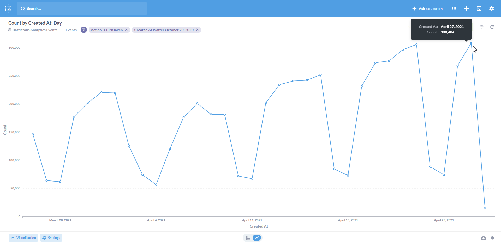
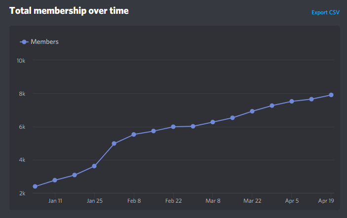
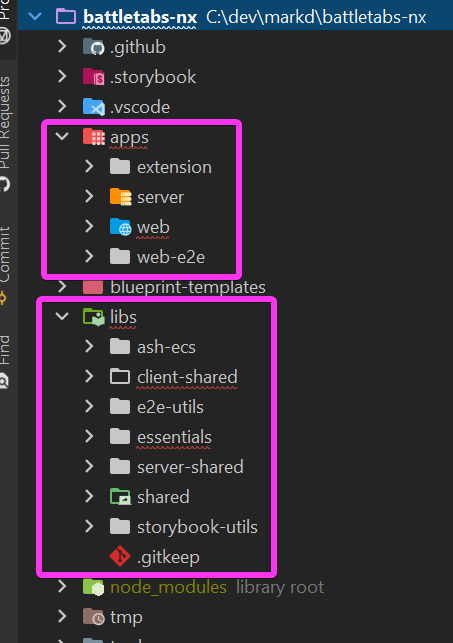

It's been 6 months since [I last wrote about BattleTabs](/posts/battletabs-ships-and-fleets-update) and so much has happened and so many things have changed I felt it was time to do an update.

# 6 Months Ago..

.. We had [just released](/posts/battletabs-ships-and-fleets-update) the ships and fleets update which was by far our biggest update to that point. For the first time we introduced the concept of ships that have abilities and are grouped into fleets. This fundamentally changed the game from what was essentially just Battleships into its own unique experience.

In the same update we added a proper tutorial and gave a UI a much needed overhaul.

# Whats New

Since then we released a whole heap of new features and improvements over a total of 35 updates!

Some of the biggest new features include:

- New version for web (https://battletabs.io)
- Battle Club, our paid subscription feature giving the player access to exclusive ships fleets, avatars backgrounds and lots more.
- BattleTabs Live, a discord bot that announces major events in the game.
- A user profile modal for viewing states and auth data
- A new authentication system so you can signup and login with socials
- A new "Update Available" / auto update feature
- Private proposals so you can send invites to each other via links
- A bunch of new fleets and ships

# Some Numbers

Players seem to enjoy the regular updates and improvements. The number of matches created per week has steadily increased to the point where almost 70,000 matches are created per week:

Thats over 300,000 turns taken per day!

# Discord

We also launched a [Discord Server](https://discord.com/invite/kvJKXsu) in the last 6 months which has seen surprising growth to over 8,000 members.

At any one time we have hundreds of members online chatting away in the various channels. Its awesome to see such a fantastic community grow around our little game.

Brandon, my co-founder, has been busy running community tournaments which have proved incredibly popular garnering far more sign-ups than there is space for.

# Under The Hood

<iframe src='https://gfycat.com/ifr/redevenbedlingtonterrier' frameborder='0' scrolling='no' width='100%' height='100%' style='position:absolute;top:0;left:0;' allowfullscreen></iframe>

As you can imagine with all this growth comes some technical challenges.

## Scaling

In the past 6 months we have had our work cut our for us scaling the backend. Its a challenge as the game uses stateful sockets for communication which complicates the usual "stateless" servers mantra.

Our solution has been to use a combination of careful horizontal scaling of client facing nodes which communicate via a shared custom redis pub-sub mechanism.

Since launch we have run most of our infrastructure on Heroku which has been great for for rapidly getting us to were we are today but its scaling is a little lacking. For now it works but theres plenty room for improvement in the future.

## Client State

Recently we also changed the way state is managed in the client over from [MobX State Tree](https://github.com/mobxjs/mobx-state-tree) (MST) to just [MobX](https://mobx.js.org/README.html). Although [I am a fan of MST](https://mikecann.co.uk/posts/mst-libs) we have found that it unfortunately doesn't play very well with Typescript once your store reaches a certain size.

MST relies on a lot of type inference and union types and if you have been around Typescript for a while you will know that this specific combination of characteristics can quickly lead to a combinatorial explosion of types causing slow compile times and a poor IDE experience.

With MobX things are simpler as state is split between multiple stores defined as classes. This means Typescript doesn't have to work so hard calculating what the type of something should be at any given time.

We do give up some nice MST features such as time travel debugging, undo-redo and state managed purely in the background page but we either weren't using those features or we would have had to stop using them for [manifest v3](https://developer.chrome.com/docs/extensions/mv3/intro/) regardless.

## Monorepo

We changed the way we code to move from a multi-repo approach to a single monorepo approach. This was done to simplify dependency management between the various parts of the system and simplify the versioning story.

This definitely makes things much simpler to understand when you have more than one person working on the codebase at once.

# Future

Theres so much more we have planned both from a feature standpoint and technically. I cant share too much right now but its super exciting so stay tuned!

If you want to play the game you can [download the extension](https://chrome.google.com/webstore/detail/battletabs/mjcklhnhfiepmofggcoegkmkokbljmjd) or play right now on http://battletabs.io/
