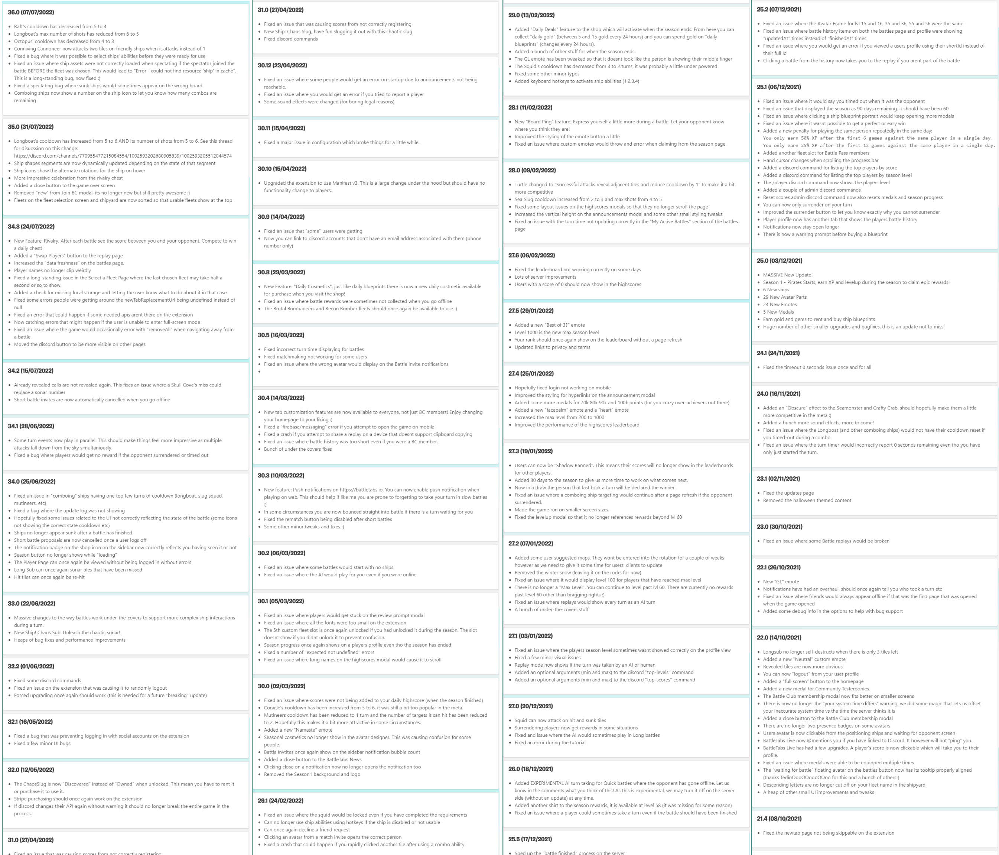
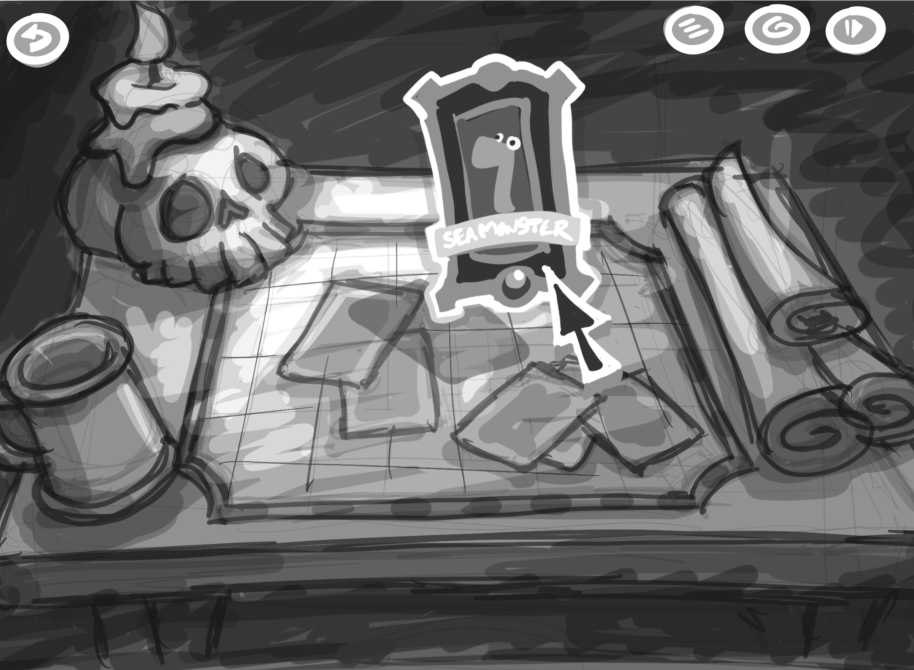
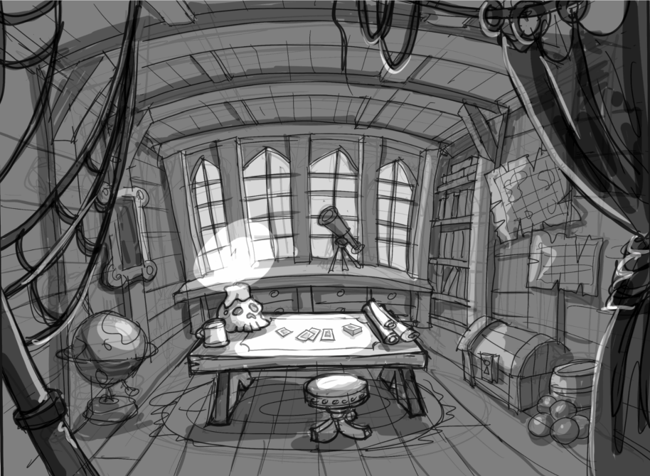
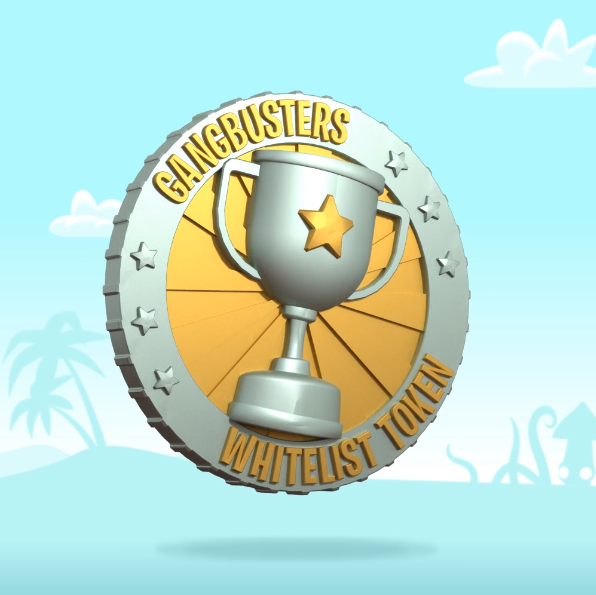
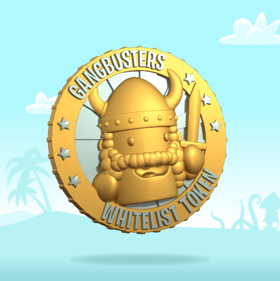

Its been a while since I have posted about BattleTabs but things most definitely haven't been inactive so I think its time for an update!

# Background

Just quickly; [BattleTabs](https://battletabs.com/) is the premier game from [Gangbusters](https://www.gangbusters.io/), the company that im a co-founder of.

I have [posted quite a few times in the past](https://mikecann.co.uk/tags/battletabs) about BattleTabs so checkout those posts for more background on the game and how it works.

# Whats Changed

Since November last year there have been over 40 updates to the game. Some of the major ones include:

- Rivalry Feature - challenge other to "just one more battle"
- Huge change to battles architecture allowing for more complex ship-ship interactions
- New content - ships, emotes, etc
- Lots of changes to support Manifest v3 Chrome Extensions
- Added new sound effects
- Added push notifications to web versions of the game
- Added "Daily Deals" feature to ship
- AI turn taking for players that go offline
- Board Ping feature
- TONs of bug fixes

In addition to the above raft of BattleTabs updates we also started work on our long-term strategy for the company.

# Cards & Web3

We believe strongly in the power of community driven games. We think that a game can be good but the community is what makes it great. This is certainly the case for BattleTabs.

Over the almost 3 years of running the game we have amassed over a million downloads and 15k+ members on discord. 24 hours a day players discuss the game, create content, share ideas or just generally hang out.

Given this progress we started to think how we could empower our community to go further and at the same time develop a strategy that allows us to continue to develop the game and company.

This is where BattleTabs Cards comes in.

From our [community page](https://battletabs.com/battletabs-cards) on the topic:

> BattleTabs Cards are digital collectible cards that you can trade with other players. They will be released in Sets, where each set will feature a particular theme or art style. Every Set will be limited in quantity, and cards will have different rarities.

<iframe width="853" height="480" src="https://www.youtube.com/embed/LFV1ugBAb1M?playlist=LFV1ugBAb1M&loop=1;rel=0&autoplay=1&controls=0&showinfo=0" frameborder="0" allow="autoplay; encrypted-media" allowfullscreen></iframe>

> Outside of their intrinsic value in looking amazing cards will also provide unique benefits in BattleTabs and other experiences we have in production. For example, you may craft a special cosmetic item or a ship skin in BattleTabs using a combination of cards, then display or trade the crafted treasure inside your own 3D sandbox! Watch as the newly crafted item comes alive with special animations and behaviours.

> Additionally, BattleTabs Cards can be freely built-upon without any intervention or restrictions from us. Say you have a fantastic idea for a new game, you can team up with your friends, use the exact same "shared card database" that we use!

> You could host tournaments with these cards, perhaps charging players a Common card to enter the tournament and setting Rare cards as a reward for the winners.

> Say you have a vast stack of cards saved up and want to give some to helpful members in the community, you can do that with cards!

We think its all really cool. And to kick things off we are running a tournament on [Fractal.is](https://fractal.is)

# Fractal Tournament

Our first card is going to be special. Its our first one and our first foray in this new direction Rather than simply selling or giving them away we thought it would be more fun if we rewarded top players and community members by giving them preferential access.

So every day that the tournament runs (2 weeks), the top 20 players that participate will earn a silver token:

The silver token along with the golden token which we awarded to a selection of of most loyal players will grant free minting rights to the Seed Card.

The tournament starts tomorrow, monday the 15th of August. Head over to [https://www.fractal.is/battletabs/tournaments](https://www.fractal.is/battletabs/tournaments) for all the details!

# Fractal Interview

In preparation we sat down with Justin Kan who co-founded JustinTV (Twitch) and a number of other companies including [Fractal.is](https://Fractal.is) where the tournament is being held.

<iframe width="853" height="480" src="https://www.youtube.com/embed/nRbUc9N9hGY" frameborder="0" allow="autoplay; encrypted-media" allowfullscreen></iframe>

We talk about the game, the tournament, web3 in general and some future projects. Check it out!

# Conclusion

The past 9 months have been a total rollercoaster of ups and downs (no one ever said running a startup would be easy huh?). The ever-changing funding landscape in particular has been a source of continual headaches.

It does however feel great to wake up each morning and work on something that brings obvious joy to thousands of people daily.

I hope we can continue to grow and improve our game, business and community for many years to come!

BTW: I generated the header image using [Dalle](https://openai.com/dall-e-2/).. so cool :)
