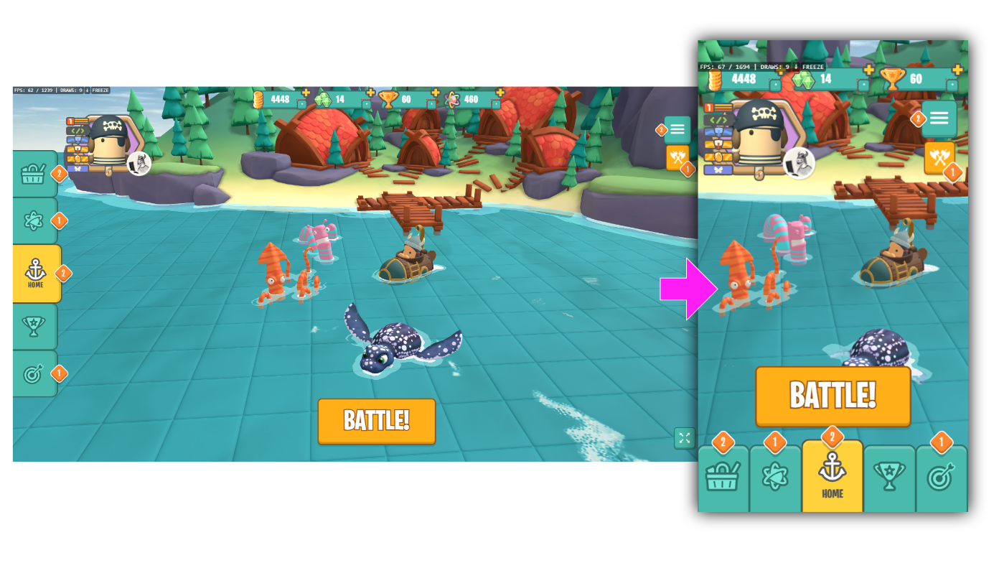
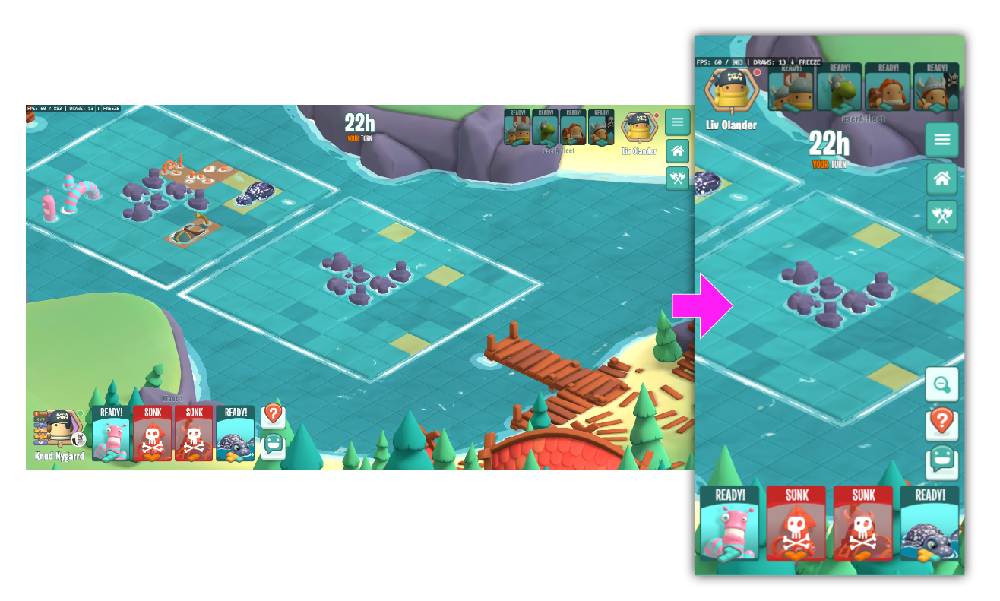

Phew its been a long long journey for our little game [BattleTabs](https://battletabs.com/) ([watch a summary video here](https://mikecann.co.uk/posts/battletabs-in-7-minutes)) but finally we are entering the phase that is a culmination of all the hard work, creativity, and perseverance: [the soft launch!](https://play.google.com/store/apps/details?id=io.battletabs)

# The Trailer

Before I start woffling on and loose you, heres some eye-candy:

<iframe width="853" height="480" src="https://www.youtube.com/embed/wGgJjEvNgt8" frameborder="0" allow="autoplay; encrypted-media" allowfullscreen></iframe>

Its almost not cringe! :D

# What Is a Soft Launch?

For those who might be wondering, a "soft launch" is a strategy used in the gaming industry where a new game is released to a limited audience or in specific regions before its official worldwide release.

In our case we are launching today [just on Android and just in the Philippines](https://play.google.com/store/apps/details?id=io.battletabs).

This phase allows us to gather valuable feedback, fine-tune gameplay, and ensure that everything is as perfect as it can be.

It’s a critical step in ensuring that BattleTabs delivers the best possible experience to its players.

# The Last 18 months

For the past year and half we have been beavering away at breakneck pace converting our web and chrome extension game over to work on mobile. Along the way we have added many new features and refined many of the existing.

Many parts of the game were changed in particular the UI has undergone a massive upgrade to make sure that the game works on small handheld devices in portrait mode.

That last part is worth underscoring. BattleTabs works in both Landscape (on the web or tablets) and Portrait (on mobile). This was no small task but I think we have pulled it off and im pretty proud of it.

Its also worth noting that, as often get asked this, the game is entirely Typescript using React for the UI and BabylonJS for the 3D rendering. I don't think there are too many games out there that have taken this path not sure if that is a good thing or not but it certainly sets us apart.

# What’s Next?

During the soft launch, we’ll be closely monitoring every aspect of the game, from user experience to the technical performance, particularly server performance.

We still have some important changes we want to make before final release such as a new First Time User Experience (tutorial) as that is super critical for players who are quick to dismiss something if they are confused or frustrated.

Post launch we have a number of exciting improvements and features planned but I might have to leave that for a future post :)

# How You Can Get Involved

Right now the game is only available on Android and in the Philippines but we are going to slowly be expanding the number of countries and platforms we are on.

We invite you to join us in this exciting phase. The best place to stay up to date is to [join the 16,000 other people on our Discord Server](https://discord.gg/battletabs). We post to the [#announcements](https://discord.com/channels/770955477215084554/770963532455477310) channel regularly about everything thats going on with the game.

Your feedback will be invaluable in shaping the final version of BattleTabs. Whether it’s a bug report, a suggestion, or even just sharing your favorite moments, every bit of communication helps us make BattleTabs better for everyone!

# Wrapping Up

The soft launch is just the beginning of the next chapter in the BattleTabs saga.

We’re incredibly proud of what we’ve achieved so far and even more excited about what the future holds.

Stay tuned, and [let the battles begin](https://play.google.com/store/apps/details?id=io.battletabs)!
