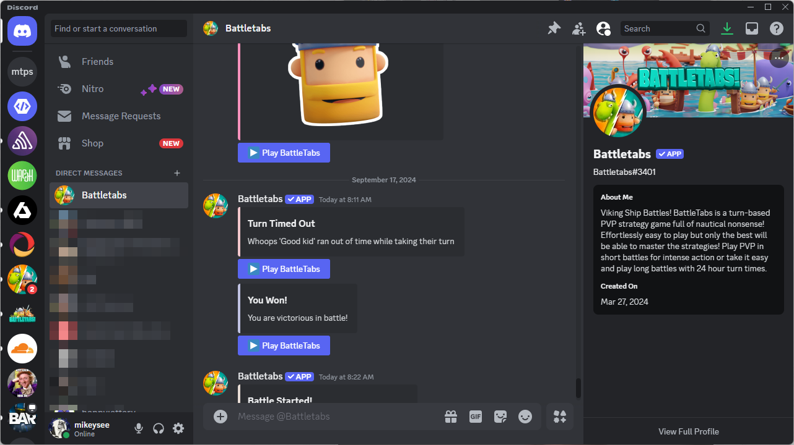
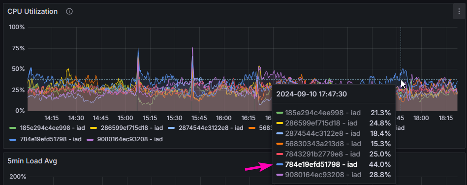
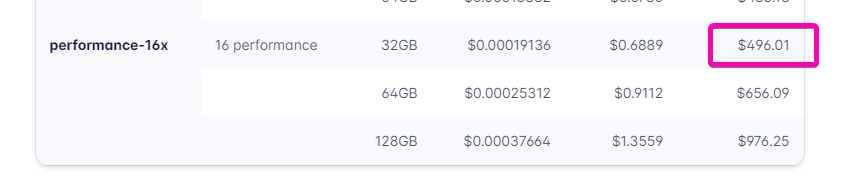
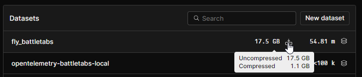

For the [longest time](https://mikecann.co.uk/posts/battletabs-6-months-later), Gangbusters has been a Discord-focused company. We use it as our primary method of interacting with our community, receiving bug reports, and gathering feature suggestions.

So when [we heard about](https://venturebeat.com/games/discord-launches-activities-with-light-games-and-a-new-app-store/) Discord's intention to make games playable within the app itself, we knew it was a strong opportunity for our game [BattleTabs](https://battletabs.com/).

Discord is a game-focused social platform where many players are hanging out with friends and looking for something to play together. Having our social multiplayer game embedded right there was a match made in heaven.

In addition to reducing the discovery friction for BattleTabs, Discord also offers a number of other compelling advantages. One of these is the ability to directly message players (we had early access to this feature). We currently use it as another Push Notification channel, but it’s so much more powerful than that—we’ve barely scratched the surface of what’s possible.

Super-fast and friction-free payments are another strong benefit of using Discord, particularly over the web platform where the friction for paying for IAPs or subscriptions makes it super challenging to monetize games like ours. Discord even provides an app "store" where you can see all products that the game offers and purchase them directly without even opening the game.

There are many other strong reasons to be excited about the Discord platform for games, especially when you read about the [incredible success](https://mojiworks.com/news/why-were-all-in-on-discord-activities) stories [from](https://a16z.com/discord-activities-social-gaming/) other [developers](https://discord.com/build-case-studies/frvr). You can see why we were keen to get on there.

Fast forward a year or two, and after much hard work by [Brandon](https://www.gangbusters.io/about), we found ourselves in the inner circle as one of Discord’s Developer Partners. The process of getting BattleTabs on Discord had begun.

The first step was a "geo test" or soft launch, focusing on Canada. This was an opportunity for Discord to see how the game performed before deciding whether to move forward with a global launch.

After two weeks of the game being available in Canada, we sat down with Discord again, and they gave us the very exciting news that the game had done exceedingly well. As a result, they wanted to take us to a global launch.

We scheduled the official global launch for 10 a.m. my time (Western Australia) on Tuesday, September 10th.

# Tuesday

After a brief call with Discord, we went live! We immediately started to see our usual traffic numbers get obliterated.

And this is where the fun started. To explain the issues we were soon to face, I first have to explain the architecture for BattleTabs a bit.

You can see from the above diagram that we have two different kinds of servers. Users connect to the "Web" servers via WebSockets, these scale out horizontally and generally aren’t a problem.

The other kind is the "worker" server. This is a singleton server and was serving many roles (foreshadowing). Some of its responsibilities include:

+ Listening for "app events" and performing various tasks like updating challenge progression, sending push notifications, awarding medals, updating league positions, etc.
+ Polling the database for matchmaking, AI turn-taking, daily shop reward rotations, etc.
+ Listening to database events and performing logic, such as alerting web servers to update subscribed users when their currency values change (due to rewards or other events).
+ Handling tasks like cheat detection, server metrics reporting, Discord server bot management, Discord live reporting, and more.

I was aware that the worker was a bottleneck in the architecture, but up to now, it hadn’t been an issue. The worker usually sat at a very low CPU and memory level.

Regardless, I beefed the worker up to the largest size that [our hosting supported](https://fly.io/docs/about/pricing/).

It was sitting at about 50% utilization for most of the day, which was a bit high but still within the bounds of comfort. So I went to bed at about 9 p.m., feeling good about the launch so far... little did I know what was coming.

# Wednesday

I woke up to an absolute nightmare. The servers had clearly been having a bad time while I was asleep. I hopped on [our Discord Server](https://discord.gg/fTdxf4y9) and saw that many players were complaining about the game not working correctly.

I took a look at the app event queue and, to my horror, saw that there were over 3 million events in the queue waiting to be processed.

The number was decreasing, but even after much tweaking of the various settings, I calculated it would take 26 hours for my poor single worker server to clear them all down, on top of everything else it was dealing with.

Before I could make any architectural changes to the servers, I needed to clear this queue to avoid losing data or causing more problems by handling events out of order.

So although the game was in a semi-broken state, I went to bed thinking that at least the queue would be mostly cleared by morning, allowing me to focus on fixing everything properly.

# Thursday

... well sh*t ... this isn’t good...

It turns out that while I was sleeping, we had some "good" news from our friends at Discord...

Ah, crap... I knew at this point I had to take action. This queue wasn’t going to clear itself.

I asked Discord to drop us back down the list. As painful as it was to request LESS traffic, I needed to buy us some breathing room.

The next step was to parallelize that event queue processing.

So I created a new kind of server called an "eventsWorker." This server took much of the event processing work from the worker, and critically, it could be parallelized.

There was a risk of out-of-order event processing, but I carefully examined each event and realized there wasn’t much event-order dependence, particularly between users. Anything that was dependent, I could likely fix later.

This realization gave me the confidence to scale up the number of eventsWorker instances. However, this put a huge strain on the database, so I scaled it up to the largest size that Fly would allow.

This allowed the eventsWorkers to scale to 15 instances, ripping through the queue at over 1 million events per hour. The entire queue should be cleared by late afternoon.

Based on that assumption, I got to work preparing the update that would go out once the queue was resolved.

I decided to reduce as many places as possible that depended on app events, thus reducing pressure on the background workers.

After thinking it over, I realized that most events could be processed "locally" instead of being sent to the background.

To explain what I mean, let's take an example event, `matchFinished`. (By the way, if you're curious, [here are all the app events](https://gist.github.com/mikecann/c7ad434ffcf94eb4e5c0d0b30f7967e1) in the game.) Here's where this event is used:

+ BattleEventsService - to send push notifications to users about the battle outcome
+ BattleWebhooksService - to send API messages to our Tournaments bot for advancing tournaments
+ BattleTabsLiveService - to update the #battletabs-live channel in Discord
+ HighScoresService - to update highscore stats
+ MedalAwardingService - to potentially award a user a new medal
+ UserChatDetectionService - to check for abuse if a user plays the same person multiple times
+ UserStatsService - to update a user’s stats
+ ChallengeUpdatingService - to progress any challenges the user might be on
+ TVChannelsService - to update any playing BattleTabsTV instances

Each of these is a totally different feature in the game and independent of each other, which is why they are handled as events rather than inline function calls in the first place.

When a battle was finished, I would publish a `matchFinished` event to the queue ([managed by pgboss](https://github.com/timgit/pg-boss)). The event would then be picked up by a background worker to handle all that work mentioned above.

I realized, though, that instead of sending it to the background, I could simply emit a "server event" in addition to the "app event". These server events would only be listenable by services running on that one server.

This shifted the computational burden from the background workers to the web workers, which could easily scale horizontally.

It seems obvious now, but hindsight is 20/20. I had been so focused on client-side improvements that I missed these obvious server-side optimizations. To be fair, it was only the increased traffic that necessitated the change.

So, shortly after 4 p.m., the events were all cleared. I scaled the eventsWorkers down from 15 to 3, then pushed my "server events" change.

This immediately reduced worker load but increased web server load as expected. Web servers could [auto-scale](https://fly.io/docs/reference/autoscaling/) up however so I wasn't worried.

I went to bed feeling pretty good about things. I did tell Brandon (who is based in the UK) to call me if the servers went down.

I soon fell asleep, fairly confident I would get a good night’s rest...

# Friday

3:14 a.m. – I got a call from Brandon letting me know that the game was down.

I jumped out of bed and hopped on my PC. Sure enough, things were not looking good and hadn’t been for a couple of hours.

This time, it wasn’t immediately obvious what was wrong. It appeared that the worker process was running out of memory. I attempted some desperate fixes but wasn’t sure about the underlying reason.

By 4:30 a.m. my brain really wasn’t working properly. I felt like the game was stable, so I decided to get an hour of sleep.

### Later on Friday

Awake and rested, I realized what the problem might be.

As previously mentioned, one of the worker server’s responsibilities was:

> Polling the database for matchmaking, AI turn-taking, daily shop reward rotations, etc.

For example, matchmaking works by requesting a list of open battle proposals every few seconds, then looping over that list and creating battles as needed.

Turn timeouts, AI turn-taking, and a bunch of other systems worked similarly.

The issue was that this polling was effectively another kind of queue. If the number of rows returned from the database during each poll was too small, that queue would build up.

Unfortunately, I had no metrics around these polling "queues," so my first task was to get some visibility into them.

Sure enough, those queues had grown to huge levels.

Much like my app events problem earlier, I knew the solution would be parallelization.

So, I carefully moved the polling code over to the eventsWorker instances. I was very nervous about this, as I knew that allowing multiple servers to poll the database simultaneously risked race conditions and other problems due to polling overlaps.

My solution was to carefully place [distributed locks](https://github.com/mike-marcacci/node-redlock) to ensure that two different workers couldn’t work on the same item from a polling queue simultaneously.

This solution worked well, and I soon had the polling queues back under control.

That’s when disaster struck...

I had been keeping a close eye on our database’s growth, knowing that if we ran out of space, it would put a hard stop to the game.

Well, it turns out that with all the chaos of the past 12 hours, I forgot to check the DB size, and it had grown wildly. It finally ran out of space and started refusing connections.

Fortunately, I was looking at the logs when I saw this message go by:

It turns out that pgboss, our app events queuing and jobs system, was timing out when trying to archive completed jobs. I ran a quick query against the database and saw over 7 million event rows waiting to be archived, with another 3 million waiting to be deleted.

It seems like pgboss wasn’t designed to handle this scenario very well and was erroring out during its archival and deletion routines.

My solution was to manually delete all 10 million rows from the database immediately. This instantly freed up 70 GB of space. I then ran a [Postgres VACUUM](https://www.postgresql.org/docs/current/sql-vacuum.html) to clear up any deleted tuples.

Instantly, the database came alive again, and disaster was averted.

Phew! It had been a long day, but I was finally feeling good about things. I went to bed certain that everything was all good.

# Saturday

I woke up, hopped on my PC, and to my dismay, saw that my "worker stopped" alert had triggered.

Fortunately, it didn’t take long to track down that this time the worker hadn’t actually gone down. The alert had triggered because [Axiom](https://axiom.co/) (our log aggregation tool) had stopped receiving log messages. This happened because our "[log shipper](https://github.com/superfly/fly-log-shipper)" instance had died.

I still don’t know why or how this happened, but I quickly gave it a poke, and things were up and running again.

From the Grafana logs on the servers, it appeared that everything had been fine overnight, much to my relief.

I think I’m going to leave the day-by-day commentary here, but I believe you’ve got a good sense of the firefight I was putting up at this point.

# Lessons

So what lessons did I learn from all this?

1. **Be wary of queues**. Anytime you’re building something that could get backed up if you 10x or 100x your traffic, it’s wise to deal with it now or, at the very least, get some metrics around it so you can keep an eye on it.

2. **Single points of failure are ticking time bombs**. For the same reasons as above, be cautious of any places that cannot scale horizontally.

3. **Use Axiom**. It’s fast, cheap, and powerful. Log everything, then build graphs.

500GB on the free tier? That’s just insane.

To put it into perspective: despite all the spam we produced over the past week, we’ve amassed 54 million log lines, amounting to just 17GB of space, which is only 1GB compressed!

4. **Load test if you can** before you expect a large increase in traffic. Even if you can’t easily hit the expected numbers on your local machine, it should at least hint at where bottlenecks might occur.

# Conclusions & Thanks

It’s still a bit early to talk about the results of all this traffic on the business, but things are going well.

I would like to thank the special people at Discord who took a chance on us and were very patient while we fought through these problems. :)