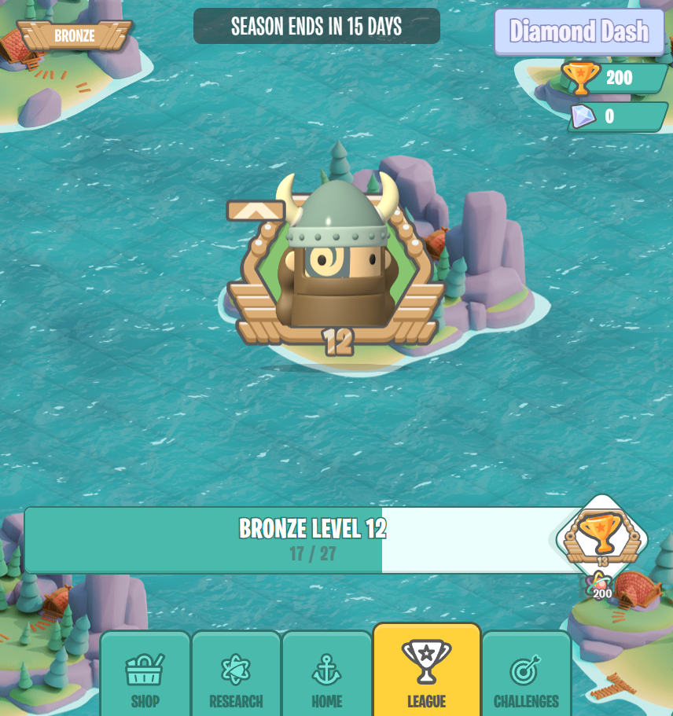
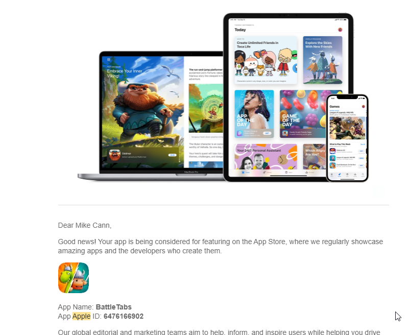

So the big day is finally here! The moment we have been working on since we decided to bring our little [Chrome extension / Web game](https://battletabs.com/) to mobile some 2 years ago. 

We have finally made the game game globally available on both iOS and Android!

Dont know what im talking about? Then checkout our trailer:

<iframe width="853" height="480" src="https://www.youtube.com/embed/wGgJjEvNgt8" frameborder="0" allow="autoplay; encrypted-media" allowfullscreen></iframe>

If you are interested in a little more detail about the history of the game and where that funnny name comes from then you can checkout [another video we put together here](https://mikecann.blog/posts/battletabs-in-7-minutes).

# Since Soft Launch

Over 6 months ago [we announced](https://mikecann.blog/posts/battletabs-enters-soft-launch) we were entering Soft Launch for mobile. Since then we have been interating adding features, tweaking features and fixing bugs. Things have taken a little more time than expected mainly because we decided to focus on our [Discord Activities launch](https://mikecann.blog/posts/battletabs-global-launch-on-discord-activities) which seemed like (and has been) a great oppertunity for us.

With that behind us now we are back focused on mobile. The main priority has been performance and stability. One issue with building your mobile game using web technologies is that you unfortunately dont get as much control over resources such as GPU memory as you might do if you were going with a more native approach. 

This means we have been at the whim of whatever browser technology is available on the platform. In the case of iOS this means WebKit. It has been known for a while now that WebKit on iOS isnt great, conspiracy theoriests would say this is because Apple is intentionally trying to hobble web experiences on mobile in an effort to boost App Store sales. I dont know, all I know is that we have had a bit of a hard time with GPU memory crashes on iOS mobile.

These crashes can happen at just about any point in the game which makes it really tricky to replicate and thus debug the problem. The tooling that Apple provides (only available on macs of-course) isnt great and unfortunately crashes all the time when we try to use it.

We have narrowed down the bulk of the crashing is related to [browser layering](https://medium.com/masmovil-engineering/layers-layers-layers-be-careful-6838d59c07fa) particularly when combined with CSS animated elements. This seems to force a high GPU memory usage as WebKit attempts to hardware accelerate large layers.

Curiously Chrome (and thus Android) does not have this problem so I, as a Windows user, am not able to debug this problem from my PC.

We dont have a definitive solution for the problem, I suspect the issue is still there but we have tried our best to minimize it by removing most usages of CSS animations (on ios) and changing the League Page over to a much simpler design as it was the culprit of many crashes.

# Apple Feature

A few week back we excitedly recieved an email from Apple informing us that we may be featured on the App Store.

We submitted all the media information required so fingers crossed we do. Apple declined to comment on likelyhood or timelines so we will see. If we do get a feature then it should hopefully be a big boost to game traffic. In preparation we have scaled up our servers just incase, I dont want another repeat of the [Discord Activities global launch](https://mikecann.blog/posts/battletabs-global-launch-on-discord-activities) ;)

# Conclusion

So its been a long time in the making but we are super excited to have the game finally avilable to (just about) everyone's mobile device and tablet. Im looking forward to battling with you guys from around the world soon!

