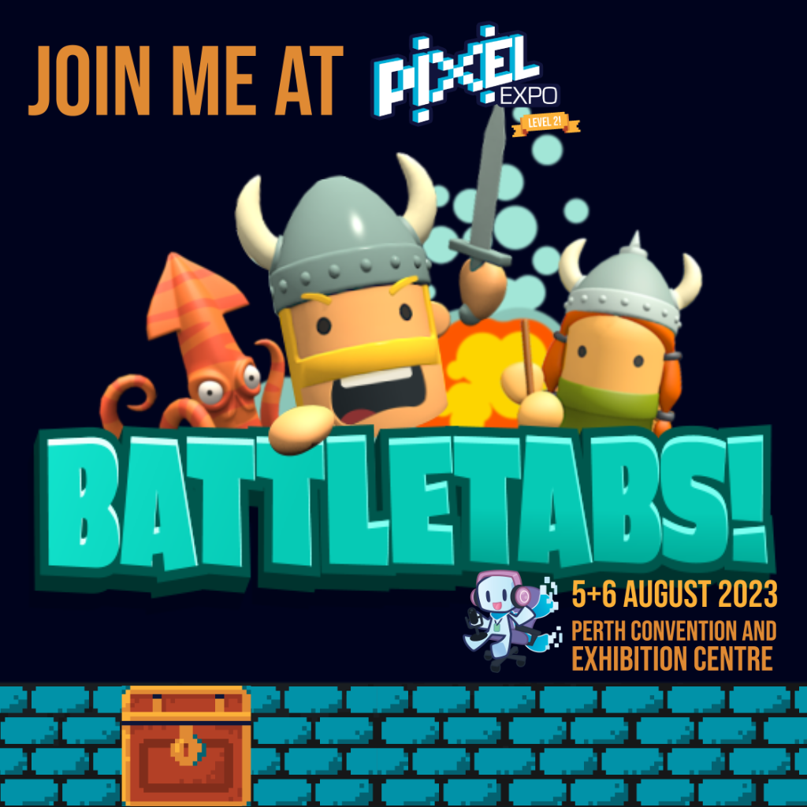

As you may be aware we have been working really hard lately on the next version of our game [BattleTabs](https://mikecann.co.uk/tags/battletabs).

In an effort to broaden the game's reach for the upcoming mobile release, we decided to invest some time in producing "devlogs".

If you're not familiar with devlogs, they are a popular format on YouTube where developers discuss their past and current progress with a game.

We hope that viewers will find the video entertaining and informative about the game. Ideally, they will subscribe and follow along as the game progresses and future devlogs are released.

With that in mind, we created our first devlog. This one is longer than future ones because I was eager to tell the story up to this point. Watch it and let us know what you think!

<iframe width="853" height="480" src="https://www.youtube.com/embed/kDlEoLjflGw" frameborder="0" allow="autoplay; encrypted-media" allowfullscreen></iframe>

We were initially hesitant about investing the time (about 5 days) to prepare and create this video, as that's time I could have spent working on the game.

However, we justified the time investment because marketing is an area where none of us on the team are experts. We feel the need to explore every possible avenue to spread the word about the game and attract new users.

Speaking of which, we are taking [BattleTabs to the Perth Pixel Expo](https://www.pixelexpo.org.au/game-devs) this year, where we have a double-wide booth.

I'm looking forward to showcasing the game in person to a larger audience, running tournaments, and giving out stickers and t-shirts!

We plan to continue our devlog videos roughly monthly, depending on other commitments and the content we have to show off.

Anyway, let us know what you think in the comments. If there are things we can improve for future videos and, importantly, other communities you think might be interested in this video, we'd love to hear from you!
