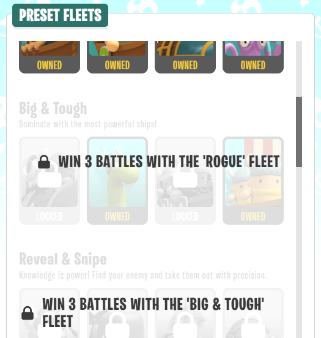
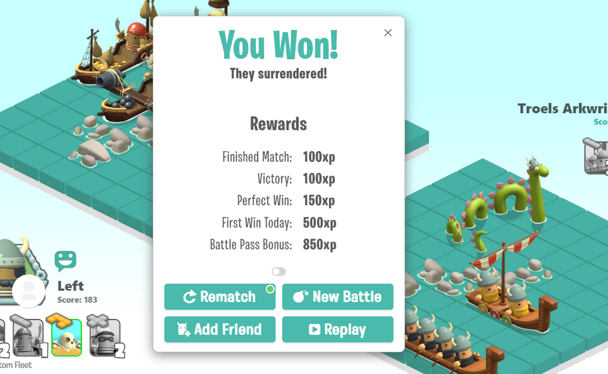
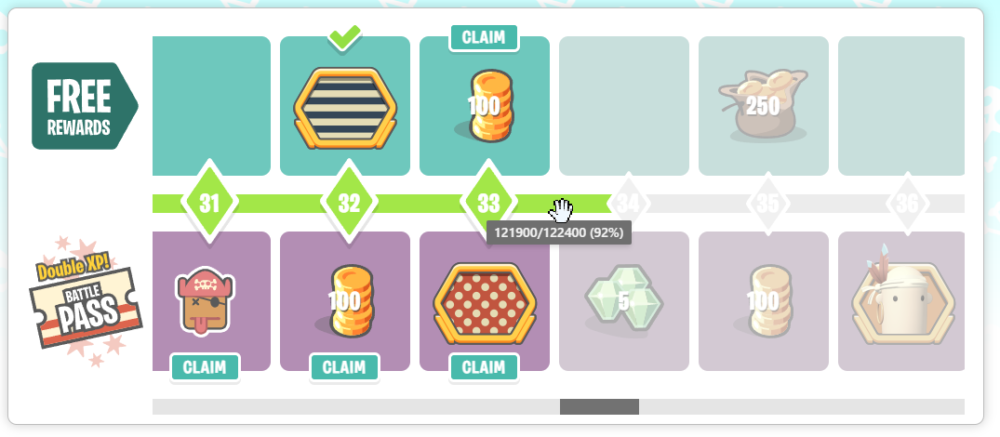
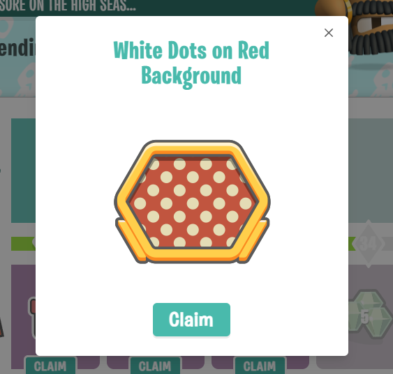
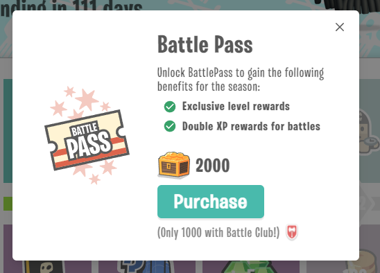
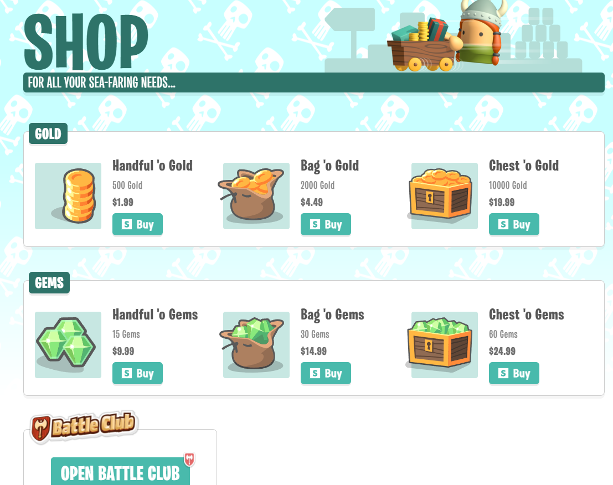
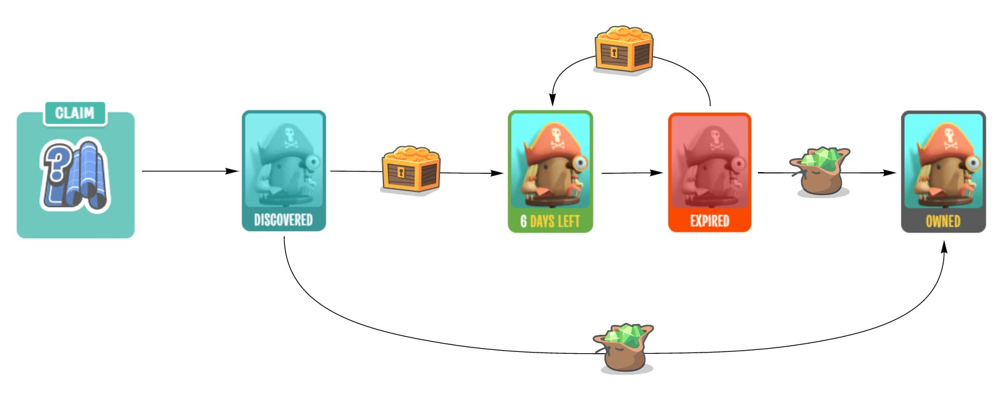
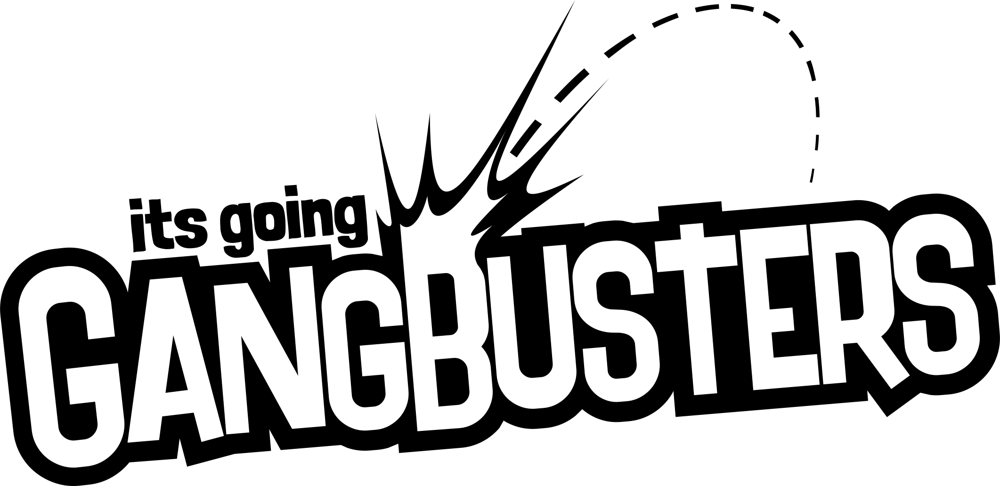

Well its been years in the planning and months in the development but the "Big Summer Update" / "Seasons" / V1 update for our game [BattleTabs](https://battletabs.com) is finally out!

This is by far our biggest update yet. We generally don't like making large changes to the game like this, preferring small frequent incremental changes but it was necessary however as there are lots of exciting new overlapping systems and features in this update!

<!-- more -->

# Progression

For ages now there has been a large missing feature in the game one so obvious it stands as a testament to the [enjoyability and popularity](https://twitter.com/theBrandonWu/status/1458058505072652300) of the game that we were able to get this far without it. That missing feature was progression.

Sure we have had a rudimentary sort of progression via preset fleet unlocks but this was rather crude and players tend to whip through that part of the game:

The new update however brings a whole new dimension to progression in the game. Players now earn XP for various actions during a battle which contributes to their season level.

# Season

Seasons are a feature common to Free-2-Play games and exist as a mechanism to keep the game feeling fresh as the developer continually works on new content. The season is periodically (every few months) refreshed and the player's level resets. This gives new players to the game a way to enter the game without feeling like they will never catch up with the players that joined before them.

The XP earned contributes to their season level:

Each level the player can claim various rewards:

There a lots of different kinds of rewards: Avatar Cosmetics, Custom Emotes, Ship Blueprints, Gold, Gems etc

There are 60 levels and two "tiers" of rewards. Theres the free tier, that anyone can claim rewards from, then there is the premium "Battle Pass" tier:

The Battle Pass costs 2000 gold to unlock (1000 with Battle Club, our subscription product) and gives the player 2x XP rewards and substantially better rewards. Battle Pass also resets at the end of each season.

The player can grind enough gold during the free tier to unlock the Battle Pass for free eventually but they will loose all the double XP bonus they could have achieved along the way if they do that, so we are hoping this will be a strong incentive to visit our new Shop.

# Shop

Another common Free-2-Play mechanic that this update brings is In App Purchases (IAP) via the Shop. The player can spend fiat on in game currency in the form of Gold and Gems.

Gold can be used to unlock the Battle Pass but Gold and Gems can also be used to rent and buy ships.

# Ship Blueprints

Ships are the core game play feature for the game and can be thought of as cards in a traditional Collectable Card Game (CCG). You collect Ships (Cards) and combine them together in Fleets (Decks) and fight other players.

This update brings the concept of "Ship Blueprints" to game.

The player can "discover" blueprints during the season then rent the ship for a few days for some gold. Once rented the ship can be used in a fleet. If it expires it can no longer be used and will have to be rented again. If the player get tired of renting a ship they can alternatively buy it outright with some gems. Once bought / owned they will never have to rent it again.

This Ship Rental concept gives the player something to spend their gold on and forces them into some interesting cost / benefit choices as they play.

# Content

The update is jam-packed with new content including:

- 6 New Ships
- 29 New Avatar Cosmetics
- 24 New Emotes
- 5 New Medals

The key is; once the season is over this content will no longer be unlockable. This incentives players to unlock everything before the season ends (FOMO). We may bring back some of the rewards in the future in the shop or through other rewarding mechanisms.

# Gangbusters

This update brings a name-change for the company.

[3 years ago](https://mikecann.blog/posts/farewell-bamboo-hello-markd) Brandon and I started working on a SaaS product called "Markd.co" and so we named the company "Markd Ltd".

Some time later we decided to pivot the company and focus on BattleTabs. For for some time now we have felt that the name no longer suits what we are doing and have been searching for a new name.

We traded different ideas until we hit on "Gangbusters". We like it as it hints at excitement, growth and energy, all things we want to instil in the company.

"Gangbusters" as a word also has some utility as it can be split into "Gang" and "Busters" so employees or fans of the company could be called "Gang Members" or perhaps "Busters". Its also a word in common parlance that hasnt been taken, which helps :P

# Conclusion

I hope this post has given you a little taste of this update. We have worked really hard on it and I am personally quite proud of the results. We are due to be featured on the GooglePlay ChromeOS store soon and the hope is this will increase the number of users and excitement around the game significantly.

If you are in interested in checking out out head over to [https://battletabs.io/](https://battletabs.io/) and get started. Ill see you there!
