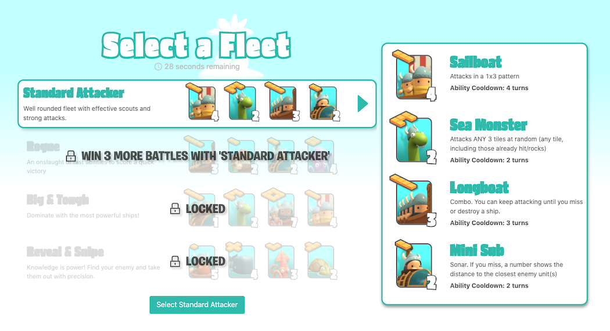
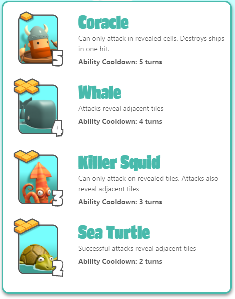
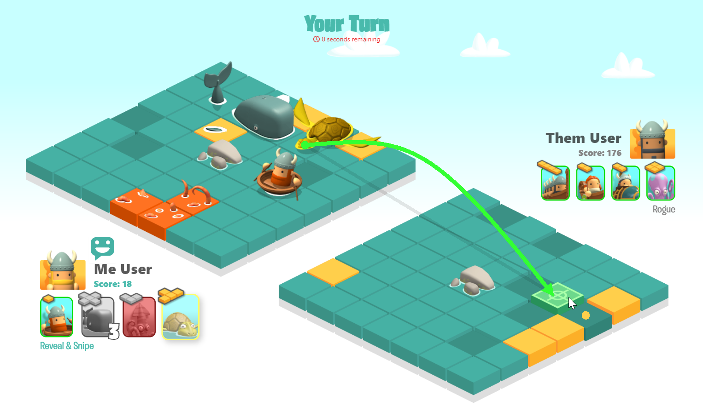
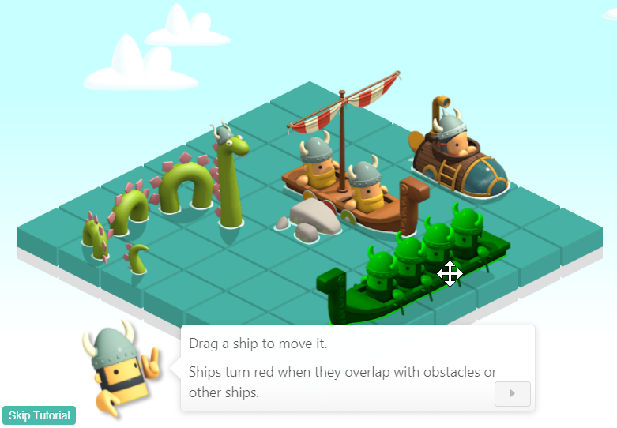
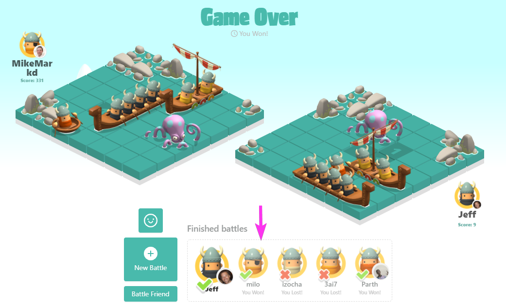
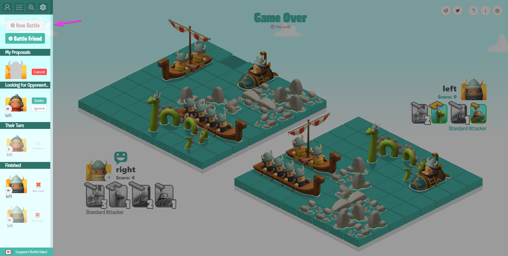

After months of hard work we are excited to announce that our latest and largest ever update to [BattleTabs](https://www.battletabs.com/) is finally live! Read on to find out about some of the gory details.

<!-- more -->

# TLDR;

The video below gives you a taste of whats changed.

<iframe width="100%" height="400" src="https://www.youtube.com/embed/JNCD3PhP08w" frameborder="0" allow="accelerometer; autoplay; clipboard-write; encrypted-media; gyroscope; picture-in-picture" allowfullscreen></iframe>

# Ships and Fleets

The most important change in this update is the addition of Ships and Fleets to the game.

Previously the game was pretty much just [standard battleships](<https://en.wikipedia.org/wiki/Battleship_(game)>) except perhaps with the addition of the distance indicators on the cells if you miss:

<iframe src='https://gfycat.com/ifr/DesertedHonoredFluke?hd=1' frameborder='0' scrolling='no' width='100%' height='450px'  allowfullscreen></iframe>

<iframe src='https://gfycat.com/ifr/BlackandwhiteLoathsomeDairycow?hd=1' frameborder='0' scrolling='no' height='450px' width='100%'   allowfullscreen></iframe>

This was enjoyable enough but we always felt it lacked a little depth so after a lot of brainstorming and hard work from our designers we came up with the concept of fleets.

A fleet contains 4 ships which each have a [special ability](https://www.battletabs.com/how-to-play-battletabs-v2/) that they can use.

Some ships live in multiple fleets but they are carefully tuned so that each fleet has an play style.

For example the "Reveal & Snipe" fleet is high risk vs high reward fleet that revolves around discovering the location of the enemy ships with "Reveal" abilities then taking them out in one hit with the Coracle.

This adds some much needed diversity to the battles as you learn how each fleet works and what its strengths and weaknesses are against other fleets.

One other strong part of this design is that it is an obvious point of extension where we can add more fleets and ships as time goes on, keeping the game interesting to loyal players.

# Tutorial

Because the Ships and Fleets is now quite a bit more complex we also decided to take the time and build a proper tutorial into the game.

Previously we simply popped up a modal with a couple of short gif animations that gave you the general gist of how to play but we always knew that was a temporary measure.

The tutorial now guides you step by step through how to play the game.

<iframe src='https://gfycat.com/ifr/ValuableIncomparableAfricangoldencat' frameborder='0' scrolling='no' width='100%' height='100%' style='position:absolute;top:0;left:0;' allowfullscreen></iframe>

# Sidebar

We know from our analytics that a large percentage of our users are playing on chromebooks or small windows laptops both of which have very limited vertical height. This meant that the play area they had was small and made smaller thanks to a bunch of vertical space eaten by our UI at the bottom of the screen:

So we decided as a part of this update to overhaul the UI and move all of this to a bar on the left hand side of the screen instead:

This not only looks a whole lot better but it frees up vertical space so that the thing thats most important (the game) can take up as much space as possible and thus isnt scaled down.

# Other Stuff

We added a whole bunch of other stuff as part of this update that I wont detail but some of which includes:

- New avatars for players
- Larger maps
- New emote UI
- New Logo
- New info modal on pinning the extension
- Screen shake effects
- Better in-game UI
- Some nice CSS animations
- Faster load times
- Better ship placement and rotation
- Countdown sound effect and better UI

# Conclusion

We are really proud of this update as we think it brings some much needed depth and polish to the game. Hopefully it also sets us up nicely for a bunch of future features we have planned so stay tuned!

If you want to checkout the game head over to: [https://www.battletabs.com/](https://www.battletabs.com/)
