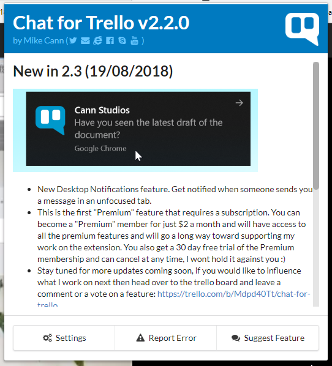
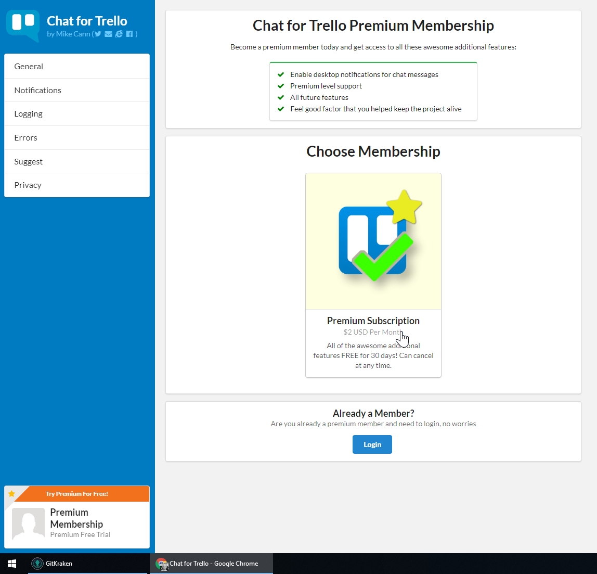

In the [spirit of repeating myself](http://mikecann.co.uk/tasks-for-trello/tasks-for-trello-a-trello-tasks-rewrite/). I have decided to rewrite another one of my chrome extensions.

<!-- more -->

# What Does it Do?

Checkout the video:

`youtube: https://www.youtube.com/embed/qEK3Zl2xA2E`

It basically adds chat functionality to a Trello Board.

# Whats changed since Trello Chat?

As with my [Tasks for Trello rewrite](http://mikecann.co.uk/tasks-for-trello/tasks-for-trello-a-trello-tasks-rewrite/) 99% of the source is new, using modern development practices.

I borrowed many of the components and functionality from Tasks for Trello so the browser-action and settings page looks good and is clear and easy to understand:

# Why change the Name?

The reason why I changed the name and created a whole new extension rather than upgrading of Trello Chat was because when I reached out to Trello to see if I could get official approval from for the extension they told me that I would have to rename the extension to "X for Trello" to comply with their branding guidelines. Well I didnt want to do that at the time as I had just spent ages getting everything setup with the name "Trello Chat" so I decided to keep it as it was.

So this time around I decided if I was going to do a rewrite, I might as well rename the extension at the same time and hopefully finally get Trello's approval.

# Rewrite?

So the decision to do a rewrite rather than an upgrade was partly because of the name and partly because I was going to have to make changes to Trello Chat for GDPR compliance. I also realized that Trello Chat was built using (what seems like) ancient coding practices so I decided in my typical naïve way that I should just start again, it shouldnt take too long, right?

Well it took about twice as long as I was expecting, but I am happy with the way it turned out.

# Open Source

I decided to do this rewrite on a public Github repo. This is because a great many extensions these days are doing very shady things such as crypto mining, ad injection, ad replacement, privacy violation and other things. I wanted to be able to avoid all of that by pointing to the source and saying; "here, look at the source, you can see im not doing anything shady".

https://github.com/mikecann/chat-for-trello

# Premium

To help justify continued work on the extension I have provided a "Premium Membership" section in the settings.

From there users can choose to become a "Premium" member for \$2 per month. That entitles them to all the premium features of which there is currently only one (Desktop notifications) but I will be adding more in the future.

When they sign up they get premium membership features free for 30 days and can cancel at any time so there is no strict lock in.

# Using Trello for Support

So I decided this time around to use Trello itself as the hub for the project.

People can leave comments, suggestions and error reports on that board which I will receive notifications for then update the board. Its a quick and simple way of managing the project.

# Trello Chat Depreciation

So I also made a very small update to Trello Chat at the same time to add a message informing my users that Trello Chat will be no more in a few weeks and to go download Chat for Trello instead. I hope they all get the message!

# Download

If you are interested then you can go grab Chat for Trello now from the chrome store: https://chrome.google.com/webstore/detail/chat-for-trello/lmhjnehakebobgfdlfcoejppgbjhnfcl
