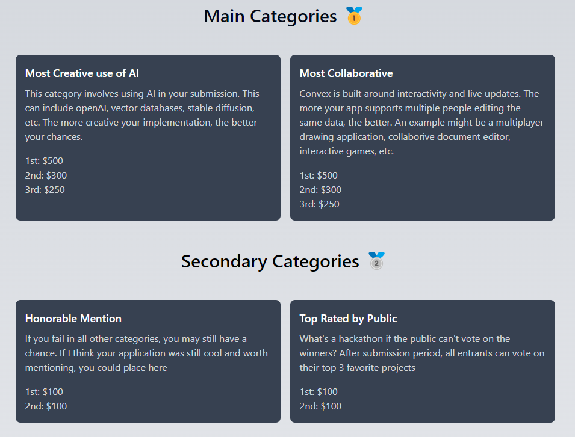

I have got to be honest, I have never heard of [Web Dev Cody](https://www.youtube.com/@WebDevCody) before but when I saw that he had a [hackathon](https://hackathon.webdevcody.com/) in partnership with [Convex](https://www.convex.dev/) I knew I was going to have to carve off a bit of time from [BattleTabs](https://battletabs.com/) development to have a crack.

<!-- more -->

# Competition Categories & Ideation

The competition was themed around Collaboration and AI so I racked my brain for a bit before coming up with an idea.

I wont spend too many words explaining what I built, instead ill let the video that I used to demo the project do the talking:

<iframe width="853" height="480" src="https://www.youtube.com/embed/XZ2iCEcW_io" frameborder="0" allow="autoplay; encrypted-media" allowfullscreen></iframe>

# Results

Out of [53 submissions](https://hackathon.webdevcody.com/submissions), I came third in the AI category which im pretty happy with considering I spent less than a day on it.

Watch Cody talk about my project here:

<iframe width="853" height="480" src="https://www.youtube.com/embed/PJjk4Qg_GiU?si=9oUEhACACbj3KxkR&amp;start=186" frameborder="0" allow="autoplay; encrypted-media" allowfullscreen></iframe>

# Conclusion

I had a ball working on this, its pretty astounding that you are able to build this much functionality in such as short time. I was able to implement and iterate as fast as I could go without any boiler-plate bogging me down.

[Convex](https://www.convex.dev/) really is an incredible technology, if you are looking to do a web app you should definitely check it out!

If you are interested in playing with Chatter Craft yourself the demo is here: https://chatter-craft.netlify.app/

If you want to peek under the covers a bit the source is available here: https://github.com/mikecann/chatter-craft
