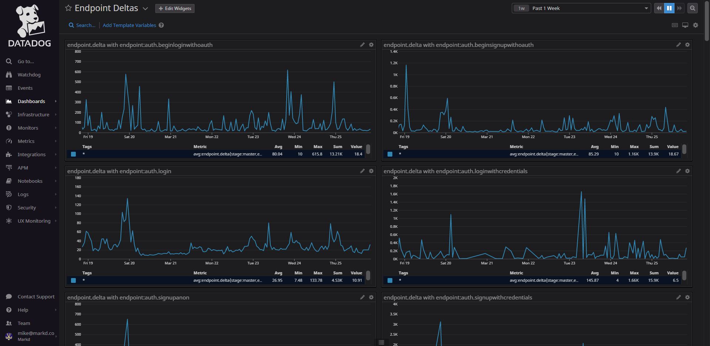
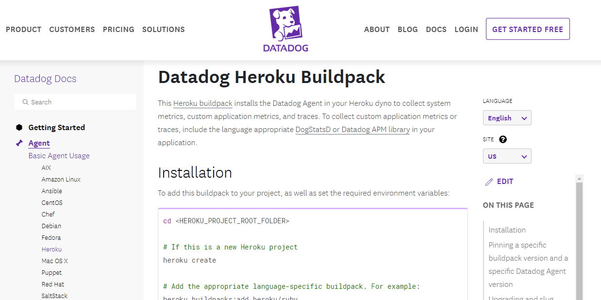
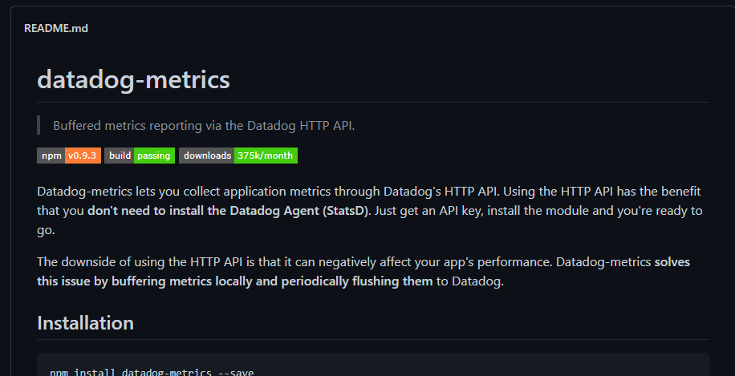

Making Heroku and DataDog Metrics play together isnt as straight forward as it probably should be. Read on to find out how to remedy this.

# TLDR;

Use the API directly with: https://github.com/dbader/node-datadog-metrics

# The Problem

I have used Heroku for many projects over the years, its a super convenient platform for hosting my apps. Lately tho our current project [BattleTabs](https://battletabs.com) has started to grow at a rate that is forcing me to look more closely at what is going on inside the system.

One way to do this is to gather metrics from the running app. Things like endpoint call frequency and roundtrip times. A fantastic tool for this is [DataDog](https://www.datadoghq.com/)



DataDog Metrics [usually requires](https://docs.datadoghq.com/getting_started/agent/) that you install their "Agent" which runs on the "host" and provides a "StatsD" service which communicates with their system. The problem is that in the Heroku environment you dont have access to the underlying host OS and thus cant install the Agent.

No worries, Heroku has a solution to this in the form of [Buildpacks](https://devcenter.heroku.com/articles/buildpacks). Fantastic so all you need to do is install the [DataDog Heroku Buildpack](https://docs.datadoghq.com/agent/basic_agent_usage/heroku/).



Well that is what I would say if you were running Heroku using their traditional "Slug Deploys" setup. Unfortunately tho we moved over to Docker Deploys for [BattleTabs](https://battletabs.com) some time back and Buildpacks dont work in that case.

Ill spare you all the details of how I searched and search for the correct way to solve this, even resorting to asking on StackOverflow with no avail. Eventually tho I stumbled upon [this part](https://docs.datadoghq.com/api/latest/metrics/#submit-metrics) of the DataDog docs that mention that it is possible to use their API to submit metrics.

Unfortunately tho DataDog dont supply an SDK for NodeJS so I would have to write my own.

# The Solution

Before I sat down to spend a few hours fighting DataDog's API I thought I would do a quick google to see if anyone else had written one. Well lucky for me someone had done an excellent job of it: https://docs.datadoghq.com/api/latest/metrics/#submit-metrics



So all that was left was to plug it into the app, too easy!

```ts
import { ensure } from "@battletabs/essentials";
import { config } from "../../config/config";
import { getClientVersion } from "@battletabs/shared";
import { BufferedMetricsLogger } from "datadog-metrics";

let _client: BufferedMetricsLogger | undefined = undefined;
const getClient = () => ensure(_client);

export const initDataDog = () => {
  if (config.DD_ENABLED != "true") return;
  _client = new BufferedMetricsLogger({
    apiKey: config.DD_API_KEY,
    appKey: config.DD_APP_KEY,
    flushIntervalSeconds: 15,
    defaultTags: [
      `app:${config.HEROKU_APP_NAME}`,
      `dyno_id:${config.HEROKU_DYNO_ID}`,
      `dyno:${config.DYNO}`,
      `client_version:${getClientVersion(config.BT_BUILD_NUMBER)}`,
      `stage:${config.STAGE}`,
    ],
  });
};

export const recordMetric = (name: string, value: number, tags: string[] = []) => {
  if (config.DD_ENABLED != "true") return;
  getClient().gauge(name, value, tags ?? []);
};

export const incrementMetric = (name: string, amount: number = 1, tags: string[] = []) => {
  if (config.DD_ENABLED != "true") return;
  getClient().increment(name, amount, tags);
};
```

# Conclusion

So although it wasn't as pain-free as I was hoping for when I decided to add some metrics to our app, the solution ended up quite clean and works well on Heroku Docker Deploys.
