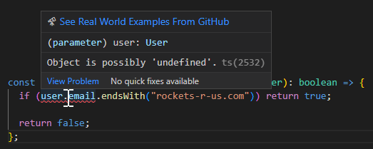
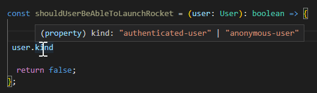
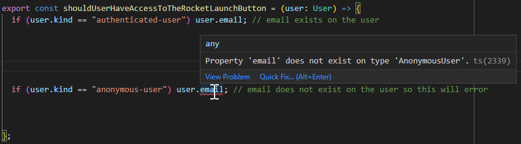
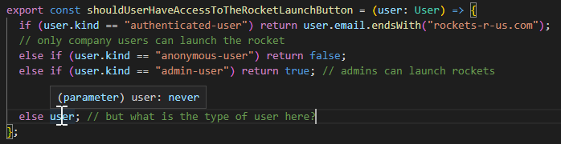
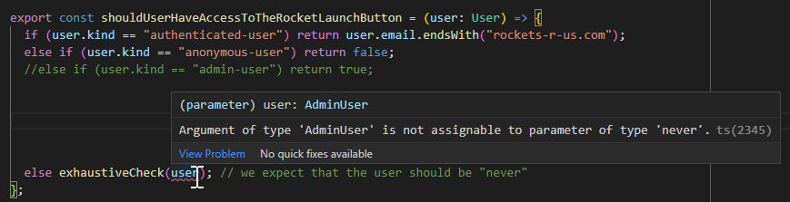

I don't tend to post about general programming topics these days because I usually don't have much to add to the public discourse available in innumerable blogs, videos, podcasts and other places. However over the last year or two I have started to heavily adopt some programming pattern that I find so valuable that its worth re-iterating in my own words.

## TLDR;

If you are proficient with Typescript already you might want to skip these first two introductory sections and head down to the part on Pattern Matching with Variant and Examples from BattleTabs below.

## The Problem

Before I dive straight into the solution I think its always valuable to start with the problem we are trying to solve.

So lets start with a simple example. Suppose we have a website that has a simple auth system that represents its "User" with the following type:

```ts
type User = {
  id: string;
  email: string;
};
```

Now lets suppose that we pass that user to a some rendering logic (in this case React):

```ts
interface Props {
  user: User;
}

export const WelcomeBanner = ({ user }: Props) => (
  <div>
    Welcome {user.email} <a>logout</a>
  </div>
);
```

We also have another function somewhere else in the codebase that uses the User object:

```ts
export const shouldUserBeAbleToLaunchRocket = (user: User): boolean => {
  if (user.email.endsWith("rockets-r-us.com")) return true;

  return false;
};
```

This is all well and good, you launch the website, everyone is happy with how it works. But then the fun and games begin..

You are asked to support "anonymous" users. This is a User that has an ID but not an email address. So you go ahead and update the type of User so that the email address is now optional:

```ts
type User = {
  id: string;
  email?: string;
};
```

We now get a compile error on the server because you cannot assign a string to our potentially missing email address.

[](./ss1.png)

Our WelcomeMessage component on the client however will quite happily render an undefined as an empty string resulting in a bug in our UI. We luckily catch this before it goes to production however and a quick patch later and we are okay again:

```ts
type Props = {
  user: User;
};

export const WelcomeBanner = ({ user }: Props) => (
  <div>
    Welcome {user.email ?? "anon"} <a>logout</a>
  </div>
);
```

The above is obviously a simple and contrived example, and im sure you are saying to yourself, well just dont forget to update everywhere you use the user and you shouldn't have a problem.

Well the problem is most codebases are much larger than this toy example and have been developed over the course of years with multiple different team members. Even well unit-tested code can quite easily see small issues like this creep into the codebase.

What would be nice is if the compiler could tell us about all the places we are using `User` and force us into making sure that what we are handling the new possible code branches.

Fortunately with Typescript there is a way..

# Unions

I think we need to take a step back first to when introduced the anonymous user. The problem is we changed the `User` type to represent what should have been two distinct "kinds" of user. So lets just try writing out both of those types now:

```ts
type AuthenticatedUser = {
  id: string;
  email: string;
};

type AnonymousUser = {
  id: string;
};
```

Cool, that seems nice and clear, but we still need a way to represent the single `user` variable in our code. So we can solve this by "union"'ing our two types together:

```ts
type User = AuthenticatedUser | AnonymousUser;
```

Our user now either an `AuthenticatedUser` OR and `AnonymousUser`.

We have made our type code a little clearer now but we havent really solved the "compiler please help me our" problem stated above, we would still run into the same problem in the first section.

The issue stems from the fact that we need a way to "discriminate" between the two "kinds" of User. So we can do something like this:

```ts
export const WelcomeBanner = ({ user }: Props) => {

  if (/* user is authenticated*/)
    return // some thing

  else
    return // something else

};
```

We could simply check to see if there is an "email" on a user, and if there is then this is indeed an Authenticated user, but what if we have another kind of user an "AdminUser" that also has an email, how do we now discriminate between an AuthenticatedUser and an AdminUser?

We could add different booleans like `isAdminUser` or `isAuthenticatedUser` but I think that is a bit gross and doesn't scale all that well.

Fortunately tho Typescript has a neat trick up its sleeve..

## Discriminated Unions

In a "nominally" typed languages like Java or C# we can check the type of something at runtime by doing something like the following:

```cs
if (user is AdminUser) {

}
```

It is possible to do it with Classes in JS / TS but there are lots of situations that its less convenient to use classes compared to simple JS objects for our data. Classes in JS also have a number of other issues that I wont get into in this post.

The big problem is that Typescript looses its type information at Runtime so we must come up with another way of "discriminating" between the different types in our `User` union.

A neat way we can do this in Typescript is by using a powerful feature of typescript called "literal types":

```ts
type AuthenticatedUser = {
  kind: "authenticated-user";
  id: string;
  email: string;
};

type AnonymousUser = {
  kind: "anonymous-user";
  id: string;
};
```

So note above the type of `kind` property on those two objects is different. Its not simply `string` and rather they are the literal value `"authenticated-user"` AND `"anonymous-user"`. So we have just invented a brand new type that MUST be that value and ONLY that value.

Now when we union the two users together in our `User` the type of the union of "kind" becomes "authenticated-user" OR "anonymous-user".

[](./ss2.png)

With this we now have a way to determine the correct type of user because if the `user` object has a kind of `"authenticated-user"` then it MUST has an email and if its an `"anonymous-user"` then it MUST NOT have one:

[](./ss3.png)

This "type narrowing" of the `user` is really cool but we can go a little further.

The real power comes in when we can lean on the compiler to remind us that we have forgotten about handling some case buried deep in our codebase.

To do this we need to lean on this "type narrowing" feature a little more..

# Exhaustive Matching

In the above section we showed that by discriminating between the "kind" of an object within an if-statement then we can "narrow" down the type of the object to JUST that kind. This means just the object properties defined by that type are available.

One other aspect of this "narrowing" of the `User` type is that the narrowed type in the `else` part of our `if-else` statement is also updated so that we actually didnt need to check for "anonymous-user" at all because it is now impossible for the type of user to be anything else:

```ts
if (user.kind == "authenticated-user") user.email = newEmail;
// email exists on the user
else user; // user MUST be an anonymous user
```

This is cool because it saves us some typing but what if we added our `AuthenticatedUser` to the `User` union so that it now becomes:

```ts
type User = AuthenticatedUser | AnonymousUser | AdminUser;
```

Now our assumption in the above if-else is wrong because `user` can now be an `AnonymousUser` OR an `AdminUser` depending on the code this could have now introduced a subtle bug.

So lets fix it by explicitly checking the kinds and handling them again:

```ts
if (user.kind == "authenticated-user") return user.email.endsWith("rockets-r-us.com");
// only company users can launch the rocket
else if (user.kind == "anonymous-user") return false;
else if (user.kind == "admin-user") return true;
// admins can launch rockets
else user; // but what is the type of user here?
```

So now we have handled every kind of user that we are going to get but the question is, what is the type of the user object that is left over from this?

[](./ss4.png)

A `never` type is a special type in Typescript and has some special abilities but one of the perhaps counter-intuitive abilities it has is that it can be used as a regular type so we can write a function like this that takes a never type:

```ts
const exhaustiveCheck = (variable: never) => {
  throw new Error(`should never get here!`);
};
```

This looks kind of funky I know, but what it lets us do is enforce the rule at compile-time that we expect there to never be any more "kinds" of user:

```ts
if (user.kind == "authenticated-user") return user.email.endsWith("rockets-r-us.com");
else if (user.kind == "anonymous-user") return false;
else if (user.kind == "admin-user") return true;
else exhaustiveCheck(user); // we expect that the user should be "never"
```

This means if we forget to handle a kind of user in our if-else then we will get a compile error:

[](./ss5.png)

By the way the same also works for switch statements too!

This is really cool because it now means we can lean on the compiler much more to let us know everywhere that needs to be updated whenever we add a new "kind" of thing to a union.

# Pattern Matching with Variant

Its possible to make the above code even cleaner however if we lean on a very cool library from paarthenon called [Variant](https://github.com/paarthenon/variant).

Its a powerful library with lots of features but the one I like to use the most is the simple pattern matching expressions.

So taking our original react example using [Variant](https://github.com/paarthenon/variant) we can write it cleanly like this:

```ts
type Props = {
  user: User;
};

const WelcomeMessage = ({ user }: Props) =>
  match(
    user,
    {
      "anonymous-user": () => (
        <div>
          Welcome Anon! <button>logout</button>
        </div>
      ),

      "authenticated-user": ({ email }) => (
        <div>
          Welcome {email}! <button>logout</button> <button>update email</button>
        </div>
      ),

      "admin-user": ({ email }) => (
        <div>
          Welcome Admin! <button>logout</button> <button>do some admin thing</button>
        </div>
      ),
    },
    // using v2 of variant, in v3 this isnt needed
    `kind`
  );
```

Now the compiler will yell at us if we dont exhaustively handle every kind of user, very cool!

# Examples from BattleTabs

I find this pattern so useful that I now use it everywhere, heres a few examples from our game [BattleTabs](https://battletabs.com):

```ts
import { ShipBlueprint } from "./ShipBlueprint";
import { matchKind } from "@battletabs/essentials";

export const findReasonWhyABlueprintCannotBeUsedInAFleet = (
  bp: ShipBlueprint
): string | undefined => {
  const shipName = bp.definition.name;
  return matchKind(bp.status, {
    locked: () => `${shipName} is Locked`,
    rented: () => undefined,
    hidden: () => `${shipName} is Hidden`,
    discovered: () => `${shipName} must first either be Rented or Bought`,
    expired: () => `${shipName} has Expired`,
    owned: () => undefined,
    undiscovered: () => `${shipName} is Undiscovered`,
  });
};
```

In the above example I am matching on the status of the blueprint and returning a message based on that.

In another example I render a different kind of emote depending on its kind:

```ts
export const EmoteView: React.FC<React.PropsWithChildren<Props>> = ({
  emote,
  scale = 1,
  ...rest
}) => {
  return matchKind(emote, {
    custom: (e) => <CustomEmoteView definitionId={e.id} scale={scale} {...rest} />,
    emoji: (e) => <EmojiEmoteView emote={e} scale={scale} {...rest} />,
  });
};
```

The example below runs on the server in a worker node executing background jobs:

```ts
export type GeneralJob =
  | MatchmakeJob
  | UpdateUserDerivableMedalsJob
  | RefreshUserSubscriptionJob
  | CollectUncollectedBattleRewardsForUserJob
  | UpdateUserScoresFromMatchFinishJob
  | AITakePlayerTurnJob;

export const createGeneralJobsHandler = ({ services }: { services: Services }) => (
  job: GeneralJob
) =>
  matchKind(job, {
    "update-user-derivable-medals": ({ userId }) => updateUserDerivableMedals({ userId, services }),
    "refresh-user-subscription": ({ userId }) => refreshUserSubscription({ userId, services }),
    "collect-uncollected-battle-rewards-for-user": ({ userId }) =>
      collectAnyUncollectedBattleRewards({ userId, services }),
    matchmake: () => services.backgroundProposalMatchmaking.check(),
    "update-user-scores-from-match-finish": ({ matchId }) =>
      updateUserScoresFromMatchFinish({ services, matchId }),
    "ai-take-player-turn": ({ userId, matchId }) =>
      services.aiTurnTaking.takeTurn({ userId, matchId }),
  });
```

The neat things about all these examples is that if I add more options to the union in the future I can be confident that the compiler is going to let me know about all the places where I need to go back and handle.

# Conclusion

Im not saying that this will solve ALL your problems but just like strongly-typed languages mean you have to write less unit tests, discriminated unions and pattern matching will help you catch more runtime problems before they go live
