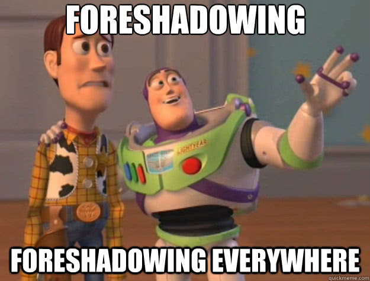
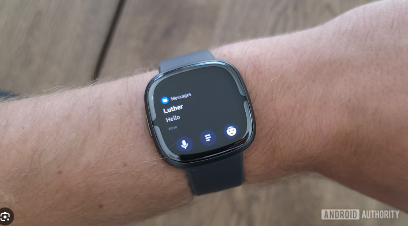

Strap yourselves in, this one is a bit of a rant.

For the longest time I have been a Fitbit Versa fanboy. I bought the Versa 1 back in June 2018 and have replaced and upgraded ever since.

When my Versa 2 last stopped working a couple of months ago (due to water ingress), Fitbit once again offered to either replace my watch with a Versa 2 or get a shop voucher for the same amount. I this time decided I wanted to upgrade to the recently released Versa 4.

If you weren't aware Google purchased Fitbit back in Jan of 2021 and the Versa 4 is the first watch they released in the Versa line since that acquisition.

I thought that Google would improve the line and not instead kneecap it instead in favour their competing [Pixel Watch](https://store.google.com/au/product/google_pixel_watch) line...

Surely Google has purely [altruistic reasons](https://time.com/5717726/google-fitbit/) for purchasing Fitbit I thought..

Well I received my Versa 4 and quickly realized that past-Mike is a poor naive fool.

## No Custom Watchfaces or Apps

I have long enjoyed creating and running my own watchfaces on my Versa. I even wrote about how much I enjoyed the process [back in May 2021](https://mikecann.co.uk/posts/minimal-mike-a-fitbit-watchface).

Unfortunately however Fitbit / Google in their infinite wisdom have decided to [no longer allow this](https://community.fitbit.com/t5/Versa-4/Versa-4-can-t-install-any-apps/m-p/5293897/highlight/true#M2012).

By the way, this isnt mentioned anywhere. You have to go spelunking through their forums to find this out. Their official developer docs [are suspiciously quiet](https://dev.fitbit.com/getting-started/) on the topic only mentioning the Versa 3. There are [A LOT of annoyed people](https://community.fitbit.com/t5/Product-Feedback/3rd-Party-Apps-on-Sense-2-and-Versa-4/idi-p/5248677) if you go looking.

BTW this also applies to Apps. You can no longer create custom apps so[ I am not able to pair](https://docs.woosports.com/docs/supported-devices) my [Woo](https://woosports.com/) kitesurfing jump-tracker with my Versa 4 like you can on [Garmin devices](https://apps.garmin.com/en-US/apps/53d9c500-614e-4e3a-88b6-9f65bc6a144a)..

# Automatic Exercise Mode Is Terrible

In principle, having the watch automatically detect that im doing exercise and only then enable battery-hungry features such as GPS and blood-oxygen monitoring is a great idea.

The only problem is when it is implemented as it has been on the Versa 4 then its worse then useless, it is a massive problem for the device.

<iframe width="419" height="744" src="https://www.youtube.com/embed/y_D1cA-IWw4" title="How Bad is the Versa 4?!?" frameborder="0" allow="accelerometer; autoplay; clipboard-write; encrypted-media; gyroscope; picture-in-picture; web-share" allowfullscreen></iframe>

Imagine you start to do some exercise, go on a walk or play squash or anything. The watch detects that you are exercising, great! Now you also want to see what the time is.. uh oh..

That right, you can no longer use your watch to tell the time once it detects that you are exercising. The only way to return to "watch" to see the time is to exit the exercise mode and this then brings up the next major issue..

As you can see from my video above, the screen doesn't work if you fingers are even a little damp. What happens when you start to exercise? Thats right, you start to sweat, rendering the tiny touchscreen inoperable.

You eventually you manage to press the tiny "end exercise" button and continue on with your exercise. 5 minutes (or so) later the watch automatically detects exercise again ARRRGGGGHHH!

P.S. As far as I was able to ascertain there is no way to disable this "functionality".

## Always on Display is Pointless

One of the main reasons I have always had for purchasing a Versa over an Apple or Samsung watch is the multi-day battery life. I used to enjoy that back when I used to wear the [e-ink Pebble watches](<https://en.wikipedia.org/wiki/Pebble_(watch)>) and didnt want to give it up.

One thing I did miss however was the always-on display.

Having to "flick" my wrist to see the time was an "okay" solution tho it didnt always work. It also used to activate randomly in bed which would cause much marital frustration as a bright light would shine in her face during the night.

So when I saw that the Versa 4 supported an "always on" display I was super excited as I felt that hopefully they had solved these issues.

Unfortunately however I quickly discovered that turning on this feature rapidly drained the battery so that the average charge time went from 5-7 days down to 1-2 days which made me question what is the point?

I know technologically it's possible as every Garmin watch has an always-on display and maintains weeks or months of battery life.

# Super annoying notifications

I couldn't find any good footage of this issue and for some reason my Versa has decided to stop sending me notifications at all (again) so just take my word for it, getting notifications on this device are super annoying.

Im sure some designer at Fitbit thought it would be super cute if they played an intro animation every time you get a notification before actually showing you the contents of that notification. The issue is this intro takes like 2 seconds.

This is super annoying when you want to quickly scan that text message while continuing what you are doing.

Like with most other things with this watch, this is not configurable without entirely disabling notifications.

# Every update resets settings

This one isn't a Versa 4 specific issue and has always happened to me on Fitbit devices but I thought I would mention it while im on the rant-train.

As mentioned in my point above for some reason my watch has decided to stop sending me notifications. Why? Who knows. Perhaps it updated? That seems to always reset my "reminders to move" settings (super annoying btw). Probably the only way to remedy this is to unpair the watch and repair it.

If that doesnt work, factory-reset the watch and setup everything again (yes I did read that as an official way to fix it but cant find the link).

# Conclusion

So I could have titled this post "Dont Buy a Versa 4" but unfortunately I cant see this situation getting any better with future Fitbit products. Google is likely going to continue to favour its own brand of smartwatches over Fitbit. Having now acquired the competition it will strangle then eventually kill it.

So after all this I decided to change over to to Garmin smartwatches. If you have gotten this far too and are now scared off Fitbit devices I can definitely recommend Garmin. They have a massive range of options, all the apps, simple to use, custom watchfaces, physical buttons, no touchscreen, GPS, always on display week+ battery times, just about everything is better.
