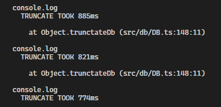
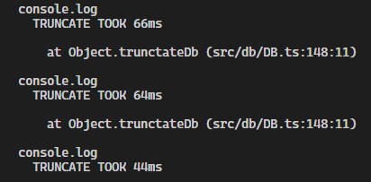

We were suffering from slow integration tests on our server when I discovered something that sped up performance by 15 times!

<!-- more -->

# TLDR;

Set `fsync=off` in your postgres config.

# The Problem

For our game [BattleTabs](http://battletabs.com/) run a custom sockets based API server. To ensure that the server is working as intended I like to write integration tests that hit the database. This gives a good level of confidence that calling that endpoint from the game client is going to work as expected.

The issue is that the tests were taking quite a while to run:

[](./before.png)

I narrowed the issue down to where most of the time was being spent:

[](./trunc-before.png)

We must truncate the database before each test runs so that there is no state from the previous test that can affect the results. The problem is that this truncate seems to be taking an inordinate amount of time.

# The Solution

After some googling I came across [this post](https://dev.to/thejessleigh/speed-up-your-postgresql-unit-tests-with-one-weird-trick-364p#:~:text=fsync,are%20physically%20written%20to%20disk.) which seemed to suggest that there was a magical config value `fsync` that I could disable which would speed things up.

So I set `fsync=false` in my postgres config and restarted my docker container and..

[](./trunc-after.png)

Wow! Thats a 15x speedup! Incredible.

So whats the downside? Well `fsync` ensures that changes are written (synced) to disk when Postgres makes a transaction. So by disabling it you are disabling protection from crashes power-cuts and whatnot so its [definitely not recommended in production](https://www.2ndquadrant.com/en/blog/postgresql-fsync-off-warning-in-config-file/) but when running tests we dont really care about data integrity so its safe to disable it.

# Github Actions

I wondered if it was possible to apply this sort of speedup to the CI which runs all the integration tests on each push.

To cut a long story short it appears you [cant supply config params to the standard postgres image while running in Github Actions](https://stackoverflow.com/questions/65438055/how-to-add-config-args-to-postgres-service-container-in-github-action/65444387?noredirect=1#comment115705280_65444387) but fortunately we can use another postgres image from Bitnami which does let us disable fsync.

```yaml
jobs:
  test-and-build-pr:
    runs-on: ubuntu-latest

    services:
      postgres:
        image: "bitnami/postgresql:latest"
        env:
          POSTGRESQL_DATABASE: postgres
          POSTGRESQL_USERNAME: postgres
          POSTGRESQL_PASSWORD: postgres
          POSTGRESQL_FSYNC: "off"
        options: >-
          --health-cmd "pg_isready -d postgres -U postgres -p 5432"
          --health-interval 10s
          --health-timeout 5s
          --health-retries 5
        ports:
          - 5432:5432
```

The result is a speedup of 3x, not quite as dramatic as the local speedup (probably because im running postgres in a linux docker container on windows locally and Github is running it on linux) but an impressive performance boost nonetheless!
