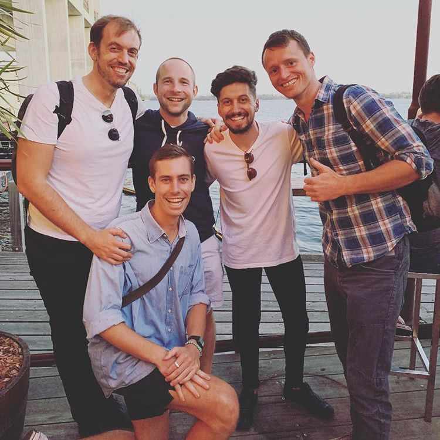

So Friday marks what could be a very important day for me. It was my last day in the employ of Bamboo but was my first day in the employ of myself for Markd!

<!-- more -->

# Bamboo

It seems hard to believe that it was [only 6 months](/posts/started-at-bamboo/) ago that I joined Bamboo the company building a cryptocurrency investment app.

It's been a wild 6 month ride. Intense long hours with highly motivated and incredibly talented individuals. Pretty much exactly what you expect & want out of a startup.

We made awesome progress in a short time. I was instrumental in setting up the initial Typescript and React-Native based mobile app before switching to building out the Typescript and Serverless backend for a [closed beta launch](https://medium.com/bambooblockchain/announcing-bamboos-closed-beta-173980918983).

Since closed beta we were working hard on the new bank-grade event-sourced backend.

Bamboo has been great to me and developed a ton there but I always felt like I was missing something, something that fed my entrepreneurial ambitions. So when I received a call from my long-time business partner [Brandon](https://brandonwu.co/) about an exciting potential business opportunity I was all ears.

# Markd

I [first wrote about](/posts/portfolio/projects/introducing-markd-pinterest-for-people/) Markd back in September of 2016. Its a service that aims to make remembering and organizing people fast, simple and fun.

Back in 2016 Brandon approached me looking for a a developer to build out an MVP for him. After a short while we completed that. I continued to work on it on and off over the next year or two.

Unbeknownst to me, Brandon had been demoing the MVP to investors and one became excited about the potential of the product and wanted to invest. Thats when Brandon contacted me to see if I wanted to work on Markd full time.

I was excited. Its not often you get the opportunity to work on a project you are excited about and are able to secure funding to cover the costs of living in a [rather expensive country](https://www.numbeo.com/cost-of-living/country_result.jsp?country=Australia) so I said yes.

# Conclusion

So im going to be working on Markd here in Perth Australia for the forseeable future with Brandon in Cambridge England. Im really excited about the future, we have a huge number of ideas and features we want to implement. Im sure ill be blogging about some of the technology and progress we make.

If you want to checkout what Markd is all about you can head to the website: https://markd.co. Dont forget tho it is very much an MVP at this stage but if you want to give us some feedback you can email me: mike@markd.co.

I also just want to say a massive thanks to the Bamboo crew, as mentioned above it was an absolute joy, im sorry it had to be cut short but im sure you guys will do just fine without me :)

