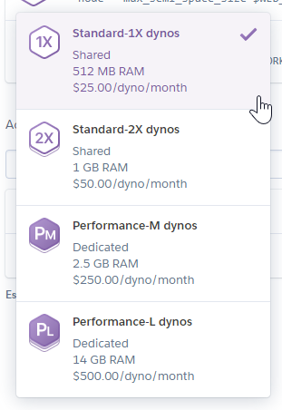
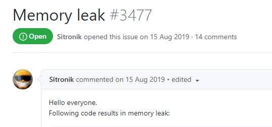
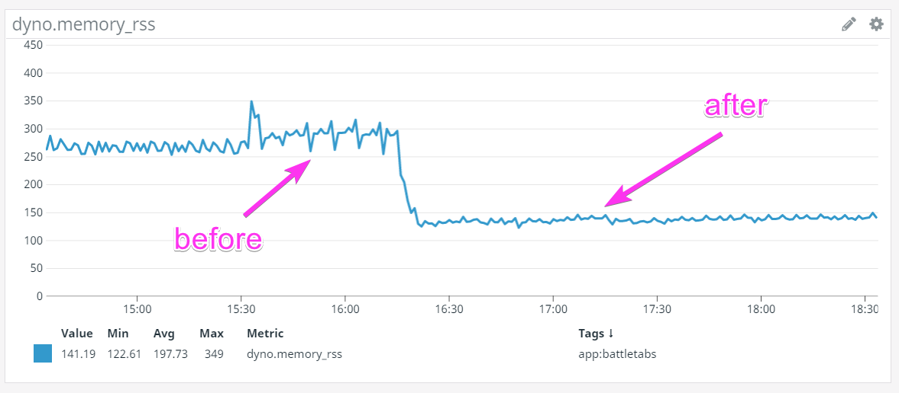

We were having serious memory issues on the Heroku hosted NodeJS backend for our game [BattleTabs](https://battletabs.com) when we decided to apply "this one little trick"...

<!-- more -->

# TLDR;

Use [Jemalloc](https://github.com/jemalloc/jemalloc).

# The Problem

For those that aren't regular readers of this blog, for the past year my main focus has been a chrome extension game called [BattleTabs](https://battletabs.com). The game is based around the classic board-game BattleShips except you can play it in a Chrome Extension. This makes it rather unique as the game is immediately available every time you open a new tab in your browser. You can take a turn and move on with what you were doing or you can sit and play a longer session.

Because of the way the game works we keep a persistent socket open to our backend at all times. This allows us to keep the user's state in sync by pushing down updates from the server.

The game has grown considerably over the past 12 months and as a result the demands on the server have continued to grown. That coupled with the increased feature set has seen more and more open sockets and more required memory per socket.

# Vertical to Horizontal

We follow a pragmatic development strategy for the game, meaning that we only spend the time working on improving the infrastructure if its necessary. This meant that for 9 months we weren't really worried about server scaling or performance. We knew the issue was there in the background but whenever we needed more capacity we just bumped up the server size in Heroku:

Well unfortunately the day game when we were up to the largest size dyno and we were starting to see some issues again, it was time to do something about it.

The issue wasn't really that of memory at this stage, instead it was the number of simultaneous open sockets to a dyno instance. As far as I am aware there is no docs on what the max number of sockets is per dyno but [this](https://stackoverflow.com/questions/25118381/websocket-concurrent-connections-limit-on-heroku) stack overflow answer seems to suggest 6000.

We were definitely right up against that but at the same time because we are on node we are single threaded so we were also up against a CPU bottleneck trying to handle all the requests when the dynos go through their daily restart.

The time had come to go from a horizontal scale strategy to a vertical one.

We had been putting this off because horizontally scaling a websocket server isn't trivial. Fortunately we didn't have that much local-state and we were using [Socket.io](https://socket.io/) which has some good plugins to help with scaling. I wont detail everything we did here, feel free to contact me if you want details.

# Memory Issues

Now we could horizontally scale our server out to as many dynos as we wanted we should in theory be able to drop our dyno size back down to the smallest size (512mb RAM) and then just add more dynos as we grew.

The problem is, we seemed to still be using far more memory than we should have been given we were only running less than 1000 sockets per dyno. Worse still the memory seemed to be increasing over time indicating that there might be a memory leak somewhere.

After days of experiments and searching I decided to look a little closer at what socket-io was doing, thats when I came across this Github issue: https://github.com/socketio/socket.io/issues/3477

Others on the issue had done the hard work for me and instead of a memory leak they suggest memory fragmentation was the root cause of the problem.

This was a big "Ahhh!" moment for me as memory fragmentation would look a lot like a memory leak as your available memory over time would decrease as the memory became more and more fragmented.

There were two suggested solutions on the thread. I tried the first which was to disable "perMessageDeflate" on SocketIO. This had some effect but still we seemed to be using far more memory than we should have been.

So I decided to try the second solution too which was something I would never have considered; replace the system memory allocator in Node.

# Jemalloc

The other users on the Github Issue suggested trying [Jemalloc](https://github.com/jemalloc/jemalloc). I personally had never heard of it before but apparently its well known and popular with 5,500+ stars on Github. It describes itself as:

> jemalloc is a general purpose malloc(3) implementation that emphasizes fragmentation avoidance and scalable concurrency support.

Sounds like its exactly what we need, but how do I get node to use that? As with most things Heroku, someone has thankfully trodden this path before me and written a "Buildpack" which I can just plug into my app: https://elements.heroku.com/buildpacks/gaffneyc/heroku-buildpack-jemalloc

And the effect?

Wow! It halved our memory usage! Incredible!

# Conclusion

We were able to scale our heroku server out horizontally and overcome a memory fragmentation issue in socket-io by replacing the memory allocator with Jemalloc.

We have been running like this for a couple of weeks now and have yet to see any issues.

I haven't tested this on non-SocketIO servers but I suspect so I cant say for sure but I suspect it would have a similar magical effect. I would be very interested to hear your results if you tried this!
