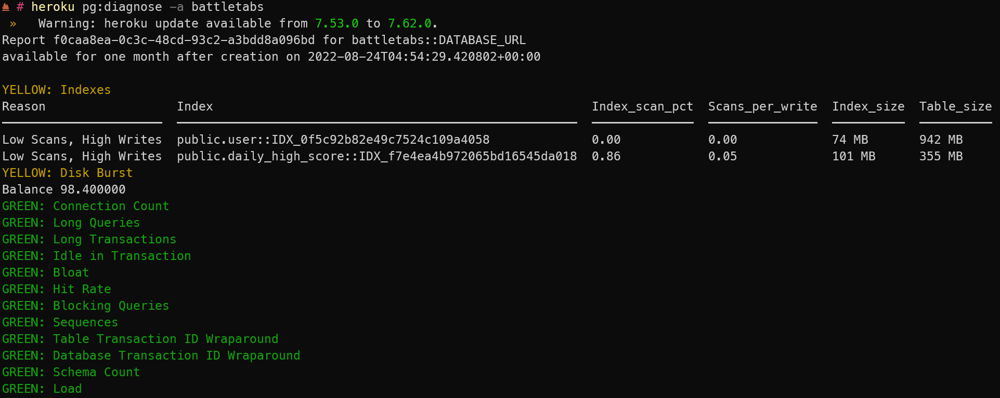
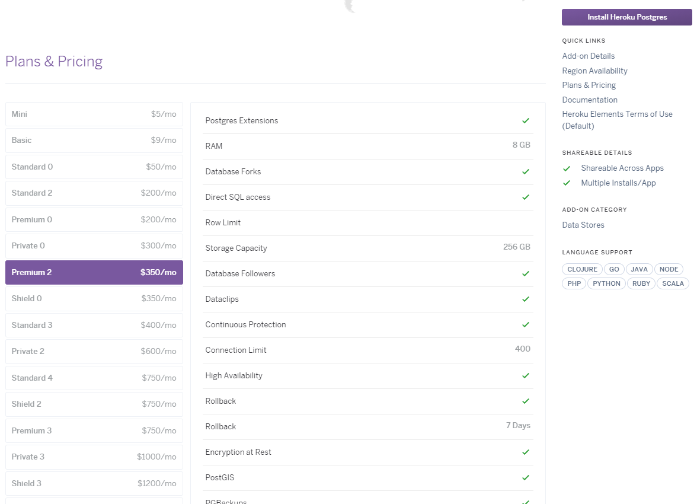
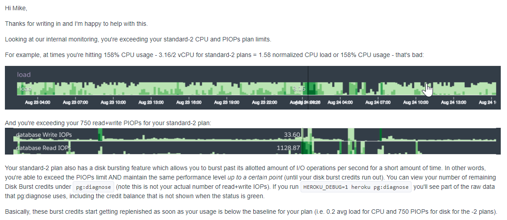
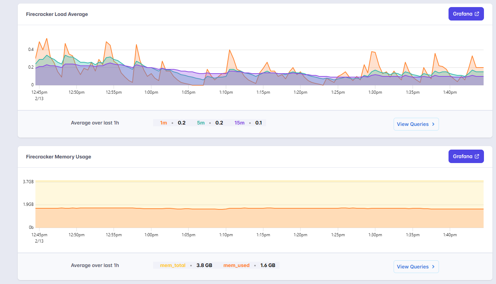
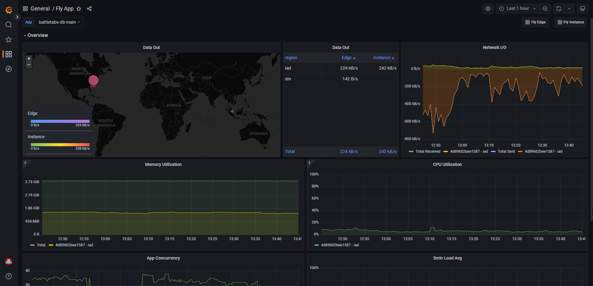

I have been a long fan of Heroku and we have been using it as the platform that powers [BattleTabs](https://battletabs.io/) for over 3 years and before that [Markd](https://markd.co) but they have long since stopped innovating and after a number of stressful events I decided it was time to break up.

# TLDR;

Ditch Heroku, move to fly.io, thank me later.

# Pain

Moving a Database to another platform is never an easy thing to do so I resisted it for the longest time despite knowing that we were paying way over the market price for the service. It just wasn't worth the developer time and potential risk of moving an unknown platform. Sometimes its "better the devil you know".

But then the issues started happening.

Every now and then, for no apparent reason, the database would grind to a crawl. Queries would start taking minutes to execute before eventually timing out. This then put backwards pressure on the web-servers as they buffered requests and started to suffer memory issues.

And of course, this all would happen just before I was going to bed at night.

My thinking at the time was perhaps we were outgrowing the database.

You see, Heroku doesnt really offer much in the way of metrics for your database. Sure they have the Postgres dashboard but that thing is pretty minimal at best and doesn't tell you anything about the CPU or memory pressures that the DB is under.

My solution each time this happened was to simply make the DB larger.

We started working our way through [the plans](https://elements.heroku.com/addons/heroku-postgresql#pricing) progressively getting larger and larger until we ended up paying $400 per month just for our Postgres instance.

I was getting more and more frustrated and nervous about this because I had no idea what the fundamental issue was.

Eventually I opened a support ticket with Heroku and they told me to try to use the `heroku pg:diagnose` tool, so I did and I got the following:

Notice that one item in yellow there "Disk Burst".

What is disk burst I ask myself? I didnt see anything on Heroku's [pricing page](https://elements.heroku.com/addons/heroku-postgresql#pricing) about IO limits

So I ask the Heroku Support and well..

Okay so Heroku has "hidden" IO limits that I was totally unaware of before and we are hitting this on certain tables and it is silently throttling us with no errors or warning or anything.

So in the end I ended up bumping up the size of the DB again but by this point I had had enough, it was time to move on.

# Moving

I started looking around at options and oh boy there are a lot of options for Postgres.

I'll save you hours and hours of research and comparison and just say that I ended up landing on [Fly.io](http://fly.io/).

The [pricing](https://fly.io/docs/postgres/) is just insane we can quite literally get 6 databases of the same size as Heroku's or one massive 8-core 32GB machine for the same price.

The price is definitely nice but thats not the main reason we moved, the main one was to get away from the hidden limits and poor metrics. Thankfully Fly.io really excels in this regard providing not only a basic metrics dashboard but a MUCH more complete Grafana dashboard.

Through that I can get a really clear view on how much memory, CPU, and importantly, IO the DB is using.

You can even setup alerts to let you know if things go out of whack.

What this information let me do was to see that we actually didn't need all the resources we were paying for on Heroku and so once the arbitrary IO limit was gone I reduced the size of the DB down from 8GB down to 4GB and the disk size down from 256GB to 40GB.

TBH I think we could even go smaller if we wanted to play it a bit more riskily.

# Cons

So its not all sunshine and unicorn farts of course.

Fly.io is NOT a managed service [as their website](https://fly.io/docs/postgres/getting-started/what-you-should-know/) takes great pains to highlight. This means upgrades and downtime are all down to you.

Its also quite a bit more work to get things setup just right. For example you have to set up your own external IP if you want to access your database from outside of your applications.

Fly is still pretty young and its platform is constantly moving. This can be both a good and bad thing. There are some rough edges in places but new features and upgrades are constantly being added and the devs are very responsive to customer feedback.

# Conclusion

So in the end if you start off paying $400 per month and reduce that down to $20 per month you can get a 20x saving on your DB costs AND get a peaceful rest at night knowing that you have lots more visibility into whats going on and alerts to let you know when things go pair shaped.

Hopefully this is the last database migration we ever have to make for the game!
