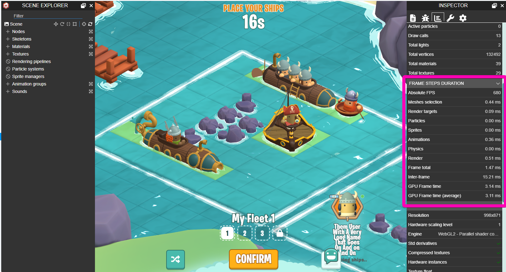
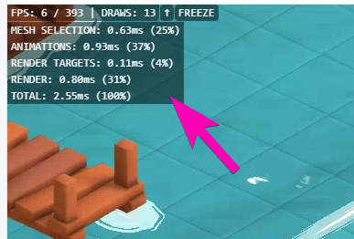
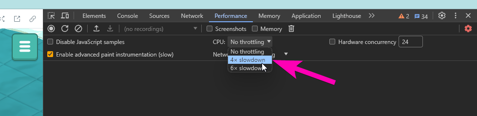
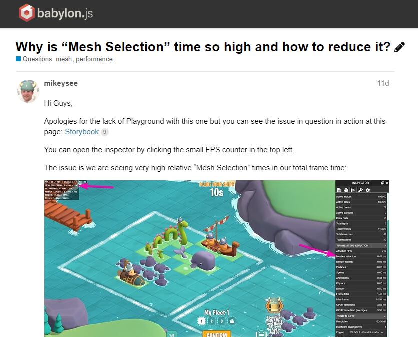
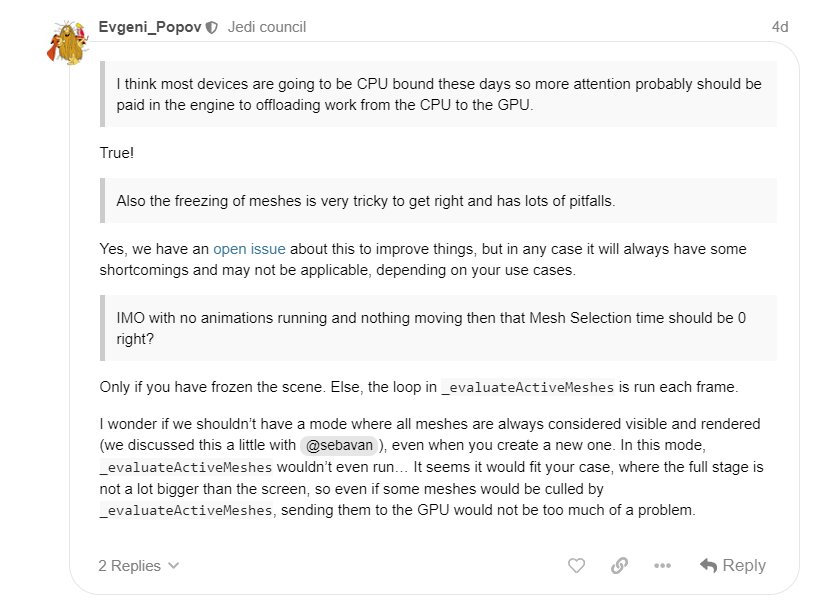

As we close in on our year-long goal of bringing [BattleTabs](https://mikecann.co.uk/posts/battletabs-in-7-minutes) to mobile the time has come for some long-overdue performance improvements.

I have been putting it off as performance improvements are always a bit of a project-black-hole sucking all time, space and energy. Fortunately I was able to escape this relativistic singularly and come out of the other side with some sizeable performance gains and interesting insights in tuning a BabylonJS game that I thought I would share here.

# Before Getting Started

First thing's first. When attempting any sort of performance optimization pass its critical to lay a good foundation down first. We need to first get some good diagnostics info from the game. This allows us to see which parts of our game are causing the performance drops.

Fortunately BabylonJS has some pretty good metrics built into the engine that you can checkout in the inspector:

It unfortunately doesnt show me those numbers as a percentage of frametime and it also takes up quite a bit of the screen. So I decided to make a little stats counter in the top left that shows me the critical numbers and their percentage of the total frame.

With this in place I was able to start to narrow down what I think I can spend some time looking to a little more deeply.

One other quick tool I like to use is Chrome's CPU throttling feature:

I develop the game on a powerful desktop PC which is likely more powerful than many of our users' devices. So using the CPU throttle it lets me simulate what its like for them a little more closely.

Arguably this slants things more towards a CPU bottleneck rather than a GPU bottleneck but lets just ignore that for now, ill discuss it more a bit later.

# Problem Areas Identified

I quickly noticed that there were three large contributors towards the total frame time: "Mesh Selection", "Animations" and "Render".

## Render

Render is a pretty obvious one, it's the time for the GPU to get the pixels on the screen. There was likely some stuff I could do here to speed things up but I decided not to tackle this one for now as it was likely going to involve some quality tradeoffs or digging through shader code which I would rather not do just yet.

## Mesh Selection

I wasn't too sure what this meant but after reading [Babylon's performance documentation](https://doc.babylonjs.com/features/featuresDeepDive/scene/optimize_your_scene#freezing-the-active-meshes) I had a better idea. As far as I understood it, it is the time taken for Babylon to choose which meshes it should send to the GPU for rendering. This is dependant mainly whether the mesh is within the camera view area (Frustrum).

BattleTabs doesn't really have many meshes and most of them are on screen most of the time so I wasnt really sure why exactly this number was so high.

I decided to [raise this issue on the BabylonJS forums](https://forum.babylonjs.com/t/why-is-mesh-selection-time-so-high-and-how-to-reduce-it/47069).

After a bit more experimentation I added a "FREEZE" button to my stats which called the `scene.freezeActiveMeshes` which was also mentioned in the Babylon performance docs. This had a dramatic effect on the Mesh Selection time, effectively removing it.

<iframe width="100%" height="480" src="https://www.youtube.com/embed/HtVbtbm8I5w" frameborder="0" allow="autoplay; encrypted-media" allowfullscreen></iframe>

As far as I understand it, freezing active meshes means that whatever is currently "active" (viewable within the Camera Frustrum) will ALWAYS be incuded in the list of meshes to be rendered.

This is great as it removes all that frustum culling time but it has a nasty side effect. If anything is added or removed from the scene, or its visibility changes, then it wont be reflected on the screen. This is because the mesh selection is "frozen". Animations also froze (im not exactly sure why this is).

All of these issues were possible to work around but it was going to be a bit of a pain going through the code with a fine-toothed-comb looking for places that might cause problems. Not only that it was likely to cause future bugs as its a nasty cross-cutting concern you can often forget.

I decided to sit on this one for now and look into the final large chunk of frame time I had yet to explore.

## Animations

Animations were taking over a third of frame time, this was a surprise to me. We only have 4-8 ships animating at any one time and [I was under the impression that babylon's skeleton animations were computed on the GPU](https://doc.babylonjs.com/features/featuresDeepDive/mesh/bonesSkeletons#picking-a-mesh-attached-to-a-skeleton) so there was no reason why they should be so slow.

I had read others having issues with this in Babylon and they suggested [that one could bake their animations](https://doc.babylonjs.com/features/featuresDeepDive/animation/baked_texture_animations) into whats know as "Vertex Animation Textures (VAT)".

These are basically pre-computed positions for each (bone? vertex?) each frame. These positions are stored in a giant array then loaded a runtime, passed to the GPU then used in a shader to update the positions of each bone / vertex each frame.

Doing this was going to be a bit of a pain as it meant we would have to add an additional design-time step of producing these VATs for each ship (and skin) and keeping them updated any time a change is made. It also precluded us from using blended animations, but we werent using those so I wasnt too bothered about that.

As with all performance work I did the bare minium of absolutely the nastiest-hackyiest code I could to test the theory and was surprised that VATs actually worked:

<iframe width="100%" height="480" src="https://www.youtube.com/embed/gIfKTqxTS4o" frameborder="0" allow="autoplay; encrypted-media" allowfullscreen></iframe>

VATs meant slower game loads as each animation for each ship now had to load in another texture. It likely also meant more VRAM usage as these new textures had to be sent to the GPU but I suspected this tradeoff was going to be an acceptable one for BattleTabs so I ploughed ahead.

# Putting it all together

With the theories in place and experiments conducted I reset my git branch and started again, this time properly coding it up. This was an arduous process as it meant handling lots of edge-cases that the experiments didn't cater.

Eventually I thought I had it all looking pretty good. To make sure I had the problem solved I put together a torture test scene:

<iframe width="100%" height="480" src="https://www.youtube.com/embed/xJ8DGv_NzAE" frameborder="0" allow="autoplay; encrypted-media" allowfullscreen></iframe>

The above shows that even with 100 ships animating I wasnt spending any time in Mesh Selection or Animations, huzzah!

# Conclusion

So in total I saw about a 70-100% performance improvement once I set my CPU throttle to 6x slowdown. This is quite a nice gain and makes me question why BabylonJS as an engine doesnt put more effort into reducing CPU load as JS is inherantly single-threaded and GPUs are so powerful these days it seems to me that the CPU is almost always going to be the bottleneck.

When I quizzed Evengi_Popov one of Babylons core-contributors he agreed:

So who knows, perhaps we will see some of this stuff built into the engine in the future.

For now im happy with the results, theres always more that could be done but I think its taken a little bit of pressure off of many of our users' poor devices and given them a better gaming experience.

Now onto the last few things before the mobile release!
