This one has been quite a while in the making but im proud to announce this innovative new game we have been working on.

<!-- more -->

# TLDR;

<iframe width="853" height="480" src="https://www.youtube.com/embed/AEC2tPX6HdM" frameborder="0" allow="autoplay; encrypted-media" allowfullscreen></iframe>

# History

I have been building chrome extensions for [quite some time](/posts/my-first-chrome-extension-post-to-tumblr/) and have always considered them a powerful and often overlooked medium.

When I came across the [Tabby Cat](https://chrome.google.com/webstore/detail/tabby-cat/mefhakmgclhhfbdadeojlkbllmecialg) extension a few years back I realized that the New Tab page is a powerful space for content that gets short but frequent attention (every new tab thats opened). It got my brain-juices flowing and I began to wonder what else we could use the new-tab page for.

Obviously as a game developer my mind quickly turned to what games could be played there. It needed to be asynchronous and quick to take your turn so you can continue on with what you were doing. I thought about classic board games and the first one I thought about was Battleships.

I half-started to implement what would become "BattleTabs" some years ago but never completed it.

When I mentioned the idea to my partner-in-crime Brandon he agreed that its an interesting idea and so we started to explore the idea a little more.

We decided to enlist the skills of my ex-colleague and artist extraordinaire [Alan Macfarlane](http://www.melbournemonsters.com/alan-macfarlane). A month or so of development later and BattleTabs was born!

# How It Works

So what is BattleTabs? Well its "An Asyncronous New Tab Chrome Extension Game", a descriptive but mouthful of a name. I like to think of it as a "Nano Game". That is you can dip into the game for a second (or less) at a time.

You start the game by going to the Chrome Webstore and installing an extension: https://chrome.google.com/webstore/detail/battle-tabs/mjcklhnhfiepmofggcoegkmkokbljmjd

Once installed the extension will replace your current new-tab page. The first time you open it you will immediately be asked to start placing your ships for your first match:

[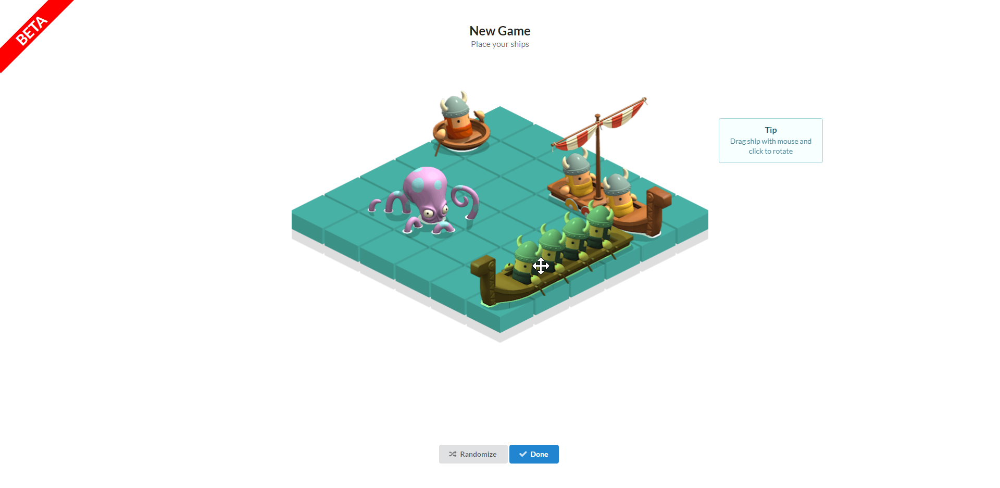](./first-match.png)

You can drag and rotate the ships to whatever you think are good positions or you can randomize the positions for quick action.

Once ready you give yourself a name and avatar (clicking the avatar changes it):

And then you are straight into the action:

[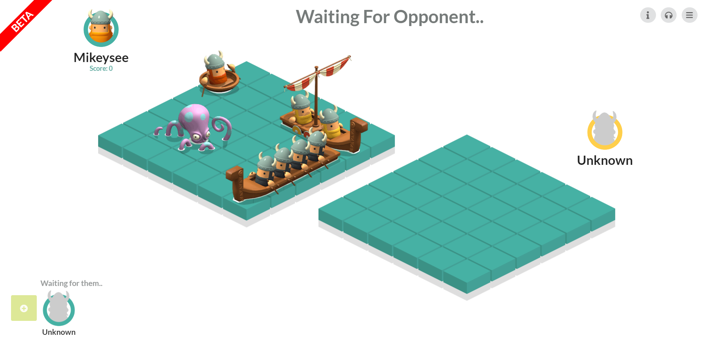](./waiting-for-opponent.png)

If theres another player that is waiting for an opponent too you will instantly be matched up against them.

You can then start taking turns trying to sink each others ships.

[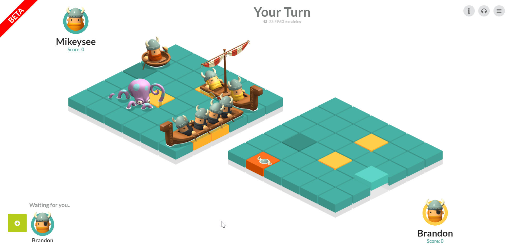](./taking-turns.png)

Because the game is designed for quick bursts of gameplay you can close the window at any time and the game will continue to periodically check in the background for turns from your opponent. It will let you know via a notification if they took a turn.

You can start a new match at any time, but you can only have 5 active matches at any one time.

[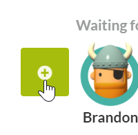](./new-match.png)

You have one day to take your turn otherwise you forfeit your turn. If you forfeit your turn three times in a row you automatically loose the match.

Scoring is pretty simple for now with a point ranking based on the number of games you have won or lost, but we plan on improving that later (see Future Plans).

# Development

Development was quite an involved process as it often is with games. We first had to decide how we wanted to present the game, should it be 3D, topdown, isometric or something more exotic?

[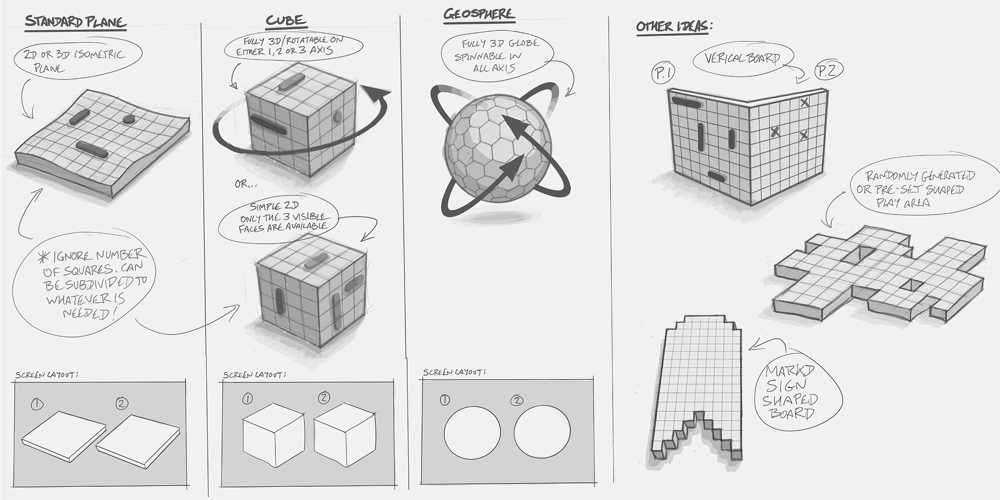](./playing areas.png)

We ended up with a simple isometric layout. We felt like it gave us the right combination of aesthetic and simplicity on art requirements as you can simply horizontal flip the sprite to make it look like its going in a different direction.

Once we had the general layout down we moved on to how do we present the ships. The talented Alan knocked out a bunch of different options for us to choose from:

[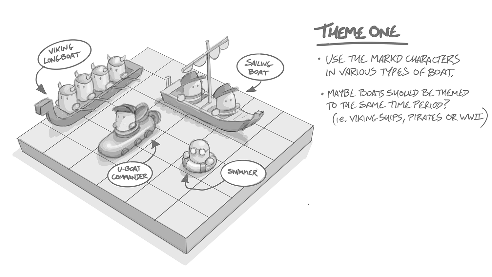](./theme1.png)

[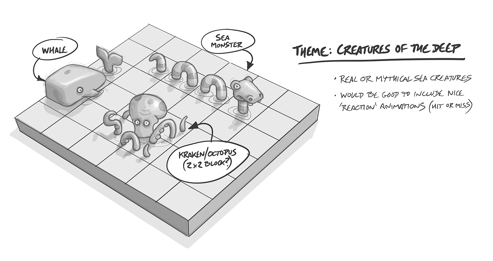](./theme2.png)

[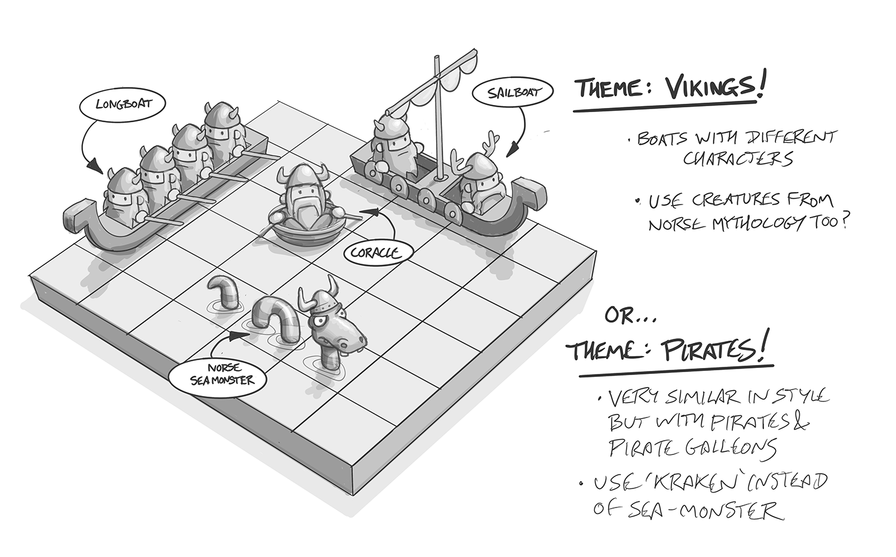](./theme3.png)

[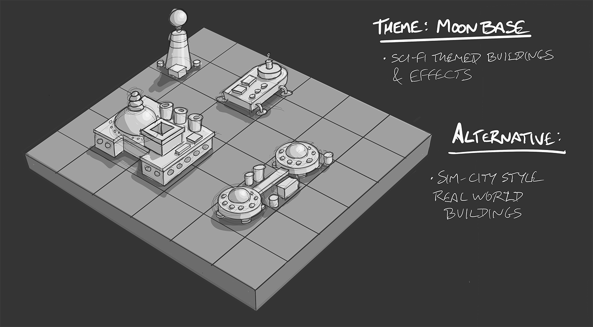](./theme4.png)

[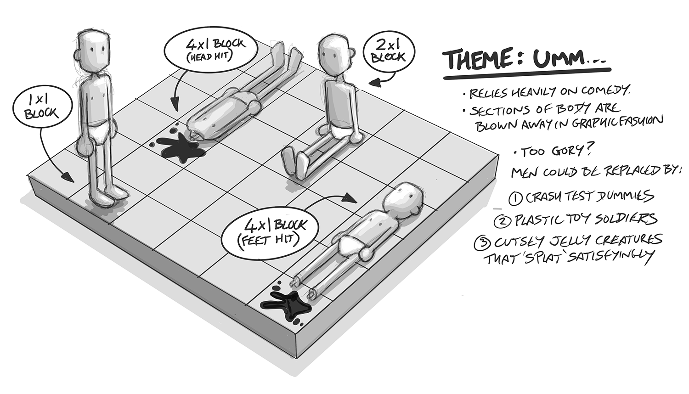](./theme5.png)

We decided that the Vikings theme would be best for the first release but we liked the idea some of the others so much we thought about future upgrades where the player can choose from different "themes" they can play with.

I got to work developing the actual game in isometric. I had built a few isometric games before and one effect I like from block based isometric is seeing the blocks move independently, it gives a sort of rippley water effect so I had a go at implementing that.

<iframe width="853" height="480" src="https://www.youtube.com/embed/AaU5sJXYWhs" frameborder="0" allow="autoplay; encrypted-media" allowfullscreen></iframe>

I was originally using React to do all of this but I discovered that react is a little too slow to animate this many objects so I reluctantly changed over to using Phaser3 for the game engine. I really didnt enjoy using Phaser tho, I think I would probably just roll my own solution in the future for more control.

Talking about isometric we had some issues with the length of the ships and isometric depth sorting.

<iframe width="853" height="480" src="https://www.youtube.com/embed/ivIm2bZNQ3Q" frameborder="0" allow="autoplay; encrypted-media" allowfullscreen></iframe>

The issue is that isometric doesnt work too well when you have long sprites. After much discussion and experimentation (and fighting with Phaser) we decided on a solution that split the sprites up so they could be depth sorted individually

[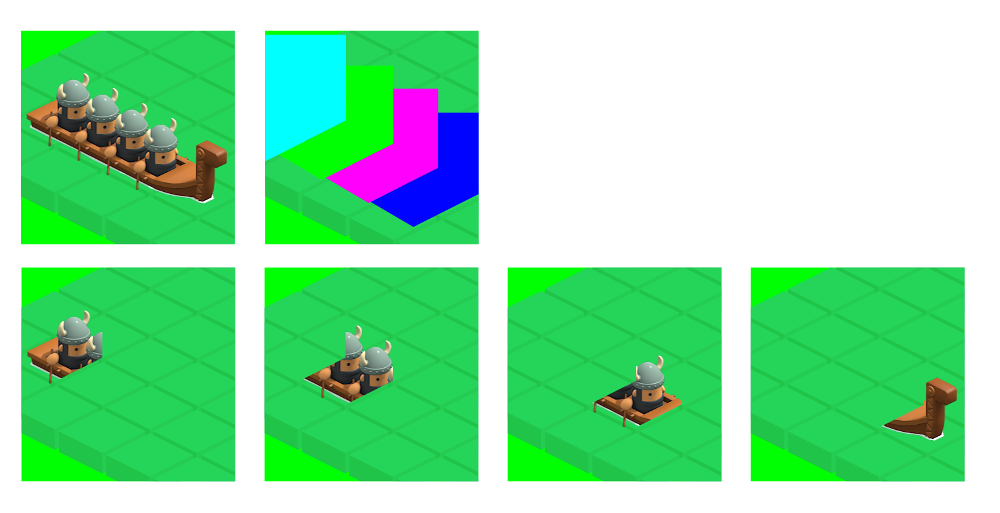](./depth-sorting-masks.png)

This finally solved the issue.

One other thing we fiddled around with for a while was how to indicate the various states that cells could be in.

For example when you click a cell to make a guess, it first enters the "guessing" state to indicate that its waiting for a response from the server. It then transitions to either a "hit" or "miss" state depending on if there is a ship there or not. Then finally there is a the "destroyed" state to make it clear that you have destroyed a ship at that cell so you dont need to explore any more.

# Future Plans

So its obviously very early days for the project and to be honest we are really just testing the idea out at this stage. Is the new-tab page a good medium for games? We arent sure. We think it is but time will tell.

If people are interested in the game then we have a bunch of future plans for things we want to work on to improve the game.

[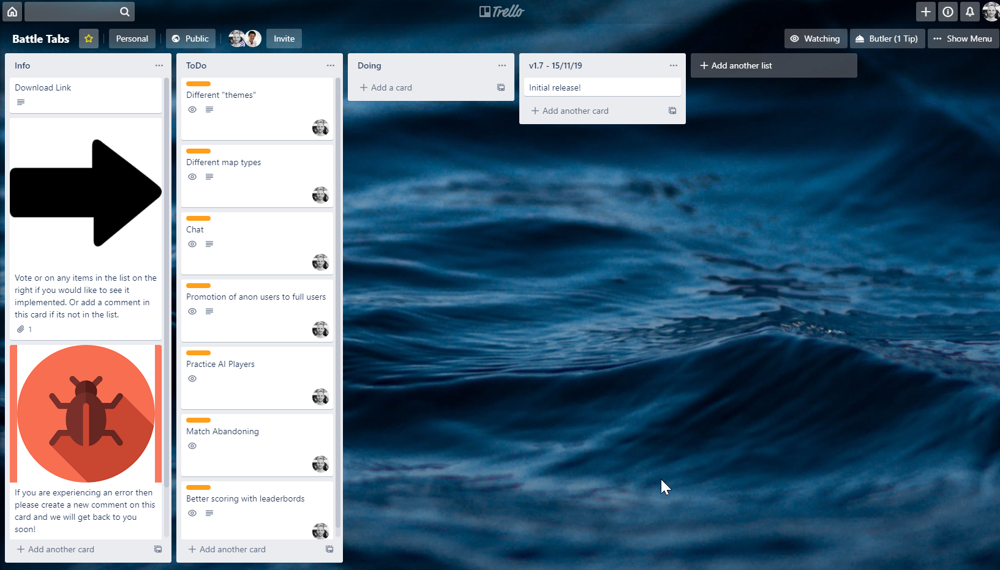](./trello.png)

Our public [Trello Board](https://trello.com/b/EoQS8Hq2/battle-tabs) lists a bunch of the things we have planned. This lets people see what we want to work on next and they can vote on their favorite's or add a comment to suggest something thats not on the list.

One of our favorite upcoming features is per-match-chat. You can use it to send quick messages to your opponent. We are considering making it emoji only chat which would be rather novel. If they are only emoji-based then theres no real way to send abuse thus we dont have to spend time moderating it.

Currently the game is totally free but obviously we will need a way to pay for continued development so we are thinking that we could sell new "themes", "skins" and other content to enhance the game.

Anyways let us know what you think of the game, is it interesting? What do you think we could do to improve it?
