I have a confession to make—I have a superpower: the ability to stay in the flow.

Throughout the workday, I'm continually assaulted with potential "side quests."

A friend might send me a message with a link to an article they think I'd enjoy. Bam! New side quest: read the article, formulate an opinion, and reply.

Or I'm reading some technical document for work and suddenly come across a link to something tangential. Bam! New side quest: go down the rabbit hole following links.

Or I'm out chatting with someone about a fascinating topic, and they mention something I should check out. Bam! New side quest: read the article on my phone instead of paying attention to my friend.

Each of these side quests, although potentially fun, inevitably pulls me out of the "flow" of whatever I was doing, disrupting my most productive self.

So, what is my superpower? It's a practice or tool I've been a fan of for a long time...

## Save It for Later

[Pocket](https://getpocket.com/) (initially named "Read It Later") is a simple service that stores links you can browse later.

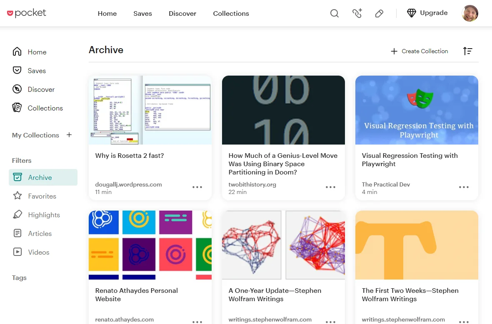

It works via a mobile app and Chrome extension. You simply press a button to trigger the extension or use another mobile button to share to the app—very simple and quick.

This means you can stay in the flow but still track that side quest for later.

Pocket worked for me for many years, but then one day, they made an update that frustrated me, so I decided to switch to a similar feature built into my RSS reader of choice, [Inoreader](https://www.inoreader.com/).

But then Inoreader decided to jack up its prices beyond what I was willing to pay.

So, I was kind of fed up at this point and thought what every self-respecting software engineer thinks to themselves: "Sod it, I'll just build it myself! How hard can it be?"

## StashIt

Just like that, [StashIt](http://stashit.lol/) was born.

Quickly on the name and logo: I wanted to keep with the side quest/game-related theme with the "stash," but then I realized that combining "Stash" and "It" together created a rather amusing double/triple entendre, hence the domain choice https://stashit.lol/.

There isn't much to say about the functionality; if you know Pocket, then it's basically like that but with far fewer features.

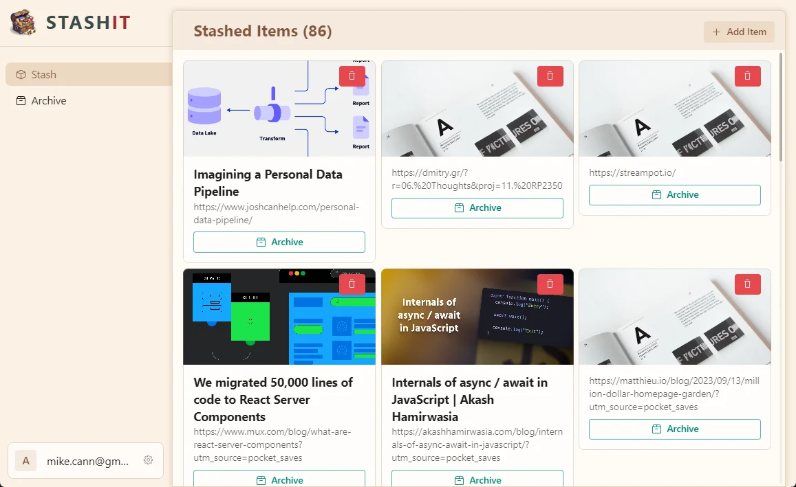

Right now, the main web app lets you add, archive, delete, and read items. This was all I really needed for the initial version, at least.

It was important that it worked well on mobile since I manage most of my side quests when I'm out and about or sitting on the sofa. So, the first thing I did was ensure that the web app was nice and responsive.

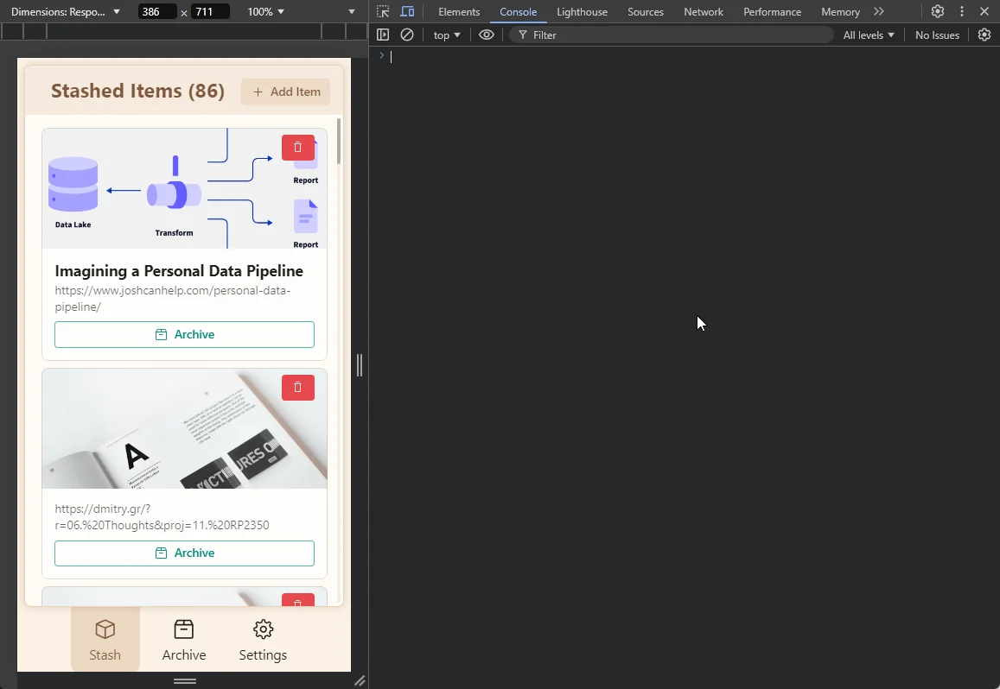

I then wrapped it up into a [Capacitor](https://capacitorjs.com/) app.

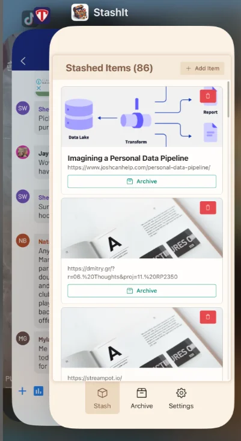

The final piece was putting together a quick Chrome extension that allowed me to quickly track that side quest when browsing the web.

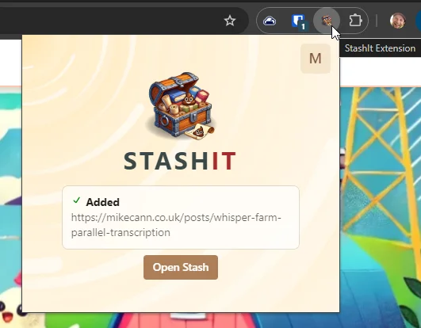

And that's about it, functionality-wise—nice and simple, but very useful.

Oh, one more thing: because I built it, I can tailor specific functionality to suit me.

For example, this blog now has an additional page: https://mikecann.co.uk/stash

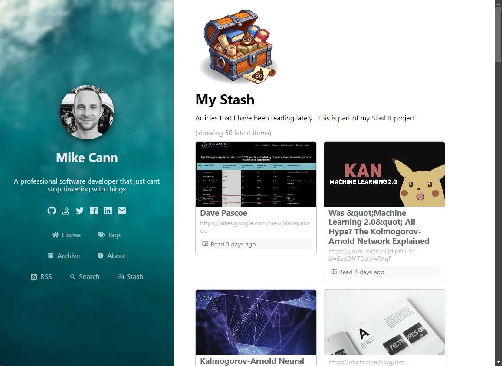

So, I now have a page I can point people to that shows a continually changing list of side quests I've been on lately. :)

## Technical Specifics

Another goal of this project was to explore some technical ideas and scratch some itches that my work at [Gangbusters](https://www.gangbusters.io/) can't currently reach.

So, in no particular order, here are some of the technologies used in this project:

- Convex
- React
- TypeScript
- Next.js
- Capacitor
- Vite
- Turbo-repo
- Chrome Extension API
- Capgo Live Updates
- Convex Auth
- Radix Themes
- Bun

This blog post would turn into a book if I talked about each of those, so instead, here are some notable thoughts on a few of them.

### Convex

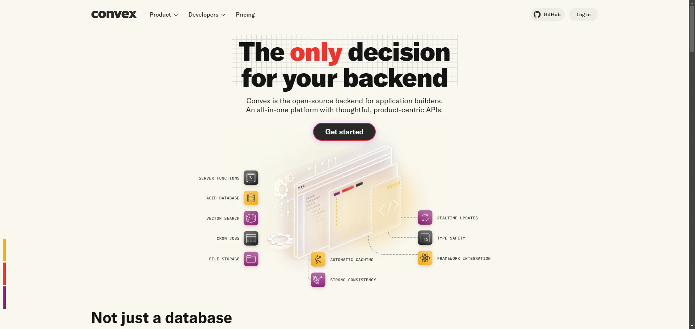

A fantastic experience, [as always](https://mikecann.co.uk/posts/tinkering-with-convex). It's always a pleasure to start a new project with Convex. The speed at which I can get going and how clear the data model is—it's just a joy.

However, I bumped into an issue I've mentioned before.

Unfortunately, Convex doesn't have any "aggregation" query methods. This means that to show the number of items within the stash or archive, you have to use some sub-optimal solutions.

The standard recommendation is to keep track of this count yourself in the database and increment or decrement it as you add or remove items. This approach is potentially error-prone, as you must remember to update this cross-cutting concern in multiple mutations.

Another way is to return all the records in the table within a query, then use `.length` on the array. This is the method I ended up using for this solution. I capped the number of items returned to 500, so if the count exceeds 500, it will just read "500+."

This probably means that query is quite expensive to run, but for now, it's okay.

There is hope on the horizon. Convex is very aware of these "aggregation" issues and is [exploring ways to solve them](https://github.com/ldanilek/aggregate). Fingers crossed, as this is just about the only big thing I miss from Postgres.

### Next.js

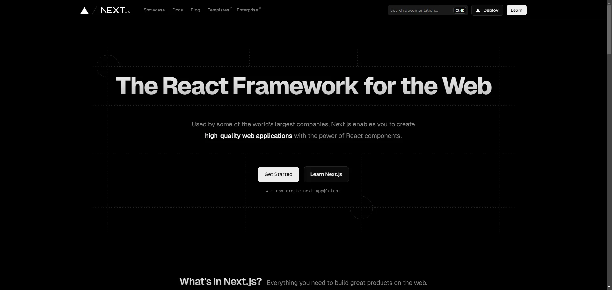

I decided to go with Next.js on this project. Although this blog is powered by Next.js, it's using the old pages way of doing things, and I haven't updated it in a while, so I thought I'd try the new hotness and see what everyone is talking about.

Well, I'm not impressed. Sure, it works and _may_ be flexible and fast (at render time), but at what price?

- I find the SSR confusion real. The React Server Components "use-client" or "use-server" is just a headache conceptually, and I end up sprinkling "use-client" everywhere to make the error messages go away.

[This post](https://www.mux.com/blog/what-are-react-server-components?utm_source=pocket_saves) makes me feel better that I'm not the only one.

- The dev experience is way slower than Vite because it doesn't pre-build the pages—only when you first visit them. You end up with a big pause when trying to navigate.

- Several times, my Next.js cache got corrupted. How? I have no idea. All I know is I suddenly started getting very strange errors that took me ages to work out. In the end, I just deleted the `.next` folder, built it again, and all was well. Still super frustrating.

So yeah, I don't think I'll go with Next.js next time.

### Capgo Live Updates

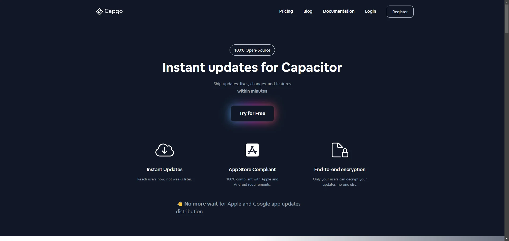

[BattleTabs](https://mikecann.co.uk/posts/introducing-battletabs) is built on Capacitor, so I decided to go with it for the mobile app for this project too.

BattleTabs works by simply iframing https://battletabs.io. This means updates are a breeze, as we simply need to reload the iframe within the Capacitor wrapper to have it auto-update.

I probably should write a blog post on this at some point, as I think it's a super interesting way of designing a cross-platform app, but I'll leave that for another day.

The more traditional way of updating a web-based mobile app these days, however, is to use a service that can "live update" the code by having the device download the new code bundle, then unpack and replace the existing code. This means you're able to provide speedy updates without having to resubmit to the various app stores each time.

For a Capacitor app, there are two main options that I could see: either [Appflow's Live Updates Service](https://capacitorjs.com/docs/guides/deploying-updates) or [CapGo's Live Updates Service](https://capgo.app/).

Both have free and paid tiers, but Capgo also has an open-source version. I wanted to experiment with self-hosting my own updates using a [simple HTTP action](https://github.com/mikecann/stashit/blob/master/packages/convex/convex/updates.ts) I wrote using Convex, then storing the updates in Convex's storage system.

When the CI builds the game, it zips up the output and then [uploads it to the Convex backend, which creates a new version](https://github.com/mikecann/stashit/blob/master/apps/client/scripts/createAndUploadNewAppVersion.ts) ready for the mobile app to consume.

This all works really well and was surprisingly simple to do—I was pleasantly surprised.

### Radix Themes

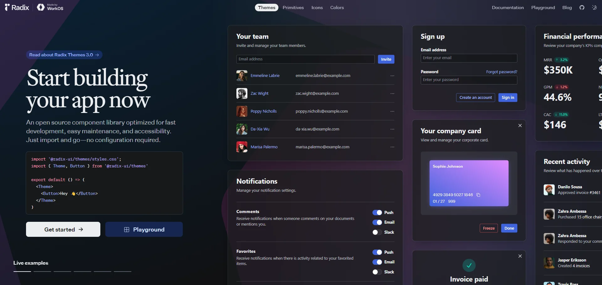

Radix Components are used

in many of the popular [ShadCN/ui](https://ui.shadcn.com/) components, so I thought I'd give their opinionated ["themes"](https://www.radix-ui.com/themes/docs/overview/getting-started) library a go.

I enjoyed the [very prescriptive](https://www.radix-ui.com/themes/docs/theme/overview) way of doing things—sometimes it's nice to just be told one way to do things.

However, I still found myself needing to use the `style` prop fairly often. I also found myself wishing for a bit more control around styling. I started to suspect that I would have to pull in Tailwind. I did resist, but I think I'll have to bow to the inevitable eventually.

I also found it kind of odd how only some CSS properties were listed as attributes. I suspect this is intentional, as with everything in Radix, but coming from the pure flexibility of the [emotion](https://emotion.sh/docs/introduction)-based [ChakraUI](https://v2.chakra-ui.com/), it just felt a little frustrating at times. Again, I suspect this is intentional.

So, all in all, I'm not exactly sure what to think about Radix Themes. I think I'm still looking for the perfect UI library. ChakraUI gets close—if only it wasn't such a massive drain on TypeScript compilation performance.

### Convex Auth

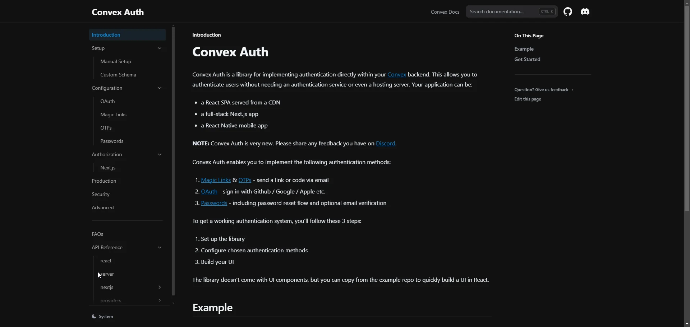

All my Convex projects up to this point have been using [Clerk](https://clerk.com/) for their authentication. However, I was getting issues when trying to implement Clerk into the Capacitor app, so I decided, why not give the [newly released Convex Auth](https://www.convex.dev/auth) a try instead?

It's all very new stuff, but it seemed to work quite well. I think I have a bit more tinkering to do with it, but I was pleasantly surprised by how smooth everything worked.

## Project Status & Conclusions

For now, this is still very much a personal project that I'm going to keep tinkering with and adding to as I need it.

I was thinking of releasing the source, but I decided not to just yet, as everything is a bit all over the place, and I'm likely to change stuff over the next several months. If you're super interested in having a look, let me know, and I can sort something out. :)

I may revisit this project in a future post, so stay tuned!
