Ever since I [built my own smart mirror](/posts/mikes-mirror-the-talk) back in 2018 I have been keen to do another hardware project...

<!-- more -->

# TLDR;

This is what I ended up building:

`youtube: https://www.youtube.com/watch?v=PWc4lJeD_T4`

# 31st October 2019

I started looking around for other cool electronic projects I would like to work on. Theres tons of cool project ideas on https://hackaday.io/ and https://www.adafruit.com/. I recorded all my favorites on a Trello board:

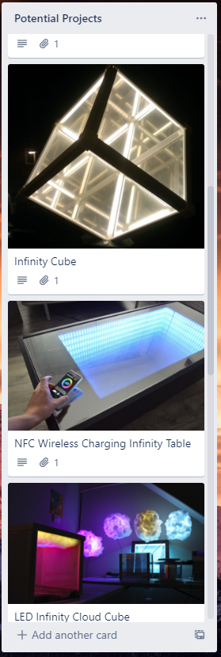

I wanted to do something really ambitious but decided to be safe I should probably start with something a little smaller then if it goes well try the larger thing (more on that later).

So the final choice was this awesome LED Matrix toy project from Adafruit: https://learn.adafruit.com/matrix-led-sand/overview

I liked it because it looked cool and had a good guide and all the components were easy to get hold of.

# 1st November 2019

I ordered the parts from various places. Most of the Adafruit stuff I bought from [Core Electronics](https://core-electronics.com.au/brands/adafruit-australia) who are the official retailers of Adafruit components.

Unfortunately Core Electronics didnt have the LED Matrix so I decided to source that myself from a [Ali Express](https://www.aliexpress.com/). It turns out there are tons of different versions from lots of different manufacturers. In the end I chose [this one](https://www.aliexpress.com/item/32650789975.html?spm=a2g0s.9042311.0.0.e86c4c4dfwYIzu) as it looked close to the Adafruit one, had good reviews and was priced okay.

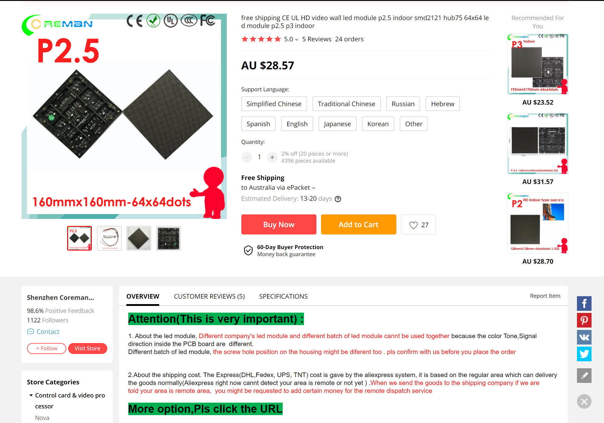

# 4th December 2019

The LED Matrix finally arrived from China. This was the last item I needed so I could start the build.

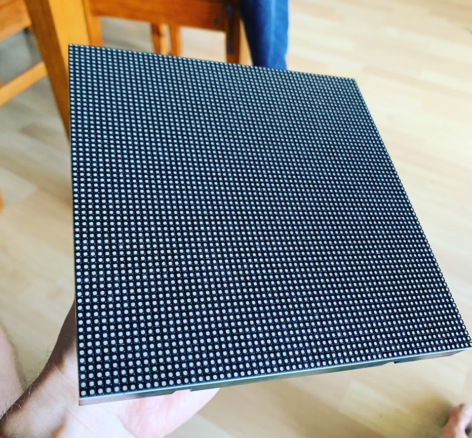

# 10th December 2019

I started following [the Adafruit guide](https://learn.adafruit.com/matrix-led-sand/overview), I first got the software running on the Raspberry Pi Zero W.

Because I thought I needed to see the screen to setup the Pi, I bought a cheap \$50 monitor from Gumtree then plugged in a spare keyboard and mouse. It turns out I neednt have bothered but more on that laters.

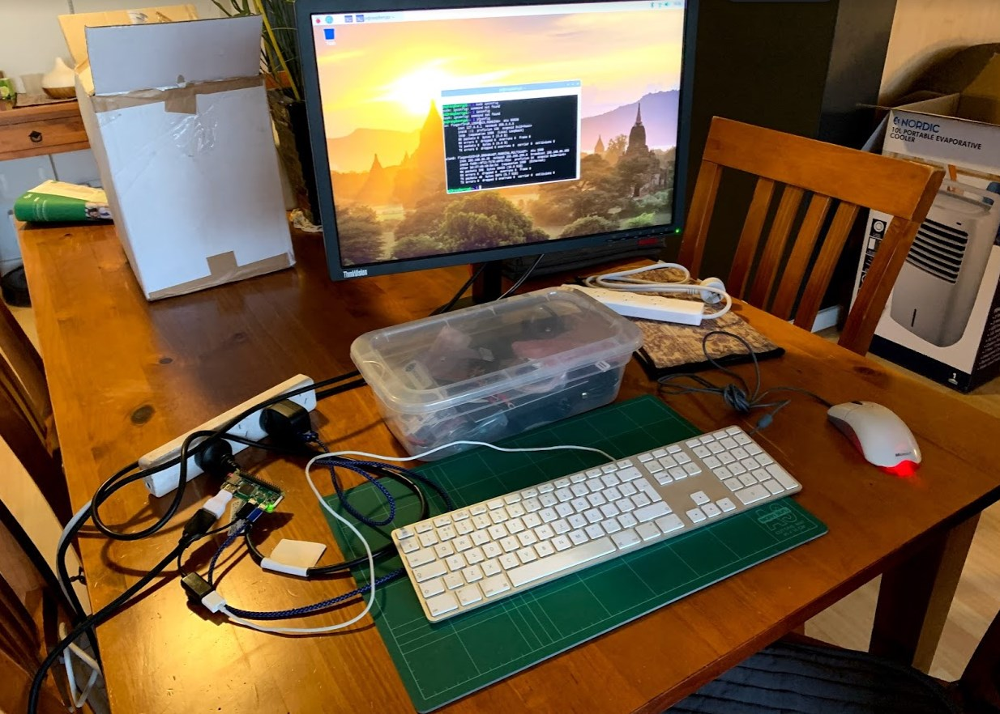

The software process was rather simple thanks to the scripts provided by Adafruit.

# 13th December 2019

I started to solder some of the components together roughly so I could test the hardware. As before I followed the Adafruit guide which provides this very handy circuit diagram:

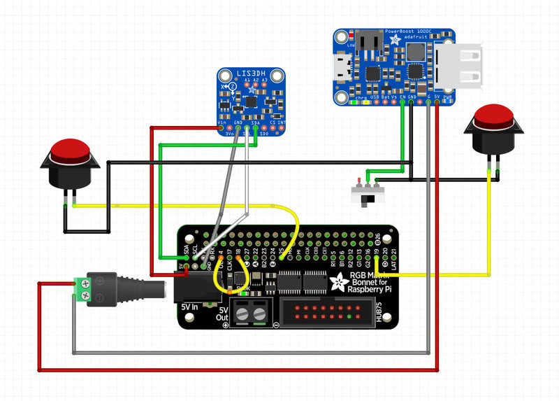

It was at this point I realized I had made a mistake. I had ordered the [Adafruit Powerboost Basic](https://www.adafruit.com/product/2030) rather than the [Adafruit Powerboost Charge](https://www.adafruit.com/product/2465).

The only different between the two I think is that the Charge is able to charge the Lipo battery as well as output the power at the correct voltage.

The wiring was a little different between the two however and I was worried about blowing something up. Instead I decided to order a Charge from Core Electronics.

Fortunately I could continue for now as I had a power supply that would work directly with the Adafruit RGB Matrix Bonnet. The whole thing would just have to be tethered to the power socket for now.

So after getting everything connected and powered on to my surprise it actually worked!

`youtube: https://www.youtube.com/watch?v=h4k6GrrQxe4`

I couldn't believe it. I was totally expecting it just to not power up or the matrix not to light up or something but it just worked. Awesome!

# 14th December 2019

I wanted to see if I could get the handles and other mounting brackets 3D printed.

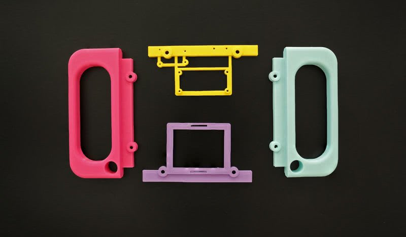

I downloaded the SDL files supplied by Adafruit and went over to a mates place who owned a 3D printer.

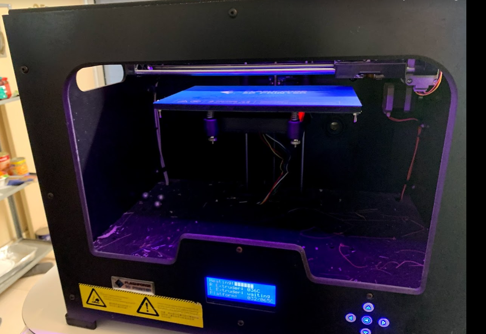

Unfortunately we couldnt get his printer to print correctly so I gave up on that and instead decided to try to print using a third party printing service.

# 7th January 2020

I joined [Thingiverse](https://www.thingiverse.com/thing:2808127) and found a third party company that could print my parts relatively cheaply.

# 26th January 2020

I received an email from my printer saying they couldn't do it for the price they had originally quoted. Sigh.

# 29th January 2020

I decided to contact a few local 3D printers here in perth using Gumtree. I got a good quote from someone within an hour and they immediately started printing.

# 30th January 2020

My 3D print was ready to collect already! I drove over picked them up, they looked great.

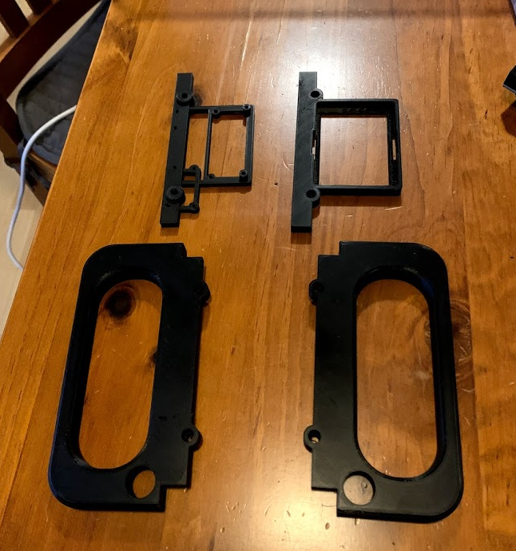

There was one small issue however... If you remember back to the start, I decided to buy an LED matrix myself from a different supplier than Adafruit. Well it turns out that the spacing for the screw holes on the back of the matrix are 10mm wider on mine than the Adafruit one.

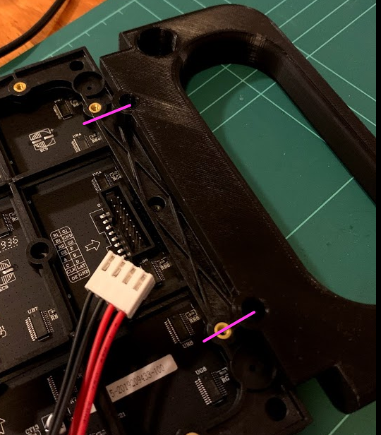

So unfortunately none of the holes lined up.. Sigh!

# 8th February 2020

I tried to edit the 3D printing files but I didnt really know what I was doing in Blender so instead I had an idea. Instead of spending ages learning how to use a 3D package and then paying to get them reprinted I could instead bodge it!

So I went off to Bunnings and bought a drill and some 3mm MDF.

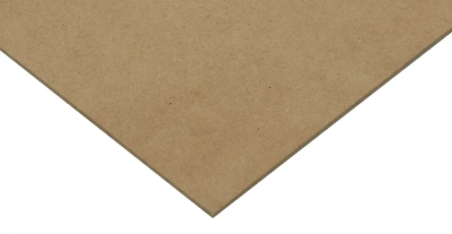

I then proceeded to do a bit of sawing, sanding and drilling..

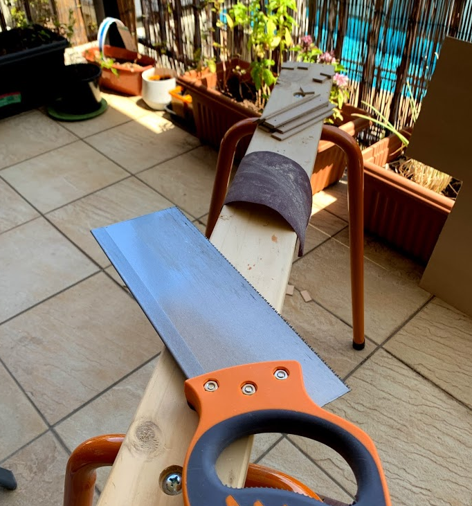

Then hey presto I had a working bodge!

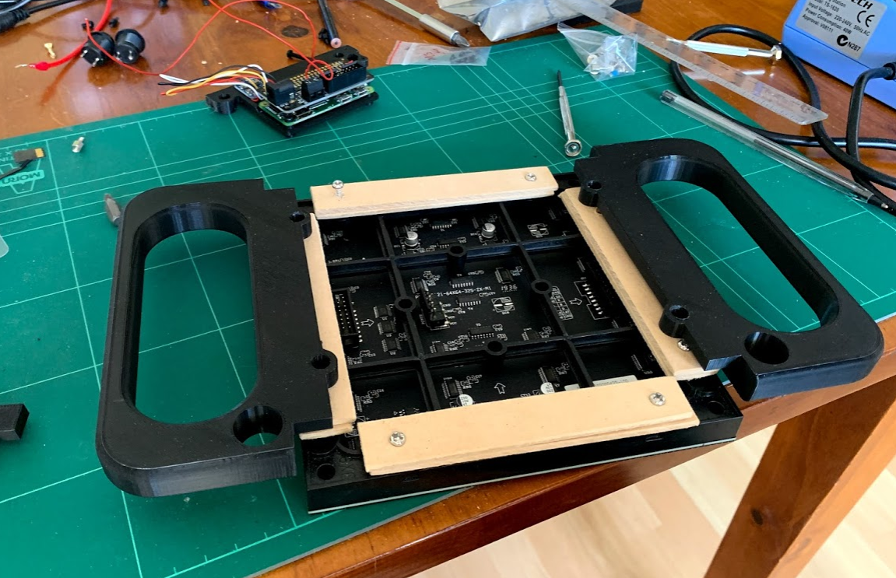

So now all that was left was to assemble everything together.. Or so I thought..

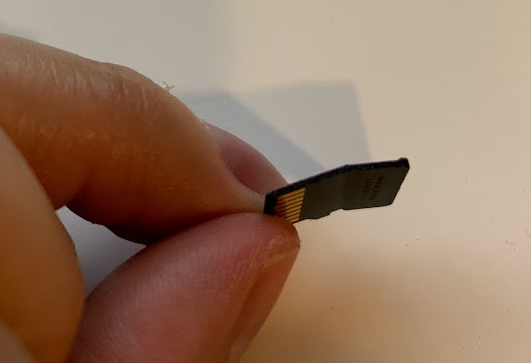

Somehow I had managed to snap the SD card while I was doing all this. Fortunately I had a spare one but it was rather annoying.

This time around however rather than getting the monitor, keyboard and mouse out again I found the IP address for the Pi using a very handy iOS app called [Fing](https://apps.apple.com/au/app/fing-network-scanner/id430921107). Once I had the IP address it was just a simple matter of SSH-ing in and running a few scripts provided by Adafruit once again.

After testing everything once more I was happy to get everything assembled.

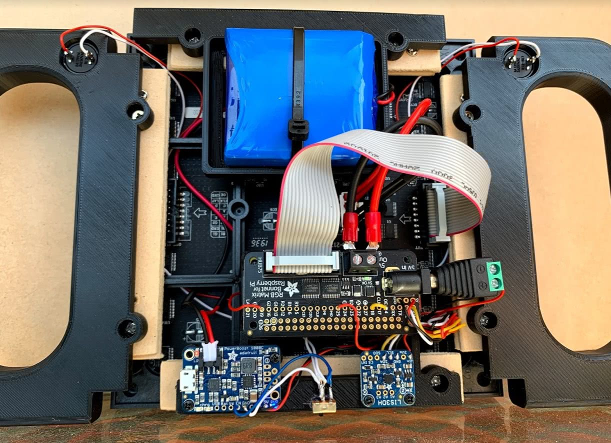

Huzzah! It all worked! (See the start of this post for a demo video)

# Conclusion

I am really happy with the final result despite a bodge or two. The only thing that is kind of annoying is that somewhere along the line a small strip of the LEDs decided to stop functioning :(

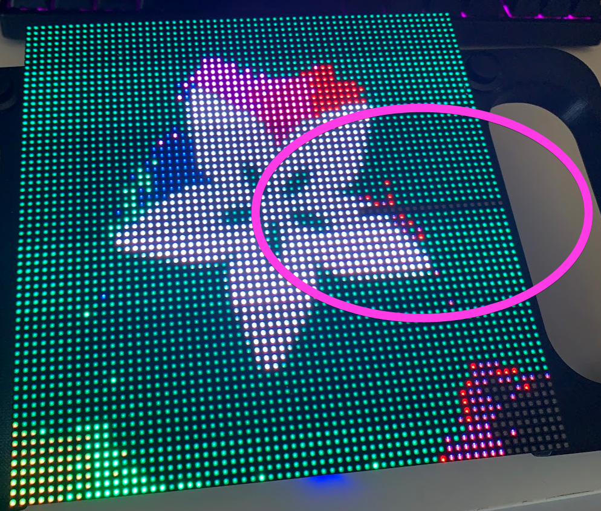

Oh well, its not a big deal, im just happy that I managed to finish it. I can replace the matrix later if I want to.

I think over the next few weeks I might have a go at writing a game or something for it, would be cool to take advantage of those buttons for something other than changing the demo.

I mentioned earlier in this post that I had a more ambitious project planned.. Well I think this project went well enough that I think im going to tackle it so stay tuned for that!
