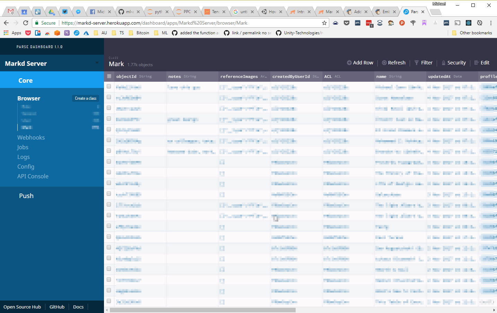
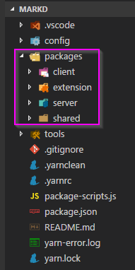

I last wrote about Markd [back in September of last year](/posts/portfolio/projects/introducing-markd-pinterest-for-people/) so I think its about time I gave you an update on our latest progress on the project.

<!-- more -->

# Refresh

Just a quick reminder about Markd; its a super cool project that I worked on for my long-term client and friend [Brandon Wu](https://www.pepwuper.com/).

At its core, its a chrome-extension that lets you "bookmark people". So for example, say you stumble across a cool games developer on Twitter and you want to make a note of him for a project you have planned in the future. You can simply click the Markd icon in Chrome to "mark" them. They are then added to your searchable collection for the future.

## TLDR;

Check out the video below for a quick demonstration:

`youtube: https://www.youtube.com/embed/0TH_JNTOPdg`

# The Problem

As [mentioned previously](/posts/portfolio/projects/introducing-markd-pinterest-for-people/) the tech stack in Markd 1 was a combination of Aurelia for the extension with Microsoft's ASP.net Core on the backend and hosted on Azure.

The problem was that I was never very happy with the way things were on the code level. There was no sharing between the extension and the client which led to many issues and bugs in conversion from one data format to another. I also had problems building Aurelia as every time I went back to it, everything had changed and I could no longer build. None of the docs matched what I had and it was generally a nightmare.

# The Update

I decided I need a do-over, this time I decided that I wanted the entire thing in the same language so I could share the code between the client, server and extension.

## Typescript

This time I wrote the entire thing using my favourite Javascript alternative: Typescript. I have been a fan of Typescript for many years now and have blogged about it many times so I wont wax on about it much here.

Just a quickly; one of the new Typescript features I took advantage of for Markd2 was "[non-nullable types](https://blog.mariusschulz.com/2016/09/27/typescript-2-0-non-nullable-types)". To be honest this feature is so great it should be in _every_ language, I strongly recommend reading up on it as it totally destroys an entire class of bugs.

## React

I have been using React for years now, and IMO its pretty much how the UI should be done. I wont talk about it here because well.. if you dont know about React yet then you are [doin' it wrong](http://thechive.com/category/humor/doin-it-wrong-funny/).

## MobX State Tree

For state management I started off by using my favourite, [MobX](https://mobx.js.org/) but discovered there was an update on their sister project [MobX State Tree](https://github.com/mobxjs/mobx-state-tree) (MST) that I had been following for a while so decided to give it a whirl and fell in love.

MST is a state management library similar to [Redux](http://redux.js.org) except unlike Redux the properties in your model are reactive. That is you can listen to them and create "computed" variables that react when that property changes.

So for example here is part of the model for a Mark:

```typescript
export const Mark = types
  .model({
    id: "",
    name: "",
    profileImage: types.maybe(MarkdFile),
    importedId: types.maybe(types.number),
    tags: types.optional(types.array(types.string), []),
    links: types.optional(types.array(types.string), []),
    referenceImages: types.optional(types.array(MarkdFile), []),
    description: "",
    notes: "",
    sourceUrl: "",
    createdByUserId: "",
    createdAt: types.maybe(types.Date),
    updatedAt: types.maybe(types.Date),
  })
  .named("Mark")
  .views((self) => ({
    get hasBeenSavedToServer() {
      return self.createdAt != null;
    },
  }))
  .actions((self) => ({
    setName(v: string) {
      self.name = v;
    },
    setProfileImage(v: IMarkdFileSnapshot | null) {
      self.profileImage = v as any;
    },
    setTags(v: string[]) {
      self.tags = v as any;
    },
    setLinks(v: string[]) {
      self.links = v as any;
    },
    setReferenceImages(v: IMarkdFileSnapshot[]) {
      self.referenceImages = v as any;
    },
    setDescription(v: string) {
      self.description = v;
    },
    setNotes(v: string) {
      self.notes = v;
    },
    setSourceUrl(v: string) {
      self.sourceUrl = v;
    },
    setCreatedByUserId(v: string) {
      self.createdByUserId = v;
    },

    load: process(function* load(id: string): any {
      const service = getEnv<IMarkEnv>(self).marksService;
      self.id = id;
      var snapshot = yield service.getMark(id);
      applySnapshot(self, snapshot);
    }),
  }));
```

As you can see we can define a number of properties in a strongly typed manner in the "model", then we can declare computed properties such as `hasBeenSavedToServer` in the "views" then we can define actions that can mutate the model in "actions". Those types are checked at compile time (thanks to Typescript) and runtime (during development) so you can catch even more of those pesky Javavascript typing issues.

Its a nice little system that combines the best of MobX and Redux.

I used MST to great effect in both the client and extension. I was able to reuse a lot of code between the two which made for less bugs.

## Parse Server

For the backend I decided to go with [Parse Server](https://github.com/parse-community/parse-server). Why go with a defunct project I hear you cry? Well since Facebook decided to shut down Parse back in Feb of this year Parse has actually continued to grow in its Open-Source form and is constantly being added to.

I know Parse very well having used it before on many projects. With Parse you get a lot of things right out of the box such as Authentication, Data Storage, REST Endpoints, Live Object Updates and many others. All stuff I would have had to build up myself (and likely gotten wrong).

One of the other benefits of using Parse is you get a pre-built dashboard on your database which I find incredibly helpful:

[](./dashboard-ss.png)

Sure, you could say that editing databases manually is a bad idea but during development it can be quite the godsend.

## Unit Testing with Jest

Im sorry to say that after all my various web based projects over the years this is the first one in which I have employed Unit Testing properly. Previously I have had bad experiences with Unit Testing in Javascript but im very glad to say things seem to have come a long way.

```typescript
test("when loading, snapshot is applied", async () => {
  const markServiceMock = mock(MarksService);
  const marksService = instance(markServiceMock);

  when(markServiceMock.getMark("mid")).thenReturn(
    Promise.resolve({
      id: "mid",
      name: "mike",
      referenceImages: [{ name: "xxx", url: "yyy" }],
    })
  );

  var mark = Mark.create({}, { marksService });

  await mark.load("mid");

  expect(mark.id).toBe("mid");
  expect(mark.name).toBe("mike");
  expect(mark.referenceImages.length).toBe(1);
  expect(mark.referenceImages[0].name).toBe("xxx");
  expect(mark.referenceImages[0].url).toBe("yyy");
});
```

Writing tests is _almost_ as nice as C#. The above example is one test for the Mark model I used above. We are able to mock the return of the service, await the return of an async operation and assert the result, pretty sweet!

# Build Tools

## Yarn Workspaces

Sadly one of the big time-sinks of any Javascript project these days is how you go about building the damn thing. Its so bad that it even has a name [javascript](https://hackernoon.com/how-it-feels-to-learn-javascript-in-2016-d3a717dd577f) / [tool fatigue](https://medium.com/@mrannedev/it-s-not-javascript-tool-fatigue-it-s-javascript-bullsh-t-fatigue-5f90f81423fb).

Unfortunately I suffered from this yet again, spending weeks just trying to get the various projects to compile and work together. One key problem is what happens when your main "solution" has multiple sub-projects in it. Visual Studio solved this years ago with .csproj and .sln files but Javascript still struggles with this.

One solution that has evolved over the yeas is [lerna](https://lernajs.io/). Lerna attempts to manage the dependencies between packages automatically. The idea is that you structure your projects inside the solution directory such as:

[](./lerna-structure.png)

Lerna then manages the dependencies between the packages by using symlinks (`npm link`). This makes me shudder every time. I cant believe this is 2017 and we are using symlinks for dependency management 😢

I had issues when using Lerna. Libraries were getting included twice in my build and other various issues. In the end I ended up using the very new [yarn workspaces](https://yarnpkg.com/blog/2017/08/02/introducing-workspaces/). Yarn workspaces attempts to formalize the concepts in Lerna by baking them into the dependency management tool itself.

Im not sure exactly how or why this worked for me, but it did so im not going to argue with it and spend any more time on it (can you tell im frustrated with this crap?).

## Node Package Scripts (NPS)

Ive got a fair bit to say about this so have moved it out into [its own blog post](/tooling/node-package-scripts/).

## React Scripts

For the "client" (the SPA website https://markd.co) I decided to go with the incredibly popular [create-react-app](https://github.com/facebookincubator/create-react-app) this took away much of the build for dev / build for productuon production headaches that I usually faced with JS build tools.

Because I use typescript I had to use a slight variant on the project, if you want to do the same I reccomend starting with this: https://github.com/Microsoft/TypeScript-React-Starter

# Infrastructure

For this rewrite I decided to go with static hosting using a combination of Route53, Cloudfront and S3 to host the static part of the website (client) then used Heroku backed by mLab for the server and API. That's a fair few moving pieces but in the end it gives us total flexibility with minimal cost.

Because the static part of site is on S3 and Cloudfront CDN its really quick.

# Conclusion

Im really happy with the result of Markd2 the site is considerably faster, thanks to being hosted on Cloudfront and Heroku. Its less bug-prone because there is lots of shared code, plus im using the latest and greatest Typescript features. Its more reliable because its got a bunch of unit tests to ensure changes dont break anything. Its more flexible because we control the entire stack.

It took me quite a bit longer than I had hoped to get to this stage but now its finally there, it should be a solid foundation moving forward.
