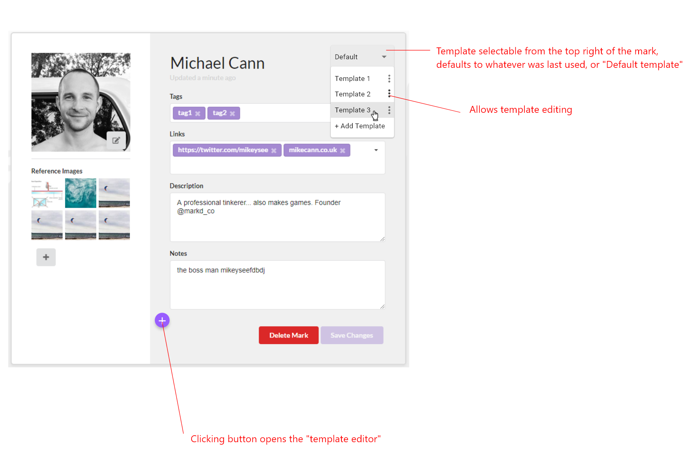
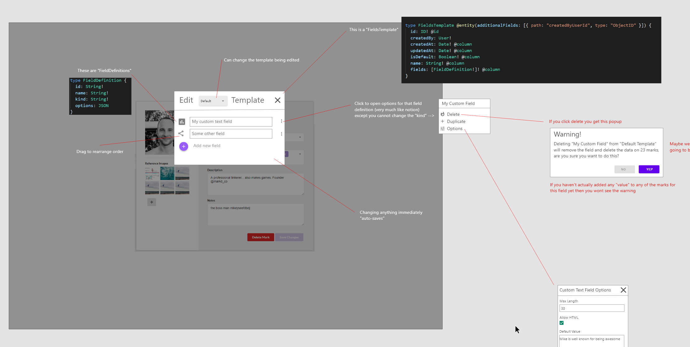
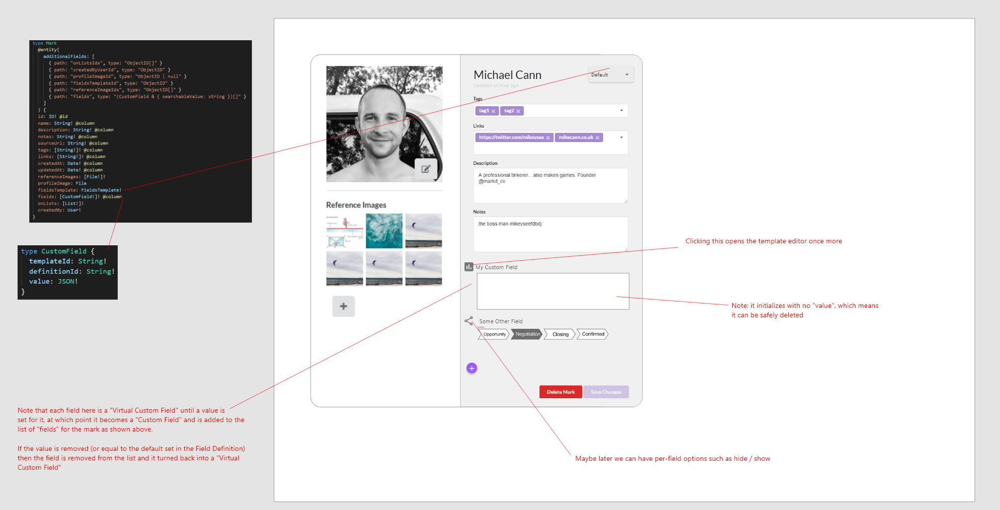
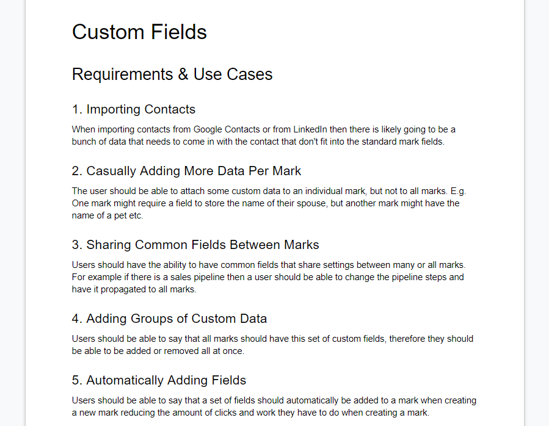

Now we have our [new designs](/markd/markd-v3) in place for [Markd](https://markd.co) things can start moving again on new features. This has been an oft-requested one, Custom Fields!

<!-- more -->

# TLDR;

<iframe width="853" height="480" src="https://www.youtube.com/embed/sCe_tsPEvnI" frameborder="0" allow="autoplay; encrypted-media" allowfullscreen></iframe>

# Reasoning

As Brandon [mentioned in our announcement](https://blog.markd.co/2019/05/29/adding-custom-fields-to-your-contacts.html) blog post on the topic, we have had quite a few requests from users to have the ability to add their own data to a given mark. This lets you have multiple contact email addresses or have a dedicated field to remember the name of their spouse or pet.

This customization is the first in many that we will start to roll out that will unlock some of the rigidity of the current design, allowing users to customize Markd to their own requirements.

We also needed this feature in before we started working on importing data from other platforms such as Google or LinkedIn as those contacts will be imported with a whole bunch of custom bits of information that the old design just didnt accommodate.

# More Complicated Than Expected

Although this feature seems quite simple on the outside it actually turned out to be more complex that we had anticipated when it came time to actually implement it.

Originally it was planned that we would have a "templates" like system that a user would be able to select

But we decided that this was probably too complex both for a user to understand and for us to implement as a first draft.

So we went back to the drawing board and wrote down the requirements and use-cases for what what we felt we needed from this feature.

We then came up with a solution that involved a multi-phase implementation. This is crucial because with only two of us in the company resources are extremely tight, so deciding what to work on and when is really tricky.

By breaking the feature up into phases we could get done what is needed for now to unlock the next major feature then come back to it later and add to it if it becomes popular.

# Conclusion

Im happy with this feature and although it took a few design passes and a little bit of wasted time I think the process we took and the result we ended up with was successful. Im looking forward to the next set of upcoming features in [Markd](https://markd.co) so stay tuned for those coming soon!
