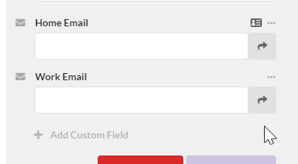

Its taken us a little while to get this right but we are proud to announce the latest feature for [Markd](https://markd.co): Import from Google Contacts.

<!-- more -->

# What?

[Markd](https://markd.co) is a SAAS product myself and my co-founder Brandon [have been working on](/personal/farewell-bamboo-hello-markd/) for most of this year. Simply put, its a tool for managing your professional network.

Since the beginning we have had a [chrome extension](https://chrome.google.com/webstore/detail/markd-bookmarks-for-peopl/beaalofkiocejchbpaocbbjhobmambpp) that lets you quickly create Marks from a given LinkedIn, Facebook, Twitter or a number of other sources. Although the process is quick, just two click in most cases, we have found that some users want to Mark a great many more people.

For this reason (and because of numerous requests from users) we decided to implement a feature that lets you import contacts from other sources too.

# First Attempt

Although a great many of our users Mark from LinkedIn we decided that we would implement importing from Google Contacts first. Mainly because it has a well defined API (unlike LinkedIn) and already have some features involving Google.

Importing seems quite simple on the surface but due to the differences between a "Google Person" and a "Mark" there were some complications, but before I get to the details of that, the general algorithm for importing looks like:

1. Call the appropriate API endpoint to pull in as many contacts as desired (in our case we limited it to 2000 for now)
2. Split the contacts up into "new" contacts and "existing" ones. Because you can import multiple times there may be contacts that you have already imported.
3. For all the new contacts go through each and convert them to Marks.
4. For all the existing marks go through each and update it if it needs updating or skip it if it doesnt.
5. Gather the results of the following steps and "apply" the changes.

Although the above is fairly simple there is a subtle issue. If you remember back from [my previous post](/posts/markd-custom-fields/) on our custom fields feature we decided to implement a system where all fields on all Marks must have a "definition" first. This definition describes its "kind", its "name" and a few other properties. The idea here was that marks could share common fields which would be really useful.

The problem with this system is that it complicated the above algorithm, it forced us to load those definitions from the database then compare them in a way to determine if we needed a new definition when importing the fields from a [Google Person](https://developers.google.com/people/api/rest/v1/people#Person). Not only that if you take a look at the API for a Google Person you will notice that many of the fields have a "type", such as [EmailAddress](https://developers.google.com/people/api/rest/v1/people#Person.EmailAddress).

```
{
  "metadata": {
    object (FieldMetadata)
  },
  "value": string,
  "type": string,
  "formattedType": string,
  "displayName": string
}
```

This "type" makes sense because you might want to add multiple email addresses to your Google Person then set one as "Home" and one as "Work" etc. The issue is that the kinds of fields that Markd supports doesn't accommodate a "type" this is because the "type" was expected to be encoded into the "name" of the field definition. So for example you might attach an "email" field to a Mark and then name it a "Work Email" and then attach another "Home Email":



All Markd fields must have a definition that is shared between Marks whereas a Google Person field can have a differently named "type" for every field. There is a fundamental difference here between how Google structures its fields and Markd does.

The problem stems from the fact that we were planning ahead with the ability to "share" fields between Marks. Unfortunately this structure appears to be too rigid as it makes it tricky to "rename" fields. Because the name is part of the definition which is shared between all fields, if you rename the field on one mark then it forces the name to change on all Marks. This might be great for some fields but its not great for others.

After much discussion we decided to add "label" properties to some of our field kinds. So for example now an "email" kind would have the following value:

```
{
  "email": "mike.cann@gmail.com",
  "label: "Home"
}
```

Values are unique to each "field" which is attached to a Mark, they just share the same "definition".

This solved the "renaming problem" as each field could change its "label" value without affecting all the other fields. Unfortunately it also made the name of the field kind of pointless; you would add an "email" field definition to your Mark, name it "home email" then you would set the "email" and have to set the "label" to "home" too. You data was now duplicated and confusing... not ideal for Markd which prides itself on being simple and fun.

# Second Attempt

So we had a fundamental issue with field structures between Markd and Google. After having spent the best part of a week designing and implementing imports around our current structure of fields we were reluctant to go back to the drawing board. In the end however we decided that it was important enough to our core principles that we spend the time now to get it right.

The main issue was around our field structure. We wanted the ability to share definitions between fields for future features but in actual fact right now we weren't using it for anything, it was kind of getting in the way and adding "accidental complexity" to the system. We didn't need it. So we reluctantly decided to remove it.

Instead of all fields having a shared definition we decided to change fields so the definition is embedded right alongside the field. This meant that every field on every mark had its own embedded definition. This ensured that each field could be renamed without it affecting all the other Marks.

We could loose those "label" properties we added and simply have the name of the embedded definition become the "label". So for example when we import an EmailAddress field from a Google Person the "type", "Home", would create a new field that has an embedded definition with a name of "Home Email Address".

It took us a few days to re-architect the whole system to use this concept of embedded definitions instead of linked ones then migrate all the old fields over to the new type. Another day or two was spent changing the import code to use the new fields system.

# Conclusion

It took a bit longer than I would have liked to complete the feature but in the end I am really happy with what we ended up with. Everything is considerably simpler and easier to reason about than before. IMO this is super critical when trying to build systems that you want to iterate on.

# Future Plans

One thing that the old system of fields gave us was a quick way to add fields that you have added before to a Mark, so say you have created an "Home Email" definition, you could with one-click re-add that to another Mark without having to type out "Home Email" again.

We realized that this could be implement in the new system in very much the same way we do with tags, we simply query the database to see which fields are commonly used on your marks and present those as "Common Fields" to add. For now we have left this addition as a "phase 2" for future development while we move onto other things.

We also plan on layering on "linked" definitions once more at a later date once we have a use-case that we want to support.

Now we have a good flexible system of fields you can expect other import sources such as LinkedIn to come soon, stay tuned!
