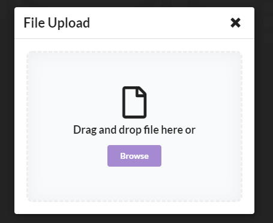

Just a quick update today about a new feature for [Markd](https://markd.co): Import from LinkedIn

<!-- more -->

# What?

I mentioned in my [last post](/markd/markd-import-from-google-contacts) that we were working on imports other than just Google Contacts and today im proud to announce that we have added LinkedIn imports to Markd.

# How?

Because LinkedIn doesnt have an API that we can use to import the connections we have to rely on the user providing a zip file from LI's export feature.

Once uploaded the server extracts the connections export tehn converts them into Marks.

For now we dont have any de-duplication feature so you might have to manually merge marks that are duplicates.

# Next

We are just debating what to work on next, if you have a suggestion for a feature you would like to see implemented please do [leave some feedback](https://markd.public.makerkit.co/).
