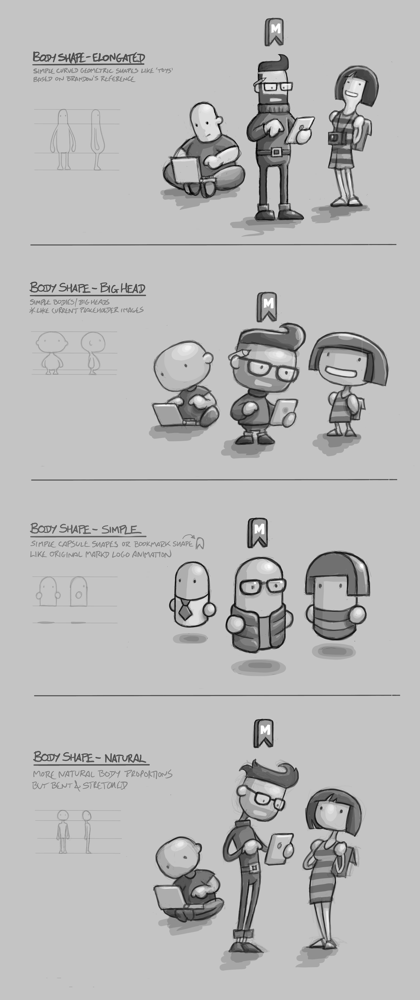
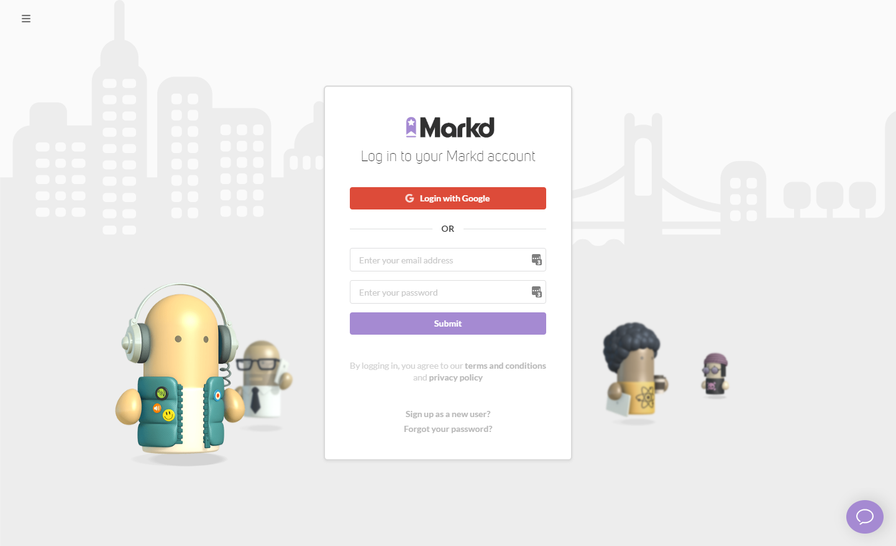
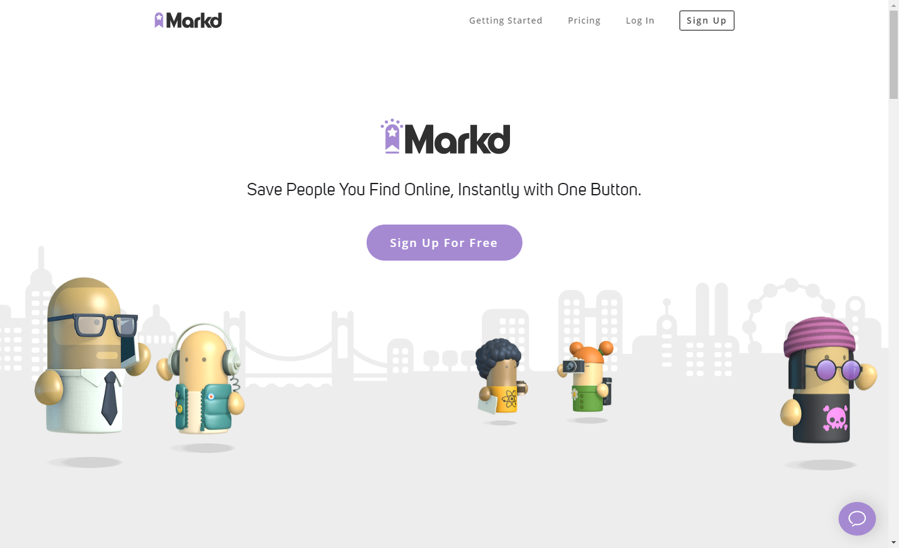
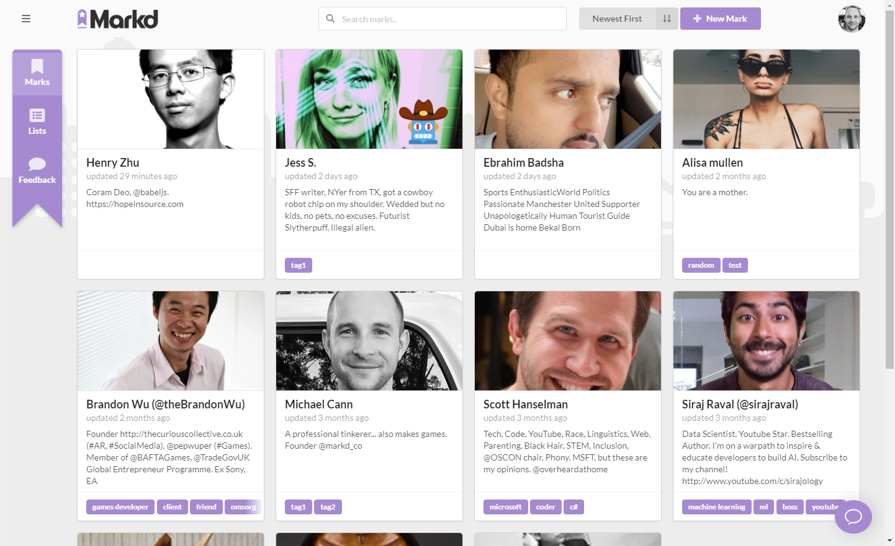
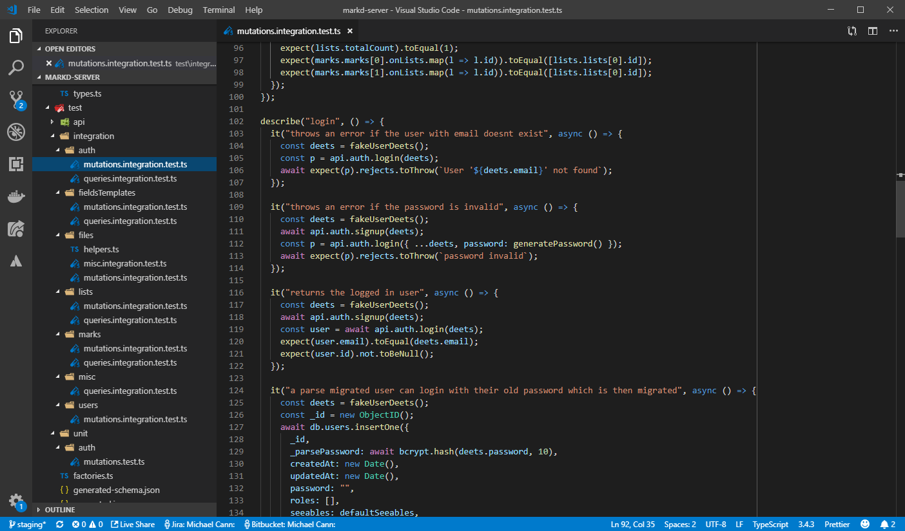

Wow its taken a little longer than we would have liked but finally we have finally released the completely redesigned and rewritten [Markd](https://markd.co) website, extension and server!

<!-- more -->

# Design

So we teamed up with an old colleague of mine [Alan Macfarlane](https://www.melbournemonsters.com/) to help us with the designs and branding. We wanted to go for something that would make our brand stand out, not feel too formal and perhaps have a little "gamey" feel to it as both Brandon and I are long time game developers.

Alan went away and came up with a bunch of awesome ideas for characters which we then used as the basis for many of the pages.

In the end we went with a very simple and stylized version that we thought suits the brand we want, is easily extensible and hopefully easy to animate in the future should we wish to.

Alan also was responsible for our new logo which I think looks awesome when shown off in its animated form:

For this version of Markd we decided to split the website up into two parts;

"Static" pages live on https://markd.co and are designed in Webflow for fast tweaking and A / B testing by Brandon.

"App" pages live on https://app.markd.co and is Typescript / React / Single Page Application (SPA) and is where I have spent most of my time.

So thanks to Alans awesome designs and after a lot of hard work I think we have ended up with a really good looking and easy to use site for collecting and organizing marks.

Heres a short video showing some of the main features:

<iframe width="853" height="480" src="https://www.youtube.com/embed/k7Ks42OSyTI" frameborder="0" allow="autoplay; encrypted-media" allowfullscreen></iframe>

# Tech

Behind the scenes a lot of work has gone into ensuring the tech is in a good stable position for us to build future features on.

I decided that our [Parse-Server](https://github.com/parse-community/parse-server) based server that we have been using up till now just wasnt going to cut it for some of the future features we had planned.

So right at the start of the project we took (not lightly) the decision to completely rip out our backend and start again, then migrate the old database over.

Due to the highly document-orientated nature of our data we decided to stick with the no-sql database MongoDb and then interface with it via node. For the Client to Server querying and mutating we decided to depart from my usual choice of REST based API and instead decided to go with GraphQL.

GraphQL should in theory be much better for us in the long term, allowing us to develop APIs that can grow with us and be compatible without a huge parameter or endpoint explosion you might end up with REST. For now I am yet to be convinced, there is definitely some benefits but also quite a bit of extra overhead to deal with when using GraphQL, im just hoping that over time as things mature some of those issues will go away.

# Testing

As we are just a small 2-man team I knew testing such a large set of changes was going to be a challenge particularly when we had added a whole bunch of new features in the process.

Our strategy with testing is to test in depth. So firstly we have the automated unit and integration testing for the server-side code.

These tests hammer the actual API from the outside which then hits a local database. This gives us a high level of confidence that when the client uses the same API to call the server will get the expected results.

On the client side I actually have very few "unit" tests and instead opt for a few high-level End-To-End (E2E) tests which use [Google Puppeteer](https://github.com/GoogleChrome/puppeteer) to spin up an actual browser which then clicks on actual elements on the screen and observes the results match the expected results.

<iframe width="853" height="480" src="https://www.youtube.com/embed/iyl7XSTZE-I" frameborder="0" allow="autoplay; encrypted-media" allowfullscreen></iframe>

I run these E2E tests twice, once for desktop sized resolutions and once for mobile sized resolutions.

All these automated tests are run on every single code push by the CI server which gives us a good level of confidence that the core functionality is working after every change.

Following that however we do a smoke-testing pass on our "staging" environment before we merge any new changes into the "master" environment.

For very large updates such as this complete redesign we knew we needed a little more testing so we contracted a freelance QA tester Seb to help us get the confidence up that everything works on a number of platforms.

# Conclusion

Time will tell if this was worth all the effort. Personally I think we have done a great job and im proud of the results. Im feeling much better about the foundations we have now to go ahead and build the next round of exciting features, so stay tuned more more!
