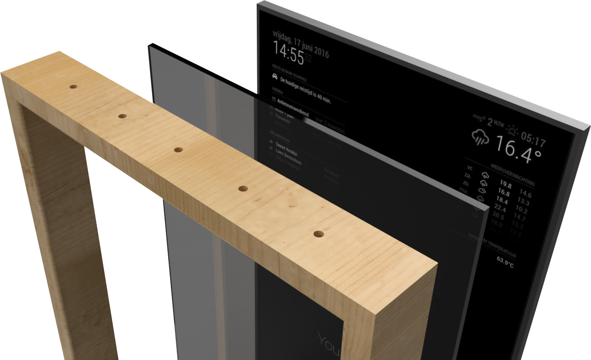
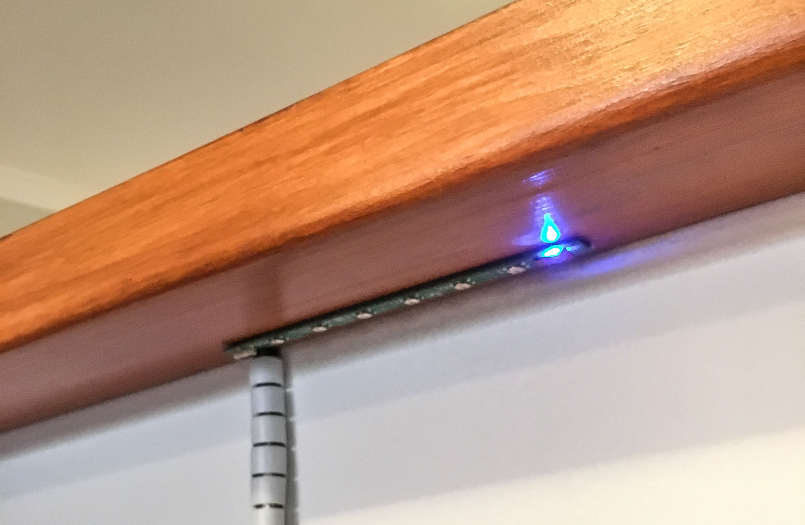
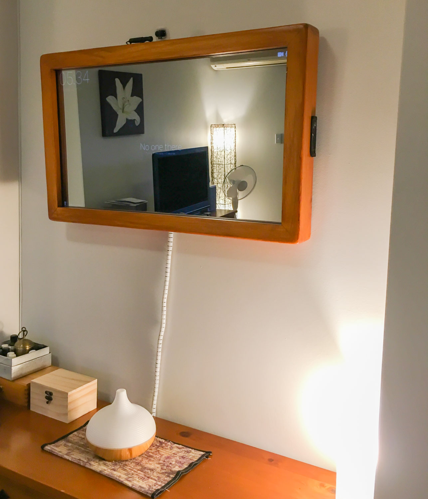
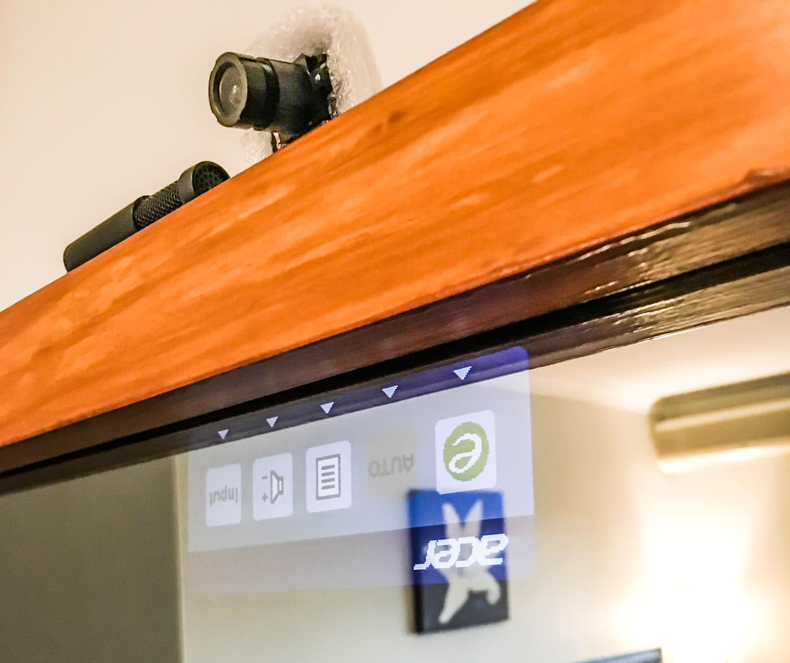
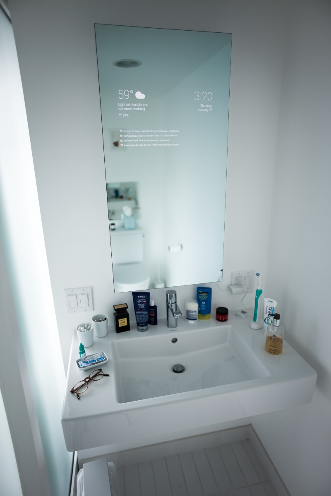

I have been wanting to do this for a while and as I recently found myself with a little spare time I decided to finally do it... build a Smart Mirror.

<!-- more -->

# TL;DR

Checkout the [video](#video).

# What Is a Smart Mirror?

Put simply it is just a computer display behind a two-way mirror so you can both see your reflection and the monitor behind.

_(img src https://magicmirror.builders/)_

The key concept is that much like a pair of sunglasses or a police interrogation room, you can only see whats behind the mirrored surface if there is light shining through. This means that when the screen is dark you will get a reflection but when the monitor is displaying something you will see that through the mirror instead.

Connected to the display is a small lower-power computer such as a Raspberry Pi, this lets you show whatever you want on the mirror.

# Why?

Good Question. The short answer is: why not? The long answer is: I think its just a cool fun project plus there are a number of things this could be useful for. Its basically your own personal dashboard so on mine I have it showing the weather, time, and hopefully in the future my Fitbit stats from my watch.

_(img src http://daniel-erhart.com/smartmirror.html)_

When you pair the mirror with some Facial Recognition or Audio Commands then it could become the smart-hub for your home except unlike pure audio devices such as Alexa or Google Home you can have a visual representation too.

# Building

The building of the mirror was quite an involved process so im going to dedicate posts to both the [software](/projects/mikes-mirror-software/) and [hardware](/projects/mikes-mirror-hardware/) side of things.

# Cost

So how much did the whole thing cost to build?

- Monitor - Office Works - \$257
- UpCore - \$181
- Two Way Glass - \$150
- Random Cables - \$25
- Woodworking Tools - \$112
- Wood - \$25

**Total: 750 AUD**

Which is quite a bit more that is strictly necessary and would probably be quite a bit cheaper if I was to do it again.

For example, the I ended up buying the display brand new from Office Works instead of picking one up cheaper on Gumtree. I had very specific requirements for the screen (read more in the [hardware](/projects/mikes-mirror-hardware/) post) and although I could have found a cheaper one second hand there would have been compromises.

The Up Core x86 processor was definitely more expensive than some alternatives. I did buy a cheaper processor ARM processor too but I was concerned about compatibility and performance so I decided to grab the more expensive UpCore x86 CPU as a backup. Im glad I did as its a great little machine and really powerful.

As I had no woodworking tools either, I had to spend about \$100 to buy some. This cost would obviously not be needed next time, tho next time I think I would probably go for one that didn't need a frame, read more in the [hardware](/projects/mikes-mirror-hardware/) post.

# Time

To be honest im not sure exactly sure how long it took. I really depends on how to measure the time, some things were done in parallel, but here is a rough breakdown:

- The thinking planning and research was over a week or two
- Time taken waiting for the CPUs to arrive was a couple of weeks to here in Australia
- Getting the glass cut (three times) was a few weeks
- Building the frame and assembling was done over about 3 days
- Writing the software has been off and on again for a few months (probably could be analysed from the [GitHub repo](https://github.com/mikecann/mikes-mirror))

So probably off and on again I have been working on for the last 3 months or so.

#  Video Demo

<iframe width="853" height="480" src="https://www.youtube.com/embed/FHjZnk6JYVQ" frameborder="0" allow="autoplay; encrypted-media" allowfullscreen></iframe>

# What went well

- Im impressed with the performance of the Up Core. For the price and size this little thing performs really well and is x86 so runs just about anything you want.
- Im alo impressed with the monitor, it was really light and when I took it all apart the display controls still worked and fit nicely underneath.

- Building everything on React and Electron was a good choice. It was quick to iterate and there are tons of prebuilt libraries out there thanks to NPM.

# When went not so well

- I had to order the two way glass three times (more on this in the [hardware](/projects/mikes-mirror-hardware/) post)
- Light from the window behind the mirror causes issues with the face detection sometimes. As a attempt at a solution I bought a desk lamp to try to illuminate your face a little more:

- I put the screen in upside down so that on-screen display settings for the monitor are upside down, whoops!

- Im really not a woodworker and so didnt do as good as job as I would have liked there (more on this in the hardware post).
- Racked up an expensive Google Bill because I was recording voice for 500 minutes when I wasn't aware it was running, whoops!

# Conclusions

It was a fun and challenging project. I would definitely recommend it if you are looking for a hardware / software project to work on. There's lots of room to customize it to your needs, just take a look at the [Magic Mirror forum](https://forum.magicmirror.builders/category/12/show-your-mirror) for other peoples projects to see how varied mirror designs can be.

If I was to do it again I think I might so for something that didn't require a bunch of woodwork like this frameless design from Max Braun:

There's plenty more things I want to add and improve to the mirror. I suspect this will be a project ill keep adding to over time and maybe some time in the future I will do a follow-up post, so subscribe to keep up to date :)

# More Reading

This is a 3 part series, find the other parts here:

1. Mikes Mirror - Overview
2. [Mikes Mirror - Hardware](/projects/mikes-mirror-hardware/)
3. [Mikes Mirror - Software](/projects/mikes-mirror-software/)
