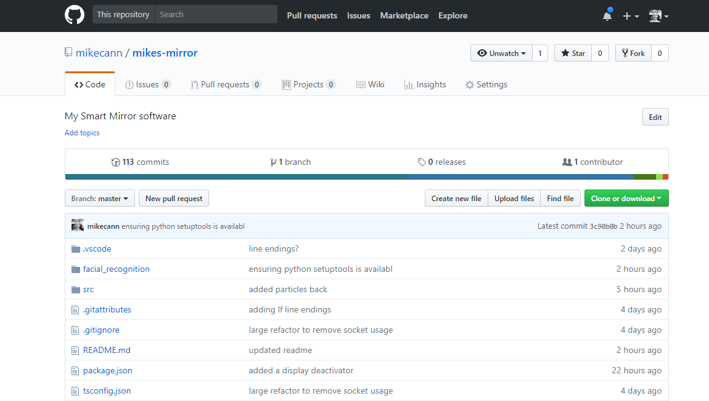
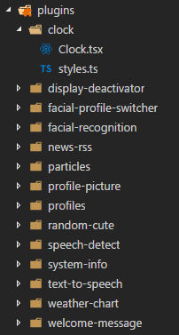
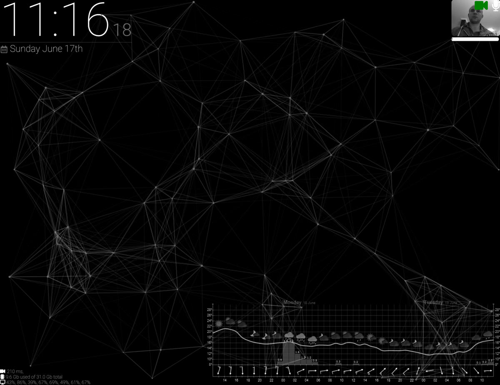
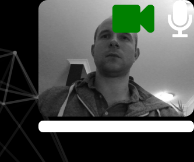
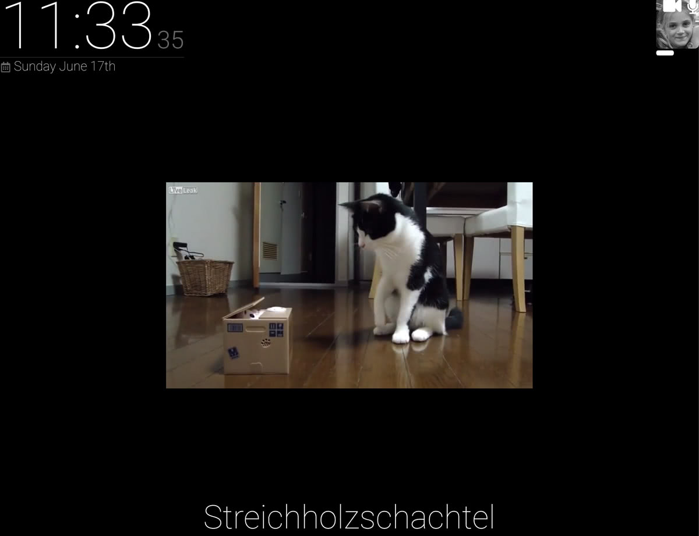

Building the frame and assembling [the hardware](/projects/mikes-mirror-hardware/) for my Smart Mirror was a tough but fun journey. But now its time for what im good at, the software.

<!-- more -->

# Parts

This is a 3 part series, find the other parts here:

1. [Mikes Mirror - Overview](/projects/mikes-mirror-overview/)
2. [Mikes Mirror - Hardware](/projects/mikes-mirror-hardware/)
3. Mikes Mirror - Software

# Research

I started off by doing a bunch of reading and research on what software to use on my mirror.

I discovered a popular project called [MagicMirror<sup>2</sup>](https://magicmirror.builders/) which is an electron based smart mirror project. Magic Mirror comes with a huge number of [Third Party Modules](https://github.com/MichMich/MagicMirror/wiki/3rd-Party-Modules) that you can use to add all sorts of functionality to your mirror in a modular way.

I initially experimented with MagicMirror<sup>2</sup> but quickly found myself getting frustrated at the way the code was structured. I felt that developing my own modules as going to be a pain so I decided I could probably save some time in the long run by rolling my own solution.

# Mikes Mirror



My from-scratch solution uses React, Typescript and Electron for the front end with Python and Dlib for the Facial Recognition part and Sonus (snowboy, Google Cloud) for the speech recognition part and a number of other libraries.

# Profiles

One of the key requirements for me (that MagicMirror was missing) was that the mirror should support multiple different people using the mirror. I wanted this ability so that when someone stands in front of it they get a mirror that is tailored to them.

I call this user-specific content a "Profile" and is simply another react component that contains a collection of "Plugins" that are laid out however you want. So for example here is my Profile:

```typescript
import * as React from "react"
import Particles from "../plugins/particles/Particles"
import Clock from "../plugins/clock/Clock"
import WeatherChart from "../plugins/weather-chart/WeatherChart"
import ProfilePicture from "../plugins/profile-picture/ProfilePicture"
import SystemInfo from "../plugins/system-info/SystemInfo"
import css from "./styles"

export default class MikesProfile extends React.Component<any, any> {
  componentDidMount() {
    // Play a sound when showing the profile
    new Howl({ src: ["./bell.wav"] }).play()
  }

  render() {
    return (
      <div className={css.profile}>
        <Particles />

        <div className={css.rootContainer}>
          <div className={css.hozContainer}>
            <Clock />
            <div className={css.flex} />
            <ProfilePicture url="../facial_recognition/faces/mike.jpg" />
          </div>

          <div className={css.flex} />

          <div className={css.hozContainer}>
            <WeatherChart />
            <div className={css.flex} />
            <div className={css.vertContainer}>
              <div className={css.flex} />
              <SystemInfo />
            </div>
          </div>
        </div>
      </div>
    )
  }
}
```

# Plugins

Most of the logic is contained within composable "Plugins".



For now I have only written a few plugins. I have included them in the main repo but they could quite easily be extracted out into separate repos much like MagicMirror<sup>2</sup> does it.

Unlike MagicMirror<sup>2</sup> my widgets are much much simpler to develop as they are just React components. IMO this is a perfect use-case for the component based, only-update-when-needed nature of React.

[Checkout some of the widgets in the repo](https://github.com/mikecann/mikes-mirror/tree/master/src/widgets) for examples of how simple and intuitive they are to develop.

[](./general-ss.jpg)

A couple of examples of plugins are:

- clock - displays a clock and date
- display-deactivator - when the widget is mounted it waits for a set amount of time before turning off the display, when it is unmounted it turns the display back on again. This is great for saving power when no one is stood infront of the mirror.
- face-profile-switcher - will change profile when it detects that person infront of it
- system-info - reports some system stats like CPU and MEM load
- weather-chart - shows a chart of the Perth weather

# MobX

I use MobX to manage the state on some of the more complex and core functionality such as the facial profile switching and the voice commands. Having a centralized state also means it can more easily be shared between components and reduce coupling.

# Facial Recognition

I had spent quite a bit of time trying to get Facial Recognition working how I wanted. In the end I ended up using the awesome [facial_recognition](https://github.com/ageitgey/face_recognition) library on github.

The facial_recognition library in turn relies upon Dlib which means that its a bit of a pain to install (LOTS of dependencies) but I did eventually get it working with reasonable performance on my target hardware.

For now im using a modified version of [facerec_from_webcam_faster.py](https://github.com/ageitgey/face_recognition/blob/master/examples/facerec_from_webcam_faster.py) example that comes with the library. I modified it to read from a directory of faces rather than hardcoding them. I also modified it to report results as JSON to stdout which then is read by the main process in the Electron app.

[](./webcam-active.png)

Currently the facial recognition only trains on a single example of peoples faces. This means that its not as accurate as it could be particularly under different lighting conditions.

The library does contain another example [face_recognition_knn.py](https://github.com/ageitgey/face_recognition/blob/master/examples/face_recognition_knn.py) which is a little more complex but supports training a face with multiple examples using the k-nearest-neighbors algorithm. I hope to integrate that with the webcam sometime in the future.

# Speech Recognition

Speech recognition was actually harder that I had imagined it would be. I bounced around quite a few different libraries trying to get them to work on my hardware.

In the end I settled on a javascript project called [Sonus](https://github.com/evancohen/sonus). Its a pretty simple project that combines the hotword detecting power of [Snowboy](https://github.com/Kitt-AI/snowboy) with the more complex sentence comprehension power of [Google's Speech-to-Text API](https://cloud.google.com/speech-to-text/).

Like the Facial Recognition, Sonus runs in a separate process that is spawned by the Electron app and then communicates via a JSON protocol over sdtout.

Snowboy continually listens in a background for a given hotword (mine is "smart mirror"). If it detects the hotword then Sonus starts streaming the recording to the Google Speech-toText API which analyses it and returns partial a partial match as you speak and then the final match once you have finished speaking.

[](./voice-commands.png)

This combined local-only Snowboy plus cloud based recognition power of Google means that I am able to keep costs and processing requirements down for the mirror.

There are definitely some issues with Snowboy however which I hope to solve in the future.

1. It only works on Linux. This means that should I ever want the mirror to be powered by windows in the future then I cant. It also means I have to develop on my ubuntu laptop rather than my desktop. This isnt a total show stopper however as I really like linux and am hoping to move my desktop machine over to the OS soon.

2. Snowboy comes with a bunch of different pre-trained hotwords and you can even supposedly train your own using [their API](https://snowboy.kitt.ai/). My experience trying to train my own model using my own samples however didnt work. Even the popular pre-trained models dont seem to work particularly well with female voices. Kelsie for example doesnt seem to reliably trigger the hotword for example.

# Voice Commands

Just being able to turn speech into text is pretty useless unless you can then do something with it. So I built a system thats capable of recognising the text and matching it to a command to be triggered.

At first I was using a simple regex matching strategy but quickly found that was limited. A simple example is the regex `lock profile` would be triggered by a user saying "lock profile" and "unlock profile". Now obviously there are ways of working around this but there were a number of other more complex edge-cases too, so I decided to go looking for a better solution.

Natural language detection is a well studied area and there were a bunch of different options on NPM. After playing with a few I settled on [natural-language-commander](https://github.com/will-wow/natural-language-commander). It doesnt have many starts but definitely deserves more (I do love libraries written in Typescript).

So now I can structure my commands like this for example:

```typescript
nlc.registerIntent({
  intent: "lock profile",
  utterances: ["lock profile", "lock my profile"],
  callback: () => profiles.lockProfile(),
})

nlc.registerIntent({
  intent: "lock profile to..",
  slots: [{ name: "Profile", type: "STRING" }],
  utterances: ["lock profile to {Profile}", "fix profile {Profile}"],
  callback: (profile: string) => {
    profiles.unlockProfile()
    profiles.changeProfile(profile)
    profiles.lockProfile()
  },
})

nlc.registerIntent({
  intent: "unlock profile",
  utterances: ["unlock profile", "unlock my profile"],
  callback: () => profiles.unlockProfile(),
})
```

Much better! For a full list of commands in the mirror you can see this file: [commands.ts](https://github.com/mikecann/mikes-mirror/blob/master/src/commands.ts)

I will definitely be adding more as I go.

# Text to Speech

One key feature of any "smart assistant" type project is the ability for the assistant to speak back to you.

For now I opted for a simple solution provided by the [GNUstep speech engine](http://manpages.ubuntu.com/manpages/trusty/man1/say.1.html). Once installed on the OS all I need to do from the app is spawn a command-line instance with the args `say "hello world"`.

The voice quality is pretty basic is you are used to more advanced assistants from the likes of Google or Apple but will do for now.

I did consider just plugging into Google's Text-to-Speech API but decided that I didnt really want the roundtrip time associated with sending the text to the cloud then downloading the resulting WAV file and playing it even though the quality of the returned speech would be far superior to GNUstep.

Perhaps in the future ill research a custom DNN-based text-to-speech solution.

# Future Plugins

Theres so much more I want to add to the mirror but I felt that in its current state its "good enough" for demonstration at least. I suspect that this will be a project that I will keep coming back to and tweaking as I go over a number of months and years.

Some random things I would love to add:

- Live Fitbit stats from my watch
- Voice controls for our Chromecast for our TV
- Speech for when people join and leave the wifi network
- Breaking news reports when something major happens in the world
- .. anything else I can dream up!

[](./cute-cat-ss.jpg)

# Conclusion

Well I hoped you enjoyed reading about my Smart Mirror project. It took me quite a bit longer than I had hoped to get it to a presentable state. There are just so many options and things to play with. Every time I thought it was "good enough" I would go off on another tangent learning something else which would take me weeks.

Despite the time and cost overrun however I found it a fun and worthwhile project and if this is your sort of thing I definitely recommend giving it a go. I just hope this series of posts helps so you can learn from my mistakes. Please do let me know via email or in the comments below if you give it a go.

Thanks again for sticking with me through these lengthy posts. Let me know in the comments if you enjoyed this, perhaps ill do an update to the project sometime in the future.

# More Reading

This is a 3 part series, find the other parts here:

1. [Mikes Mirror - Overview](/projects/mikes-mirror-overview/)
2. [Mikes Mirror - Hardware](/projects/mikes-mirror-hardware/)
3. [Mikes Mirror - Software](/projects/mikes-mirror-software/)
