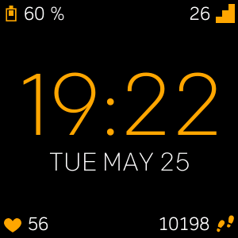
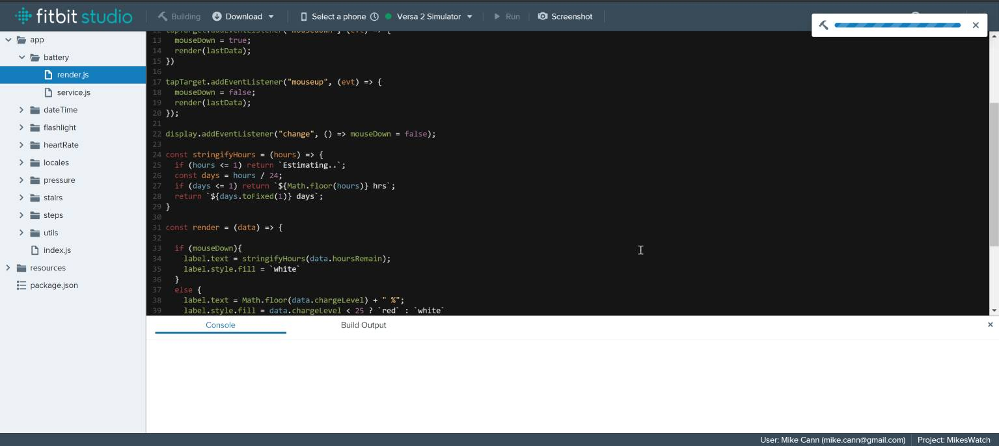
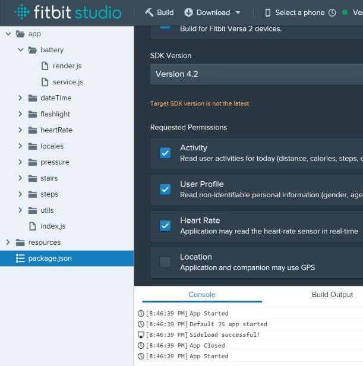
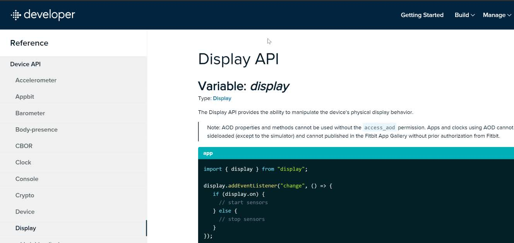
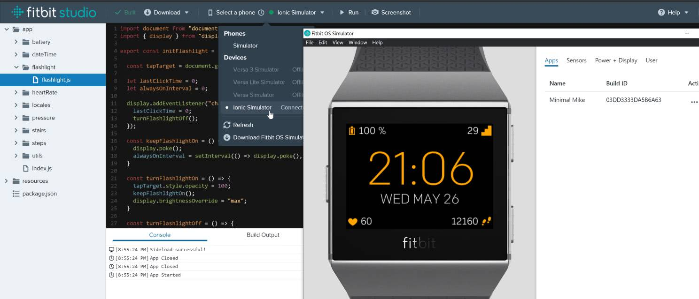
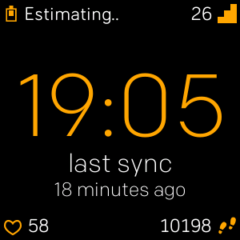
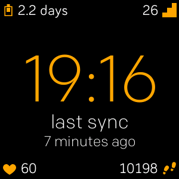
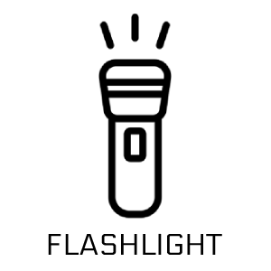

When I was sent a replacement for my broken [Versa 1](https://www.fitbit.com/global/us/products/smartwatches) by Fitbit they decided to upgrade me to a Versa 2. This was great except it meant that the watch face I was using before no longer worked and I was unable to find a good replacement so I thought it was time to get my hands dirty and code one up myself.

<!-- more -->

# TLDR;

Check out the clock face: https://gallery.fitbit.com/details/e865d518-7a36-41b2-b3e7-e12789c138a8

# How?

Micro controller development such as the [Arduino or ESP32](https://www.arduino.cc/en/software) tends to involve hacking away in low-level languages such as C. Fortunately Fitbit make things super easy with their Fitbit Studio their online IDE and the language choice (Javascript).

It was super simple to setup a new project. Define your project and permission requirements in the "package.json" and start coding against their excellent SDK.

As a (mostly) web developer these days I found it easy-peasy to get started with [their SDK](https://dev.fitbit.com/build/reference/device-api/power/) just import a few things then start reading data from the sensors.

One aspect unique to watch development is the care you have to take around battery. Limiting computation and sensor reads is important to prolong time between charges. Thankfully the SDK has you covered here and provides some handy API's for detecting screen on and off events.

When it comes time to test your clock face you can either run it on device or via a very handy simulator that Fitbit provide. Connecting from Fitbit Studio is all rather straight forward tho I did have a couple of times where the IDE refused to connect to the watch for some reason.

# What?

So what does my Clock Face do? .. Well it can tell the time ... among other things ..

It also shows the most important sensor readings in each corner; battery, heart rate, steps and stairs climbed.

I decided to get a little fancy with the icons for a couple of them. The battery icon has a bar that changes size depending on the battery level and the heart icon flashes from full to empty at the rate of your BPM.

After getting these basics in there I started to get a little carried away and decided to add some extra info.

A press of the screen and the user is taken into an auxiliary data mode. The date is replaced by the time the watch was last synced (I have found this useful to know so you don't loose data). This auxiliary data mode also reveals the "battery life estimation" instead of the current battery level.

The battery estimate feature is a little experimental but it seems to work well enough. When the battery level drops by 3% or more it calculates the time taken to decrease by that amount and interpolates the remaining time for the current battery level.

Last but not least I decided to add one final mode you can access by tapping the screen twice

Flashlight mode makes the screen go completely white and is actually super useful for when you get up in the middle of the night and its pitch black and cant see but don't want to turn the light on.

# Conclusion

All in all im happy with how things went. Fitbit put a lot of effort into making the development experience a breeze which made the process fun.

The watch itself works well and does everything the last one did and more.

Its even received a few positive ratings already :)

If you are interested in getting the watch yourself its freely available on the Fitbit Gallery here: https://gallery.fitbit.com/details/e865d518-7a36-41b2-b3e7-e12789c138a8

I also uploaded the source code to Github incase you want to take a closer look at how things work under the hood: https://github.com/mikecann/minimal-mike
