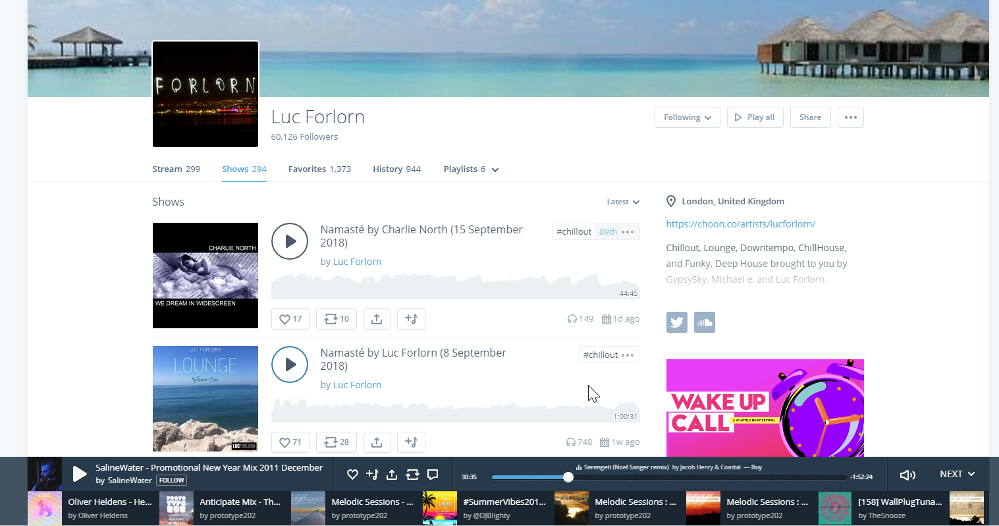

I love the mix-streaming service Mixcloud but its unfriendly user-interface was really starting to bug me so I whipped up this little tool to help.

<!-- more -->

# The Problem

Mixcloud is a great service to find dj mixes from a wide variety of people. I have listened to hundreds of hours worth of mixes on the service and discovered some of my favorite artists through it.

It seems however that Mixcloud doesnt put too much effort into their playlist and playback experience however. When you just want to listen to all the mixes from a particular artist, Mixcloud seems to take it upon itself to do something totally different such as playing mixes from totally different artists.

The "next" playlist down the bottom is totally abysmal. Theres very few options particularly for common things you would want to do such a clearing all upcoming mixes or finding mixes similar to the one playing, sorting or even shuffle.

So I decided to whip up a quick tool so I could grab those mixes and play them however I liked in the comfort of my own desktop music player.

# The Solution

So I decided to smash out this little tool:

https://github.com/mikecann/mixcloud-dl

Its really rather simple. It takes advantage of [Mixcloud's public API](https://www.mixcloud.com/developers/) to grab all the "cloudcasts" for a given user then the hard part (scraping the mixcloud page for the stream) is done by the awesome [youtube-dl](https://github.com/rg3/youtube-dl) which despite the name can download just about any streaming content, not just Youtube!

Anyways, enjoy!
