Its been a while since I have given a personal update so I thought I would take this month to talk about my recent move and some adventures with satellite internet.

# The Move

[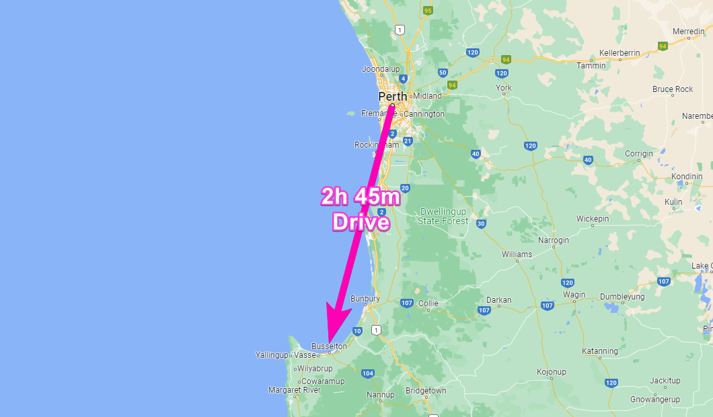](./map.png)

So I have lived in Australia for 9 years now (cant actually believe that) and I have moved a total of 8 times. When I was living the UK I moved a similar number of times in my entire life. So its safe to say that im pretty comfortable with moving home.

One week ago however we moved house from Perth to Busselton (Western Australia) and this time was different. This time for the first time in my life we had furniture and a 3 year old to contend with.

We knew we weren't likely to fit everything in our revivalists van so we decided to hire a transit van for a day 2 days before the big move day. Fortunately my parents were on hand from the UK to help with the tetris-like packing.

[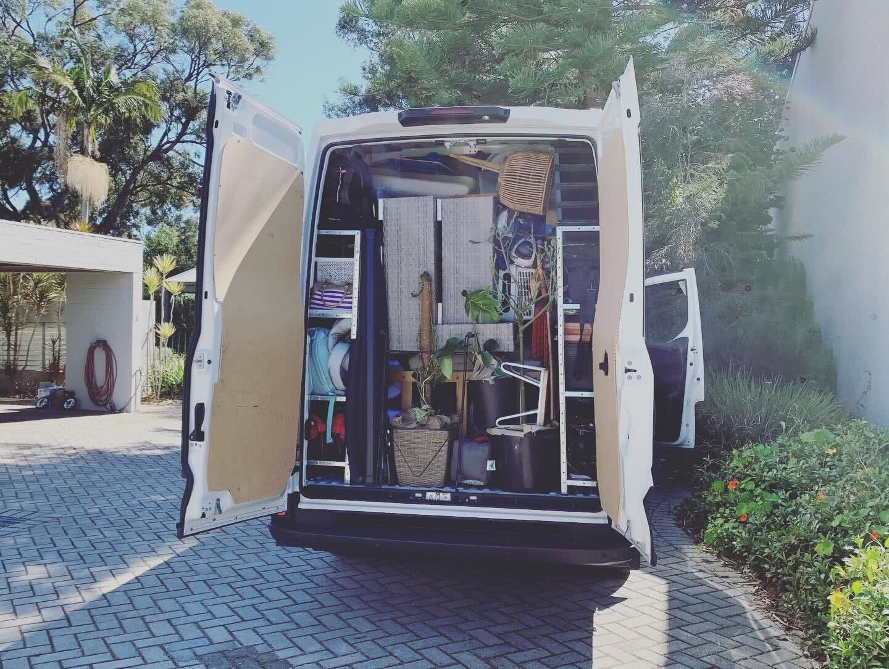](./tetris.jpg)

So then the big day came and most of the items fit in the van but unfortunately not everything.

[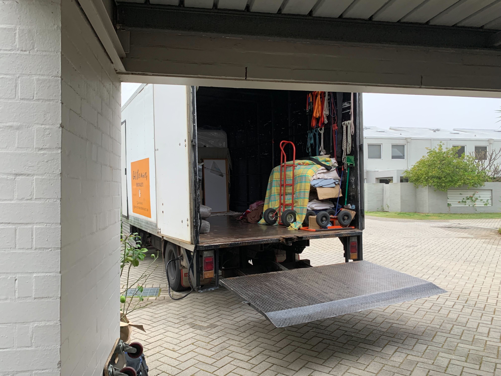](./van.jpg)

[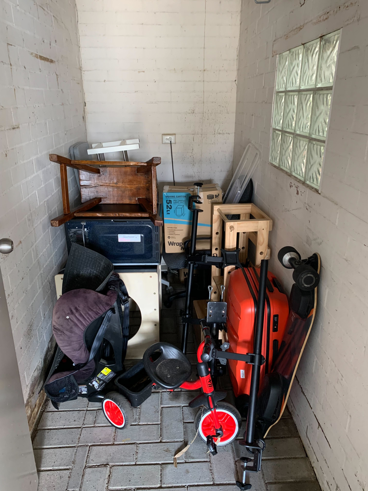](./left-over.jpg)

So this meant that the following day I had to hire a trailer and drive back to Perth to collect the remaining items.

[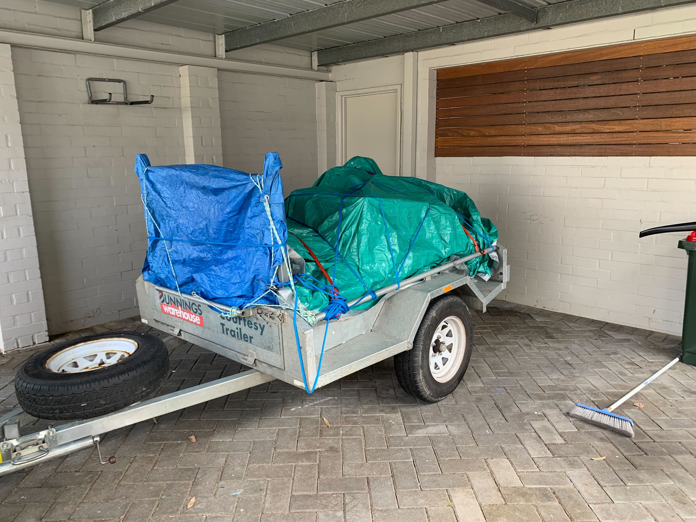](./trailer.jpg)

With everything now moved we could finally start to settle in and enjoy the environment.

[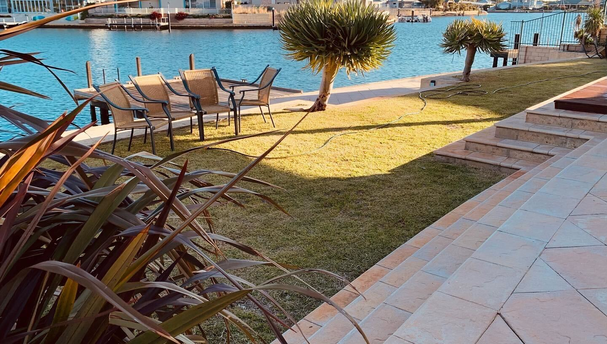](./garden.jpg)

<iframe width="853" height="480" src="https://www.youtube.com/embed/T4kaZX1ZzzM" frameborder="0" allow="autoplay; encrypted-media" allowfullscreen></iframe>

# Starlink

So as I work from home on [BattleTabs](https://mikecann.co.uk/posts/battletabs-in-7-minutes) its essential that I have internet and preferably good internet.

Although Busselton is 3 hours south of the capital of WA Perth, it isnt a total backwater. It does have broadband connection in the form of the National Broadband Network (NBN).

The only issue is that when I called up to move my connection the customer support staff informed me that it was likely I was going to get poorer speeds that I was currently getting. I was paying $79 per month for a 50Mbs down 20Mbs up connection (50/20) this is unfortunately the limit of copper cable broadband and although Fibre NBN is rolling out across WA, neither my Perth home had it nor the new place in Busselton.

Worse than that I was informed that I was likely not going to even get the 50/20, likely the maximum would be 50/13.

This wasnt great for me who lives on the internet most of the day, so I decided to look into alternatives. The only real contender was [Starlink](https://www.starlink.com/), Elon Musk's internet from space company.

I had reservations about going Starlink as [I had read](https://www.whistleout.com.au/Broadband/Guides/Starlink-Australia-Everything-you-need-to-know) that the upload speeds wouldnt be much faster than I was due to get.

It was a combination of speaking to a friend who assured me that was likely old information (Starlink speeds improve as more satellites are launched) and seeing the 30-day-money-back-trial paired with the 50% discount on the dish for rural customers (me), I decided to take the plunge and order one.

[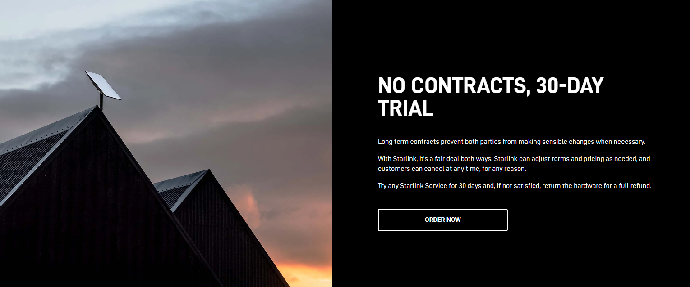](./30day.png)

So after we moved down here I got the NBN internet setup and it was worse that I had feared. The following was just about the maximum speed I could achieve over a couple of days of testing:

[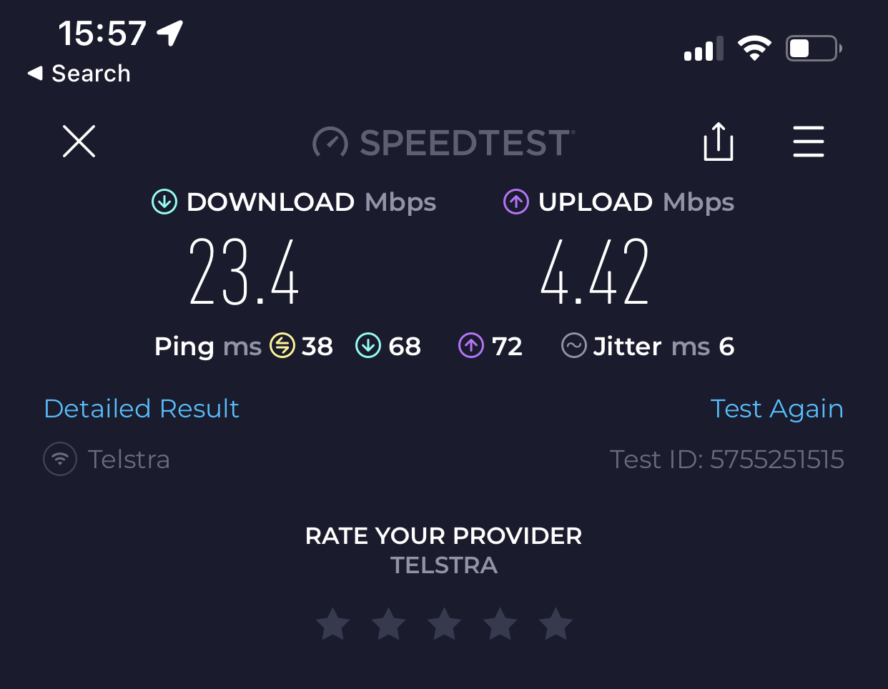](./nbn-speed.png)

Less than 5Mbs upload! This was definitely not going to cut it.

Time to crack out the Starlink.

[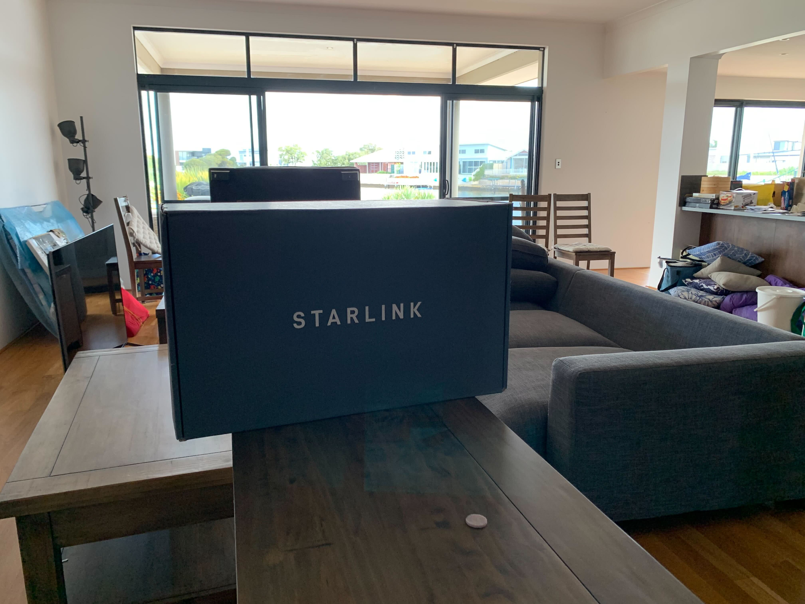](./starlink-box.jpg)

After a bit of faffing around with trying to find a temporary location for the dish that wasnt in the way but also still allowed us to lock the house at night I was ready to run some tests.

[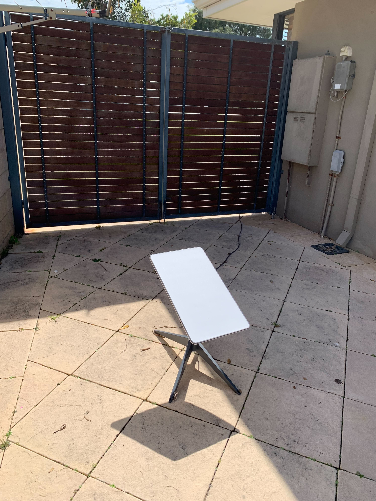](./dish.jpg)

So even though the dish is only in a temporary spot and is partially blocked by some stuff down the side of my house the speeds are far faster than I was expecting!

[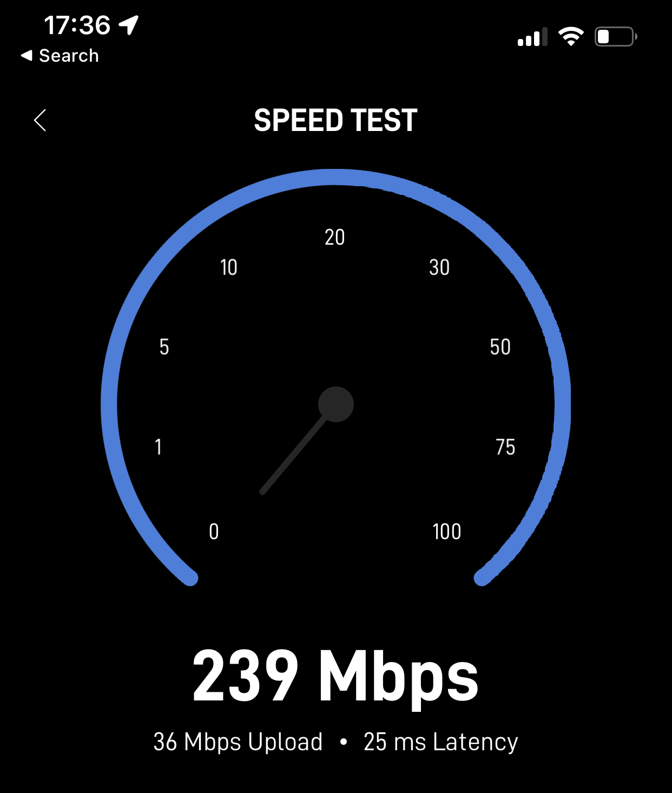](./starlink-speed2.png)

The speeds are definitely more variable than NBN, im assuming this is just the way it works as it swaps between satellites. Im hoping it will also stabilize a bit over time and once I have it mounted on the roof.

But my calculations it is on average 6-10 times faster than the fastest NBN I could get here and incredibly it even has lower latency!

So all in all I have been mightily impressed with the service so far. For $139 per month (plus the $300 for the dish) its more than I was paying before but not much more than the comparable NBN speed (250/25) thats assuming I would have ever been able to get those speeds.

I have received quotes from two TV / Satellite dish installers that it will cost me between $300-$600 to get it properly installed. I however noticed that we have an old satellite dish on the roof already so I might have a crack at just repurposing that mount myself and thus hopefully save some money.

# Conclusion

Im really happy to finally have moved into my new home and super excited that I have internet blessed by his holyness, Elon Musk :)
