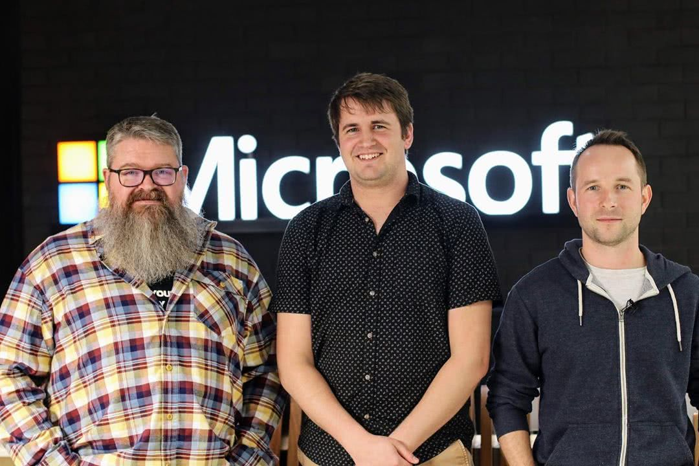

Back in August 2019 I have a talk at the local [Front End Web Developers (Fenders)](https://www.meetup.com/Front-End-Web-Developers-Perth/) meetup group here in Perth. Its taken them a little while but the talk is finally up on Youtube!

<!-- more -->

# The Talk

<iframe width="853" height="480" src="https://www.youtube.com/embed/OFKYo8lvS7E" frameborder="0" allow="autoplay; encrypted-media" allowfullscreen></iframe>

As you could probably guess if you had looked at my past few years worth of posts on this blog I have been using Typescript on a daily basis and I am really impressed with the power of the type system so I thought I would try to share some of that fascination with others in Perth.

I was really nervous about giving the talk even though it was only short and only to a small (~150 people) local meetup.

Despite doing it all as a live-coding with audience participation I think it went okay tho im not sure how many people followed along as it it was quite dense.

Everyone seemed to enjoy the game at the end though so perhaps I should have made that the focus of the talk, what do you think?
