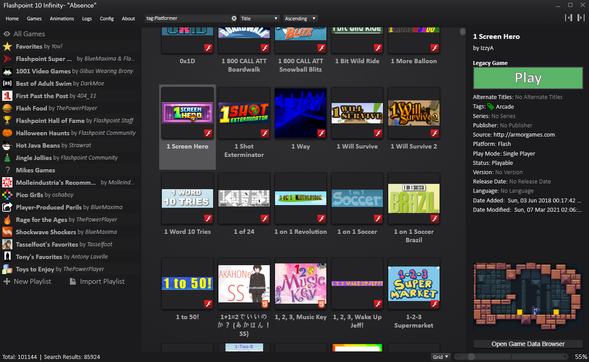
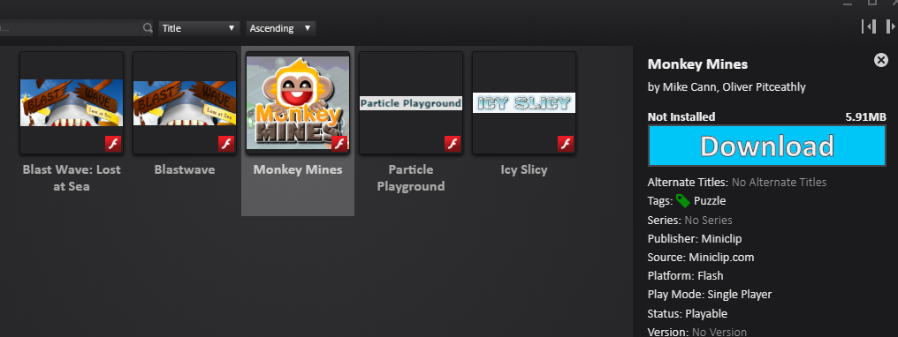

Just a small post today sharing with you a really cool project that I have only recently become aware of.

<!-- more -->

# My Flash Game History

For new readers of this blog you may not be aware of my long history in building flash content. In fact some of my earliest posts to this blog (14 years ago) were about my (now defunct) Flash website Artifical Studios [way back in 2004](/posts/artificial-sudios-1).

Since then I have worked on [many websites, projects and games](https://mikecann.co.uk/tags/flash) built in Flash both personally [and professionally](/posts/gourmet-ranch).

Some of the Games I built [ended up being fairly popular](https://mikecann.co.uk/posts/1000000-views).

The problem is because Flash is now [effectively dead](https://blog.adobe.com/en/publish/2017/07/25/adobe-flash-update.html) on the web all my old content has stopped working.

# Flashpoint

Fortunately others have lamented this sorry state of affairs by collecting a huge archive of old flash content and making it available to play once again in an easy to use package.

Simply [download the app](https://bluemaxima.org/flashpoint/downloads/) (either the 650mb installer or the MASSIVE 600GB full archive) and then search any game you want to play and click to run it, that simple!

Its awesome to see some of my games on there available to play again just a single click away.

If you are interested I made a playlist:

So far I was able to find

- [Icy Slicy](/posts/icy-slicy)
- [Blast Wave](/posts/blast-wave)
- [Blast Wave: Lost at Sea](/posts/blastwave-lost-at-sea)
- [Monkey Mines](/posts/monkey-mines)
- [Particle Playground](/posts/particle-playground)

Unfortunately ones that seem to be missing are

- [Blast Out](/posts/blast-out)
- [Flashteroids](/posts/flashteroids-is-out-finally)
- [Mr Nibbles](/posts/mr-nibbles-2)
- [Mr Nibbles Forever](/posts/mr-nibbles-forever-now-on-apple-app-store)

# Future

It looks like we might soon be able to play Flash content on the web again thanks to [Project Ruffle](https://github.com/ruffle-rs/ruffle) which looks really promising. Once its up to 100% feature parity with the latest version of Flash I might once again be able to update this blog with web-accessible links to my old games :)

An alternative might be [CheeperX For Flash](https://leaningtech.com/cheerpx-for-flash/) which emulates the entire of the x86 version of the Flash runtime in Web Assembly (jeeze!) but it appears that it is currently a commercial-only offering :(
