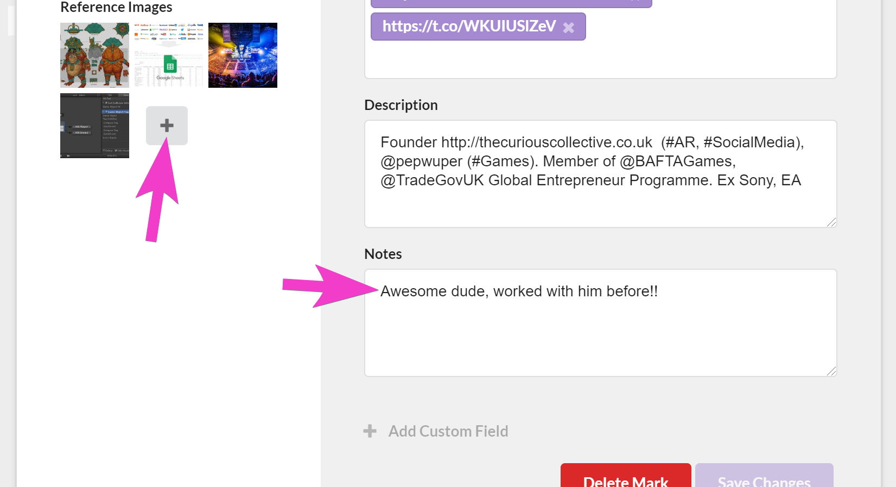

Thick and fast on the heels of our last new feature [Custom Fields](/markd/markd-custom-fields) today we are happy to announce our latest feature: Notes.

<!-- more -->

# TLDR;

<iframe width="853" height="480" src="https://www.youtube.com/embed/D0l5nf7Vjqo" frameborder="0" allow="autoplay; encrypted-media" allowfullscreen></iframe>

# Why?

Brandon [mentioned in our official announcement](https://blog.markd.co/2019/06/06/adding-meeting-notes-to-a-person-on-the-activity-timeline.html) blog post on the topic, we felt that we needed a way for users to be able to take notes from a meeting and attach them to a given mark. So far the only ability we have for this is either to use the notes field on the mark or attach a file directly to the mark:

Those might be okay for static data that you want to record about someone but it doesn't reflect the the temporal nature of other bits of data you might want to record about someone such as meeting notes, scheduled calls or dates of trips away.

For that reason we felt that we needed a way to attach data to a mark that would then be fed into an "Activity Feed" that represents information about the person that changes over time.

The first of these temporal data attachments are notes which can be used to quickly record meetings or anything else you want to say about someone in a given instant.

# Two takes

Just like with the [custom fields](/markd/markd-custom-fields) feature it took us a couple of attempts to get to the current design.

The first iteration we had it look more like a list of documents rather than a list of "comment" like notes in an activity feed. Although this was functional it felt a little too "worky" and against our philosophy for the product: "Fast, Simple and **Fun**"

<iframe width="853" height="480" src="https://www.youtube.com/embed/aBJgli8T4hs" frameborder="0" allow="autoplay; encrypted-media" allowfullscreen></iframe>

The second attempt is the one you see on [https://app.markd.co](https://app.markd.co) now and better aligns with how we want notes to feel and sets the stage for future item types into the "activity feed".

# Simple Search

As part of the feature we implemented a way to search your notes. This will be super important once people start amassing lots of notes over time about someone.

The implementation of the search is a simple regex based search on the "searchable" content of a note. I felt like although I could go the full-text search route based on "text" indices in mongo or even Lucine / Algolia it was overkill given that we are narrowly searching for notes on a given mark by a given user only.

On a personal note; im working hard to temper my desire to "over-engineer" the technical solution to the problems faced by these new features. Its more important for us to get something out there and see what works and what doesn't before architecting the perfect high-performance solution.

# Conclusion

Im happy with how this feature turned out. Im glad we took the extra time to do a second iteration on the feature to get it right. Its going to be great once we have a bunch more items populating that feed.

# P.S.

This is a little bonus announcement not related to notes but we also added 4 new custom field types..

These will be needed for our upcoming Google and LinkedIn import feature, so stay tuned for those!
