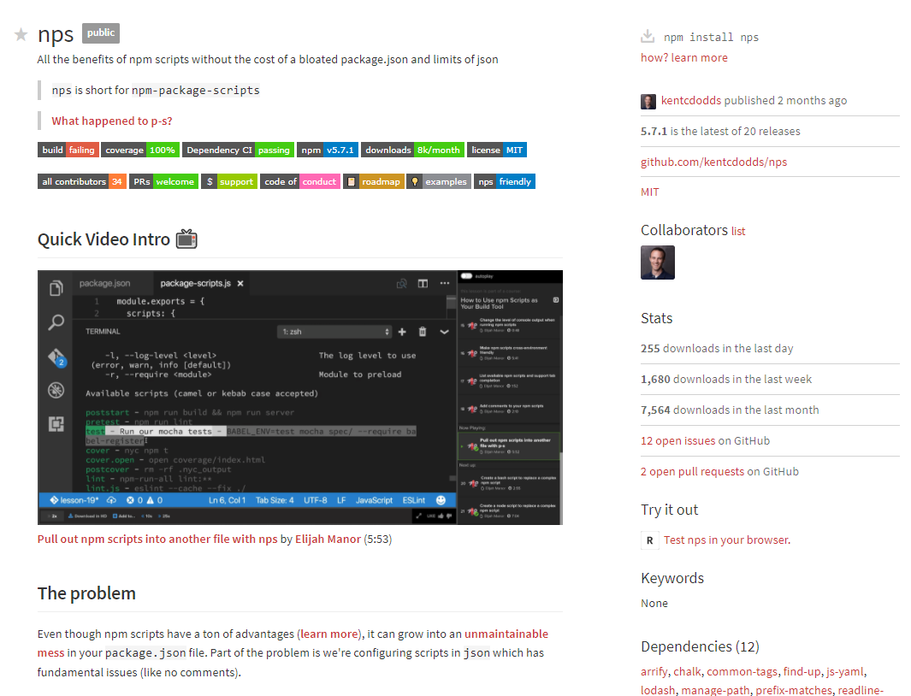
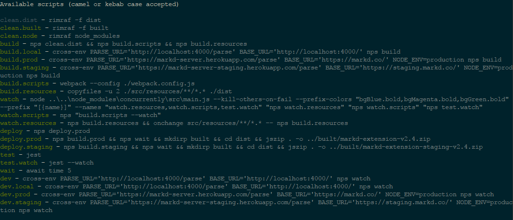
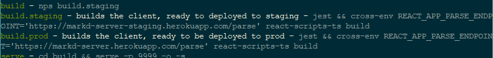
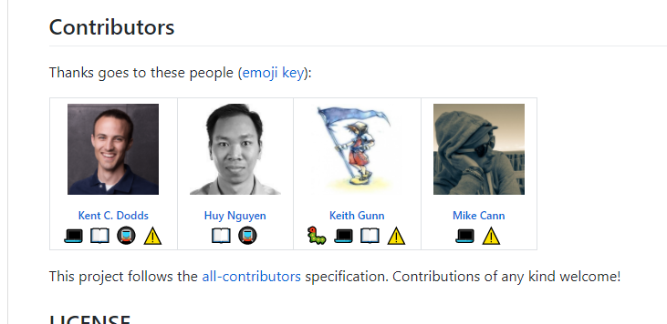

For some time now I have done all my build-scripting on Javascript / Typescript projects in package.json. In a complex projects such as [Markd2](/markd/portfolio/markd-2-total-re-write-using-react-mobx-state-tree-and-parse-server/): this can quickly become quite unweildy.

<!-- more -->

# The Problem

For example checkout one of my other projects:

[](./packagejson-scripts.png)

And this is just a fairly simple example that doesnt include multiple-packages in one solution.

Because all the scripts are contained in json you are very restricted with what you can do. For example in my above screenshot, you can see that there is quite a bit of duplication, if only there was a way I could use variables and functions...

# The Solution

[](./nps-ss1.png)

Enter Node Package Scripts (NPS). It takes all those scripts out of package.json and puts them into javascript but still leaves it declarative, like json, so its easy to understand whats going on. For example here are the scripts for the [Markd2 extension](/markd/portfolio/markd-2-total-re-write-using-react-mobx-state-tree-and-parse-server/):

```javascript
const utils = require("nps-utils")
const concurrent = utils.concurrent
const series = utils.series
const open = utils.open

const config = require("../../package.json")

const { local, staging, prod } = config.markd

const setEnv = target =>
  `cross-env PARSE_URL='${target.server}parse' BASE_URL='${
    target.web
  }' NODE_ENV=production`
const setLocalEnv = () =>
  `cross-env PARSE_URL='${local.server}parse' BASE_URL='${local.server}'`
const getManifestVersion = () =>
  require("./src/resources/manifest.json").version

module.exports = {
  scripts: {
    clean: {
      dist: "rimraf -f dist",
      built: "rimraf -f built",
      node: "rimraf node_modules",
    },
    build: {
      local: `${setLocalEnv()} nps build`,
      prod: `${setEnv(prod)} nps build`,
      staging: `${setEnv(staging)} nps build`,
      default: {
        script: series.nps("clean.dist", "build.scripts", "build.resources"),
        hidden: true,
      },
      scripts: "webpack --config ./webpack.config.js",
      resources: "copyfiles -u 2 ./src/resources/**/*.* ./dist",
    },
    watch: {
      default: concurrent.nps("watch.resources", "watch.scripts", "test.watch"),
      scripts: 'nps "build.scripts --watch"',
      resources: series(
        "nps build.resources",
        "onchange src/resources/**/*.* -- nps build.resources"
      ),
    },
    deploy: {
      default: "nps deploy.prod",
      prod: series(
        "nps build.prod",
        `nps wait`,
        `mkdirp built && cd dist && jszip . -o ../built/markd-extension-v${getManifestVersion()}.zip`
      ),
      staging: series(
        "nps build.staging",
        `nps wait`,
        `mkdirp built && cd dist && jszip . -o ../built/markd-extension-staging-v${getManifestVersion()}.zip`
      ),
    },
    test: {
      default: "jest",
      watch: "jest --watch",
    },
    wait: "await time 5",
    dev: {
      default: `${setLocalEnv()} nps watch`,
      local: `${setLocalEnv()} nps watch`,
      prod: `${setEnv(prod)} nps watch`,
      staging: `${setEnv(staging)} nps watch`,
    },
  },
}
```

You can see im able to use all the latest and greatest JS features such as template strings and lambda function declarations. I can pull in other packages and import config files from disk.

Its reminiscent of the day when we used to build our projects using Grunt and Gulp except its in a declarative structure, making it easy to read and reason about.

Then your `package.json`:

```json
...
"scripts": {
    "start": "nps",
    "test": "nps test"
  }
...
```

Much simpler.

# My Contribution

So how do you run those commands? Well for example say you want to run the tests simply type `npm start test` or perhaps you want to watch the resources directory type `npm start watch.resources`.

You can get information on the your available commands with `npm start help`

[](./nps-help.png)

You can annotate those commands with some helpful text such as:

```javascript
module.exports = {
    ...
    build: {
      default: "nps build.staging",
      staging: {
        script: series("jest", `${setEnv(staging)} react-scripts-ts build`),
        description: `builds the client, ready to deployed to staging`
      },
      prod: {
        script: series("jest", `${setEnv(prod)} react-scripts-ts build`),
        description: `builds the client, ready to be deployed to prod`
      }
    },
    ...
}
```

will result in:

[](./nps-help-description.png)

Sweet!

The only missing bit of the puzzle was what happens when you are working in a multi-package solution such as the one in [Markd2](<(/markd/portfolio/markd-2-total-re-write-using-react-mobx-state-tree-and-parse-server/)>)?

Just as a reminder the folder structure for the project looks like:

[](./dir-structure.png)

Ideally what I want to be able to do is from the top level directory type `npm start extension.build.staging` which will then run the `build.staging` command within the context of the "extension" package.

Unfortunately NPS didnt have this ability out of the box so I decided to have a go of coding it up myself. Once done I posted it on the [nps-utils](https://github.com/kentcdodds/nps-utils) github repo and was invited by its maintainer (and all OSS god) [Kent Dodds](https://github.com/kentcdodds) to submit a PR with the feature.

So after a little bit of back-and-forth (this was the most strict OSS project I had ever committed too, but thats a good thing) I was able to get my feature merged in and I was even added as a contributor of the project:

[](./me-contributor.png)

So now with my addition you can include other NPS scripts within yours and thus achieve what I wanted:

[](./imported-nps.png)

# Conclusion

So next time you are working on a JS project with non-trivial amount of scripts in your `package.json` think about adding `nps`.
