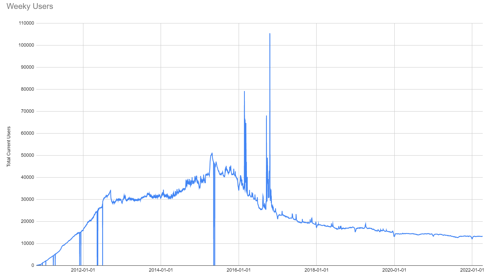
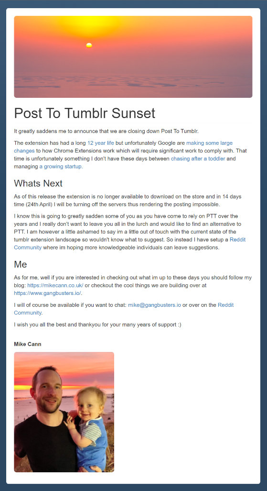
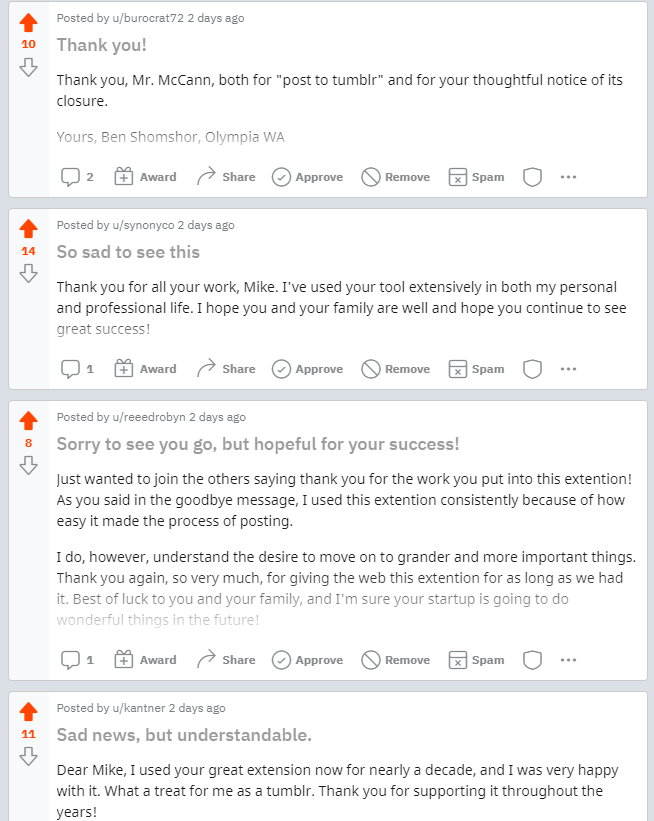
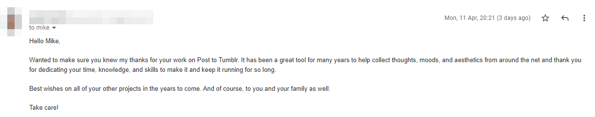
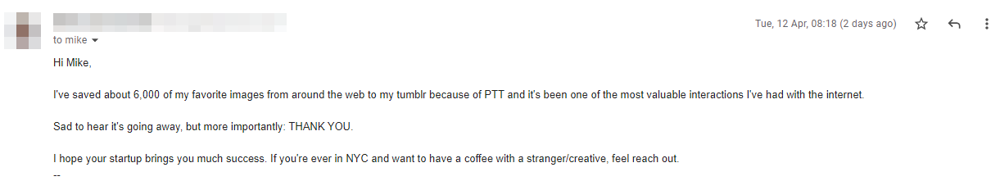

Well all good things must come to an end and Post To Tumblr has had 14 excellent years. Its just about my longest running project but unfortunately its come time to let it go the way Old Yeller...

<!-- more -->

# History

[12 years ago](https://mikecann.co.uk/posts/my-first-chrome-extension-post-to-tumblr) I posted about my first Chrome Extension ever. A little tool to help with posting content to the (at the time popular) micro blogging platform Tumblr.

The concept was simple. Allow people to quickly post content to Tumblr by simply right clicking on it.

Since that humble beginning I slowly started adding more and more features such as [post preformatting](https://mikecann.co.uk/posts/post-to-tumblr-version-0-4) and [custom context menus](https://mikecann.co.uk/posts/post-to-tumblr-v6-16-templated-variables).

Over time the extension grew in popularity, reaching a peak of about 50,000 weekly users:

Since then however Tumblr's popularity started to decline and so too did my interest in the project. I did however continue to support the project with small updates and bug fixes.

I especially enjoyed getting emails from some of my most loyal users letting me know what they have been up to :)

# Sunset

Unfortunately my spare time, along with the updates, for PTT have totally dried up to the point where I haven't updated the extension in over a year.

Back in September of last year [Google announced](https://developer.chrome.com/blog/mv2-transition/) that they would be shutting down extensions that run on "Manifest V2" in favour of their newer "Manifest v3" format.

Upgrading PTT to support V3 was going to be a job too large for me to take on given my lack of time and (quite frankly) willpower to do.

So unfortunately we made the decision that it was time to turn off the PTT servers and remove the extension from the store.

I published one final update to the extension which added the following message:

# Re: Sunset

Since posting the above announcement in the extension I have received a heap of lovely feedback from users of the extension both by email and on the [dedicated SubReddit](https://www.reddit.com/r/post_to_tumblr/).

Its messages like these that let me know that all the effort that I put into the extension over the years has been worth it. People have found real value from a product that started out as a simple experiment :)

