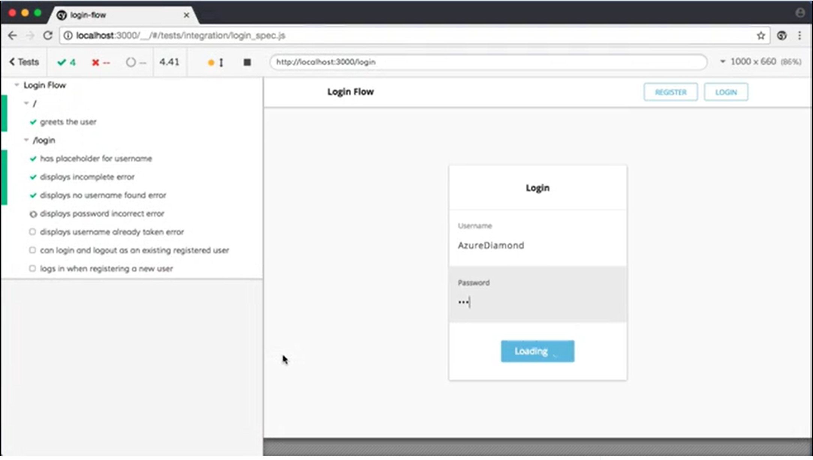

I dont know about you but every time I have to write a CI script or modify an existing one my stomach fills with dread. I just know im in for a long frustrating session of fighting with some tortured mutant DSL written in YAML only to wait 15 minutes between iterations of cryptic error messages.

Why oh why cant things be better?

# YAML

## Problems

In in the web development world some of the most popular CI platforms today are Github Actions, Jenkins, CircleCI and TravisCI. The one thing they all have in common is they use the [flaming ball of excrement that is YAML](https://noyaml.com/).

Why on earth to these CI platform all choose YAML? I have no idea.

The thing is, if it was just left at YAML that would be bad enough ([for](https://noyaml.com/) l[ot](https://news.ycombinator.com/item?id=26234260#:~:text=YAML%20is%20one%20of%20the,of%20various%20line%2Dendingness'.)s [of](https://sehun.me/why-you-hate-yaml-and-how-to-tackle-it-3e8471cf1ca8) reasons) but what invariably ends up happening is the platform developers add features things such as variables, functions and string interpolation. These are concepts that really dont belong in a declarative language and end up as hacky messy balls of confusing text.

Dont belive me? [Go take a look](https://circleci.com/docs/reusing-config/#authoring-reusable-commands) at the tortured syntactical hoops you have to jump through to define a "reusable" function that can take parameters in CircleCI.

Don't even get me started about the nightmare that is string interpolation in CircleCI or Github Actions YAML. Inserting environment variables into build commands and other scripts should be the bread and butter of any CI system but its unnecessarily complex and convoluted and error prone in a declarative format such as YAML.

I posted the question to Stack Overflow ["Why do most CI / CD platforms use YAML for their pipelines?"](https://stackoverflow.com/questions/73424263/why-do-most-ci-cd-platforms-use-yaml-for-their-pipelines) but was unable to get an answer from anyone.

If you know of a reason please do let me know in the comments.

## Solution

What I really think think would make things better is to use a langauge that is more flexible and better suited to the problem at hand.

If we need functions, variables and string interpolation why not use a language that has all of those things natively available?

You could use C#, Java, Go or any other language you like. The CI developer could build simple SDKs for each requested language.

Using my personal favourite language Typescript a simple build script could look something like:

```ts
import { exec, defineJob, persist, restore, defineWorkflow } from "ci";
import * as netlify from "netlify";

function doSomeCommonPreJobStuff() {
  console.log(`starting job..`);
}

const install = defineJob({
  label: `install`,
  description: `installs dependencies for the project`,
  handler: async () => {
    doSomeCommonPreJobStuff();
    await exec(`yarn install`, { label: "installs dependencies using yarn" });
    await persist([`./node_modules`]);
  },
});

const build = defineJob({
  label: `build`,
  description: `builds the project`,
  machine: `4x-16gb`,
  handler: async () => {
    doSomeCommonPreJobStuff();
    await restore();
    await exec(`yarn build`);
    await persist([`./dist`]);
  },
});

const test = defineJob({
  label: `test`,
  image: `cimg/node:16.15.1`,
  description: `tests the project`,
  handler: async () => {
    doSomeCommonPreJobStuff();
    await restore();
    await exec(`yarn test`);
  },
});

const deploy = defineJob({
  label: `deploy`,
  description: `deploys the project to netlify`,
  handler: async () => {
    doSomeCommonPreJobStuff();
    await restore();
    netlify.deploy(`./dist`, { apiToken: process.env.NETLIFY_TOKEN });
  },
});

defineWorkflow({
  label: `main workflow`,
  jobs: [install, [build, test], [deploy]],
});
```

It is almost reminiscent of a [gulp.js](https://gulpjs.com/) script if you are old enough to remember those.

It would be far more usable and easy to understand and critically testable..

# Testing & Iteration

## Problems

Another big problem with CI scripts is their development cycle is slow and painful and usually looks something like:

1. Write a few lines of YAML, hope that you have the syntax and commands correct and havent gotten a single whitespace of indentation wrong somewhere.
2. Git commit and push to the CI
3. Alt-tab to browser, wait for the CI to pick up the job
4. Usually errors at this point because of syntax issue in YAML, return to step 1. to get that right first
5. Wait for the install dependencies step to run (minutes)
6. Finally get to the bit you just added and discover it has errored for some reason, not sure why, return to step 1 to try some other minor change

In this day and age why oh why do we have to do things like this?

## Solution

We solved the problem of local execution of untrusted code some time ago with Virtual Machines and Docker, why cant we use those?

Why cant we use something like [Firecracker VMs as Fly.io does](https://fly.io/docs/reference/architecture/#microvms), that way you can execute docker instances with them without any problems. They also support snapshots similar to docker so you could imagine some interesting replay and rewind UI / UX scenarios this would empower. Im thinking something like [Cypress](https://www.cypress.io/) but for CI scripts.

[](./cypress.png)

Another bonus of writing CI scripts in a general purpose language like Typescript we could easily unit test them, bringing another level of confidence that complex scripts work and will continue to work.

# Infrastructure as Code

IaC is a powerful technology that makes the infrastructure that runs your applications repeatable and manageable.

For the longest time it too suffered from the same problems as CI scripts, too much declarative code in the form of [Cloud Formation](https://aws.amazon.com/cloudformation/) or [ARM](https://learn.microsoft.com/en-us/azure/azure-resource-manager/resource-group-overview#template-deployment) Templates but then came along tools such as [CDK](https://docs.aws.amazon.com/cdk/v2/guide/home.html) or [Pulumi](https://www.pulumi.com/) which replaced declarative nightmare with a far more intuitive scripting syntax.

# Conclusion

We can do better, we have the technology, so why dont we? I dont know.

Maybe I have missed something, perhaps there is a very good reason why its done this way. Or perhaps there is a project or solution that always works exactly as I describe it.

If this is the case please leave me a comment below or email me if it is the case! If its not the case, IMO this would be an excellent SaaS business for someone brave enough to take it on.
