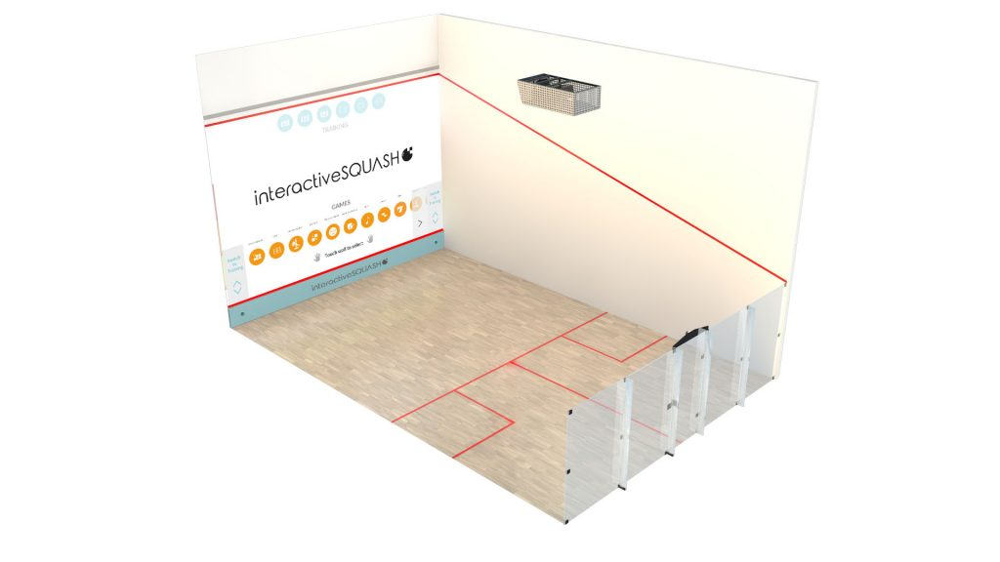
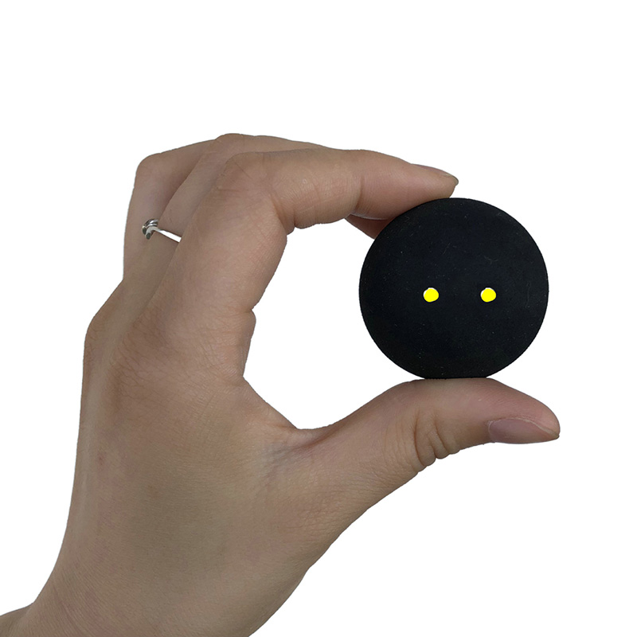
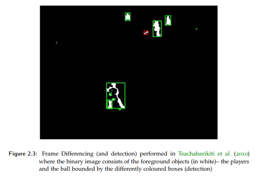
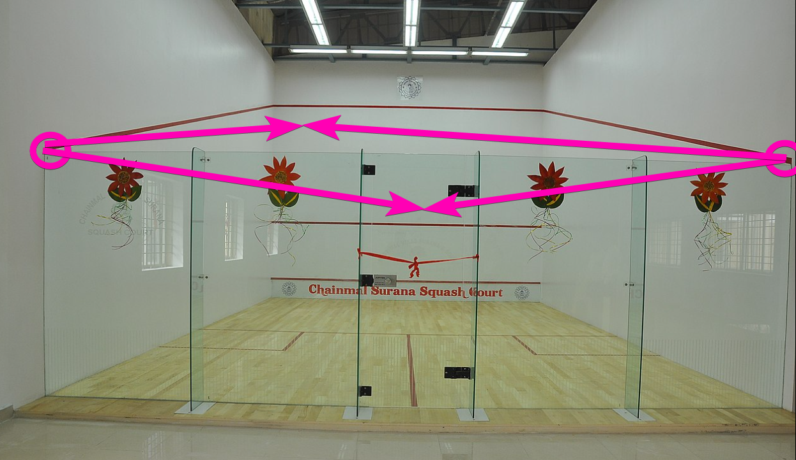
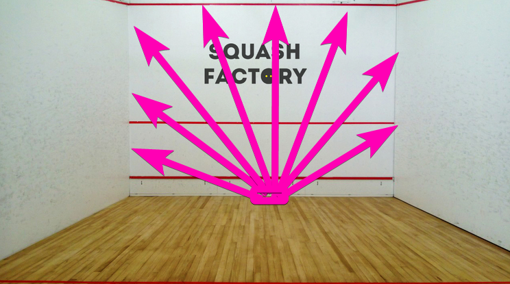
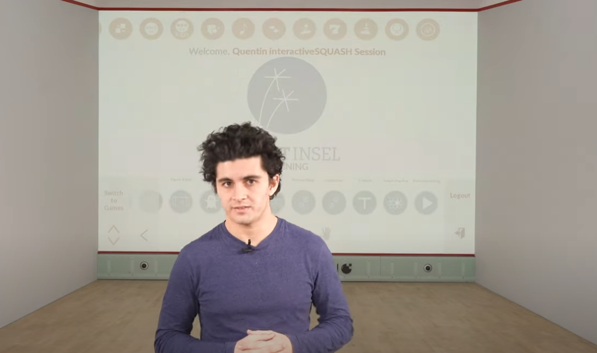

Quite some time ago now a good friend and fellow squash player shared an idea he had with me, to create a system that is able to track a squash ball during a game and project realtime information onto the back wall.

Its an idea that really resonated with me and I have been thinking about it ever since. I want to share my thoughts here and see if anyone else has ideas on how to tackle this thorny problem.

<!-- more -->

# Prior Art

To set the stage, checkout this demo of an already existing system from [Interactive SQUASH](https://interactivesquash.com/):

<iframe width="853" height="480" src="https://www.youtube.com/embed/0N6OSVwGiRE" frameborder="0" allow="autoplay; encrypted-media" allowfullscreen></iframe>

Their system tracks the ball and players using infrared sensors and cameras placed in both the tin (bottom front of the court) and in a box on the ceiling. The box on the ceiling also contains the projector which is used to update the display on the back wall in realtime.

Its a very cool system and is the gold standard for the kind of system we would like to build. There are however a few small issues:

1. Cost. This is NOT a cheap system. They dont list their price on the website and I have requested a quote but I have been told that it is at a minimum $50k USD per court plus a yearly $5k USD subscription.

2. As explained in their [FAQ](https://interactivesquash.com/operator/) you must prepare the court for the system which could cost up to another $5k USD to paint the wall with special paint, install specific electrical cables etc.

3. It requires modifying the court. This might be a problem for a club (such as ours) that uses a shared community facility.

4. Its permanent. All the equipment must remain on site and cannot be taken home at the end of the day. This might pose a security issue when in a shared community facility.

So for these reasons we felt that there must be way we could take some of the best bits of this system but simplify things a bit and remove some of the bits we maybe dont need.

For the rest of this post im going to discuss my thoughts on this.

# Simplified Requirements

Before we can talk about solutions I want to make it clear what the requirements are.

1. At a very basic level all we want to do is know where on the back wall a ball strikes and then use that location to update a realtime projection of some scene onto the back wall. We dont really need to track the players or the ball in the air unless its comes for free as a result of the solution.

2. We want the system to be relatively inexpensive. We are not a rich club.

3. Preferably the system is portable and quick and easy to setup without any court modifications required.

# Problem Space

For those that are not familiar with the sport here is some basic info to help illustrate some of issues.

A standard squash court is 9.75m in length and 6.4m in width. They can sometimes have one or more walls made of glass so you can see inside. In our case we have just the back-wall made of glass (see the above image for an example).

A standard squash ball is about 4cm in diameter and can travel EXTREMELY fast. Here is a video of one being hit at 281km/h:

<iframe width="853" height="480" src="https://www.youtube.com/embed/4zXWu22ZhZY" frameborder="0" allow="autoplay; encrypted-media" allowfullscreen></iframe>

So tracking this ball with a standard video camera is a tough problem due to its size and speed of motion.

The sport involves two players hitting the ball with a racket against the back wall and then returning it. A player wins a point if their opponent is unable to return the shot.

# Potential Solutions

Okay with the requirements listed and the problem space explained lets discuss some potential solutions.

I have split solution into two parts; first we need to detect the impact then we need a way of displaying the results on the back wall in real time.

## Impact Detection

### Computer Vision

This was my first thought. If we could mount a camera on a tripod behind the court we could potentially use some clever CV or ML based methods to detect the moving ball and track it in 3D space as it moves around the court.

<iframe width="853" height="480" src="https://www.youtube.com/embed/h_MZg6qZc8I" frameborder="0" allow="autoplay; encrypted-media" allowfullscreen></iframe>

The above video uses a program called [Kinovea](https://www.kinovea.org/) to retroactively track the ball using computer vision techniques in a semi-automated manner. Its cool but we need it to be realtime and totally automated.

[This paper](https://repository.tudelft.nl/islandora/object/uuid:758d345d-ecdf-478e-a534-a23300dbe877/datastream/OBJ/download) entitled "Detection and Tracking of a Fast-Moving Object in Squash using a Low-Cost Approach" outlines in great detail the problems and techniques involved with tracking a squash ball using cameras.

Their approach however has a number caveats and critically is unable to run in realtime.

The first paragraph of the conclusion of this paper sums up the problem with CV based approaches perfectly:

> Ball-tracking in sports is a difficult problem because of the small size of the ball
> and the high speed at which it moves. The varying illumination conditions, the
> shape of the ball and constant occlusion due to the continuous movement of the
> players makes it even more difficult to track the ball accurately.

It obviously is possible to solve the problem using Computer Vision as [Interactive SQUASH](https://interactivesquash.com/) demonstrates but is is a thorny problem that requires multiple cameras and sensors from different angles.

If I had spare cash I would love to try out one or two of the [OptiTrack](https://optitrack.com/) cameras which are designed for motion tracking and have some high FPS options. These cameras are used by the excellent [Stuff Made Here](https://www.youtube.com/c/StuffMadeHere) in [this video](https://www.youtube.com/watch?v=1MkrNVic7pw) and [this one](https://www.youtube.com/watch?v=myO8fxhDRW0). I am however not sure on the limits of the cameras and if they could track something as small and fast as a squash ball however.

### Audio

Another potential solution is via audio "triangulation". Using 2 or more microphones placed at suitable distances apart it should be possible to detect the sound induced by the impact of the ball on the back wall.

The benefit of this approach over computer vision is that it can handle very high impact velocities as the sample rate is generally much higher. This means we should be able to analyze the details of the sound produced in greater detail even when traveling at a high speed.

The paper "[Audio-based performance evaluation of squash players](https://www.ncbi.nlm.nih.gov/pmc/articles/PMC5868801/)" uses this precise method.

The authors of this paper use 6 microphones spread around the court to triangulate audio events in 3D. This allows them to detect not just wall impacts but ball-racket, player-floor and other impacts.

For our purposes however we are only interested in ball-wall impacts which is a 2D location and so dont require as many microphones to locate it in 3D space.

There are some significant issues with this solution however:

1. Distinguishing between an actual impact and an impact sound reflected from a wall.

2. Level of accuracy required by just two microphones may be too high given their short maximum separation distance and the speed of sound vs speed of light.

3. Slow impacts might be too quiet to hear or may overlap with other sounds.

4. Impacts from nearby courts might be difficult to disambiguate from our court.

### Lidar

This solution is the one favoured by my friend. If you are able to place a lidar on the floor at the base of the court and point it upwards in 180 arc then you might be able to use that to detect a ball that passes through the beam before it strikes the wall.

Given you know the mirror position of the spinning laser and the distance from the beam source you can calculate where the ball is.

My main concern with this solution however is that the ball may be traveling too fast and will have struck the wall and rebounded before the laser has swept over it.

Another slight concern is how to power the lidar at the front of the court. If its power requirements are low then a battery may be feasible.

### Seismic

An interesting method, related to the audio based solution, would be to place two microphones or seismometers at the far lower corners of the court so they are both touching the back wall. You could "triangulate" the location of the impact by measuring the difference in the times that the impact event was recorded.

This solution also suffers from many of the same issues that the audio based solution as it is effectively the same solution just detecting vibration through the wall rather than through the air.

## Realtime Display

Supposing one of the above solutions is able to accurately detect an impact point on the wall we now need to update some sort of display on the back wall.

### Projector

Squash courts tend to be quite bright places this makes projecting an image on a back wall a difficult thing to do as it requires an exceedingly high-lumen projector. Even the Interactive SQUASH projector which is undoubtedly very expensive doesnt seem to produce a particularly bright image:

This problem is compounded by the fact that we want the system to be portable and thus not require it to be mounted from the ceiling, this means putting it on a stand outside the court. This unfortunately means that we are going to end up with silhouettes as a player occludes the projector.

Potentially a short throw projector could be used right at the front of the court but im not exactly sure what the closest distance from the back wall you could make a short-throw projector

### Laser

An alternative method is to use a laser such as the one from the [Laser Cube](https://www.laseros.com/) guys:

<iframe width="853" height="480" src="https://www.youtube.com/embed/8KxbNctIzto" frameborder="0" allow="autoplay; encrypted-media" allowfullscreen></iframe>

This solution should in theory be bright enough even in a fully lit squash court. It would however also suffer from player obstruction. It is however low power and runs off batteries so could be placed at the bottom of the court and shine upwards.

The only issue with this solution is the kinds of things you could project. You couldn't do full color images or video like you might expect from a TV or computer display but it might be sufficient for the purposes of this project.

### LED Matrix

This one is very impractical for our purposes but an alternative solution is to cover the entire back wall in arrays of LED Matrix panels effectively turning the entire back wall into a giant display. This method has actually been done before as can be seen in the following video from Interactive SQUASH

<iframe width="853" height="480" src="https://www.youtube.com/embed/LclyACKS8xs" frameborder="0" allow="autoplay; encrypted-media" allowfullscreen></iframe>

This solution does however require a glass backed court (which we don't have) and an (undoubtedly) very expensive array of LED Matrix panels.

# Conclusion

So there we have it. This is something I have been thinking about for a while.

Let me know what you think, have I missed something obvious? How would you solve this problem? Let me know in the comments!
